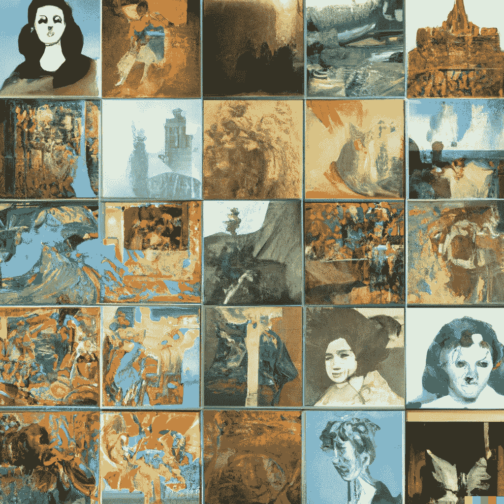

# 人工智能艺术作品生成的 65 个艺术数据集。随时可用

> 原文：<https://medium.com/mlearning-ai/65-art-datasets-for-ai-artwork-generation-ready-to-use-beabc34afd9b?source=collection_archive---------0----------------------->

## [机器学习艺术](https://mlearning.substack.com)

## 你是怎么做 AI 生成艺术的？

[Art Database Variations](https://evartology.substack.com/p/all-of-the-greatest-ai-powered-art?r=9hp4d&s=w&utm_campaign=post&utm_medium=web) — [Images Created with DALL·E, an AI system](https://mlearning.substack.com/p/a-good-alternative-to-dalle-2-that?r=z7zu8&s=w&utm_campaign=post&utm_medium=web)

## [为什么数据需要您的关注](/mlearning-ai/why-data-requires-your-care-3f633f64e966)

> [作为一个艺术家](https://datasculptor.medium.com/datasculptors-top-stories-616f2f098959)，我理解 [**艺术数据集**](http://As an artist, I understand the importance of data. The value of data is exponential given the advances in computing and machine learning that have been made over the last decade) 的重要性。鉴于计算和机器学习在过去十年中取得的进步，数据的价值是指数级的…