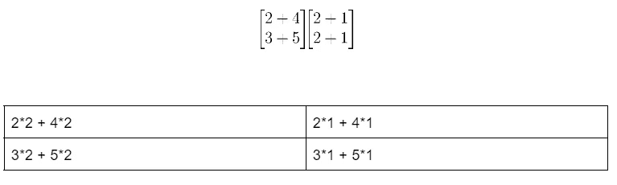
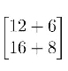
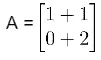
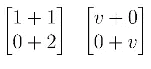
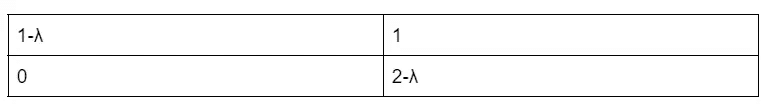
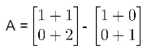
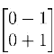
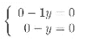
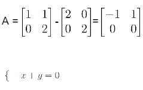

# 7.5 比奈定理，特征值和特征向量。

> 原文：<https://medium.com/mlearning-ai/7-5-binet-theorem-eigenvalues-and-eigenvectors-6bce63f7cfac?source=collection_archive---------5----------------------->

ISON Comet

*比奈定理*

*特征值和特征向量*

# **比奈定理**

比奈定理是关于行列式的性质的。

检测(AB) =检测(A)检测(B)

所以:

Addition of the two Matrix.

我们获得:

Result of the addition.

现在我们以和以前一样的方式进行:

| A | = 12 * 8–16 * 6 = 0

行列式为 0 是什么意思？它们是线性的*依赖*。

# **特征值和特征向量**

*特征值*

考虑矩阵 A，我们减去这个矩阵，得到一个维数相同，对角线为λ的矩阵。

为了方便起见，我用 v 代替λ，把你看到的每一个 v 都当作λ。

Multiplicate the Matrix for a Matrix with a diagonal of Lambda.

结果是:

Operation calculus

接下来，我们将主对角线和次对角线相乘:

**= (1-λ)(2-λ) = 0**

我们简化:

**λ — 3λ + 2 = 0**

它是这样的:

**λ1 = 1**

**λ2 = -2**

这两个是特征值！

*特征向量*

我们必须用这种方法将之前找到的两个特征值减去初始矩阵:

First matrix — a matrix with a 1 diagonal.

结果是:

The result.

现在我们有了矩阵，我们可以重新转换系统，所以我们把 x 和 y 相加，在这种情况下，加 x 是有用的，因为两个 x 都是 0。

那么我们需要了解什么呢？x 中的所有信息都包含在 y 中，所以这个方程是线性相关的。

继续第二个特征值:

这变成了:x = y

这意味着这些特征向量是相同的。

这是数学基础和线性代数的最后一课。我会发表其他关于统计的东西，但是现在，就这些了！

感谢所有看过我文章的人，希望你们喜欢。

在每种情况下都要发表评论并留下反馈！

从我内心最深处感谢你。: )

 [## Mlearning.ai 提交建议

### 如何成为 Mlearning.ai 上的作家

medium.com](/mlearning-ai/mlearning-ai-submission-suggestions-b51e2b130bfb)