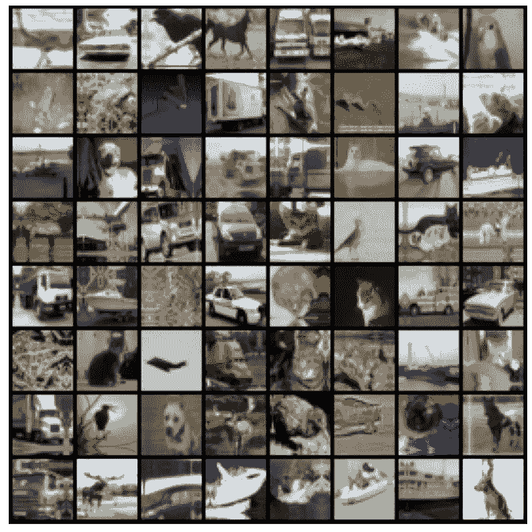
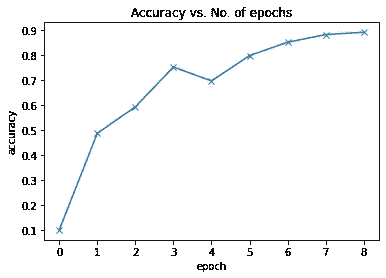
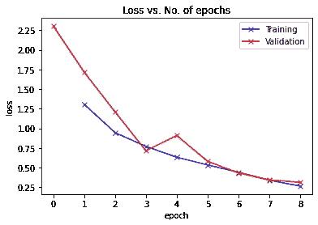
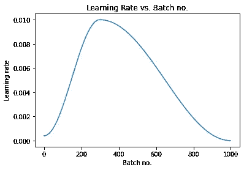

# 提高 CNN W/O 过拟合精度的 7 种最佳技术

> 原文：<https://medium.com/mlearning-ai/7-best-techniques-to-improve-the-accuracy-of-cnn-w-o-overfitting-6db06467182f?source=collection_archive---------0----------------------->

## 数据集— CIFAR 10

Photo by [Matthew Henry](https://burst.shopify.com/@matthew_henry?utm_campaign=photo_credit&utm_content=Picture+of+Frustrated+Man+On+Computer+-+Free+Stock+Photo&utm_medium=referral&utm_source=credit) from [Burst](https://burst.shopify.com/walls?utm_campaign=photo_credit&utm_content=Picture+of+Frustrated+Man+On+Computer+-+Free+Stock+Photo&utm_medium=referral&utm_source=credit)

当我们开发**卷积神经网络** (CNN)来对图像进行分类时，经常会发现当我们试图提高准确性时，模型开始过度拟合。非常令人沮丧，因此我列出了以下技术，这些技术将提高模型性能，而不会使模型过度适应训练数据。

1.  **数据归一化** 我们通过减去平均值并除以每个通道上像素的标准偏差来归一化图像张量。标准化数据可以防止任何一个通道的像素值对损失和梯度产生不成比例的影响。[了解更多信息](/@ml_kid/what-is-transform-and-transform-normalize-lesson-4-neural-networks-in-pytorch-ca97842336bd)
2.  **数据扩充**
    我们在从训练数据集中加载图像时应用了随机变换。具体来说，我们将每个图像填充 4 个像素，然后随机裁剪大小为 32 x 32 像素的图像，然后以 50%的概率水平翻转图像。[了解更多信息](https://www.analyticsvidhya.com/blog/2019/12/image-augmentation-deep-learning-pytorch/)
3.  **批量归一化** 在每个卷积层之后，我们增加了一个批量归一化层，对前一层的输出进行归一化。这有点类似于数据归一化，只是它应用于图层的输出，而平均值和标准差是学习参数。[了解更多信息](https://towardsdatascience.com/batch-normalization-and-dropout-in-neural-networks-explained-with-pytorch-47d7a8459bcd)
4.  **学习率调度** 我们不使用固定的学习率，而是使用一个学习率调度器，它会在每一批训练后改变学习率。在训练中有许多改变学习率的策略，我们使用了“一个周期学习率策略”。[了解更多信息](https://sgugger.github.io/the-1cycle-policy.html)
5.  **权重衰减**:我们在优化器中加入了权重衰减，这是另一种正则化技术，通过在损失函数中加入一个附加项来防止权重变得过大。[了解更多信息](https://towardsdatascience.com/this-thing-called-weight-decay-a7cd4bcfccab)
6.  **渐变剪辑**:我们还增加了渐变剪辑 pint，它有助于将渐变的值限制在一个小的范围内，以防止在训练过程中由于较大的渐变值而导致模型参数发生不希望的变化。[了解更多](https://towardsdatascience.com/what-is-gradient-clipping-b8e815cdfb48#63e0)
7.  **Adam optimizer** :我们使用了 Adam optimizer，而不是 SGD(随机梯度下降)，它使用了动量和自适应学习率等技术来加快训练速度。有许多其他的优化器可供选择和试验。[了解更多信息](https://ruder.io/optimizing-gradient-descent/index.html)

没有实现上述技术的 CNN 模型给出大约 75%的准确度。你可以在这个[博客](/mlearning-ai/training-convolutional-neural-network-convnet-cnn-on-gpu-from-scratch-439e9fdc13a5)上了解更多关于这款车型的信息。现在，我通过实现所有 7 种技术构建了一个 CNN，并将模型精度提高到 90%，而没有在训练集上过度拟合模型。

# 关于数据集

CIFAR-10 数据集(加拿大高级研究所)是一个图像集合，通常用于训练机器学习和计算机视觉算法。这是机器学习研究中使用最广泛的数据集之一。CIFAR-10 数据集包含 10 个不同类别的 60，000 幅 32x32 彩色图像。这 10 个不同的类别代表飞机、汽车、鸟、猫、鹿、狗、青蛙、马、船和卡车。每个类有 6000 张图片。

# 目录

1.  [简介](#cd69)
2.  [数据预处理](#86f0)
    2.1 [加载所需库](#c2ac)
3.  [应用**数据规范化**和**数据扩充**](#fe8c)3.1**[构建数据转换](#b0ce)
    3.2 [将转换应用到数据集](#34a5)**
4.  **[访问少量样本图像](#a200)**
5.  **[访问 GPU](#8442)**
6.  **[模型配置](#dbda)
    4.1 [设置精度函数和图像分类基类](#d3b6)
    4.2 [实现**批量归一化和漏失**](#128b)
    4.3 [实现**权重衰减**、**渐变裁剪**、 **Adam 优化器**](#bd40)
    4.4 [将模型移动到 **GPU**](#bc8f)**
7.  **[训练模型&结果分析](#83bb)
    6.1 [训练前设置参数](#d001)
    6.2 [运行模型 **8 个历元**](#2b8a)
    6.3 [精度 vs 历元数](#d1de)
    6.4 [损失 vs 历元](#5352)
    6.5 [学习率与批号](#477d)**
8.  **[对测试数据集运行预测](#63fc)**
9.  **[总结](#4e58)**
10.  **[未来工作](#830b)**
11.  **[参考文献](#930c)**

# **№1:简介**

**CIFAR-10 数据集包含 10 个不同类别的 60，000 幅 32x32 彩色图像。CIFAR-10 是一组图像，可用于教 FFNN 如何识别物体。由于 CIFAR-10 中的图像是低分辨率的(32x32)，这个数据集可以让研究人员快速尝试不同的算法，看看什么有效。**

**CIFAR 10 数据集下的类别列表—**

1.  **✈️飞机公司**
2.  **汽车🚗**
3.  **鸟🐦**
4.  **猫😺**
5.  **鹿🐆**
6.  **狗🐶**
7.  **青蛙🐸**
8.  **马🐴**
9.  **船🚢**
10.  **卡车🚚**

# **№2:数据预处理**

# **加载所需的库**

**因为我们用 PyTorch 来构建神经网络。我一次性导入了所有相关的库。**

# **№3:应用**数据归一化**和**数据增强****

**使用 in transforms 函数加载数据集时，会实现数据规范化和数据扩充。**

## **构建数据转换**

## **将变换应用于数据集**

**让我们访问培训和验证集**

**现在我构建了 2 个数据加载器用于测试和验证。为此，我使用了 DataLoader 方法**

# **№4:访问少量样本图像**

**在我们开始构建模型之前，让我们也访问一下样本图像。请注意，数据加载器中的数据是标准化的，显示这些数据没有任何意义。因此，开发了一个 demoralize 函数来还原这些更改，以便可以访问原始图像。**

****

**Present in training dataset**

# **№5:访问 GPU**

**如果您的执行平台连接到 NVIDIA 制造的图形处理器，您可以使用图形处理器(GPU)来更快地训练您的模型。按照以下说明在您选择的平台上使用 GPU:**

*   **Google Colab:使用菜单选项“运行时>更改运行时类型”，并从“硬件加速器”下拉列表中选择“GPU”。**
*   **Kaggle:在侧边栏的“设置”部分，从“加速器”下拉列表中选择“GPU”。使用右上角的按钮打开侧边栏。**
*   **Binder:运行 Binder 的笔记本不能使用 GPU，因为支持 Binder 的机器没有连接到任何 GPU。**
*   **Linux:如果你的笔记本电脑/台式机有 NVIDIA GPU(显卡)，确保你已经安装了 NVIDIA CUDA 驱动程序。**
*   **Windows:如果你的笔记本电脑/台式机有 NVIDIA GPU(显卡)，请确保你已经安装了 NVIDIA CUDA 驱动程序。macOS: macOS 与 NVIDIA GPUs 不兼容**
*   **如果您无法访问 GPU 或者不确定它是什么，不要担心，您可以在没有 GPU 的情况下执行本教程中的所有代码。**

**让我们从安装和导入所需的库开始。**

# **№6:型号配置**

## **设置精度函数和图像分类基类**

**准确度函数通过将模型输出与标签进行比较来提供模型的准确度。在 ImageClassificationBase 中，我们有计算“损失”的函数和计算每个时期的组合损失和精确度的辅助函数。**

## **实施批量标准化和退出**

**我们使用`nn.sequential`来链接神经网络的层。我在每一层的末尾实现了批量规范化。还要观察退学 20%的执行情况。**

## **实现权重衰减、渐变裁剪、Adam 优化器**

**我稍微修改了一下拟合函数，以接受权重衰减和渐变剪切参数。请注意，`fit`函数是通用函数，可以像在其他神经网络中一样使用**

## **将模型移动到 **GPU****

**在我们训练之前，让我们检查一下模特的表现**

**我观察到大约 10%的准确度。因为我们有 10 个类，所以预测正确的几率是 1/10。因此，该模型似乎是随机猜测。**

# **№7:训练模型和结果分析**

## **训练前设置参数**

**在开始训练之前，我传递以下参数。尝试用不同参数进行试验。最初，您可以从较大的值开始，当您的模型开始达到更高的精度值时，切换到较小的值。**

## **运行模型 8 个时期**

**如果你观察上面的结果。我们仅用不到 3 分钟的时间训练模型，就达到了大约 90% 的**准确率。这太棒了。****

## **精确度与纪元数量**

****

## **损失与时代**

**我们还可以绘制训练和验证损失图来研究趋势。**

****

**从趋势来看，我们的模型显然还没有过度适应训练数据。**

## **批次号的学习率**

****

**正如预期的那样，学习率从一个低值开始，并在 30%的迭代中逐渐增加到最大值`0.01`，然后逐渐减少到一个非常小的值。**

# **№8:使用单个图像进行测试**

**虽然到目前为止我们一直在跟踪模型的整体准确性，但在一些样本图像上查看模型的结果也是一个好主意。让我们用 10000 张图像的预定义测试数据集中的一些图像来测试我们的模型。**

**模特似乎表现得很好。有些图像很难被人眼识别，但该模型似乎在分类这些图像方面做得很好。**

# **№9:摘要**

**下面是本文的简要总结，以及我们在应用所有 7 种技术来提高模型性能时遵循的一步一步的过程。**

1.  **我们简单了解了所有的 7 种技术
    - **数据归一化
    -**-**数据扩充** - **批量归一化** - **学习速率调度** - **权重衰减
    -**-**梯度裁剪** - **Adam 优化器****
2.  **我们学会了构建转换，并在其中实现了**数据规范化**和**数据扩充**。**
3.  **我们学习了访问 GPU 以及如何在 GPU 上加载训练和验证数据集。**
4.  **在构建神经网络时，我们实现了**批量归一化**和**剔除**。**
5.  **我们在训练模型的同时实现了**权重衰减**、**梯度裁剪**和 **adam** 优化器。**
6.  **经过 3 分钟的训练，我们达到了 90%的准确率。**
7.  **我们通过在几个测试样本上运行来随机检查模型性能**

# **№10:未来的工作**

1.  **尝试逐个删除批处理规范化、数据扩充和遗漏，以研究它们对过度拟合的影响。**
2.  **使用 TensorFlow 建立模型，并尝试实现所有这些技术。**
3.  **我们的模型在 3 分钟内训练出超过 90%的准确率！尝试使用数据增强、网络架构&超参数来实现以下结果:
    -10 分钟内达到 94%的准确率(简单)
    -2 分钟内达到 90%的准确率(中等)
    -5 分钟内达到 94%的准确率(困难)**

# **№11:参考**

1.  **您可以通过此链接访问并执行完整的笔记本—[https://jovian.ai/hargurjeet/cfar-10-dataset-6e9d9](https://jovian.ai/hargurjeet/cfar-10-image-classifier)**
2.  **[https://pytorch.org/](https://pytorch.org/)**
3.  **[https://jovian . ai/learn/deep-learning-with-py torch-zero-to-gans](https://jovian.ai/learn/deep-learning-with-pytorch-zero-to-gans)**

**至此，我们完成了所有 3 篇文章的系列，最初我们开始构建 ANN，然后转向 CNN 以获得更好的性能，最后应用一些技术来进一步增强模型性能。你可以在这里访问我以前的博客——[博客 1](/mlearning-ai/training-feed-forward-neural-network-ffnn-on-gpu-beginners-guide-2d04254deca9) 、[博客 2](/mlearning-ai/training-convolutional-neural-network-convnet-cnn-on-gpu-from-scratch-439e9fdc13a5)**

**我真的希望你们能从这篇文章中学到一些东西。随意👏如果你喜欢你所学的。如果有什么需要我帮忙的，请告诉我。**

## **感谢阅读这篇文章。快乐学习😃**