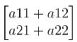
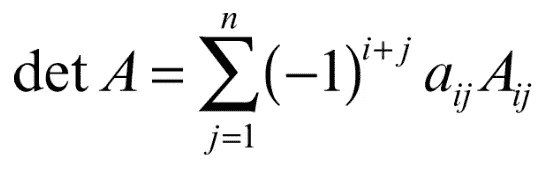
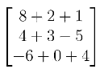
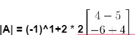
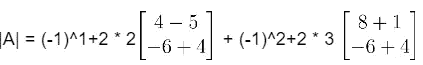

# 7.行列式和拉普拉斯定理及练习。

> 原文：<https://medium.com/mlearning-ai/7-determinant-and-laplace-theorem-with-exercise-6c007683822?source=collection_archive---------5----------------------->

Centaurus A Nebula

*行列式*

*拉普拉斯定理与习题*

# **行列式**

矩阵的行列式是一种性质。只有当矩阵的行数和列数与 5x5、3x3、10x10 等相同时，才有可能计算行列式。

矩阵 A 的行列式表示为 **|A|** 。

如果矩阵只由一个元素组成，矩阵的行列式就是这个元素，这就简单了。

如果矩阵由更多元素组成，如

这种情况下计算: **|A| = a11a22 — a12a21**

计算行列式的过程叫做**拉普拉斯展开**。

# **拉普拉斯定理与习题**

我们有两个可能的公式可以用，如果你不完全理解这些公式，不要担心，我们会在后面的练习中看到。

这两个是拉普拉斯定理的公式。

j =删除的列

k =淘汰行

好吧，这可能看起来很奇怪，现在我们将看到一个练习，它会更清楚我发誓！

考虑到这个矩阵，我们必须计算行列式。

首先，我们必须对要修复的列/行进行个性化处理。

您可以为分辨率选择每个列/行的组合，但为了简化工作，可以方便地选择更多零和更小数字的组合。

在这种情况下，方便的做法是 K = a 表示第一行，j = 2 表示第二列。

k = 1，j = 2 = a12

接下来，我们必须在相同的列中前进，因此感兴趣的数量是:

+2(第一行，第二列)

+3(第二行，第二列)

0(第三行，第二列)

好吧，但是我们怎么处理这些数字呢？

首先我设定了微积分的起点:

1.  **|A| = (-1)** ，每次都以(-1)开头。
2.  **|A| = (-1) +2** ，我设置了-1 的指数，这是第一个数的行(1) +列(2)。第一元素的位置。
3.  **|A| = (-1) +2 * 2** ，接下来我乘以第一个位置的值，本例中为+2。

4.现在我插入矩阵的剩余部分。你还记得初始矩阵吗？如果我们删除第一行第二列(我们考虑的点的坐标)会怎么样？)依然是我之前写的矩阵！

下一步是什么？我们对第二列的另一个值做同样的事情。所以最后的结果是:

通常会有三个 3X3 矩阵，但考虑到第二列的最后一个值是零，我们不必插入该值。

我们下一步做什么？我们解决了剩下的每一部分:

= 2(16–30)+3(32+6)

1.  我们解决了 **(-1)^k+j** ，这只是需要的迹象。
2.  在图 2 和图 3 中，数字取自矩阵 remain。
3.  但是()里面是什么呢？16 来自于 4 和 4 的乘法，主对角线，32 也一样，8 和 4 的乘法。
4.  另外两个数 30 和 6 是次对角线的乘法，32 = -5*-6 和 6 = -6 *1。

现在我们简单地解一下微积分:

= 2(16–30)+3(32+6) = 28 + 114 = 142

 [## Mlearning.ai 提交建议

### 如何成为 Mlearning.ai 上的作家

medium.com](/mlearning-ai/mlearning-ai-submission-suggestions-b51e2b130bfb)