# 7 种 Jupyter 降价款式，让你的笔记本更美观

> 原文：<https://medium.com/mlearning-ai/7-jupyter-markdown-styles-to-format-your-notebook-more-nicely-78a52f84986e?source=collection_archive---------1----------------------->

## 我们仍然在使用 Jupyter 笔记本，在我之前的一篇文章[这里](/tiamiyu/25-jupyter-notebook-hacks-to-boost-your-productivity-3d0530340cf2)中，我提到了一些在 Jupyter 笔记本上更高效工作的捷径。现在，是减价的时候了！

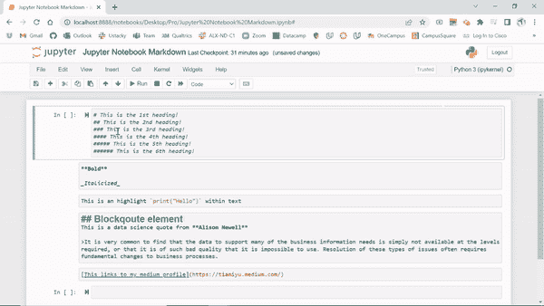

**Jupyter Notebook** 是一个基于网络的交互式计算平台。该笔记本将实时代码、公式、叙述性文本和可视化结合在一个文档中。jupyter 笔记本离线工作，有一些在线版本如 Google Colab 和 Kaggle kernel。

查看 Jupyter 笔记本快捷方式[这里](/tiamiyu/25-jupyter-notebook-hacks-to-boost-your-productivity-3d0530340cf2)。

**Jupyter 笔记本降价**

Markdown 是一种轻量级的流行标记语言，是数据科学家和分析师的编写标准。它通常被 Markdown 处理器转换成相应的 HTML，这使得它可以在不同的设备和人之间容易地共享。

标记语言类似于由标记标签组成的超文本标记语言(HTML)，由开始标签<tagname>和结束标签</tagname>组成。

从 markdown 开始，我们首先需要将**活动单元格**从默认代码转换为 markdown，如下所示。快捷方式是在特定单元格外单击并按下 **M** 键。

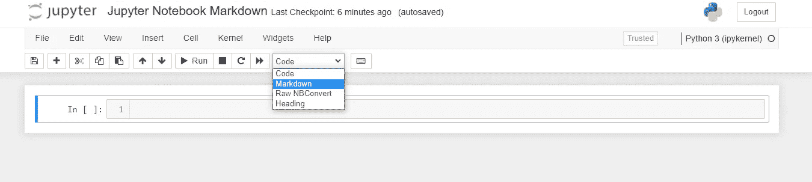

**Markdown conversion**

1.  **标题**

标题以散列符号(#)开头，然后是一个空格。标题有六个级别，最大的标题只有一个散列符号，最小的标题使用六个散列符号。当散列符号增加到 6 以上时，标题停止工作。

你应该用第一个标题作为你笔记本的主题/标题，然后其他的标题也跟着用。

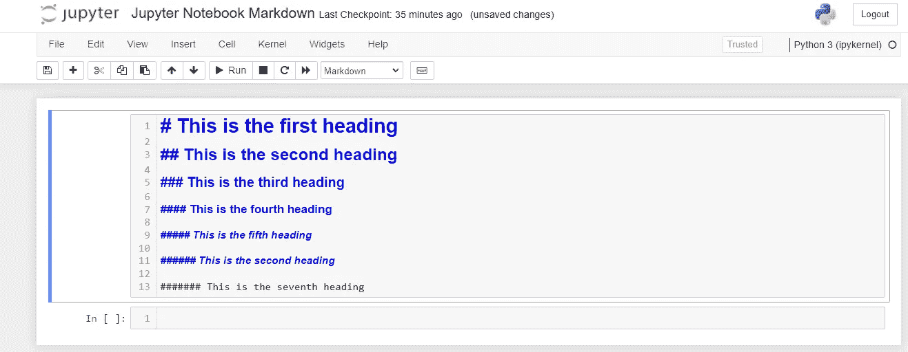

Headings before running the markdown

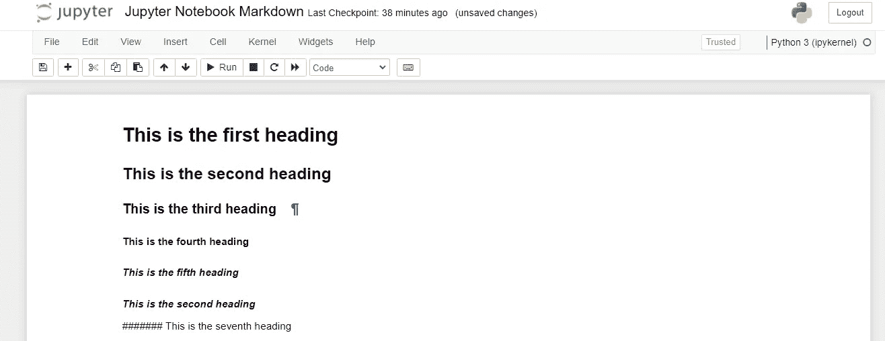

Headings after running the markdown

**2。强调** 这些用来给某些文本赋予特殊的价值或重要性。

*   **粗体:**在文本前后插入两个下划线或两个星号(__text__ 或**test**)。

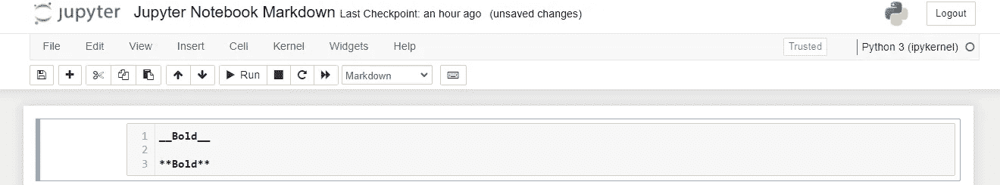

Bold

*   **斜体:**在文本前后插入一个下划线或一个星号(_text_ or *test*)。

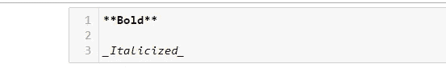

Bold/Italic

output

**3。列表也可以用来创建有序列表和无序列表。**

*   **有序列表** 有序列表按字母或数字顺序排列项目。输入数字 1 和一个点(。)后跟一个空格，然后是所需的文本。按 enter 键，将 2 插入下一行，依此类推。
    您可以通过按 tab 键、数字、点号、空格，然后按子列表项，在列表中创建子列表。

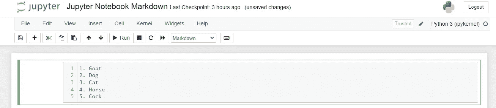

ol

output

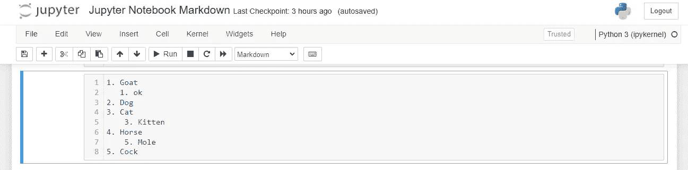

sublist

*   **无序列表** 无序列表用项目符号来标记。就像有序列表一样，你插入一个星号或破折号，然后是一个空格。你也可以有一个无序列表的子列表。

ul

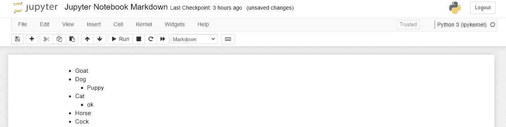

output

**4。高亮显示** 用这个，你可以用纯文本高亮显示一个代码或者函数。使用的符号称为后单引号(`)。

Highlight

**5。删除线** 删除线也称为删除线，由中间有一条水平线的单词表示。这意味着文本是错误的，最近被删除或标记为错误。删除线文本由要删除的文本开头和结尾的波浪号(~)表示。

**注意:**您需要处于降价样式才能使用此格式。

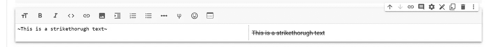

strikethrough text

**6** 。**块引号** 块引号用于定义从其他来源引用的文本块。块引号可以包含一大块文本，通常是缩进的**。**大于号(>)用于引入缩进。

blockquote

**7。超链接** 这些是引用存储在另一个位置的数据的链接。它们是通过点击高亮显示的单词或图像激活的。为此，您可以将文本写在方括号([])中，将超链接写在圆括号()中。

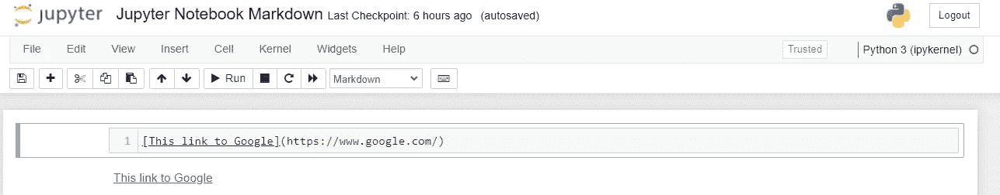

Hyperlinks

**8。Images** Image 也可以嵌入 jupyter notebook markdown，以 source 作为属性，由目录或链接组成，带有宽度和高度等可选属性。
另一个选项是点击编辑菜单>插入图片>上传，然后点击确定。

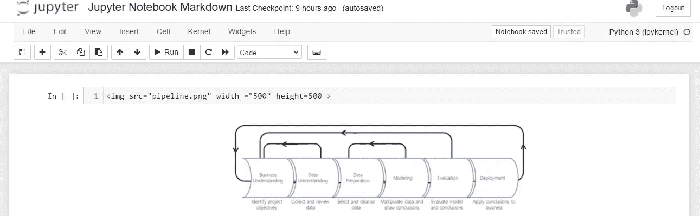

我们可以用 Jupyter 笔记本减价做很多其他事情，但我觉得这些是最常见或最重要的事情。

**参考文献**

*   [https://jupyter.org/](https://jupyter.org/)
*   [数据营](https://www.datacamp.com/)
*   [地球科学](https://www.earthdatascience.org/)

 [## Mlearning.ai 提交建议

### 如何成为 Mlearning.ai 上的作家

medium.com](/mlearning-ai/mlearning-ai-submission-suggestions-b51e2b130bfb)