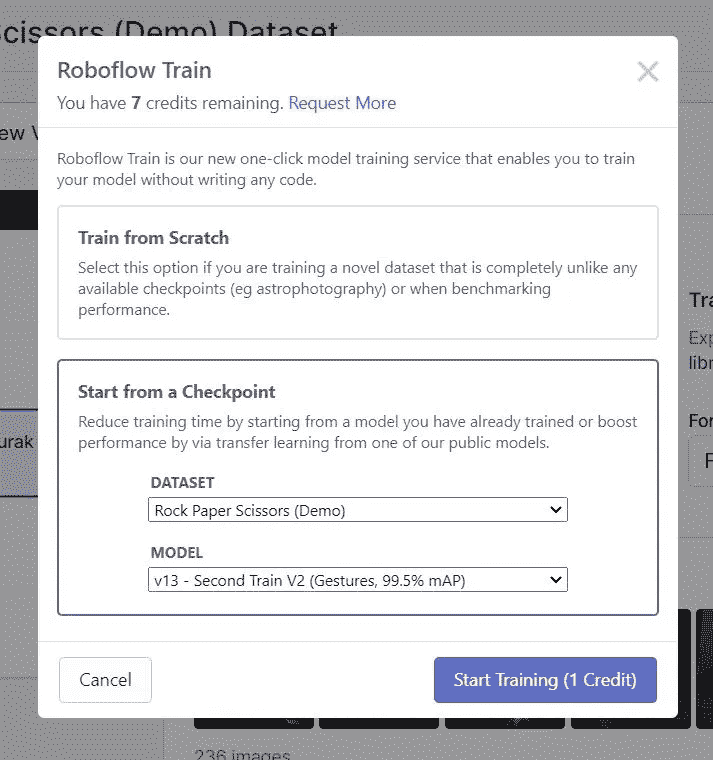

# 不应该开发自己的计算机视觉管道的 7 个理由

> 原文：<https://medium.com/mlearning-ai/7-reasons-why-you-shouldnt-roll-your-own-computer-vision-pipeline-9bc4a214f203?source=collection_archive---------3----------------------->

Ask yourself, “Is this good for the COMPANY?”

众所周知，独立构建计算机视觉模型是一项艰巨的工作。它需要将不同的平台、开源工具和开发人员笔记本放在一起，以创建一个有效的机器学习管道。而这还只是*开始*；在你有了一个训练有素的模型之后，你仍然需要做工程工作来在野外部署和维护它。

我每天都与开发人员交谈，他们花费了无数的时间来精心设计这些工作流——尽管它们无疑令人印象深刻，但它们也是劳动密集型的，并且需要频繁的维护。更糟糕的是，当这些完全不同的系统中的任何一个崩溃时(它们将会崩溃)，不可能找到错误的来源。尤其是在拼凑它的工程师已经离开公司之后。

> 结果，这些公司花费了几个月宝贵的开发时间(这些时间本可以更好地集中在公司的核心业务问题上),制造出一个不可维护的庞然大物，既不可扩展也不可重复。

如果你问我，我会说公司应该使用由一心一意的专家团队制作和维护的工具链，并且已经被成千上万的开发人员测试过。毕竟，这个过程不一定简单。它至少需要六个关键组件:

1.  上传图像
2.  注释图像
3.  生成数据集版本
4.  训练模特
5.  部署模型
6.  优化绩效(主动学习)

开发人员(天生)足智多谋，面向解决方案，适应性强。我明白，当你相信自己可以构建完全相同的解决方案时，购买一个产品可能会感觉违反直觉。让我们深入探讨计算机视觉团队在构建他们自己的(内部)机器学习工具时遇到的一些常见问题，以及使用端到端计算机视觉平台如何解决、减轻或完全消除这种痛苦。

# 问题#1:版本控制和协作

如果他们推出自己的计算机视觉管道，团队通常会遇到的一个挑战是，不同的数据科学家和工程师将处理同一数据集的不同版本，很难保持每个人的更改和添加都是正确的。如果您的一个团队成员注意到并修复了您注释中的一个错误，该修复如何进入其他团队成员的模型？如果您想要添加新的训练数据来提高边缘案例的性能，该信息是如何传播的？如果一个数据科学家训练一个新模型，你如何跟踪它与你的其他数据科学家以前的模型相比表现如何？

像 [Roboflow](https://roboflow.com/) 这样的系统使开发人员和领域专家能够创建准确、即时可用的计算机视觉模型，并且每个人都可以随着时间跟踪每个版本的功效。您可以很容易地查看您帐户中的所有以前的数据集，并且很清楚哪个版本是预先培训、训练和部署的。然后，Roboflow 上的团队可以通过评估各自账户内的最终模型性能(mAP、精确度和召回率)来比较各自独特的数据集参数。

# 问题 2:缺乏中心性

生成和维护一个外部开发的机器学习管道通常只属于一个人或一个小的开发团队。这意味着，任何数量的员工流失都可能极大地阻碍您团队的进展，因为其他人都试图理解(并拼凑)用于开发管道的许多不同工具和解决方案。谁可以访问哪些平台？注释存储在哪里？哪些系统需要手动更新或维护，更新频率如何？

预先建立的计算机视觉管道位于云中，这意味着每个人，包括非技术利益相关者，都将始终可以访问整个工作流。共享账户可以存放所有源图像、注释、数据集和训练有素的模型。这些是组成整个机器学习管道的组件，它们应该存在于一个中央存储库中。

# 问题 3:培训过程缓慢

从头开始训练一个模型需要很长时间。您不想在每次对数据集进行改进时都等待一个完整的模型来训练，您希望您的模型从一个封装了您的模型之前所学的所有东西的检查点开始。

这叫做[转移学习](https://blog.roboflow.com/a-primer-on-transfer-learning/)，它被烘焙到您的 Roboflow 账户中。只需选择您希望新模型学习的经过训练的模型，下一个迭代将从上一个迭代停止的地方开始学习您的新数据。

# 问题 4:模型性能不佳

在为创建您自己的计算机视觉管道投入了这么多时间和精力之后，当生成的模型的性能不如您的团队所希望或预期的那样好时，这可能会是毁灭性的。如果没有分析和报告功能，您需要了解模型在哪里以及如何失败，优化模型可能会感觉像是一个昂贵而耗时的猜测和检查游戏。

在野外理解模型性能，然后将推断数据反馈到下一个模型迭代的源数据集中的过程称为[主动学习](https://blog.roboflow.com/what-is-active-learning/)，与迁移学习一样，它也类似地融入到您的 Roboflow 帐户中。此外，我们的上传 API 使您能够预先选择这项工作的最高杠杆图像，包括最终不正确的低置信度预测和高置信度预测。

我们将此工作流设计为交钥匙工程，面向在部署中使用一个或多个模型主动收集推断数据的客户，这样他们的模型就可以越用越好。

# 问题#5:部署

如果一个经过训练的模型不能在野外使用，它就没有多大用处。使用内部工具和定制的培训管道，部署可能会带来一系列挑战，具体取决于您希望模型对现实世界数据进行预测的方法(例如，驾驶无人机收集航空影像，在仓库中安装摄像头，或将模型嵌入智能手机应用程序)。开发人员可以花费数周时间为独特的设备构建自己的 API 调用和 Dockers，但这些解决方案是静态的，无法随着该行业快速变化的形势而发展。

你可以通过多种方式从你的 Roboflow 账户部署一个训练过的模型，包括[一个托管的推理 API](https://docs.roboflow.com/inference/hosted-api) ，在设备上部署(针对像 [NVIDIA Jetson](https://docs.roboflow.com/inference/nvidia-jetson) 和 [OpenCV AI Kit 设备](https://docs.roboflow.com/inference/luxonis-oak)，甚至[一个网络浏览器](https://docs.roboflow.com/inference/web-browser)。我们提供 Dockers 和文档来使这个过程变得简单和可扩展，即使整个行业都在发生变化，新一代的工具已经发布给公众。你可以在几天内投入生产，而不是几个月。

# 问题#6:受阻的计划

团队受阻。这种情况一直都在发生，尤其是在计算机视觉领域，新技术(以及对旧技术的改进)带来的问题往往比它们回答的问题更多。在这种情况下，专家会求助于其他专家、GitHub 上的论坛、学术论文甚至 YouTube 视频。有一个随叫随到的机器学习专家团队不是很好吗？

使用 Roboflow 的最大好处之一是，我们的客户可以直接从我们的团队那里获得教育内容、[在线文档](https://docs.roboflow.com/)，以及我们的教程[视频](https://www.youtube.com/channel/UCUlRrGpNRT5jbiV8h5Q_4Fg)和博客帖子，这些内容涉及常见的陷阱、操作方法和最佳实践。当您使用 Roboflow 进行构建时，您永远不会孤独。

有了 Roboflow 专家的专业知识和帮助，以及你现有的工程天赋，你就不需要雇佣一个昂贵的机器学习博士团队。如果你已经有计算机视觉专家，他们可以把时间花在更高的杠杆上，他们工作的差异化部分，而不是重新发明轮子。

# 问题 7:成本

许多技术专家在构建一个强大而复杂的管道时发现了我们的解决方案，他们显然投入了大量的时间和资源来开发这个管道。我们想强调的是，为了更好的可伸缩性和增长，这些努力并没有因为切换到 Roboflow 的模块而白费。从长期来看，使用 Roboflow 的总成本可能会远远低于维护一个团队来支持和扩展您现有的解决方案。

事实上，你开发的外部系统可以告诉我们很多关于如何为你服务的信息。我们可以发现您当前工作流程的优缺点，以更好地满足您项目的独特需求。我们的目标是创建一个平台，为您提供两个世界的最佳选择:一个您可以拥有、接触和管理的系统，以及一个用于您所有数据和模型的中心枢纽，它可以自动执行今天从头开始构建所需的大量手动工作。

# 准备，开始，烘烤！

想明确知道 Roboflow 的性能是否与您现有的预建管道一样好(如果不是更好的话)？我们邀请你参加烘焙比赛。[联系我们](https://roboflow.com/sales)获得免费培训积分，我们将带您完成上传您的图片+注释和在 Roboflow 上培训新模型的过程。让我们比较结果，并帮助您正式决定是与我们一起构建，还是自己构建。