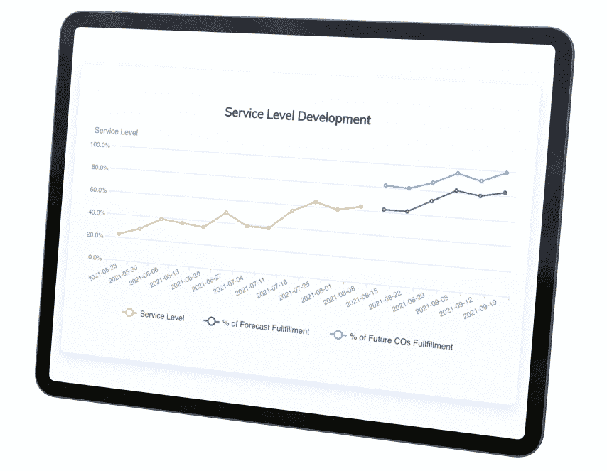

# 增加电子商务收入的 7 个备选步骤

> 原文：<https://medium.com/mlearning-ai/7-steps-to-reduce-lost-sales-in-e-commerce-e6ab6463a172?source=collection_archive---------11----------------------->

大多数网上购物者在网上购买产品时，看到“仅在 12 周内可用”时都会感到沮丧。高达 58%的沮丧购物者会因为店内销售中的产品缺货而失去顾客，65%的人会因为在线销售而失去顾客。这些损失的收入足以让我们仔细看看电子商务公司缺货的根本原因。