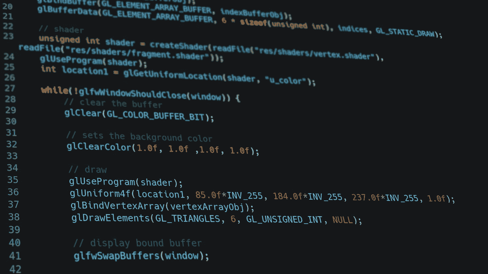

# 用于数据科学和分析项目的 8 个有用的 python 代码片段

> 原文：<https://medium.com/mlearning-ai/8-useful-python-code-snippets-for-data-science-and-analysis-projects-e76b0f391fb?source=collection_archive---------9----------------------->

## 需要完成一些工作吗？这里有 8 个对数据科学和分析项目有用的 python 代码片段。

Photo by [Krishna Pandey](https://unsplash.com/@krishna2803?utm_source=medium&utm_medium=referral) on [Unsplash](https://unsplash.com?utm_source=medium&utm_medium=referral)

**简介**

这些是我日常工作中最常见的任务。我希望它们对你有用。在列表下面。享受吧。

## 1.将同一文件的多个 excel 表格合并到一个数据框架中，并另存为。战斗支援车

## 2.从熊猫的日期数据中提取年份

## 3.函数来寻找异常值的边界

## 4.量化数据集中的基数

## 5.用图表量化缺失数据

## 6.打印、列出和计数数据集中的数字或分类特征熊猫

## 7.熊猫地图功能提供分类/文本标签的标签

## 8.实用程序:用空间预处理文本

## 结论

我希望这些对你有用。我将在未来添加更多的片段。如果你有任何问题或建议，请告诉我。感谢阅读。

## 作者

我写关于数据科学、python 编码项目和数据驱动营销的文章。我还为数据新手或数据入门者提供数据和业务指导。

你可以在[媒体](/@Marcello_Dichiera)和[推特](https://twitter.com/ItalyMarcello)上关注我，或者访问[我的网站](https://marcello-personal-website.netlify.app/)和 [Github](https://github.com/marcello-calabrese) 页面。

 [## Mlearning.ai 提交建议

### 如何成为 Mlearning.ai 上的作家

medium.com](/mlearning-ai/mlearning-ai-submission-suggestions-b51e2b130bfb)