# 9 个重要的数据分布和每个分布的真实例子

> 原文：<https://medium.com/mlearning-ai/9-important-data-distributions-real-world-examples-for-each-b804d9d95fe7?source=collection_archive---------2----------------------->

目录:

*   简介
    - [离散数据 vs 连续数据](#1893)
    - [PMF vs PDF vs CDF](#7c61)
*   离散数据分布
    - [伯努利](#7583)
    - [二项式](#ac9c)
    - [离散均匀](#d7f9)-
    -[泊松](#aa2a)
*   连续数据分布
    - [高斯](#87ca)
    - [指数](#9d07)
    - [伽玛](#b27d)
    - [对数-正态](#d9ed)
    - [学生-t](#b37c)
*   [结论](#a78c)

# 介绍

数据科学家的大部分工作是处理和操纵真实世界的数据，根据数据代表的内容，将会有相关的**数据分布。**

在我看来，理解不同数据分布的最简单方法是通过一个真实世界的例子来解释它们，这也是我在本文中将要做的！

但是在我们进入一些例子之前，让我们快速定义一些统计学领域的重要概念…

## 离散数据与连续数据

*   ***离散数据****——**由相互之间没有连续空间的特定有限值定义的数据。离散数据被*计数。
    -示例:高尔夫球袋中高尔夫球杆的数量**
*   ****连续数据***——存在于连续空间中的数据，可以取该空间内的任意值。连续数据是*测量的。
    -例如:温度读数为 21.25 度**

## *PMF vs PDF vs CDF*

*   ****PMF(概率质量函数)*** —一个数学公式，用来衡量从离散数据分布中抽取特定值的*概率。**
*   ****PDF(概率密度函数)*** —一个数学公式，用来度量跨越连续空间的不同值的*概率密度。**
*   ****CDF(累积密度函数)*** —一个数学公式，用来衡量小于或等于某个值的抽取样本的*概率。**

*好了，现在让我们来看看一些数据分布！*

# *离散数据分布*

## *1.二项分布*

*伯努利分布捕捉给定一次试验获得两种结果之一(通常称为成功或失败)的概率。它实际上只是二项分布的一个特例，其中 *n=1* 。*

*示例:*

*   *你和你的朋友出去了，你从口袋里掏出一枚硬币来决定谁来买下一轮饮料🍻这种抛硬币的结果可以用伯努利分布来模拟。*

*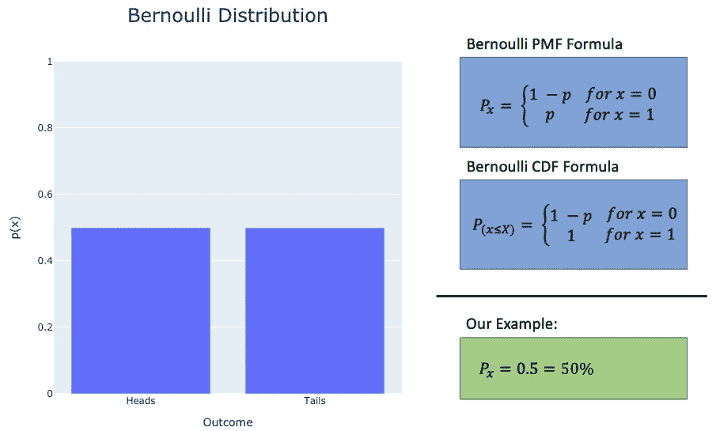*

*Bernoulli distribution — [learn more here](https://www.statisticshowto.com/bernoulli-distribution/)*

## *2.二项分布*

*二项式分布只是把伯努利向前推进了一步。我们仍然有导致两种结果之一(成功或失败)的试验，但现在我们正在研究特定数量的结果( *x* ) 出现在 *n 次试验*而不是单次试验中的**概率。***

*示例:*

*   *你决定试着欺骗你的朋友(当然是用统计数据),你说如果你抛 5 次硬币，正面朝上正好是🪙的 2 倍，你将购买下一轮饮料*

*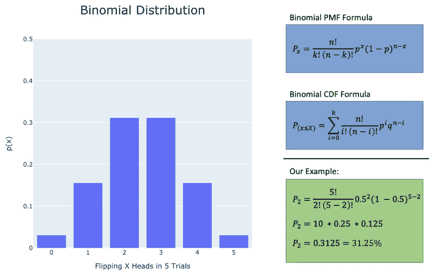*

*Binomial distribution — [learn more here](https://www.statisticshowto.com/probability-and-statistics/binomial-theorem/binomial-distribution-formula/)*

## *3.离散均匀分布*

*离散均匀分布是一种简单的分布，其中我们有一组潜在的结果( *n* )，每个结果发生的可能性都是相等的。*

*示例:*

*   *你盲目地把手伸进一袋弹珠里，里面有一颗绿色弹珠、一颗红色弹珠、一颗蓝色弹珠和一颗黄色弹珠。挑选黄色弹珠的机会有多大？🟡*

*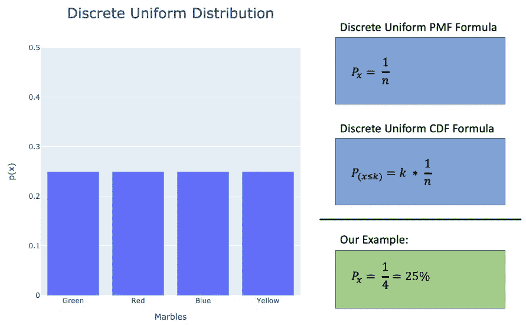*

*discrete uniform distribution— [learn more here](https://mathworld.wolfram.com/DiscreteUniformDistribution.html)*

## *4.泊松分布*

*泊松分布用于回答问题**一个事件在给定时间段内可能发生多少次？**泊松分布由*速率参数* (λ)定义，它是在单个观察时间单位内该事件发生的平均次数。*

*示例:*

*   *假设一个篮球队平均每节投 4.2 个三分球🏀如果这是真的，那么这支球队在一个季度中准确投进 7 个三分球的可能性有多大？*

*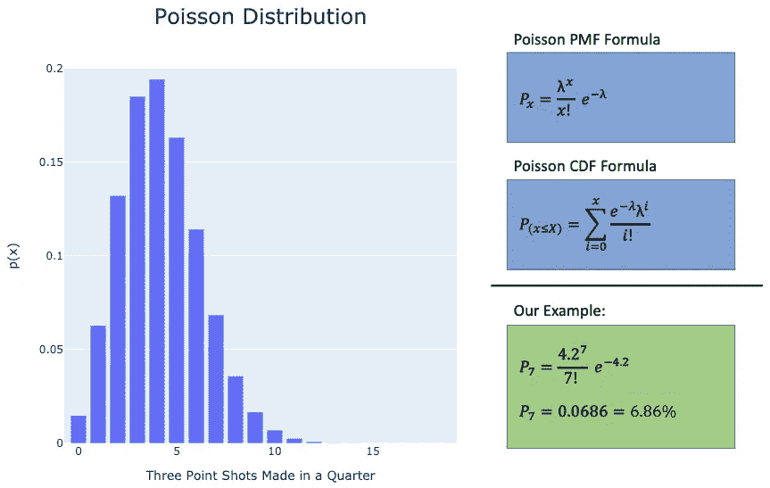*

*Poisson distribution — [learn more here](https://www.statisticshowto.com/probability-and-statistics/statistics-definitions/probability-distribution/poisson-distribution/)*

# *连续数据分布*

## *1.高斯(正态)分布*

*高斯分布可能是自然界中最广为人知和观察到的分布。由一个*平均值* (μ)和一个*标准差(* σ)定义。*

*同样，现在我们正在讨论连续值，我们不能再说“这个*精确的*值出现的可能性有多大”，因为从技术上讲，在连续空间中不存在精确的值。相反，我们会问这样一个问题“样本*落入给定数值范围*的可能性有多大？”*

*示例:*

*   *假设我和世界上每一个人都是朋友(😎)而且每个人都自愿把自己的身高信息给我。人口的平均身高为 164.58 厘米，标准差为 8.83 厘米*
*   *根据上面的信息，某人身高超过 175cm 的概率是多少？*

*** *注** —* 对于连续空间中的计算，我们有时会通过计算*分数*并在*查找表*中找到其相关概率来近似概率。对于高斯分布，我们使用所谓的 ***z 值*。***

*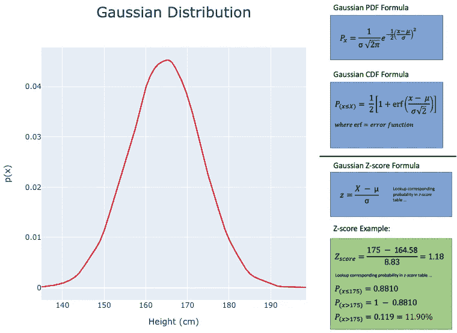*

*Gaussian distribution — [learn more here](https://www.scribbr.com/statistics/normal-distribution/)*

*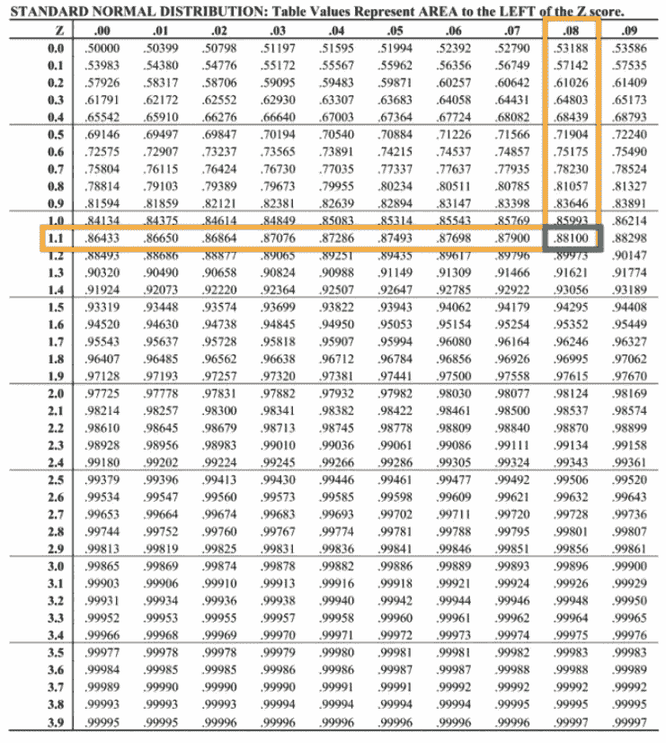*

*z-score table (positive z-scores)*

## *2.指数分布*

*指数分布是随机值遵循指数模式的分布。**指数函数通常用于确定下一个事件发生前的等待时间。**这个分布的重要参数是*速率参数* (λ)，它是单位时间内完成的事件的速率。*

*示例:*

*   *一个邮政工人平均花 4 分钟在每个顾客身上，他们花在顾客身上的时间可以用指数函数来表示(0.25 个顾客/分钟)*
*   *给定一个随机的顾客，邮递员与他们相处少于 2 分钟的概率是多少？*

*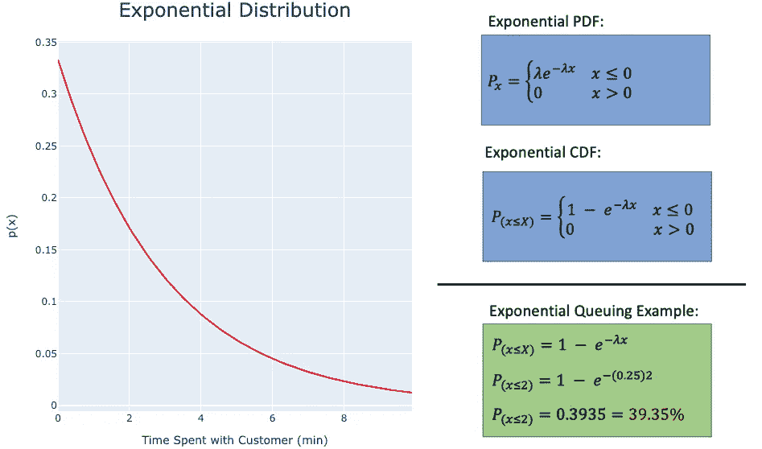*

*Exponential distribution — [learn more here](https://opentextbc.ca/introstatopenstax/chapter/the-exponential-distribution/)*

## *3.γ分布*

*与指数函数类似，伽马分布通常用于等待时间问题。不同之处在于，伽马分布**用于寻找与等待 *k* 个事件**相关的概率，而不是像指数分布那样仅一个事件。Gamma 的重要参数是等待的事件数和速率参数。*

*示例:*

*   *你来到你最喜欢的餐馆，有两个人排在你前面点菜。这家餐厅的平均点餐时间是 2 分钟(或每分钟 0.5 个顾客的比率)。*
*   *您在接下来的 4 分钟内开始下单的可能性有多大？🍔*

*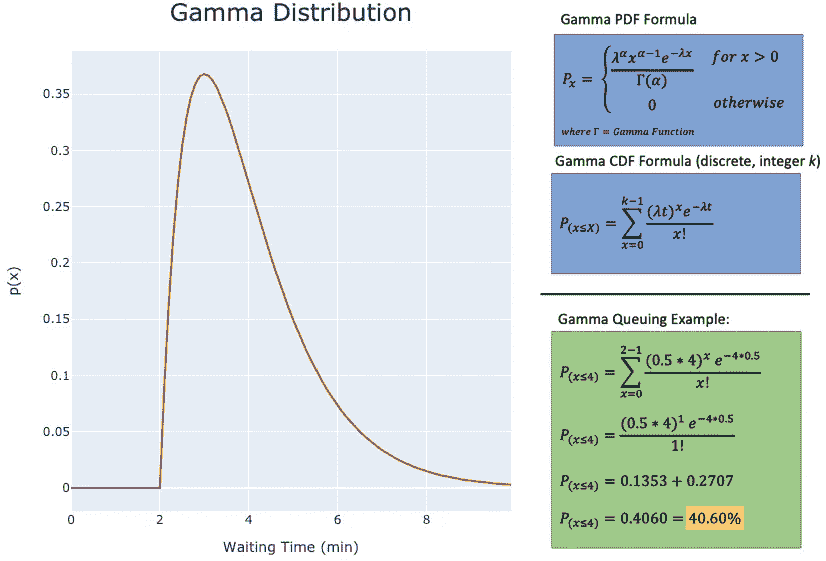*

*Gamma distribution — [learn more here](https://towardsdatascience.com/gamma-distribution-intuition-derivation-and-examples-55f407423840)*

## *4.对数正态分布*

*对数正态分布是对数呈正态分布的随机变量的连续分布。**换句话说，对数正态分布是由 eˣ函数生成的，其中 x(随机变量)假定是正态分布。***

*示例:*

*   *假设你是一名质量控制工程师，⚙️，你必须在液压机下对你的产品进行 10，000 次压力测试，看看它需要多长时间才会断裂/失效。所有样本的结果可能看起来像下面的对数正态分布。*

*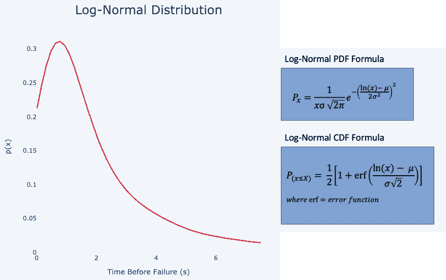*

*Log-normal distribution — [learn more here](https://brilliant.org/wiki/log-normal-distribution/)*

*知道您的数据是对数正态分布是有价值的，因为我们可以使用 *log(x)* 函数轻松地将对数正态数据转换成正态分布！*

## *5.学生 t 分布*

*Students t-test 分布与高斯分布具有相似的形状，但是略短且略宽。当我们的样本量很小和/或总体标准差未知时，这有助于进行组间比较。学生 t 分布的重要参数是总体均值( *μ* )、样本均值(x̂)、样本标准差(σ̂)和自由度( *n-1* )。*

*t 分布最常用于 [*假设检验*](https://www.scribbr.com/statistics/t-test/#:~:text=A%20t%2Dtest%20is%20a%20statistical%20test%20that%20compares%20the,means%20is%20different%20from%20zero.) *、*范围内的计算，如下例所示！*

*示例:*

*   *假设一款新车上市，制造商声称其平均油耗为 7.2 升/100 公里🚗你决定自己出去测试其中的 4 辆车，并记录它们的燃油等级:
    【7.1，7.5，6.7，6.9】*
*   *根据你收集的数据，使用 95%的置信区间，你能证实制造商的说法吗？*

*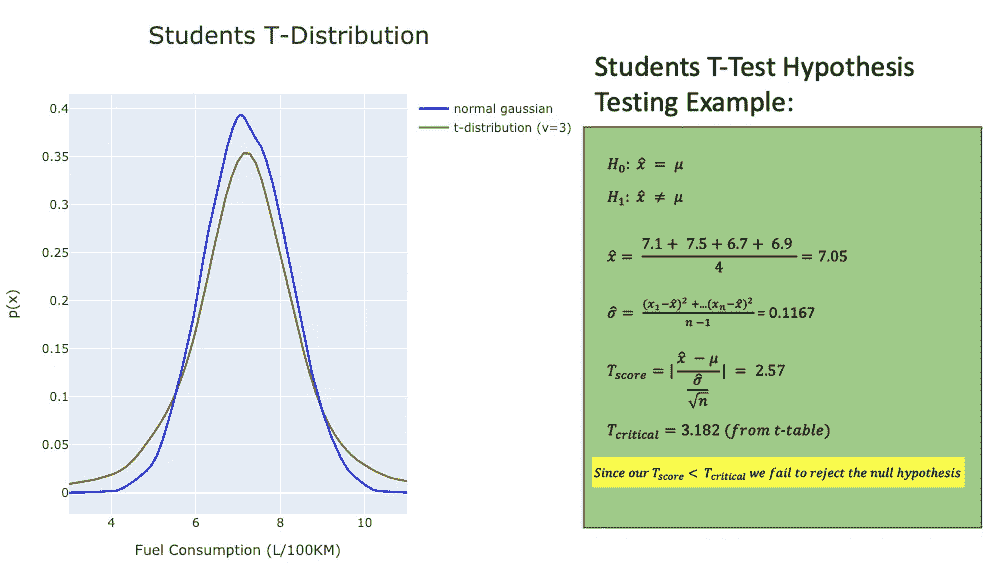*

*Students t-distribution — [learn more here](https://stattrek.com/probability-distributions/t-distribution.aspx)*

*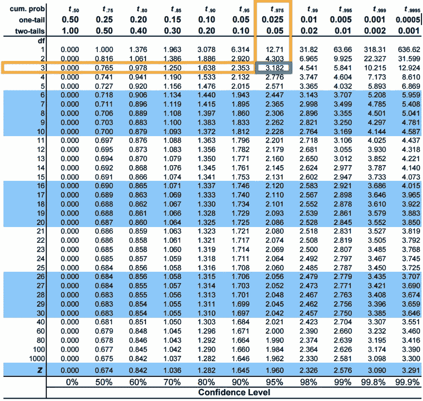*

*t-test table*

*由于我们无法拒绝零假设，我们可以说，从我们的数据发现，我们有 95%的信心，汽车制造商声称是真实的！*

# *结论*

*理解数据的分布是很重要的，因为它们可以给我们洞察力，并为执行进一步的统计分析打开大门。本文涵盖了一些最常见的数据分布，但绝不是一个全面的列表。*

*如果 PDF 和 CDF 的一些公式看起来有点难以理解，不要担心(我支持你)。幸运的是，像 R 和 Python 这样的编程语言中有很多在线工具和库可以帮助进行统计分析(比如 [SciPy](https://scipy.org/) )。*

*我希望您能从这篇文章中学到一些东西，并且真实世界的例子能帮助您更好地理解发行版！*

*感谢阅读！*

*[在 LinkedIn 上与我联系👤💡](https://www.linkedin.com/in/kaine-black-50b583168/)*

* [## Mlearning.ai 提交建议

### 如何成为 Mlearning.ai 上的作家

medium.com](/mlearning-ai/mlearning-ai-submission-suggestions-b51e2b130bfb) 

[成为作家](/mlearning-ai/mlearning-ai-submission-suggestions-b51e2b130bfb)*