# A/B 测试:

> 原文：<https://medium.com/mlearning-ai/a-b-test-d638b1870665?source=collection_archive---------5----------------------->

## 测试购物网页的新功能

Photo by Jaime Reimer on pexels.com

本文由[黑尔·克孜尔杜曼](https://medium.com/u/233c859ccc6?source=post_page-----d638b1870665--------------------------------)和[阿尔帕斯兰·梅斯里](https://medium.com/u/fe99f0a4a612?source=post_page-----d638b1870665--------------------------------)撰写。

本文结合广告实验进行了 A/B 测试。数据通过以下[链接](https://www.kaggle.com/code/evaaasong/a-b-testing-analysis/data)开放访问。在进行这项研究时，代码改编自 kaggle 中类似的主题作品。您可以访问。ipynb 文件通过[链接](https://github.com/HaleKizilduman/A-B_Test)。

下面是这个数据的故事。本文末尾的术语表部分添加了对所用属性的描述。

一家公司最近引入了一种新的投标类型“平均投标”，作为其现有投标类型“最高投标”的替代。我们的一个客户，….com，已经决定测试这个新功能，并希望进行 A/B 测试，以了解平均出价是否比最高出价带来更多的转换。A/B 测试已经进行了 1 个月，….com 现在希望您分析并展示这一 A/B 测试的结果[1]。

因此，选择了 A/B 测试标准转换率。先做 EDA，然后检查 A/B 测试。

首先，导入所需的库。

通过使用 *sep* 参数，测试组数据被导入并分成列。

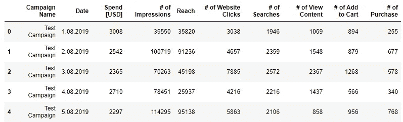

列名已经重新排列，不包括标签。

使用 info 命令检查列的数据类型。

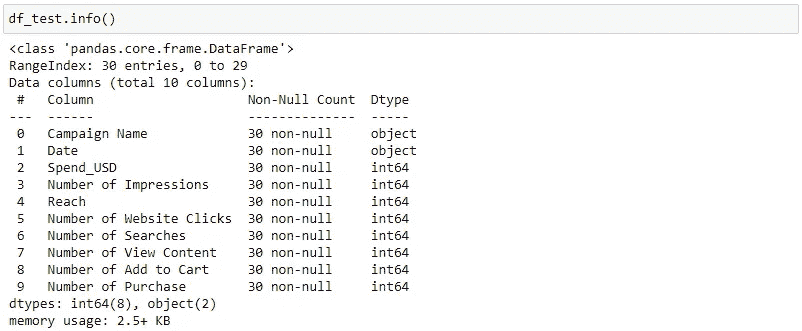

*日期*列的数据类型从 object 转换为 datetime。

使用 describe 函数检查 df_test 数据帧的摘要。

也分别对对照组执行测试组的程序，并且确定在对照组中存在 NaN 值。这些空数据使用 K-NN 算法填充。

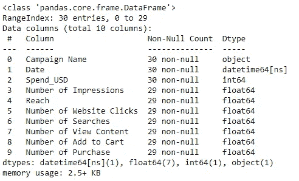

测试数据帧和控制数据帧合并在一起，形成一个单一的数据帧 df。索引列已根据新的数据框架重置，以避免混淆。分析中使用的新属性是通过特征工程创建的。这些属性是:每次购买的美元花费、点击率(%)、转换率(%)、加入购物车率(%)。

## 探索性数据分析

为了探究数据，创建了各种图表，并从不同角度查看数据。

根据下图，控制组在转化率(%)方面更成功，而测试组在每个广告的网站访问率，CTR(%)方面更成功。

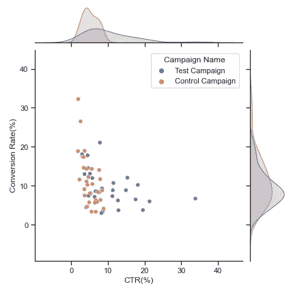

测试组和对照组的分布似乎相等，考虑到网站点击次数和购买次数，没有检测到显著差异。

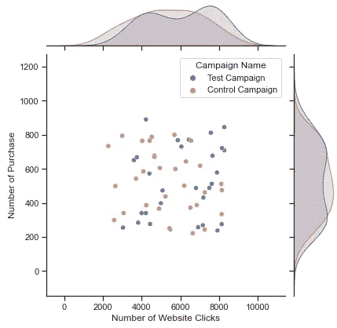

在下面的图表中，控制组每次商业交易购买的产品数量似乎更高。

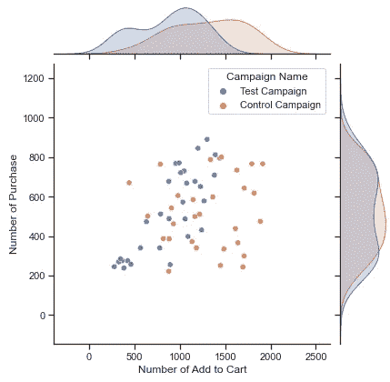

与控制组相比，测试组似乎进行了更昂贵的交易，如下图所示。

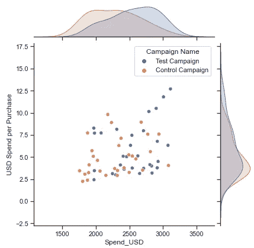

如下所示，与测试组相比，对照组的印象数量和范围都更高。

当检查样本数据时，对照组总共花费了 68，653.0 美元，而测试组花费了 76，892.0 美元。总支出增长计算如下:

(76892–68653)/68653 = 0.12

根据这个结果，测试组总共多花了 12%的钱。

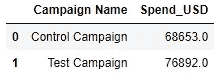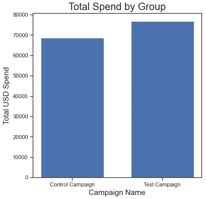

虽然测试组每笔交易的平均花费金额为 5.9 美元，但在对照组中却下降了 1 美元，为 4.99 美元。每次购买的美元增值计算如下:

(5.90–4.99)/4.99= 0.18

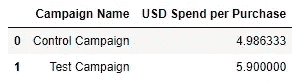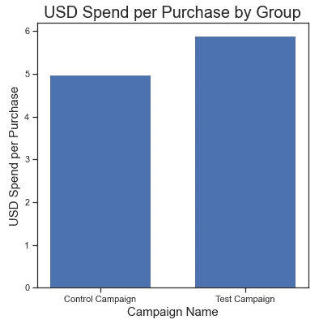

虽然商业交易的数量有所减少，但在每笔交易中购买的产品数量增加了，或者销售的产品类型可能发生了变化。这可以通过查看添加到图表中的产品数量来理解。

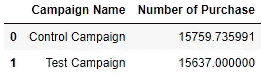

在测试组中，放入购物车的产品要少得多。因此，产品类型可能会改变，或者添加到测试组中的购物车的产品可能会不太频繁地被移除。

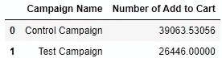

根据转换率(%)的各组分布显示在下面的箱线图中。

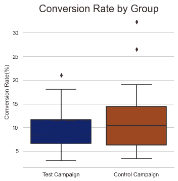

对照组的转化率(%)度量的平均值计算为 11.4，而测试组的平均值计算为 9.23。

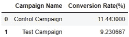

各组根据 CTR (%)的分布如下图所示。方框图显示，发布的广告可能更好地抓住了目标受众。另一种可能性是，提供的广告可以做得更吸引人。

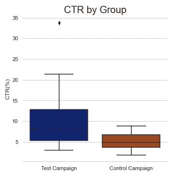

根据印象数量的组的分布在下面显示为箱线图。

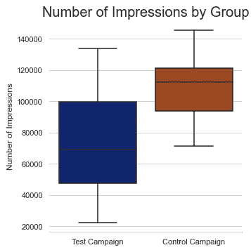

当查看关于印象数和到达数的箱线图值时，结果是平行的。对照组的数值高于试验组。

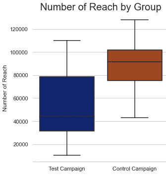

## A/B 测试:转化率

首先，将 df 变量复制到 df_2 变量，这样就不会对 df 变量进行修改。然后，数据集被分成两部分，即测试 g 和控制 g。

对于第一个假设检验，转换率列被分配给 test_group_cr 和 control_group_cr 变量。

比较两个样本的标准差，以实施假设检验。试验组标准偏差为 4.449，对照组标准偏差为 6.722，两者之间存在差异。

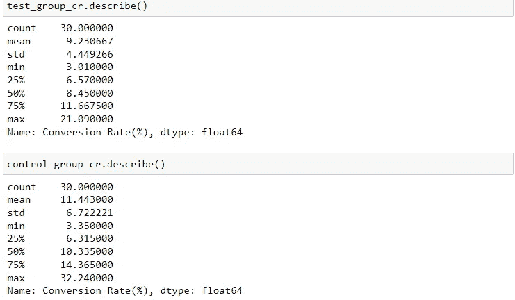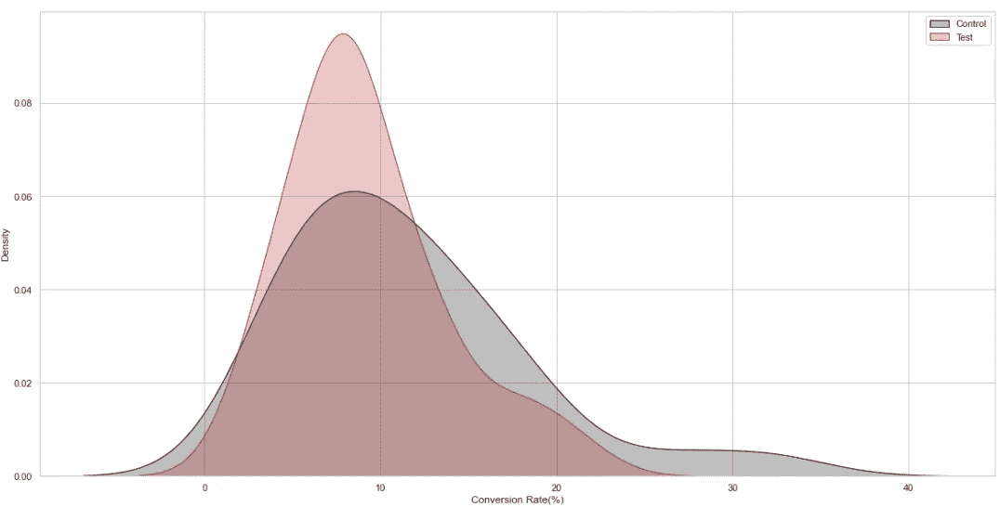

为了检测异常值，绘制了转化率的箱线图。

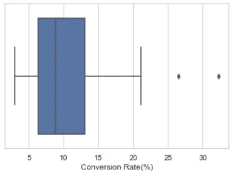

在箱线图中看到异常值后，打印出这些点。

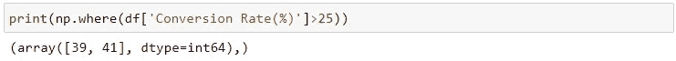

从数据中清除检测到的异常点。因此，两个数据集的差异更加接近。这样，我们可以在 AB 测试的同时执行标准的独立 2 样本测试。

剔除异常数据后，两个样本的分布回归到正态分布。

已执行 AB 测试。由于 p 值大于α值，显著性水平为 0.05，因此接受了尿道下裂。因此，就转换率(%)而言，对照组和试验组之间不存在具有统计意义的差异。

## A/B 测试:CTR

换算率(%)之后，现在就要执行 CTR 的 AB 测试了。
离群数据通过绘制箱线图来说明。

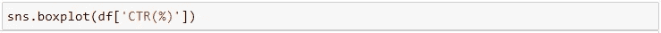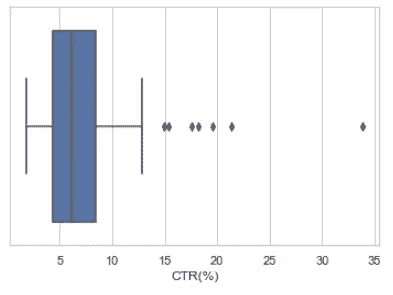

CTR 值为 34 的点被从样本中删除，因为它是异常值数据。

根据经验，如果较大方差与较小方差之比小于 4，那么我们可以假设方差大致相等，并使用学生的 t 检验[2]。当我们比较测试组和对照组的方差时，可以看出方差之间的差异足以用学生的 t 检验进行假设检验。

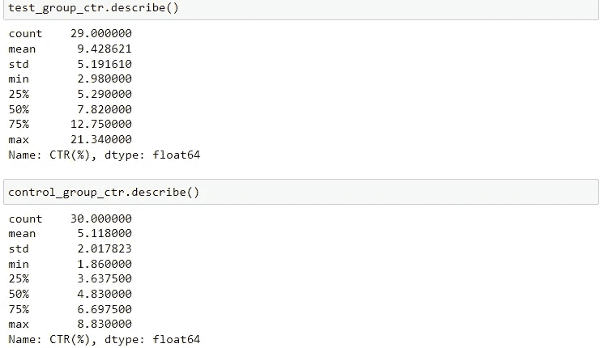

绘制样本组的分布图，并检验它们是否具有正态分布。检查图表后，做一个有助于了解各组是否呈正态分布的测试可能是有益的。

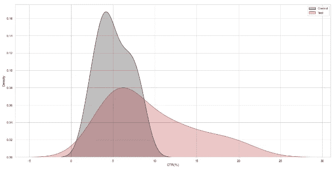

夏皮罗-维尔克和科尔莫戈罗夫-斯米尔诺夫检验的零假设是总体呈正态分布。因此，如果 *p* 值小于所选的α水平，则零假设被拒绝[3]。从下面的测试结果可以看出，测试组没有正态分布。因此，不能应用 AB 测试。建议在测试数据转换成正态分布后，可以再次查看 CTR 的 AB 测试。

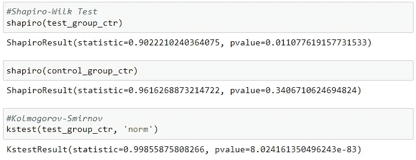

## A/B 测试:添加到购物车比率(%)

在 CTR(%)之后，现在将执行添加到购物车比率(%)的 AB 测试。
异常数据通过绘制箱线图来说明。

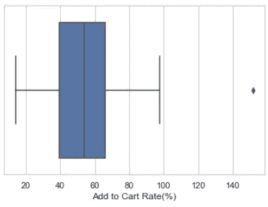

添加到购物车的比率(%)值大于 140 的点已从样本中删除，因为它是异常值数据。

当我们比较测试组和对照组的方差时，可以看出方差之间的差异足以用学生的 t 检验进行假设检验。

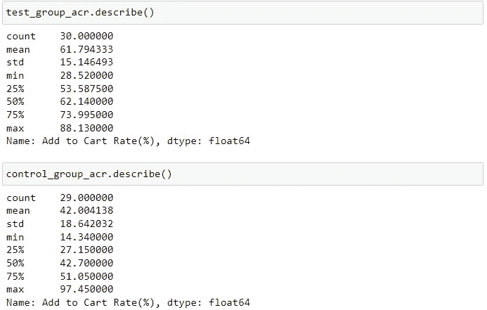

绘制样本组的分布图，并检验它们是否具有正态分布。虽然图像类似于正态分布，然而夏皮罗-维尔克检验被应用。

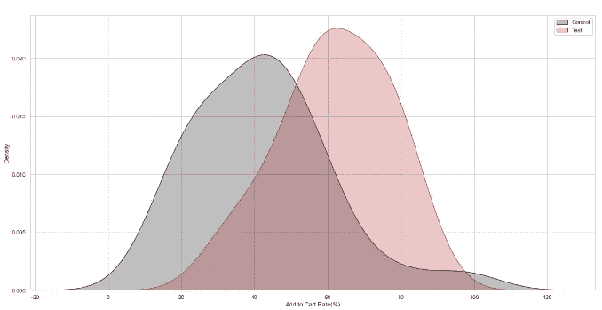

由于 *p* 值大于α水平 0.05，则零假设被接受。因此，可以应用 AB 测试。

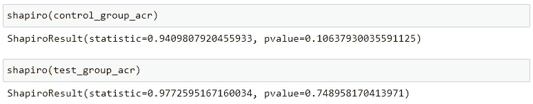

已执行 AB 测试。由于 p 值小于α，显著性水平为 0.05，因此拒绝接受尿道下裂。因此，就加入购物车的比率(%)而言，对照组和试验组之间存在具有统计意义的差异。

试验组和对照组的平均值分别为 61.79 和 42.00。在这种情况下，可以说网页的新设计在添加到购物车比率参数方面有所改进。

总之，在这项研究中，三个参数:转换率，点击率和加入购物车率，被用来衡量网站新旧设计之间的差异。
根据转换率参数，新旧设计之间没有统计学上的显著差异。当检查 CTR 参数时，发现该参数由于其分布不适合 A/B 测试。查看添加到购物车比率参数，可以看出新设计的添加到购物车比率的平均值高于旧设计。

## 词汇表:

控制组:一个[在线控制实验](https://www.analytics-toolkit.com/glossary/online-controlled-experiment/)是一组(通常是随机分配的)用户/会话/浏览量/等等。谁**不会接触到实验性治疗**。将[测试组](https://www.analytics-toolkit.com/glossary/test-group/) (s)的性能与对照组的性能进行比较，以检查差异是否大到足以拒绝[零假设](https://www.analytics-toolkit.com/glossary/null-hypothesis/)【4】。

测试组:是一组(通常是随机分配的)用户/会话/页面视图等。接受某种[处理](https://www.analytics-toolkit.com/glossary/treatment/)。然后将测试组与[对照组](https://www.analytics-toolkit.com/glossary/control-group/)进行比较，以检查差异是否大到足以拒绝感兴趣的[无效假设](https://www.analytics-toolkit.com/glossary/null-hypothesis/)。

control_group.csv:它包含控件组数据。

test_group.csv:它包含测试组数据。

活动名称:活动名称包含两个值，即测试组和对照组。

日期:年月日

花费[美元]:每天花费的钱。

印象数:用户看到广告是一个变量。

影响范围:看到广告的独特人数。

网站点击量:是与用户点击广告中的网站链接相关的变量。

搜索次数:是与用户在网站上执行搜索相关的变量。

查看内容数量:是与用户查看产品详情相关的变量。

添加到购物车的数量:这是与用户将产品添加到购物车相关的变量。

购买次数:是与用户购买产品相关的变量。

转换率:每次访问的商业交易，以百分比表示。

每次购买花费的美元:购买每件商品花费的美元金额。点击率(%):显示人们看到你的广告并最终点击它的频率。
添加到购物车比率(%):会话期间添加到购物车的产品的购买比率，以百分比表示。

参考资料:

[1][https://www . ka ggle . com/code/evaaasong/a-b-testing-analysis/notebook](https://www.kaggle.com/code/evaaasong/a-b-testing-analysis/notebook)

[2][https://www . statology . org/determine-equal-or-equal-variance/](https://www.statology.org/determine-equal-or-unequal-variance/)

[3][https://en.wikipedia.org/wiki/Shapiro%E2%80%93Wilk_test](https://en.wikipedia.org/wiki/Shapiro%E2%80%93Wilk_test)

[https://www.analytics-toolkit.com/glossary/control-group/](https://www.analytics-toolkit.com/glossary/control-group/)

[https://www.analytics-toolkit.com/glossary/test-group/](https://www.analytics-toolkit.com/glossary/test-group/)

 [## Mlearning.ai 提交建议

### 如何成为 Mlearning.ai 上的作家

medium.com](/mlearning-ai/mlearning-ai-submission-suggestions-b51e2b130bfb)