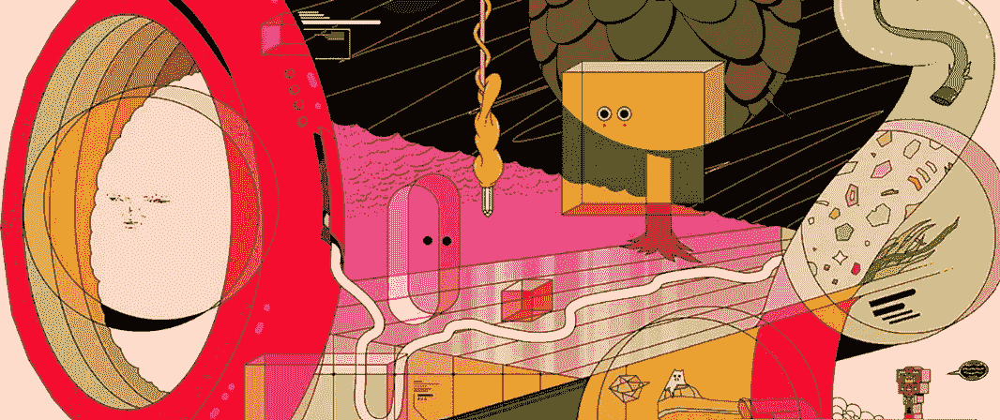
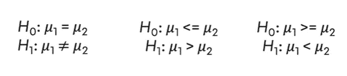

# A/B 测试

> 原文：<https://medium.com/mlearning-ai/a-b-testing-c2bdb065fb39?source=collection_archive---------1----------------------->



A/B 检验是检验随机对照组产生的差异是否具有统计显著性的方法。它的主要目的是在不确定的情况下做出决策，也是数据科学领域最常用的方法之一。A/B 测试可用于企业检查新 UX、UI 试用、产品新版本的必要性或影响，以及新算法是否成功。

在深入探讨 AB 测试之前，最好先了解一下统计学的基本概念:

*   **抽样:**人群的一个子集，被认为具有该受众的特征。换句话说，它是人口的代表。
*   **描述性统计:**它也可以作为探索性数据分析出现。这是一种试图描述数据集的努力。
*   **置信区间:**可以包含总体参数估计值的数字范围。
*   **相关性:**一种统计方法，提供变量之间关系的信息，以及这种关系的方向和严重程度。
*   **假设检验:一种用于检验信念或论点的**统计方法。

# AB 检验:双样本 t 检验

当需要对两组的平均值进行比较时，可以使用这种方法。A/B 测试应该总是基于假设。当选择一个问题时，重要的是对要测试的服务(产品)的问题和可能的想法进行优先排序。

当您建立假设时，如果您遵循以下步骤，将会非常有帮助:

```
1 - Set up hypotheses
2 - Check assumptions
  2.1 - Normality Assumption
  2.2 - Variance homogenity
3 - Carry out hypotheses
  3.1 - if the assumptions are verified, two sample t-test (parametric test)
  3.2 - if the assumptions are not verified, mannwhitneyu test, (non-parametric test)
4 - Comment on results based o p-value
```

在执行这些步骤时，有两点需要注意:

*   如果其中一个假设得到验证，如果没有验证正态性，则进行非参数检验；如果方差齐性未得到验证，则应继续进行参数测试。
*   在正态性分析之前执行异常值的分析和编辑可能是有用的。

要应用假设检验，有必要了解一些术语，如零假设、替代假设、显著性水平和 p 值。



Hypotheses

*   H0(零假设):基本假设是发展不会带来任何变化。如果零假设没有被拒绝，就没有需要任何改变的情况。
*   H1(另一种假设):认为两组之间会有差异的论点。它是拒绝零假设的结果，接受替代假设是没有用的。
*   显著性水平:证明零假设必须超过的极限值。用α表示，表示拒绝零假设的概率。
*   p 值:假设零假设不被拒绝的概率。计算 p 值后，将其与显著性水平进行比较。

> **H0 被拒绝或不被拒绝，没有接受 H1 这回事。**

**数据集的故事**:

*   脸书最近引入了一种新的投标方式“平均投标”,以替代目前的“最高投标”。我们的一个客户，xxx.com，已经决定测试这个新功能，并想做一个 A/B 测试，看看平均出价转换是否超过最高出价。A/B 测试已经进行了 1 个月，xxx.com 正在等待你分析这个 A/B 测试的结果。对 xxx.com 来说，衡量成功的最终标准是购买。因此，重点应该放在统计测试的购买度量上。有两个独立的数据集，对照组和测试组。对对照组采用最高竞价，对试验组采用平均竞价。

**变量:**

*   印象:广告视图
*   点击:广告被点击的次数
*   购买:广告点击后购买的产品数量
*   收入:购买产品后的利润

零假设定义为两个版本之间没有差异，替代假设定义为有差异。通过取两组的平均值来检查是否存在显著差异。不能直接说一组比另一组更有效率。需要考虑差异的统计意义。

实施 A/B 检验需要满足一些假设:“正态假设”和“方差齐性”。

夏皮罗检验是在检验正态性假设时应用的。

normality assumption for the control group

如您所见，p 值= 0.5891 > 0.05，因此不能拒绝 H0，这意味着正态分布的假设得到了验证。

检验方差齐性时应用 Levene 检验。

如您所见，p 值= 0.1083 >0.05，因此不能拒绝 H0，这意味着方差齐性的假设得到了验证。

在这种情况下，提供了正态性和方差齐性假设，因此将使用双样本 t 检验(参数检验)。

p 值= 0.3493 >0.05，因此 H0 不能被拒绝，这意味着两组的购买平均值之间没有统计学显著差异。

如果假设没有得到验证，那么就应该进行参数测试。在这种情况下，我们应用 t 检验来验证假设。如果你想看看参数测试是如何使用的，你可以在这里找到完整的代码。

我们已经到达终点了！有问题，遇到困难或者只是想打个招呼？请使用评论框。🦖

[](https://github.com/zbeyza/ab_testing) [## GitHub - zbeyza/ab_testing

### 当希望对两组的平均值进行比较时，使用双样本 t 检验。A/B 测试应该…

github.com](https://github.com/zbeyza/ab_testing) [](/mlearning-ai/mlearning-ai-submission-suggestions-b51e2b130bfb) [## Mlearning.ai 提交建议

### 如何成为 Mlearning.ai 上的作家

medium.com](/mlearning-ai/mlearning-ai-submission-suggestions-b51e2b130bfb)