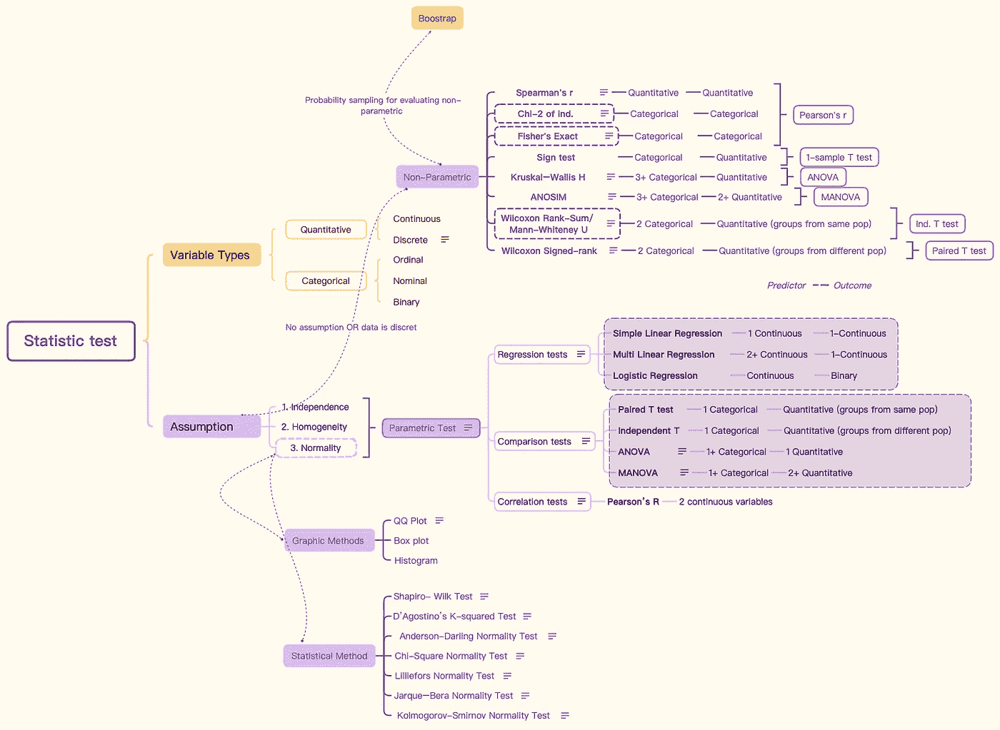
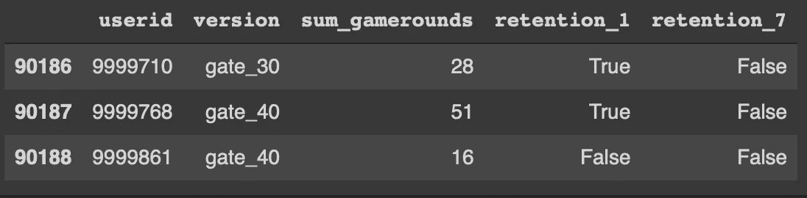
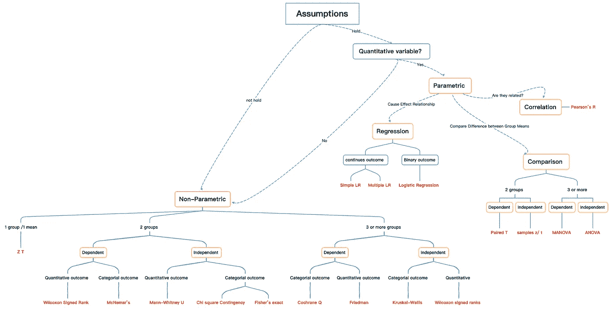

# 使用 Python 进行 A/B 测试结果分析——初学者指南

> 原文：<https://medium.com/mlearning-ai/a-b-testing-result-analysis-using-python-beginners-guide-7a6562933f7?source=collection_archive---------2----------------------->

最近，我刚刚完成了 udacity.com 的 A/B 测试课程。那是为数不多的让我爱上数据科学概念的在线课程之一。我设法找到了这个从一个移动游戏中收集的 A/B 测试结果数据集。我在这里，分享我的分析和笔记。

笔记本和资料可以在这里找到: [Github](https://github.com/Asuna-sama-1/A-B-Testing-Analysis)

A/B 测试结果分析包括:

1.  数据探索/清理
2.  通过*概率抽样(Bootstrap)* 或*统计检验*进行分析

[链接到**统计测试**思维导图](https://drive.google.com/file/d/193EdFuOMb1LliuJ-Nl0QD6PtQyaWfvvH/view?usp=drivesdk)

Mindmap for Statistic test

# 1.数据探索

该数据包含五列:

1.  *:每个玩家唯一的用户 id*
2.  ****版本*** :测试了两个版本(gate_30 和 gate_40)*
3.  ****sum _ gamer ounds***:用户玩的游戏总数*
4.  ****保留 _1*** :第 1 天保留(bool)*
5.  ****滞留 _7*** :第 7 天滞留(bool)*

**

## *- sum_gamerounds*

*没有探索和清理数据，不能开始任何数据分析项目！我们的数据集相对整洁；我需要做的就是*

*1.检测(使用直方图和盒批)并移除异常值(玩 0 轮或超过 3000 轮)*

*2.删除玩了 0 轮游戏的用户*

*3.检查是否有重复值。*

## *-保留*

*   *超负荷第一天留存率为**46.5%**；A 版有 **46.8%** ，B 版有 **46.2%***
*   *超负荷 7 天留存率**19.4%**；版本 A 有 **19.8%** 版本 B 有 **19.0%***
*   *版本 A 比版本 B 具有更高的第 1 天和第 7 天保留率*

# ***2。统计测试***

*统计测试的一般步骤包括:*

1.  *选择测试(参数或非参数)*
2.  *状态零假设和替代假设*
3.  *用 P 值和检验统计量来决定是否拒绝 H0*

## *2.1 选择测试*

*为了确定参数或非参数检验，我们首先需要检查三个假设:(1)变量的**独立性**(2)数据的**正态性**(3)方差的**齐性**。*

*   *有多种方法可以检查**是否正常**:*

*通过图表-*

***QQ 图**:如果数据呈正态分布，我们应该看到所有的点都坐在直线上。*

***箱线图**:如果数据呈正态分布，我们应该看到中间的均值和中位数。*

***直方图**:如果数据呈正态分布，我们应该会看到一条钟形曲线。*

*通过统计测试-*

*[夏皮罗-维尔克正态性检验](https://docs.scipy.org/doc/scipy/reference/generated/scipy.stats.shapiro.html)，[达戈斯蒂诺的 K 平方检验](https://docs.scipy.org/doc/scipy/reference/generated/scipy.stats.normaltest.html) [正态性检验](https://docs.scipy.org/doc/scipy/reference/generated/scipy.stats.shapiro.html) [卡方正态性检验](https://docs.scipy.org/doc/scipy/reference/generated/scipy.stats.normaltest.html)，[卡方正态性检验](https://docs.scipy.org/doc/scipy/reference/generated/scipy.stats.chisquare.html)，[科尔莫戈罗夫-斯米尔诺夫正态性检验](https://docs.scipy.org/doc/scipy/reference/generated/scipy.stats.jarque_bera.html)，以及[安德森-达令正态性检验](https://docs.scipy.org/doc/scipy/reference/generated/scipy.stats.anderson.html)*

***如果数据通过参数测试:***

*   *回归检验:SLR，MLR，逻辑回归*
*   *比较试验:[配对 T 检验](https://docs.scipy.org/doc/scipy/reference/generated/scipy.stats.ttest_rel.html)、[独立 T 检验](https://docs.scipy.org/doc/scipy/reference/generated/scipy.stats.ttest_ind.html)、[方差分析](https://docs.scipy.org/doc/scipy/reference/generated/scipy.stats.f_oneway.html)、[方差分析](https://www.statsmodels.org/devel/generated/statsmodels.multivariate.manova.MANOVA.html)*
*   *相关性检验:[皮尔森相关性](https://docs.scipy.org/doc/scipy-0.14.0/reference/generated/scipy.stats.pearsonr.html)*

***如果数据没有通过非参数测试:***

*   *比较两组:*

*[Mann-Whitney U](https://docs.scipy.org/doc/scipy/reference/generated/scipy.stats.mannwhitneyu.html)/Wilcoxon 秩和(独立，非分类)*

*[Wilcoxon 符号等级检验](https://docs.scipy.org/doc/scipy/reference/generated/scipy.stats.wilcoxon.html)/符号检验(配对，非分类)*

*[卡方检验](https://docs.scipy.org/doc/scipy/reference/generated/scipy.stats.chisquare.html)，[费雪精确检验](https://docs.scipy.org/doc/scipy/reference/generated/scipy.stats.fisher_exact.html)(独立，分类)*

*   *比较 3 组或更多组:[克鲁斯卡尔沃利斯检验](https://docs.scipy.org/doc/scipy/reference/generated/scipy.stats.kruskal.html)(独立)[弗里德曼检验](https://docs.scipy.org/doc/scipy/reference/generated/scipy.stats.friedmanchisquare.html)(配对)，等等*

*[链接到思维导图](https://drive.google.com/file/d/11zDXLSMI3JnnfaGFk3NFqA2QrV-6lHgU/view?usp=drivesdk)*

**

*[https://drive.google.com/file/d/11zDXLSMI3JnnfaGFk3NFqA2QrV-6lHgU/view?usp=drivesdk](https://drive.google.com/file/d/11zDXLSMI3JnnfaGFk3NFqA2QrV-6lHgU/view?usp=drivesdk)Parametric vs Non-Parametric Tests*

## *- sum_gamerounds*

*根据上面的图表，我们正在进行非参数检验→ 2 组→独立→定量结果→ **曼-惠特尼 U 检验***

## *-第 1 天/第 7 天保留*

*根据上面的图表，我们正在进行非参数检验→ 2 组→独立→二元(分类)结果→**χ2 检验***

## *2.2 陈述零假设和替代假设*

## *- sum_gamerounds*

***H0** :两个版本的 sum_gamerounds 没有显著差异*

***H1:** 两个版本的 sum_gamerounds 有显著差异*

## *-第 1 天/第 7 天保留*

***H0** :两个版本的留存率没有明显差异*

***H1** :两个版本的留存率有显著差异*

## *2.3 使用 P 值和测试统计来决定是否拒绝 H0*

## *- sum_gamerounds*

*由于 p=0.0588，大于 0.05，我们**无法拒绝**两个版本之间的 sum _ gamerounds 没有**显著差异的无效假设***

## *-第一天保留*

*由于第一天的保留率 p=0.1155，大于 0.05，**无法拒绝**两个版本没有**和**显著差异的零假设。*

## *-第 7 天保留*

*因为第 7 天的保留率 p=0.0027，这是<0.05, we have enough evidence to **拒绝**两个版本有显著差异的原假设。*

* [## Mlearning.ai 提交建议

### 如何成为 Mlearning.ai 上的作家

medium.com](/mlearning-ai/mlearning-ai-submission-suggestions-b51e2b130bfb)*