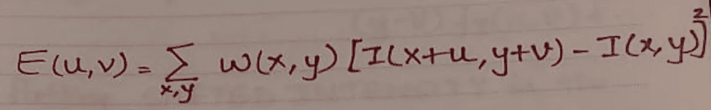
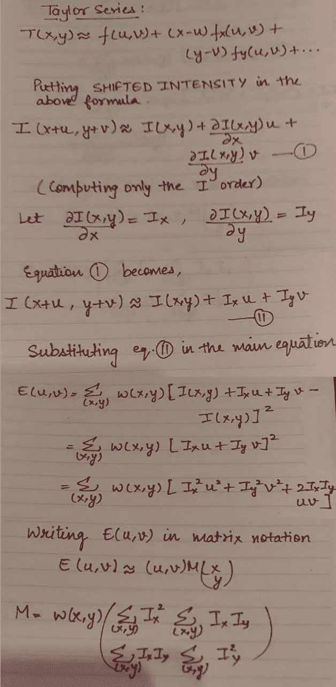
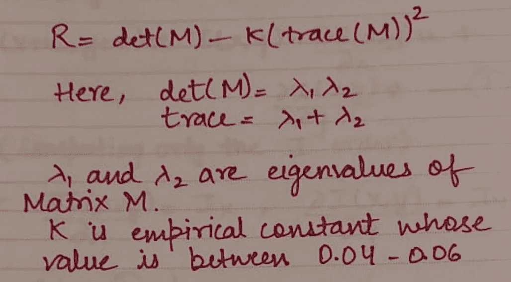
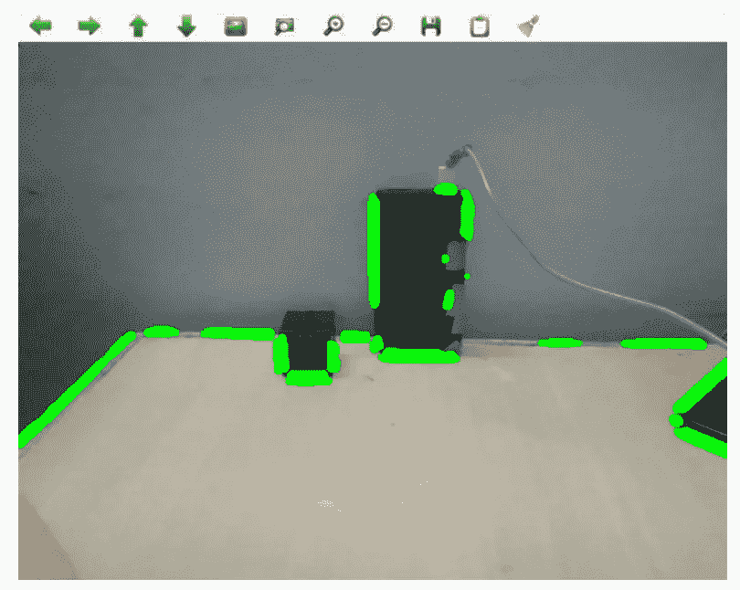
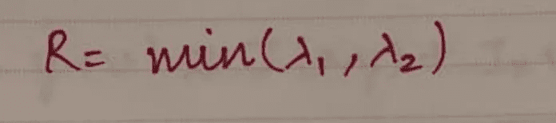

# 对初学者友好的角点检测算法概述

> 原文：<https://medium.com/mlearning-ai/a-beginner-friendly-overview-of-corner-detection-algorithms-530978d16f2d?source=collection_archive---------2----------------------->

## Harris 角点检测和 Shi-Tomasi 角点检测算法的简要理论描述

Photo by [Bianca Ackermann](https://unsplash.com/@biancablah?utm_source=unsplash&utm_medium=referral&utm_content=creditCopyText) on [Unsplash](https://unsplash.com/s/photos/building-jigsaw-puzzle?utm_source=unsplash&utm_medium=referral&utm_content=creditCopyText)

# 介绍

角点检测是一种计算机视觉方法，用于特征检测(角点、边缘)、运动检测、特征跟踪、图像处理和对象识别。我们将要讨论的用于角点检测的两种广泛使用的算法是:Harris 角点检测器和 Shi-Tomasi 角点检测器。

# 什么是拐角，为什么它们很重要？

角基本上是两条边的交点。想象你正在通过看图片把拼图拼在一起。你倾向于先找到那些有角或边的碎片，然后围绕它们构建整个拼图。这是因为由于物体和背景之间的颜色差异，角落或边缘很容易定位。这是角点检测背后的基本思想。如果 x 和 y 方向的颜色都有变化，则认为这是一个角。如果只有一个方向有颜色变化，那就是边缘。角点被认为是图像中更鲁棒的特征，因为它们对于平移、旋转和光照是不变的。这就是为什么它们也被称为关键点或兴趣点。

# **哈里斯角探测器**

**Harris 角点检测器是最著名的角点检测算法之一。**整个图像被分成类似的块，称为*窗口*。哈里斯角检测器确定哪些窗口在向 *x* 和 *y* 两个方向移动时会产生巨大的亮度差异。对于每个窗口，计算得分 *R* 。我们定义了这个分数的阈值，并且找到了强角点。数学上，它的工作原理如下:

我们一直在寻找产生大的 E 值的窗口。为此，我们需要最大化下面等式中方括号内的项。

Equation

> **E**-原窗口和下一个窗口之间的差异。
> 
> **u** —窗口在 x 方向的位移
> 
> **v** —窗口在 y 方向的位移
> 
> **w(x，y)** —窗口的当前位置。
> 
> **I** —图像在某一位置(x，y)的强度。
> 
> **I(x，y)** —原始窗口的强度
> 
> **I(x+u，y+v)** —下一个窗口的强度。

泰勒级数展开用于计算 *E* 。

Computing E

既然我们知道哪个窗口产生大的变化，我们使用矩阵的特征值来寻找合适的角。我们计算每个这样的窗口的得分 *R* 。

Score R

现在我们已经计算了 *R* 的值，大的值表示有拐角，负值表示有边。通过哈里斯角点检测器的角点在 OpenCV 中使用以下方法找到:***cv2 . Corner Harris()***

它的论点是:

*   **img** —输入灰度图像。
*   **blockSize** —邻域的大小。
*   **ksize** —所用索贝尔导数的孔径参数。
*   **k** —等式中的哈里斯探测器自由参数。

An example of Harris Corner Detection method

# **石-托马西探测器**

Shi-Tomasi 是另一种用于角点检测的算法。除了在 Shi-Tomasi 中计算分数的方式之外，它类似于 Harris 角点检测器。**这种差异提供了更好的结果**。与哈里斯角不同，它可以检测几乎所有重要的角，如果我们不想检测所有的角，我们可以检测顶部的 *N* 角。

Shi-Tomasi 检测器中的分数 R 计算如下:
如果 *R* 大于一个*阈值*，则它是一个拐角。

Score R in Shi-Tomasi

在 Shi-Tomasi 方法中，通过使用以下方法找到角点:OpenCV ***中的***goodFeaturesToTrack()***。*** 它决定了图像中的强角点。

它采用以下参数:

*   **图像** —输入灰度图像。
*   **角点** —检测角点的输出矢量。
*   **maxCorners** —返回的最大拐角数。
*   **qualityLevel** —该参数表示图像角点的最低可接受质量，所有质量测量值低于规定值的角点都将被拒绝。
*   **minDistance** —返回的角点之间的最小可能欧几里德距离。
*   **block Size**-用于计算每个像素邻域上的导数协方差矩阵的平均块的大小。
*   **使用哈里斯探测器** —指示是否使用哈里斯探测器的参数
*   **k** :哈里斯检测器的自由参数。

An example of Shi-Tomasi Corner Detection method

# **结论**

Harris Corner Detector 和 Shi-Tomasi 都基于相同的概念工作，即改变强度以实现角点检测。但是由于 Score(R)公式的变化，Shi-Tomasi 给出了比 Harris Corner 更好的结果。因此，Shi-Tomasi 被认为是 Harris 角点的更好版本，并且优选地用于角点检测。

我已经尝试给出关于这两种算法的简要想法。在下一篇文章中，我将写一篇教程，介绍如何用 C++或 python 实现这两种算法。

> 感谢阅读！我希望这篇文章能让你对这两种角点检测算法有一个基本的了解。