# Python 数据分析入门指南

> 原文：<https://medium.com/mlearning-ai/a-beginner-guide-to-data-analysis-with-python-825792b5eb38?source=collection_archive---------3----------------------->


Photo by [Luke Chesser](https://unsplash.com/@lukechesser?utm_source=unsplash&utm_medium=referral&utm_content=creditCopyText) on [Unsplash](https://unsplash.com/@lukechesser?utm_source=unsplash&utm_medium=referral&utm_content=creditCopyText)

Python 是一种非常通用的编程语言，也是初学者友好的。因此，如果您对使用 python 这样的编程语言进行数据分析或可视化感兴趣，这篇文章正好适合您。如果您是一名经验丰富的 Python 程序员，希望进入数据可视化领域，那么本文也适合您。本文包含如何使用 python 可视化和分析数据的分步指南，本文中使用的数据集是从 [Kaggle 获得的网飞数据集。](https://www.kaggle.com/shivamb/netflix-shows)要理解本文，您需要熟悉 python。使用的工具和库包括 Google Colaboratory、Matplotlib、Plotly、Seaborn、Numpy 和 Pandas。

# 步骤 1:导入库

在笔记本中开始数据可视化之前，您应该做的第一件事是导入您将需要的库。如果您的笔记本没有安装库，您将无法导入它们。如果你使用的是 Jupyter 笔记本，你可以查看这篇[文章](https://www.geeksforgeeks.org/install-python-package-using-jupyter-notebook/)，了解如何在 Jupyter 笔记本上安装模块。Google Colaboratory 安装了以下库，因此您唯一需要做的就是导入它们。你可以通过输入密码来理解。

```
import numpy as np
import pandas as pd
import matplotlib.pyplot as plt
import seaborn as sns%matplotlib inlineimport warnings
warnings.filterwarnings("ignore")
```

# 步骤 2:获取数据

我使用的数据存储在我的 google drive 中，所以我正在将我的 google drive 安装到 Google Colaboratory 中。然后我使用 pandas 库读取 CSV 文件格式的数据。如果你的数据存储在本地存储器、GitHub 或其他地方，你也可以从那里上传。如果你没有使用谷歌协作，这些代码中的一些将抛出一个错误。要上传 Jupyter 笔记本中的数据，您可以遵循本[文档](https://tljh.jupyter.org/en/latest/howto/content/add-data.html)中的说明。

```
from google.colab import drive
drive.mount('/content/drive')
path =  '/content/drive/MyDrive/SCA Dataset/netflix_titles.csv'
df = pd.read_csv(path)
df
```

您应该会得到这样的输出，显示您的数据框。

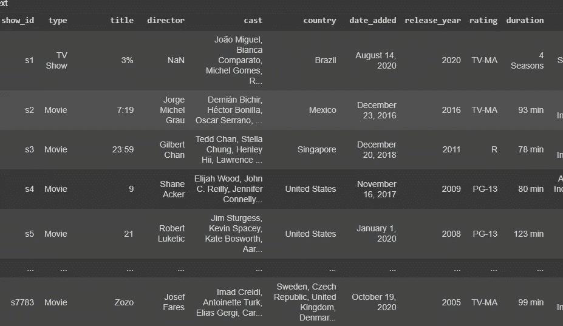

要从 Github 获取数据，点击 GitHub 存储库中的数据集，然后点击**查看原始数据**。您可以使用下面的代码:

```
url = 'copied_raw_Github_link'
df1 = pd.read_csv(url)
# Dataset from Github is now stored in a Pandas Dataframe
```

要获取存储在本地存储中的数据，请首先运行以下代码:

```
from google.colab import files
uploaded = files.upload()
```

您将看到一个提示，要求您选择一个文件。单击“选择文件”提示，从出现的文件浏览器窗口中选择文件并上传文件。等待你的上传达到 100%。您将能够看到 Colab 用来存储文件的名称。使用以下代码将其导入 dataframe。记住要仔细检查你上传的文件名是否与 Colab 存储你的文件的文件名相同。

```
import io
df2 = pd.read_csv(io.BytesIO(uploaded['Dataset.csv']))
#Or you can just read the csv directly like the code below
df2 = pd.read_csv("copy and paste the name colab saved your file as in the output shown after you have uploaded your files")
# Dataset from local storage is now stored in a Pandas Dataframe 
```

# 第三步:了解你的数据

让我们获取数据的行数和列数以及每列的数据类型等信息。为此，您将对数据框运行信息函数。

```
df.info()
```

输出:

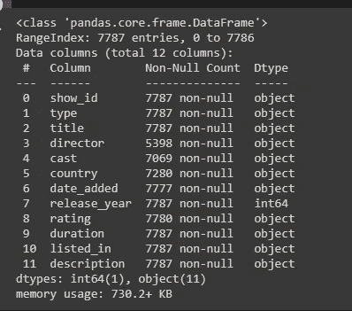

要查看数据框的前五行:

```
df.head()
#default value for the head function is 5 and you can pass in any number you want into it, try it and see.
```

您将得到如下输出:

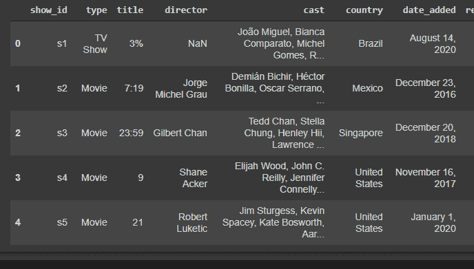

要查看数值列的统计数据:

```
df.describe()
#to see the statistics for all your columns try the code below
df.describe(include="all")
```

您将得到如下所示的输出:

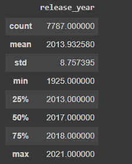

要查看每列缺失值的总数:

```
df.isnull().sum()
```

您的输出将如下所示:

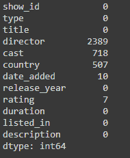

我们在导演、演员、国家、添加日期和评级列中缺少值。Director 的缺失值数量最多。因此，我们将从用单词“missing”替换 director 和 cast 列中缺少的值开始。

```
#filling missing rows in director column with the keyword missing
df.director.fillna('missing', inplace=True)#filling missing rows in cast column with the keyword missing
df.cast.fillna('missing', inplace=True)
```

对于 cast 列，我们将创建一个字典，将惟一的 cast 值存储为一个键，将它在数据集中出现的次数存储为一个值。这将有助于执行数据分析。

```
data = []
for i in range(len(df)):
    data.extend(df.cast.iloc[i].split(','))
element = {}
for i in data:
    element[i] = data.count(i)
element = sorted(element.items(), key = lambda item: item[1], reverse=True)
len(set(element))
```

这将输出元素的长度，即 35373。

接下来，我们将填充“国家和评级”列中缺少的值，并删除“添加日期”列中缺少的值。处理数据框中缺失值的方法有多种，这只是其中一种。

```
#filling missing rows in country column with the keyword missing
df.country.fillna('missing', inplace=True)#filling missing rows in rating column with the keyword missing
df.rating.fillna('missing', inplace=True)#Dropping missing values in date_added column
df.dropna(subset=['date_added'], inplace=True)
```

运行上面的代码后，您可以再次运行下面的代码，您会注意到我们所有的列现在都有相同的行数。

```
df.info()
```

输出:

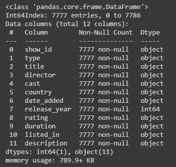

我们已经完成了对数据集中缺失值的处理。现在，我们继续进一步清理数据集。我们可以从数据集中提取什么数据？我们将:

*   将 date_added 列拆分为月、日和年。
*   将 listed_in 列拆分为不同的类别。

```
#new added month column
df['added_month'] = np.nan
for i in range(len(df)):
    df['added_month'][i] = df.date_added.iloc[i].split(' ')[0]#new added date column
df['added_date'] = np.nan
for i in range(len(df)):
    df['added_date'][i] = df.date_added.iloc[i].split(' ')[1][:-1]#new added year column
df["date_added"] = pd.to_datetime(df['date_added'])df['added_year'] = df['date_added'].dt.year
```

因为我们已经完成了对 date_added 列的提取，所以可以从数据集中删除该列。

```
df.drop('date_added', axis=1, inplace=True)
```

拆分 listed_in 列中的值。

```
#Splitting values
listed_in = []
for i in range(len(df)):
    listed_in.extend(df.listed_in.iloc[i].split(','))#counting values in the newly created dictionary
listed_dic = {}
for i in listed_in:
    listed_dic[i] = listed_in.count(i)listed_dic = dict(listed_dic)#dropping any null values
df.dropna(inplace=True)
```

需要记住的一点是，当您处理数据时，大部分时间将用于准备和清理数据。既然我们已经完成了数据清理，我们可以进入下一步。

# 第四步:提问/数据分析

我们将通过分析回答的问题

*   上传到网飞上的不同类型的内容是什么，它们所占的比例是多少？
*   哪位导演在网飞数据集中出现的次数最多？
*   哪位导演执导的电视剧数量最高？
*   哪位名人出演的角色最多？
*   内容生产的前 20 个国家？
*   哪一年的参赛作品数量最多？
*   网飞有哪些不同类型的评级，哪一种最受欢迎？
*   在我们的数据集中，不同流派之间的相关关系是什么？

```
#To check for number of tv shows and movies that we have in our dataset
content_count = df['type'].value_counts().sort_values()
print(content_count)
```

输出:

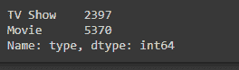

要以可视化方式查看上述输出，您可以运行以下代码:

```
#Matplotlib library is used here to visualize the data
plt.figure(figsize=(10,5))
plt.pie(df['type'].value_counts(),labels=df['type'].value_counts().index,explode=[0.05,0],
        autopct='%1.2f%%',colors=['Blue','Green'])
plt.show()
```

输出:

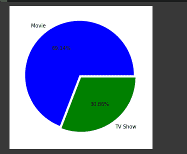

上面的饼图显示，我们的网飞数据集中超过一半是电影。似乎人们更喜欢电影是因为:

*   电影更激烈:在电视节目中，一集可以很激烈，但不是全部。相比较而言，电影比节目更激烈。一部好电影会让你粘在座位上。
*   他们有特效:电影有更好的特效，他们可以从电影中删除任何不必要的镜头，因为他们知道他们只有有限的时间来吸引观众的注意力。而在电视节目中，一些镜头被保留下来以延长情节，这使人们失去了兴趣。
*   **电影更容易访问:**这意味着你可以随时随地观看电影。电视节目每集都有固定的时间和日期，而所有的在线平台都让你可以随时观看电影。无论是凌晨还是半夜，一旦电影上映，就不用等剧集掉了。
*   **电影更容易理解:**每当你比较电影和电视节目时，有一个巨大的差异，就像在电影中你可以假设接下来几分钟将发生什么，并在这段时间里让你呆在座位上。但在电视节目中，几集让你想知道正在发生什么，以及在接下来的几分钟或几集里会发生什么。当你看电视节目时，它会让你像坐过山车一样。
*   **电影不需要提前可视化:**你需要一口气坐 2 个小时，电影就完成了。而对于连续剧，你需要每天或每周坐在电视机前，在等待下一集的时候，思考并试图想象接下来会发生什么。电影有助于你更好地理解故事，而且一步到位。
*   许多艺术形式都可以融入其中:在电影中，你可以包含许多艺术形式，而在电视节目中，你无法让他们看到，他们也没有多少机会接触到。
*   **社交方面:**你可以抽出时间和你的朋友一起去看电影，因为他们花的时间更少，而在电视节目中，你的朋友可能不喜欢你看的节目。你可能会感兴趣，但你的朋友不会。当然，除非你计划和你的朋友一起狂欢，这可能不像去看电影那么频繁。

让我们看看导演一栏:

```
director_count = df['director'].value_counts()
print(director_count)
#most of the director dataset is missing
```

输出:


```
#Our top 20 common directors in the dataset
df.director.value_counts()[1:20].sort_values(ascending=False).plot(kind='bar', width=0.5, color='Blue')
```

输出:

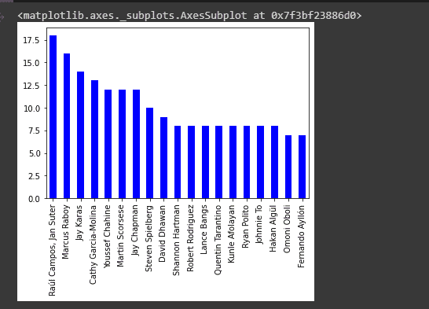

劳尔·坎波斯和扬·苏特是最常见的导演，他们导演网飞数据集上的内容。我们还可以检查内容的类型，即他们和其他导演执导的电视节目或电影。

```
fig, (ax1, ax2) = plt.subplots(1, 2, figsize=(20, 8))
data = df.groupby('type')['director'].value_counts()['Movie'][1: 20]
data = pd.DataFrame(data)
ax1.bar(data.index, data.director, color='red')
ax1.tick_params(labelrotation=90)
ax1.set_title('Movie', fontsize=24, fontweight='bold')
data2 = df.groupby('type')['director'].value_counts()['TV Show'][1: 20]
data2 = pd.DataFrame(data2)
ax2.bar(data2.index, data2.director, color='green')
ax2.tick_params(labelrotation=90)
ax2.set_title('TV Show', fontsize=24, fontweight='bold')
```

输出:

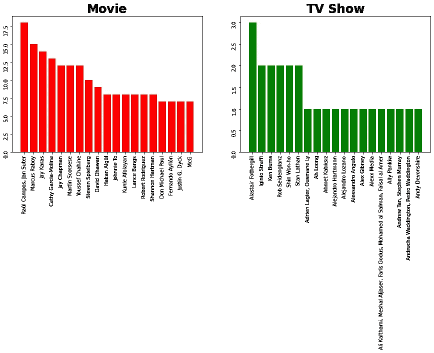

我们可以看到，劳尔·坎波斯和扬·苏特主要执导上传到网飞的电影，艾雷斯泰·法瑟吉尔主要执导在网飞找到的电视节目。让我们看看我们之前创建的转换字典:

```
#dictionary of actors and how many contents they appeared in
dic_element = dict(element[1:])
print(dic_element)
```

输出如下所示


现在让我们想象一下上面的输出:

```
dic_element = dict(element[1:])
dic_element_key = list(dic_element.keys())
dic_element_value = list(dic_element.values())
plt.bar(dic_element_key[:20], dic_element_value[:20], color='red')
plt.xticks(rotation='vertical')
```

输出:

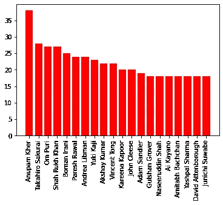

阿努潘·凯尔是在网飞数据集中出现次数最多的演员。他大多出现在网飞印度电影中。我们要做的下一件事是查看这些年来内容增加的速度。在笔记本中运行以下代码:

```
import plotly.graph_objects as go
df_tv = df[df["type"] == "TV Show"]
df_movies = df[df["type"] == "Movie"]df_content = df['added_year'].value_counts().reset_index().rename(columns = {
    'added_year' : 'count', 'index' : 'added_year'}).sort_values('added_year')
df_content['percent'] = df_content['count'].apply(lambda x : 100*x/sum(df_content['count'])) df_tv1 = df_tv['added_year'].value_counts().reset_index().rename(columns = {
    'added_year' : 'count', 'index' : 'added_year'}).sort_values('added_year')
df_tv1['percent'] = df_tv1['count'].apply(lambda x : 100*x/sum(df_tv1['count'])) df_movies1 = df_movies['added_year'].value_counts().reset_index().rename(columns = {
    'added_year' : 'count', 'index' : 'added_year'}).sort_values('added_year')
df_movies1['percent'] = df_movies1['count'].apply(lambda x : 100*x/sum(df_movies1['count']))t1 = go.Scatter(x=df_movies1['added_year'], y=df_movies1["count"], name="Movies", marker=dict(color="#a678de"))
t2 = go.Scatter(x=df_tv1['added_year'], y=df_tv1["count"], name="TV Shows", marker=dict(color="#6ad49b"))
t3 = go.Scatter(x=df_content['added_year'], y=df_content["count"], name="Total Contents", marker=dict(color="brown"))data = [t1, t2, t3]layout = go.Layout(title="Content added over the years", legend=dict(x=0.1, y=1.1, orientation="h"))
fig = go.Figure(data, layout=layout)
fig.show()
```

输出将是这样的，这将是一个交互式的视觉效果:

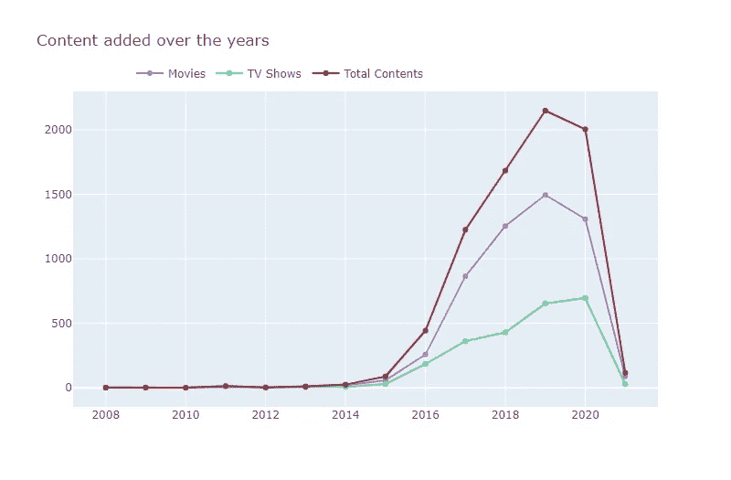

网飞最初的商业模式包括 DVD 销售和邮寄租赁，但在公司成立约一年后，创始人放弃了销售，专注于最初的 DVD 租赁业务。2007 年，网飞通过引入流媒体技术扩大了业务，同时保留了 DVD 和蓝光租赁业务。该公司在 2010 年进行了国际扩张，在加拿大推出了流媒体服务，随后是拉丁美洲和加勒比海地区。网飞在 2013 年进入内容制作行业，推出了第一部《纸牌屋》。这大概就是 2013 年开始内容增长的原因。

网飞电影数量的增长远高于电视节目数量的增长

2018 年和 2019 年都增加了约 1200 部新电影。2019 新增内容数量最高。我预计 2020 年将会增加更多内容，因为我们已经看到在那之前我们的条目一直在稳定增长，我认为 2020 年增加的内容会减少，因为疫情，封锁，大多数系列和电影的制作都被停止。

让我们看看数据集中的不同评级:

```
plt.figure(figsize=(8, 10))
sns.countplot(y='rating', data=df, order=df.rating.value_counts().index.to_list(), palette='dark:salmon_r')
plt.title('Different Ratings', fontsize=24, fontweight='bold');
```

输出

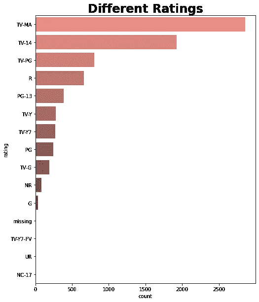

所以，电视马是网飞最常见的评级。这个评级是成熟的成年人，它可能是最常见的评级，因为是成年人为订阅付费。网飞最大的观众群年龄在 16-34 岁之间。我们看到了饼图、散点图、折线图和条形图。现在，让我们看看如何做一个相关矩阵

```
from sklearn.preprocessing import MultiLabelBinarizer 
#Multilabelbinarizer allows you to encode multiple labels per instance.
def relation_heatmap(df, title):
    df['genre'] = df['listed_in'].apply(lambda x :  x.replace(' ,',',').replace(', ',',').split(',')) 
    Types = []
    for i in df['genre']: Types += i
    Types = set(Types)
    print("There are {} types in the Netflix {} Dataset".format(len(Types),title))    
    test = df['genre']
    mlb = MultiLabelBinarizer()
    res = pd.DataFrame(mlb.fit_transform(test), columns=mlb.classes_, index=test.index)
    corr = res.corr()
    mask = np.zeros_like(corr, dtype=np.bool)
    mask[np.triu_indices_from(mask)] = True
    fig, ax = plt.subplots(figsize=(10, 7))
    pl = sns.heatmap(corr, mask=mask, cmap= "coolwarm", vmax=.5, vmin=-.5, center=0, square=True, linewidths=.7,
                     cbar_kws={"shrink": 0.6})

    plt.show()
```

在下一段代码中调用我们在上面创建的函数:

```
relation_heatmap(df_movies, 'Movie')
```

输出:


戏剧和纪录片的负面关系是显著的。对于独立电影和国际电影，我们看到的是一种中性的相关性。科幻与幻想和动作与冒险之间有很强的相关性。负关系意味着两种类型一起出现的概率很低，而正关系意味着两种类型一起出现的概率很高，即它们一起出现。

要查看电视节目的关联热图:

```
relation_heatmap(dfs_tv, 'TV Show')
```

输出:

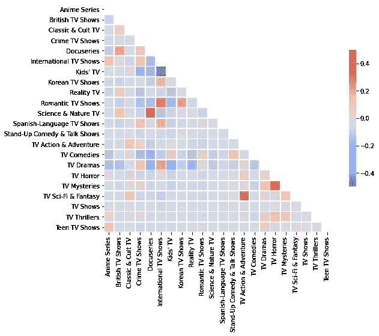

儿童电视和国际电视节目之间的负面关系是显著的。这可能意味着这两种类型不在一起。自然科学和文学之间有很强的正相关性。这可能意味着大多数科学和自然题材也是文学作品。

作为参考，这是一个[链接](https://colab.research.google.com/drive/1vv0Xz_tHMD1eLO6h1zXndbjffE-uuMZp?usp=sharing)到我的谷歌合作笔记本，你会发现我在里面做的完整分析。数据可视化是数据分析的一个非常重要的部分，它还可以帮助您直观地讲述数据的故事。感谢您的阅读，请在评论区留言。