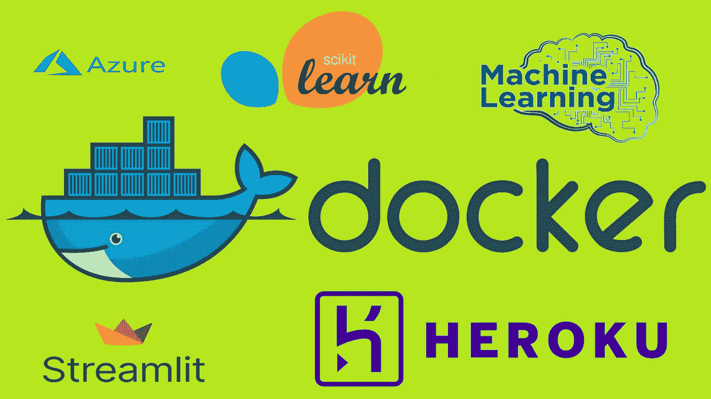
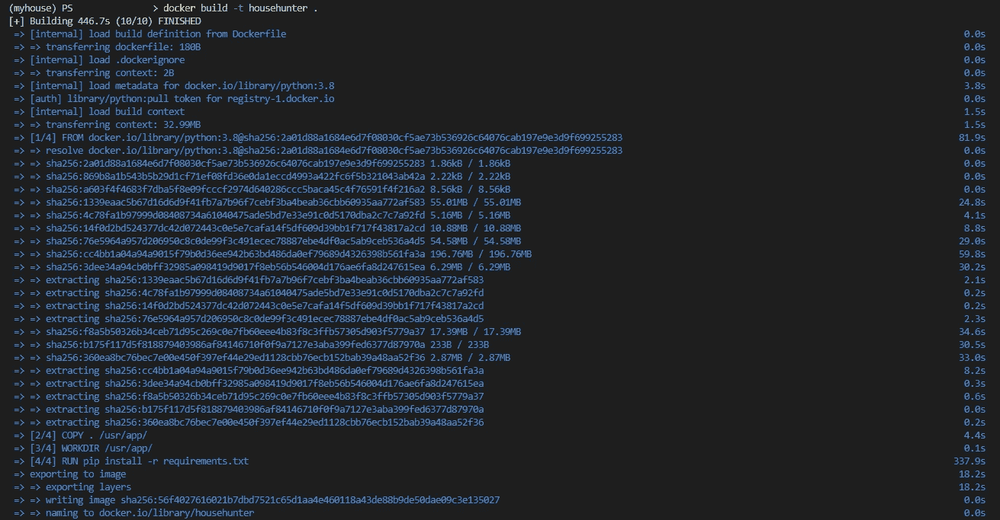
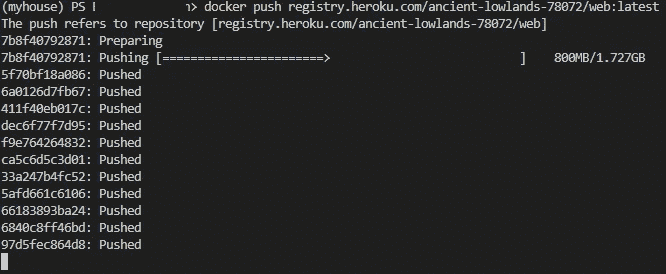

# 为您的 ML 模型构建和部署容器的初学者指南

> 原文：<https://medium.com/mlearning-ai/a-beginners-guide-to-building-and-deploying-a-container-for-your-ml-model-3cbc45d16e9f?source=collection_archive---------12----------------------->

## 数据科学/部署

## 使用 Streamlit 制作并部署在 Heroku 上的 Web 应用程序。



我在之前的文章中已经讨论过了。现在让我们进行一些实际操作。我们会部署一个叫做 House Hunter 的机器学习模型。这是一个使用 Streamlit 制作的房价预测 web 应用程序。

部署容器涉及的不同步骤有

1.  先决条件
2.  创建 Dockerfile 文件
3.  建筑形象
4.  创建 Heroku Web 应用程序
5.  将映像推送到 Heroku 上的容器注册表
6.  部署容器

> 提示:对于每个新的基于 Python 的项目，有一个新的虚拟环境通常是好的。所以每个项目的依赖关系都是相互隔离的。

# **1。先决条件**

在我们开始构建容器之前，有两个先决条件。它们是:

**1.1。安装 Docker 桌面**

你可以参考 David Bombal 的视频来设置 Docker 桌面。

> **WSL 2 与 Docker 入门作者大卫·邦巴尔** [https://youtu.be/5RQbdMn04Oc](https://youtu.be/5RQbdMn04Oc)

**1.2。构建一个 ML web 应用程序(或使用现有的 web 应用程序)**

在本文中，我们将使用 House Hunter web 应用程序，它已经部署在 Heroku 上，因为它低于 500MB 的限制。现在，我们将尝试将其装箱，然后进行部署。

> **房屋猎人 Github 链接** [https://github.com/MSufiyanAG/House-Hunter](https://github.com/MSufiyanAG/House-Hunter)

所以现在我们已经准备好 Docker 桌面和 ML web 应用程序了。

# 2.创建 Dockerfile 文件

Dockerfile 是一个文本文档，它包含用户可以在命令行上调用的所有命令来组合一个图像。使用 docker build，用户可以创建一个连续执行几个命令行指令的自动化构建。

## Dockerfile:

```
FROM python:3.8 COPY . /usr/app/ WORKDIR /usr/app/ RUN pip install -r requirements.txt CMD sh setup.sh \ 
    && streamlit run app.py
```

**从**开始——为后续指令设置基础图像。
**复制**—将源路径的内容复制到目的路径。
**WORKDIR**—定义 Docker 容器的工作目录。
**运行** —它在当前图像之上的新图层中执行任何命令，并提交结果。
**CMD**—为正在执行的容器提供默认值。

> 供参考:[https://docs.docker.com/engine/reference/builder/](https://docs.docker.com/engine/reference/builder/)

# 3.建筑形象

docker build 命令从 docker 文件构建 Docker 映像。

```
$ docker build [OPTIONS] PATH | URL | -
```



一旦图像准备就绪，就可以使用命令来查看它

```
$ docker images [OPTIONS] [REPOSITORY[:TAG]]
```

> 要了解更多命令，如运行、标记，..
> [https://docs . docker . com/engine/reference/command line/docker/](https://docs.docker.com/engine/reference/commandline/docker/)

# 4.创建 Heroku Web 应用程序

登录 Heroku，Heroku 容器注册表

```
$ heroku login
$ heroku container:login
```

现在创建一个新的 webapp

```
$ heroku create app-name
```

> 关于命令的详细信息:
> [https://dev center . heroku . com/articles/container-registry-and-runtime](https://devcenter.heroku.com/articles/container-registry-and-runtime)

# 5.将映像推送到 Heroku 上的容器注册表

创建一个引用源图像的标记目标图像，该目标图像将被推送到容器注册表。

```
$ docker tag <image> registry.heroku.com/<app>/<process-type>
```

将此映像推送到容器注册表

```
$ docker push registry.heroku.com/<app>/<process-type>
```



# 6.部署容器

一旦图像被推送到容器注册表，我们将释放它。

```
$ heroku container:release web --app app-name
```

然后打开 Heroku，打开 app。


利用 Heroku 日志找出错误(如果有的话)。

python 库中发生了很多变化；今天使用的库明天可能会被弃用。一般来说，良好的谷歌搜索技能会帮助你摆脱任何情况(我的学习方法)。

虽然本文展示了如何使用 Docker 来部署使用 Streamlit 制作的 web 应用程序。Docker 的官方文档对底层概念提供了很好的解释。

**敬请期待。**

**快乐学习**

**参考文献**

[1]:戴维·邦巴尔，联合王国。Docker 入门的 WSL 2。(2020 年 6 月 11 日 6 月)。访问时间:2022 年 7 月 4 日。【在线视频】。可用:[https://www.youtube.com/watch?v=_fntjriRe48&list = plhfrwillookmhhb 39 BH 3 xbpolxv 3 f 0v 9](https://www.youtube.com/watch?v=_fntjriRe48&list=PLhfrWIlLOoKNMHhB39bh3XBpoLxV3f0V9)

[2] : Dockerfile 参考。【在线】。可用:[https://docs.docker.com/engine/reference/builder/](https://docs.docker.com/engine/reference/builder/)

[](/mlearning-ai/mlearning-ai-submission-suggestions-b51e2b130bfb) [## Mlearning.ai 提交建议

### 如何成为 Mlearning.ai 上的作家

medium.com](/mlearning-ai/mlearning-ai-submission-suggestions-b51e2b130bfb)