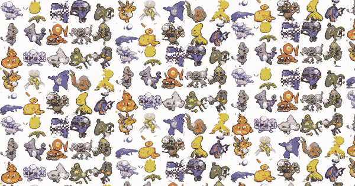
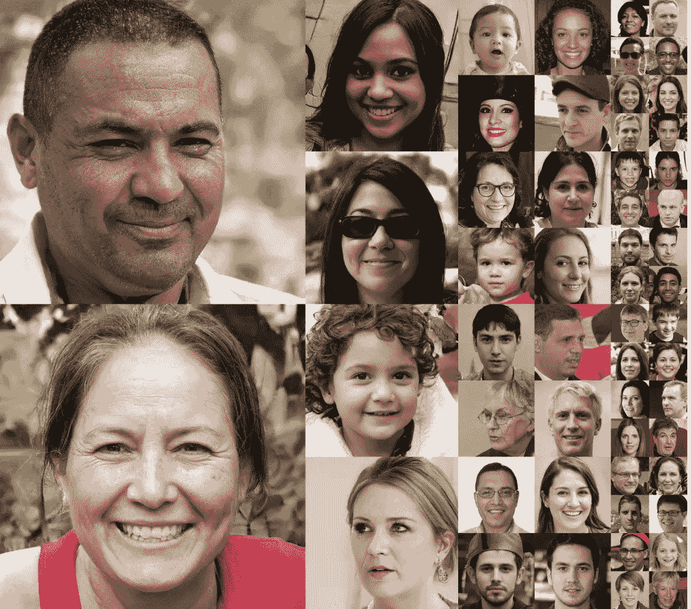
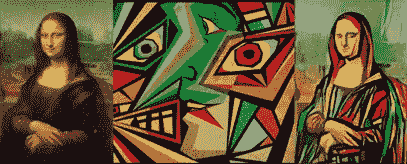
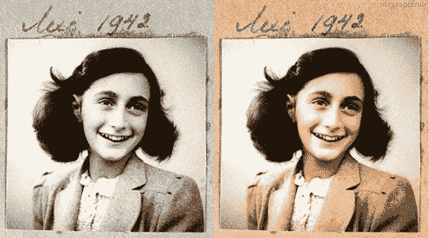
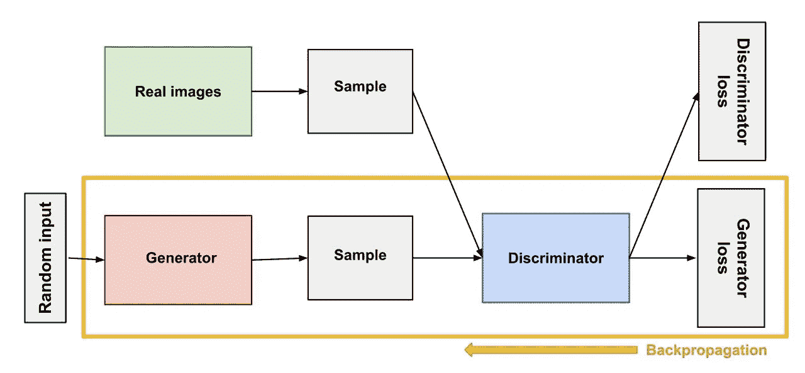
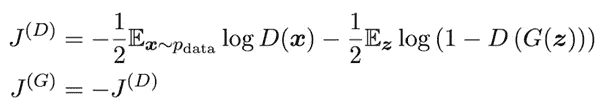
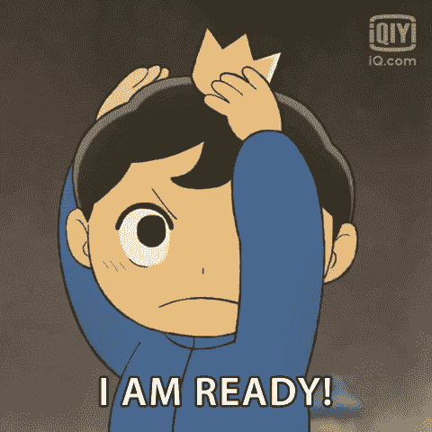

# GANs 初学者指南

> 原文：<https://medium.com/mlearning-ai/a-beginners-guide-to-gans-86705602a519?source=collection_archive---------2----------------------->

你可能熟悉汤姆·克鲁斯的抖音视频。这些视频已经获得了数百万的浏览量，拥有绝对震惊的观众。为什么？因为汤姆·克鲁斯根本没有抖音频道！那么那些视频到底是什么？谁在里面？这是什么巫术！？

愚弄了许多观众的逼真视频被称为- DeepFakes。他们背后的技术？他们被称为-生成性对抗网络。是不是很迷人？

这篇文章将帮助你理解 GANs 的字母表，然后你就可以自己建立一个模型了！

Photo by [Alex Knight](https://unsplash.com/@agk42?utm_source=medium&utm_medium=referral) on [Unsplash](https://unsplash.com?utm_source=medium&utm_medium=referral)

# 介绍

在 Ian Goodfellow 于 2014 年广泛引入生成对抗网络(GANs)以生成虚假数据之后，GANs 在当今的应用已经有了一些发展。GANs 的现实生活应用始于 2017 年，使用人脸数据集实现图像增强，可以产生高强度的即兴插图。

# 氮化镓的应用

目前，相当多的研究人员和人工智能爱好者已经开发了 GANs 的各种应用，并有进一步研究的范围。一些有趣的应用是-

*   从数据集中生成新的实体。
    从提供的数据集生成新的实体，比如生成新的动漫头像，新的口袋妖怪，已经成为理解 DCGANs 实现的热门项目。StyleGANs 也可用于此目的。常用的数据集是“动漫人脸数据集”。

[Generating Pokemon Images](https://wp-assets.futurism.com/2019/05/these-grotesque-pokemon-were-drawn-by-a-neural-network-600x315.png)

*   **生成用于数据增强的人脸图像**
    使用 DCGANs 可以生成假人脸，并在数据增强领域有广阔的应用范围。此外，由于缺少用于图像处理和面部表情识别的数据，所以生成更多的数据是有帮助的。可以使用的数据集是 Kaggle 上的“CelebA dataset”。

[Generating Fake Images](https://machinelearningmastery.com/wp-content/uploads/2019/04/Example-of-Photorealistic-Human-Faces-Generated-by-a-GAN.png)

*   **使用 CycleGANs 进行图像到图像的翻译。**
    图像到图像的翻译或图像风格的转换使用两个图像(内容，引用)。它以引用的样式组合内容图像的对象，导致组合的合成。可以使用的数据集是“有史以来最好的艺术品”和“我自己也是个画家”。

[Image Translation](https://www.projectpro.io/article/generative-adversarial-networks-gan-based-projects-to-work-on/530)

*   黑白图像彩色化
    图像彩色化是 GAN 应用中的一个热门话题。在过去，色彩是一个遥不可及的梦想，现在可以使用 GANs 来拍摄照片。*着色*通常被定义为将单色映射到尽可能接近的颜色的过程。可以使用的数据集是“图像彩色化数据集”。

[Colorizing the image](https://miro.medium.com/max/620/0*YC331zOiGcd1hs_t.jpg)

# **GANs 基本介绍**

GANs 是一种无监督的机器学习任务，因为它们发现并学习训练数据中的模式，以便从原始数据集生成新的示例，否则这是不可能的。甘人的学习方式很复杂。他们把这个问题作为一个有监督的最大似然问题来提出，但却是按照无监督的最大似然问题的思路来运作的。

GANs 使用两种不同的神经网络结构来生成假数据——不断相互竞争的**鉴别器**和**生成器**。生成器的功能是**用数据集训练后生成人工图像**。相反，鉴别器的功能是**检测生成的图像是真实的**，即来自域还是伪造的，即生成的。鉴别器的输出值介于 0(假)和 1(真)之间。

“敌对的”意味着两个相互对立的实体。顾名思义，鉴别者和生成者在一个**零和博弈/对抗性**中被训练，直到鉴别者被忽悠。如果鉴别器有 50%的时间被欺骗，我们的发生器就会产生可信的图像。

GAN 有几种类型，如循环 GAN、Pix2Pix GAN、CGAN、星形 GAN 和 DCGAN。大多数 GAN 模型使用卷积神经网络框架(CNN)。

# GANs 的工作

GAN 的工作可以描述为:

*   生成器接受种子值/随机数，并通过从训练数据集的概率分布中自动学习来生成图像。
*   向鉴别器提供一些真实图像，即属于初始数据集的图像，以及伪图像，即由生成器生成的图像。
*   鉴别器返回真实的概率，一个介于 0(假)和 1(真)之间的数字。
*   双反馈回路，即鉴别器和数据集、生成器和鉴别器之间的回路，有助于生成器得到进一步训练，以便成功地欺骗鉴别器。

[Working of GANs](https://developers.google.com/machine-learning/gan/generator)

# 基础数学

由于鉴别器的作用是确定图像是假的还是真的，我们可以把它看作一个二进制分类问题。这表明必须采用二元损失熵函数。由于 gan 是对抗性的，它们可以被视为一个最小-最大问题或零和问题。

[Equation](https://miro.medium.com/max/800/0*opnQ1IE6H5CY5ker.png)

如果我们看上面陈述的两个等式，我们理解鉴别器想要最大化等式 1 和最小化等式 2。等式 1 中鉴别器的输入是来自数据集的真实图像。因为图像是真实的，我们想要一个作为我们的值，导致这个等式成为一个最大化问题。相比之下，等式 2 中鉴别器的输入是发生器产生的假图像。因为图像是假的，我们想要 0 作为我们的值，导致这个方程成为最小化问题。这个问题的解是博弈的一个均衡点，这个均衡点是鉴别器损失的一个鞍点。

此外，鉴别器和发生器的损失函数需要以对抗的方式训练，这需要两个独立的损失函数和两个独立的梯度更新。当应用鉴别器的梯度来减少鉴别器的损耗时，只有鉴别器的权重必须被更新。修改生成器的权重不会产生任何有益的结果。

# 训练你的 GAN 模型的几个技巧

GANs 是一种成熟的深度学习技术，容易出现低准确性、失真和失败。因为我们并行处理两个模型，生成器和鉴别器；一个模型的随机超参数调整可能会对另一个模型的性能产生负面影响。这描绘了 GANs 的原始和不稳定的性质。

然而，经过几次测试和运行后，之前的研究提供了一个黑客/技巧列表，人们可以在他们的 GAN 模型中使用它来获得更好的结果。以下是拉德福德在他的论文*‘深度卷积生成对抗网络的无监督表示学习’*中为 2015 年的 DCGANs 提出的几个指导原则，可以在这里[查看](https://arxiv.org/abs/1511.06434) -

*   在 LeakyReLU 中，所有型号的泄漏斜率都应设置为 0.2。
*   应该用步长卷积(鉴别器)和分数步长卷积(生成器)替换池层。
*   在生成器和鉴别器中都应该使用批处理规范化。
*   应该在所有层的鉴别器中使用 LeakyReLU 激活。
*   除了使用 Tanh 的输出层之外，所有层都应在发生器中使用 ReLU 激活。

我偶然发现的其他黑客包括-

*   应该使用高斯权重初始化。
*   应该使用 Adam 随机梯度下降。
*   图像应在(-1，1)的范围内缩放。

# 到处都是 GANs 我该选哪个？

有几种类型的 GAN 经常会导致混淆哪种 GAN 最适合您的项目。选择合适的 GAN 可能是至关重要的一步。以下是几个 gan 及其应用-

1.  pix 2 pix GAN
    pix 2 pix GAN 最广泛用于图像到图像的翻译。该模型用于成对的数据集，其中该对包含翻译前(源)和翻译后(目标)图像。发生器产生的图像应该通过最小化损失而与目标图像非常相似，并且应该是可信的以欺骗鉴别器。当我们有一个**配对数据集时，必须使用这个 GAN。**
2.  **循环 GAN** 循环 GAN 也用于图像到图像的自动转换，但是，与 Pix2Pix GANs 不同，它不需要成对图像。循环 gan 是一个扩展版本，引入了“循环一致性”的概念。有两个生成器和鉴别器。使用第一个生成器生成的图像可以用作第二个生成器的输入，在第二个生成器中，我们检查生成的图像是否与原始图像匹配。
3.  **大 GAN** 大 GAN 旨在增强或扩展现有的 GAN 型号。顾名思义，它旨在使用以下方法使 GAN 更大-
    -增加模型参数数量
    -增强批量大小
    -架构修改
    大 GAN 可用于产生占用更大存储空间的高清图像。
4.  **风格 GAN** 风格 GAN 对 GAN 架构提出了较大的修正和改变。它用于生成高度逼真的人脸图像，可以通过修改矢量、噪声和参数来控制。它有助于控制属性/特征，如眼睛颜色、头发、皮肤纹理等。

# 结论

伊恩·古德费勒(Ian Goodfellow)在 2014 年提出的生成对抗网络(GANs)现在已经接管了深度学习世界，其各种应用很难学习，对人眼具有欺骗性，但却越来越重要。

GANs 主要由两个模型组成——生成器和鉴别器。生成器旨在通过对提供的数据集进行训练来生成似是而非的图像，然后将其作为输入发送给鉴别器，鉴别器旨在将图像分类为真/假。如果鉴别器被欺骗了一半时间，即 50%的准确度，我们认为我们的 GAN 模型是成功的。

有几种类型的 GANs，每种都有不同的用途:Pix2Pix，Cycle，Big，Style。为您的项目选择合适的 GAN 至关重要，它将提供最佳结果。

# 这是一个总结！

既然已经介绍了 GANs 的基础、架构、应用和类型，人们可以选择任何感兴趣的小项目并实现 GANs。

你准备好了！

Giphy

在下一篇文章中，我将解释如何使用任何可用的数据集生成假人脸。

# 参考

*   拉德福德大学、梅斯大学和钦塔拉大学(2015 年)。深度卷积生成对抗网络的无监督表示学习。 *arXiv 预印本 arXiv:1511.06434* 。
*   Aggarwal，a .，Mittal，m .，和 Battineni，G. (2021 年)。生成对抗网络:理论与应用综述。*国际信息管理数据洞察杂志*， *1* (1)，100004。
*   [https://www . project pro . io/article/generative-adversarial-networks-gan-based-projects-to-work-on/530](https://www.projectpro.io/article/generative-adversarial-networks-gan-based-projects-to-work-on/530)

# 进一步阅读

我参加了两个短期课程来吸收 GANs 的工作，我强烈推荐给你。我用他们的知识和理解写了这篇文章，以及上面提到的参考资料。

*   [关于 GANs 的谷歌开发者课程](https://developers.google.com/machine-learning/gan)
*   [如何开始学习 GANs- 7 天速成课程](https://www.google.com/url?sa=t&rct=j&q=&esrc=s&source=web&cd=&cad=rja&uact=8&ved=2ahUKEwiywKbOkZn4AhVD7XMBHcCRC-cQFnoECAgQAQ&url=https%3A%2F%2Fmachinelearningmastery.com%2Fhow-to-get-started-with-generative-adversarial-networks-7-day-mini-course%2F&usg=AOvVaw0Z3rW56zjURcoNCqwshq_f)

感谢您的阅读！

如有任何疑问或机会，请通过 hiraninetra22@gmail.com 或 https://www.linkedin.com/in/netrahirani/联系我。

 [## Mlearning.ai 提交建议

### 如何成为 Mlearning.ai 上的作家

medium.com](/mlearning-ai/mlearning-ai-submission-suggestions-b51e2b130bfb)