# 面向数据科学的 Python 初学者指南

> 原文：<https://medium.com/mlearning-ai/a-beginners-guide-to-python-for-data-science-3c90c4e1761b?source=collection_archive---------4----------------------->


Photo by [David Clode](https://unsplash.com/@davidclode?utm_source=medium&utm_medium=referral) on [Unsplash](https://unsplash.com?utm_source=medium&utm_medium=referral)

让我们讨论一下对编码和数据科学感兴趣的人如何开始他们的旅程。

你看到很多人在学习 Python 和数据科学。一旦他们有了数据分析师或数据科学家的工作，由于他们的技能为社会创造了价值，他们过着舒适的生活，直接让个人赚了很多钱。

你决定试一试，然后给自己买了一台笔记本电脑。现在，你得到的问题大概如下:

1.  你从哪里开始？
2.  你选哪门课？

如果你想达到你想要的目标，这些都是需要回答的关键问题。

网上有很多可供选择的课程，你可能会在浏览各种课程的选择时感到有点头晕。

这篇文章是我试图让你的旅程更舒适一点。我将把重点放在 Python 语言上，但是请注意，我们有许多编码语言可供选择来学习这个技能集。

我们将从安装学习数据科学所需的软件开始。

对于数据科学初学者来说，最好的工具是 Anaconda 发行版，它是数据科学所需的一组优化包，由 Anaconda Inc. 巧妙地打包成一个可下载的文件

以下链接将直接带您到您可以下载免费个人版的网页:

[](https://www.anaconda.com/products/distribution) [## 蟒蛇|蟒蛇分布

### Anaconda 的开源发行版是在一个…

www.anaconda.com](https://www.anaconda.com/products/distribution) 

接下来，我们需要一个 T2 集成开发环境(IDE)。市场上有许多可供 ide 选择的选项。最常用的是 Spyder 和 PyCharm。

我喜欢 PyCharm，因为它的易用性和无限制的定制选择，任何开发人员都可能需要。

以下链接将直接带您到可以下载免费社区版的网页:

[](https://www.jetbrains.com/pycharm/download/#section=windows) [## 下载 py charm:JetBrains 为专业开发人员提供的 Python IDE

### 我们注意到您的网络浏览器禁用了 JavaScript。请启用 JavaScript 来利用…

www.jetbrains.com](https://www.jetbrains.com/pycharm/download/#section=windows) 

可以按照默认设置安装以上两个软件。

请记住，您下载和安装的顺序需要和上面显示的一样，首先是 anaconda，然后是 Pycharm，这样一切才能正常工作。

接下来，我们将使用 Pycharm 创建一个新项目。我们可以打开 Pycharm 并点击加号来创建一个新项目，如下所示:


Image by Author

现在，只要您单击“创建项目”按钮，您就会转到另一个屏幕，在那里您必须提及所需的项目名称，如下所示:

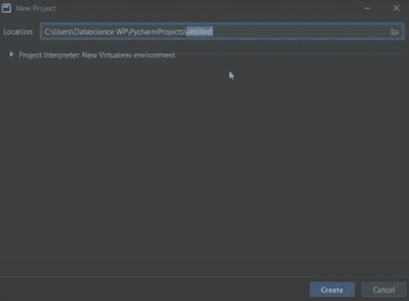

Image by Author

默认的项目名称是“无标题”，如上图所示。

接下来，我们在屏幕的“位置”部分看到一个小三角形符号。当我们点击三角形时，Pycharm 为我们提供了许多选项，如下所示:

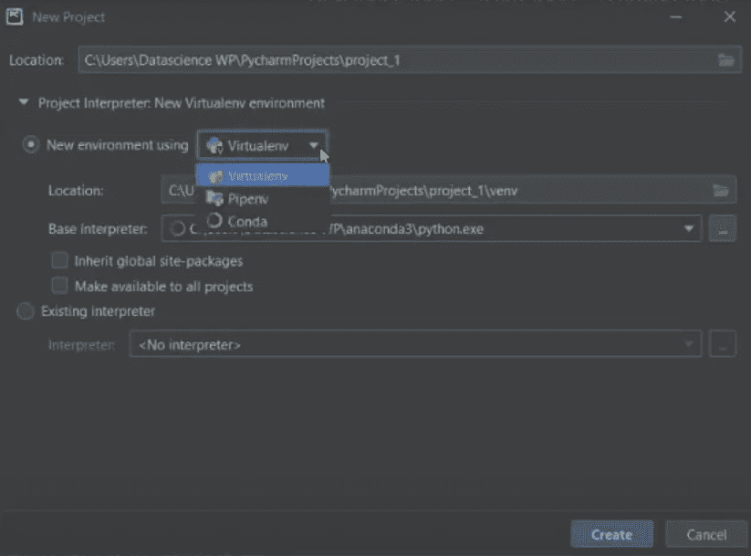

Image by Author

在上面的选项中，我们看到一个标题为“新环境使用”。如果我们点击下拉菜单，我们会看到其中一个是“Conda”，这是“Anaconda”的简称。我们需要在单击 Create 按钮之前选择这个选项，以确保我们正在使用 anaconda 发行版创建新环境。

您应该记住的一件重要事情是，环境名称中不能有任何空格。相反，你可以像“MyEnv”一样用骆驼大小写来分隔单词。另一种选择是使用下划线，如“My_Env”。目的是只保留一个单词作为环境的完整名称。

现在，我们可以点击最后的“创建”按钮，让 Pycharm 施展魔法生成一个闪亮的新环境。

当环境启动并运行时，我们可以开始进入 Python 和数据科学世界的编码之旅。

第一步是检查环境是否设置正确，即是否执行了安装和创建过程。

对于上面的检查，我们必须安装 jupyter 笔记本并运行几个命令。

因此，开始安装 jupyter 笔记本，做一个简单的谷歌搜索类似:
“康达安装 jupyter 笔记本”。

我们应该在结果中得到一个来自“Anaconda.org”的链接。

选择在 Anconda.org 下面写着 Jupyter 的那个，然后打开链接。我们应该到达以下地点:

 [## 朱庇特::Anaconda.org

### 编辑描述

anaconda.org](https://anaconda.org/anaconda/jupyter) 

在网页上，如果我们向下滚动，我们会看到所需的命令以灰色突出显示。
安装的命令是:

```
conda install -c anaconda jupyter
```

我们需要在 Pycharm 的终端部分下运行命令。您将在 Pycharm UI 的底部找到 terminal 部分，它是在之前创建环境时生成的。

上述过程适用于在我们的环境中安装任何包。

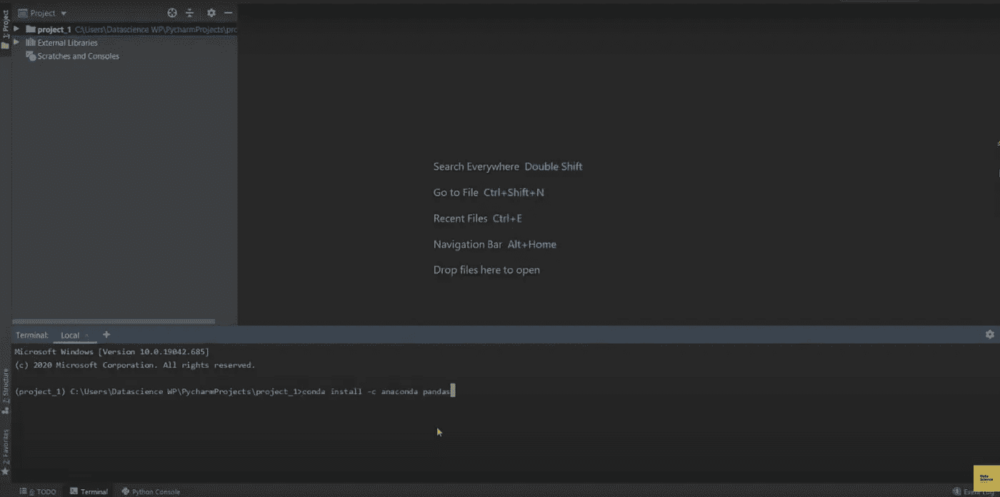

Image by Author

例如，在上图中，我们可以看到我正在使用上面讨论的方法在终端中安装“Pandas”库。

粘贴命令并按 enter 键后，Python 会要求您授权继续安装。

你所要做的就是按 Y 键来安装所需的软件包。

安装完成后，下一步是在终端中运行以下命令:

```
jupyter notebook
```

在输入上面的命令后，只要您按下 enter 键，Python 就会启动一个带有 jupyter notebook 设置的网页，如下所示:

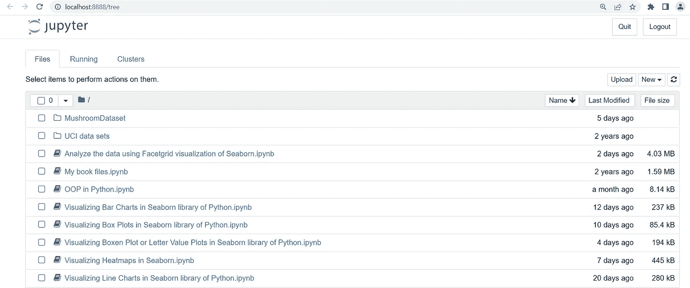

Image by Author

目前，我的环境中有一些 jupyter 笔记本，所以它会显示这些，但当您第一次这样做时，您的 jupyter 笔记本设置将是空白的，即没有文件存在。

现在，点击屏幕右侧的“新建”按钮，并选择“Python3 (ipykernal)”选项来创建您的第一个 jupyter 笔记本，如下所示:

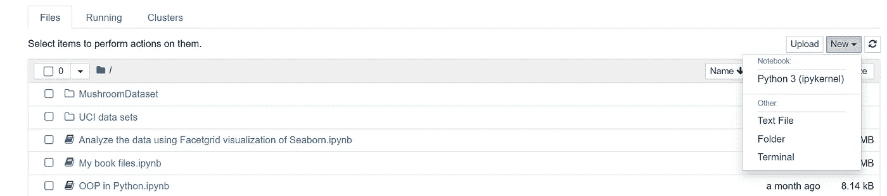

Image by Author

现在，只要我们点击“Python3 ( ipykernal)”，我们就应该看到我们的笔记本。

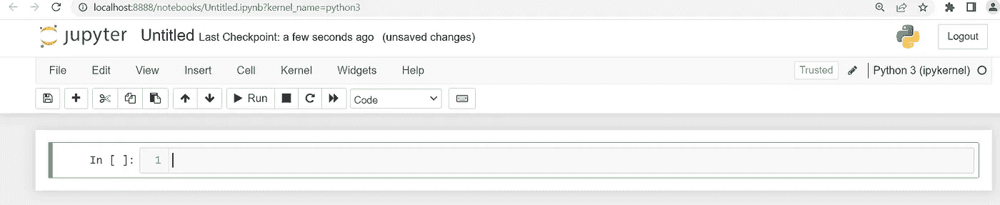

Image by Author

如果您正确执行了所有步骤，您应该会在您的系统中看到上面的页面。

现在，上面生成的*笔记本就是我们的游乐场，在这里我们将学习 python* 语言的基础。

我们要做的第一件事是添加两个数字，并检查安装设置。

我将数字 1 和 5 相加用于测试(你可以选择任何你喜欢的数字。).我们得到如下所示的正确输出:

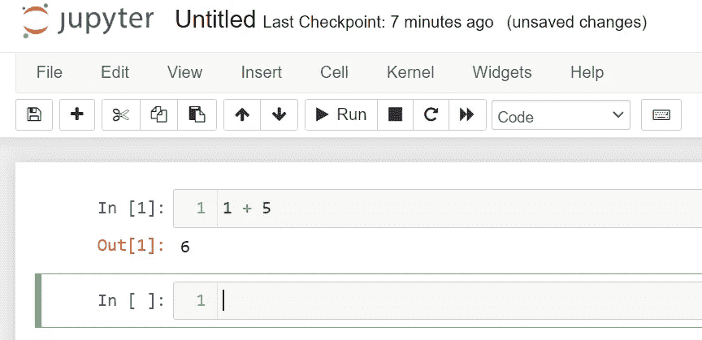

Image by Author

我们得到了正确的输出，因此可以断定安装是成功的。

现在，是时候把我们的注意力转向 jupyter 笔记本本身了。我们看到不同的选项，一些代码行，一些名为“无标题”的东西，通知我们上一个检查点，等等。

我们可以做的第一件事是给我们的笔记本起一个名字。我们可以通过点击“无标题”区域来做到这一点，只要我们点击它，jupyter 就会提供一个输入框来重命名文件，如下所示:

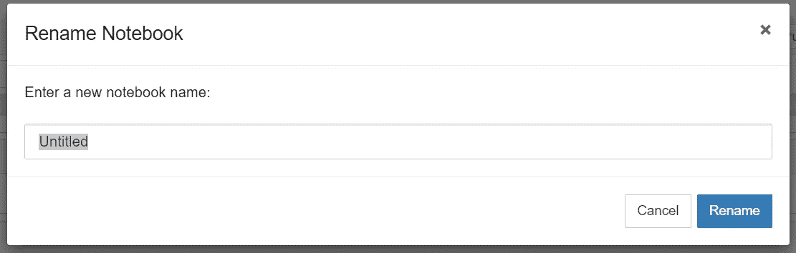

Image by Author

我们将把这个笔记本命名为“Python 入门”。

现在，我们将在快速选项之前查看功能区中提供的选项。

功能区中的第一个选项是“文件”。只要我们点击它，我们就可以看到与处理文件相关的所有选项，例如创建新文件、打开现有文件以及以多种不同格式复制和保存文件，只需按一下按钮就可以使用。

下面的屏幕截图让您可以快速查看上面讨论的所有选项:

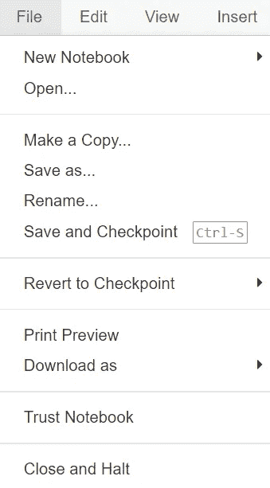

Image by Author

接下来，我们有“编辑”选项。我们有我们能想到的所有编辑选项，如剪切、复制、粘贴、删除、撤消和上下移动代码单元格，查找和替换，这取决于我们的需要，如下所示:

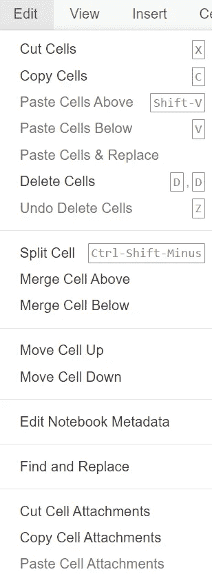

Image by Author

接下来，最重要的选项是“单元”和“内核”，它们有助于运行笔记本。

如果我们看到“Cell”中的选项，我们会发现我们可以选择运行特定的单元或一次运行整个笔记本，如下所示:

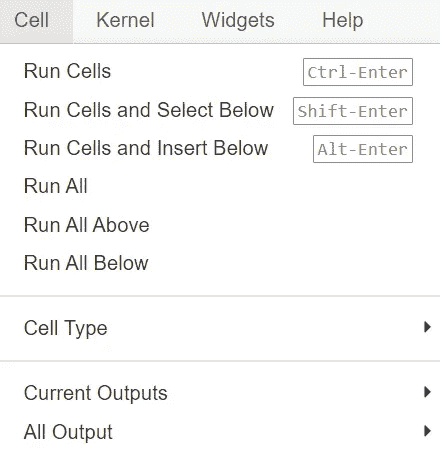

Image by Author

类似于“单元”选项，我们有“内核”，它允许我们控制笔记本。当我们需要通过单击一个按钮来停止或重新启动整个设置时，我们会使用它，如下所示:

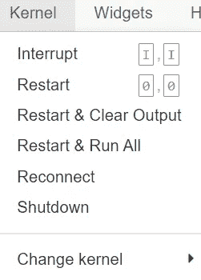

Image by Author

我最喜欢的快捷键之一是运行当前单元格的“Shift + Enter”。这个命令运行单元格，并在下面生成一个新的空单元格，供我们继续工作。

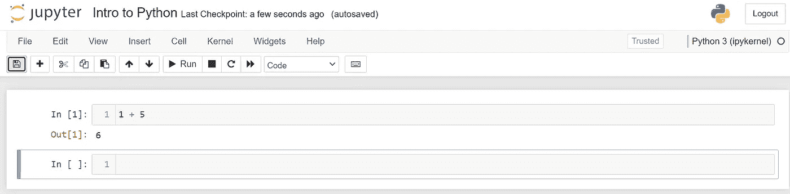

Image by Author

正如我们在上面的图像中看到的，当我们使用“Shift + Enter”运行第一个单元格时，我们会收到下面的一个空单元格，突出显示为当前单元格，周围的蓝色框表示该单元格。

现在，假设我们想要在当前单元格的上方插入单元格。当**单元格为蓝色**时，我们可以通过按“A”键来实现，也称为**“命令模式”**。
在单元格内点击时，您会发现**单元格边界从之前的蓝色变成了绿色**。
另一种表达相同信息的方式是，单元格从“命令模式”变为**“编辑模式”。**你可以在下图中看到这一点:

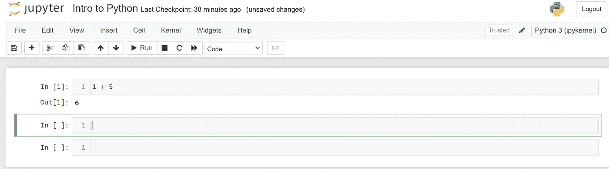

Image by Author

我们可以通过按键盘上的 escape 键从编辑模式转换到命令模式。

现在我们已经学习了 jupyter 笔记本的基础知识，是时候进入实质性问题了，也就是说，是时候开始学习 Python 了。

# 1.语句和缩进:

# 1.a .发言:

我们首先要讨论的是“语句和缩进”。

语句是给 Python 的任何指令或命令集，或者我们可以说语句是 Python 内部可执行的任何代码。

因此，我们在检查安装时执行的一个简单添加就是一个语句的例子。

在 Python 中，您通常会看到两种类型的语句，它们是:

1.  单行语句。
2.  多行语句。

让我们看一个多行语句的例子。我们将添加任务的前六个数字。

我们将运行以下命令:

```
my_variable = (1 + 2 + 3 + 4 + 5 + 6)
```

当我们打印变量时，我们看到我们得到了期望数字的和。

在上面的代码中，我在一行中输入了整个加法，它也可以被分成多行，如下所示:

```
my_variable = (  1 + 2 
               + 3 + 4 
               + 5 + 6)
```

如果我们运行上面的代码，我们将不会收到来自 Python 的任何错误，因为代码中提到的括号向 Python 表明代码还没有完成。

如果我们运行不带括号的相同代码，那么您会发现 Python 抛出一个语法错误，如下所示:

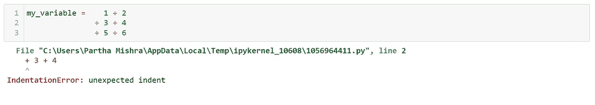

Image by Author

```
my_variable =    1 + 2 \
               + 3 + 4 \
               + 5 + 6
```

这里反斜杠作为符号，它通知 Python 代码行还没有完成，是多行语句的一个例子。

# 1.b .缩进:

缩进是区分代码并为各种语句提供上下文的空间。

如果你以前有过用其他语言编码的经验，你会知道缩进是使我们的代码可读性更好所必需的。当我们想让代码看起来整洁干净时，这是一个要求。

在 Python 中，缩进有不同的用法。这是一种*方式，我们通过这种方式通知 Python 关于不同代码块*之间的区别。

这样想；如果你用 C 或 C++编写过代码，你会注意到不同代码块之间的花括号。在 Python 中，我们使用空格来完成与花括号相同的任务。因此，在代码中加入任何随机的缩进/空格时，我们都应该小心，因为这可能会中断代码的流程。

一般我们根据个人喜好使用空格或制表符进行缩进。一些人通过空格键使用空白，而另一些人在 Python 中使用 tab 键启动缩进。

让我们看一个小例子，看看我们如何应用缩进。

假设我们想使用 Python 中的 for 循环打印前十个数字。

为此，我们将运行以下代码:

```
for i in range(1, 11):
    print(i)
```

在上面的代码中，我们使用了一个名为“range”的内置函数，它给出了从 1 到 10 的值。我们使用 for 循环一个接一个地打印数字，如下所示:

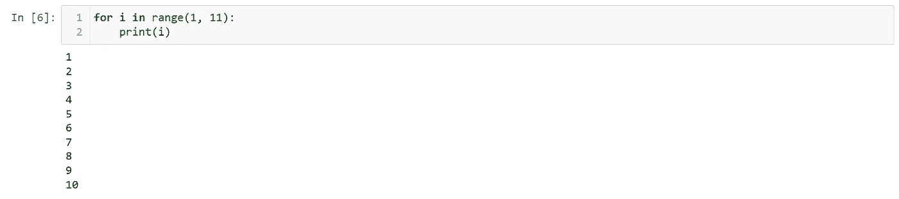

Image by Author

这里可以看到，当你在 range 函数后写冒号符号并按 enter 键时，Python 会在我们开始写 print 语句时自动给出缩进，如上图所示。

让我们看看如果有人不遵守缩进规则会发生什么。我们将使用上面的例子来打印十个数字。这一次，我们删除创建的缩进并运行代码，如下所示:

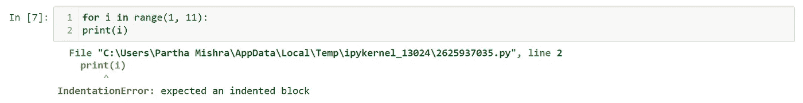

Image by Author

我们可以看到 Python 抛出了一个“缩进错误”，如上图。

# 2.添加评论:

接下来，我们来讨论一下 Python 中的注释。

注释是对考虑中的代码的*描述。所以我们可以写一行或多行解释。*

有时候，你需要为一项任务编写一些又长又复杂的代码。完成后，您可能会将文件保存在某个地方，但是当您在将来的某个时候引用代码时，比如说，三四个月后，您可能无法理解您自己编写的代码！

为了帮助你自己和任何浏览你的代码的人，希望理解它的效用，你应该慷慨地使用注释来阐明所写的代码。

注释是必要的，特别是对于你为一个特定任务创建的复杂函数。

有几种方法可以在 Python 中声明注释。最简单的方法是使用散列符号(#)。

当我们在代码中使用散列符号时，python 解释器会忽略散列符号之后的任何内容。

让我们以使用“for 循环”打印前十个数字为例。现在，假设我们正在与一个不理解“for 循环”如何工作以及预期输出应该是什么的人共享这段代码。我们可以通过在代码前写注释来帮助这个人，如下所示:

```
# A for loop to print the numbers from 1 to 10
for i in range(1, 11):
    print(i)
```

您可以观察到，当您运行上面的代码时，Python 并没有抱怨我们所写的解释，因为它只是忽略了它，这要感谢哈希符号。

让我们用多行写前面的评论。

```
# A for loop to print 
# the numbers from 1 to 10
for i in range(1, 11):
    print(i)
```

编写多行注释的第二种方法是使用三重引号，如下所示:

```
'''A for loop to print 
   the numbers from 1 to 10'''
for i in range(1, 11):
    print(i)
```

所以，每当你需要为任何代码写一个多行注释时，我的建议是用三重引号。使用它们比每行都使用散列符号更容易注释。

# 3.文档字符串:

文档字符串与上面讨论的注释非常相似。不同之处在于，文档字符串帮助我们编写函数、方法、类或模块的文档。

文档字符串经常在用户定义的函数中使用，以帮助新用户理解如何使用它。

让我们为此示例创建一个示例用户定义函数，如下所示:

```
def multiplyby5(x):
    return 5*x
```

顾名思义，我们将给定的数乘以 5，并作为结果传递它。

如果我们有一个模糊的名字，比如 b1，那么我们必须通知用户关于代码的使用，如下所示:

```
def b1(x):
    '''Multiplies the number x with 5'''
    return 5*x
```

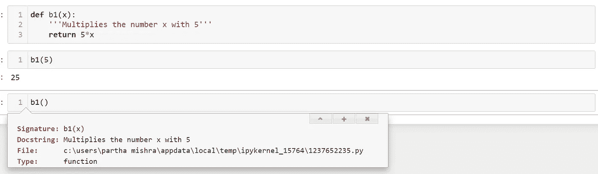

Image by Author

从上图中我们可以看到，只要我们在三重引号中写下函数的效用，它就在“Docstring”中定义了。

将光标放在函数括号内，按下“**Shift+Tab”**键，可以检索到 docstring，如上图所示。

调用文档字符串的另一种方法是使用“__doc__”，如下所示:

```
b1.__doc__
```

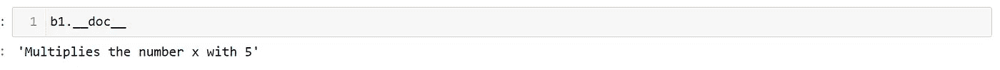

Image by Author

# 4.Python 中的基础数学:

接下来，我们将看看如何在 Python 中执行基本的数学运算。

我们将从加减乘除开始。

```
# Addition of numbers
5 + 6
```


Image by Author

```
# Subtraction of numbers
10 - 2
```

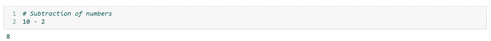

Image by Author

```
# Multiplication of numbers
25 * 10
```

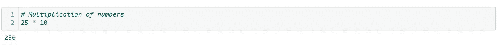

Image by Author

```
# Division of numbers
10/2
```

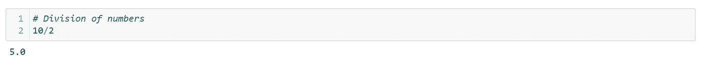

Image by Author

在 Python 中，我们称之为*楼层划分*。地板除法的目的是给我们除法的*商，它忽略了余数。*

假设我们想用 7 除以 3。我们可以通过以下方式实现这一点:

```
7/3
```

我们得到的值是 2.3333…，如下所示:

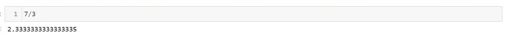

Image by Author

现在，如果我们只对商感兴趣，即 2，那么我们可以使用底除法来实现这一点:

```
7//3
```

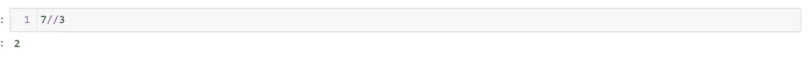

Image by Author

当我们想要执行*楼层划分时，我们使用*两个划分符号*。*

现在，如果我们想要的是余数而不是商，那么我们可以使用一种叫做模运算符的东西，如下所示:

```
# Modulo operator 
7 % 3
```

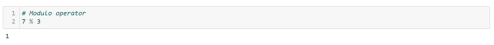

Image by Author

当我们想要执行*模运算符时，我们使用*百分比符号*。*

接下来，让我们讨论幂运算，即把一个数提高到另一个数，换句话说就是把 a 提高到 b 的幂。

假设我们想求 3 的平方，即 3 的 2 次方。
我们可以通过以下方式实现这一点:

```
# Power operations
3 ** 2
```

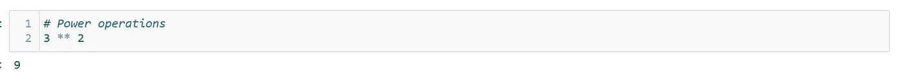

Image by Author

当我们想要执行*幂运算符时，我们使用*两个星号*。*

现在，我们将讨论 Python 中操作的基本顺序。我们可能在最初的数学课上学习过，也就是使用 BODMAS 法则，也就是 PEMDAS。

B =括号
O =阶数，即乘方
D =除法
M =乘法
A =加法
S =减法

P =括号
E =指数
M =乘法
D =除法
A =加法
S =减法

让我们举一个简单的例子来看看它的实际应用:

```
# BODMAS
5+6*10/2# Steps
# 5 + 6 * 5
# 5 + 30# PEMDAS
5+6*10/2# Steps
# 5 + 60/2
# 5 + 30
```

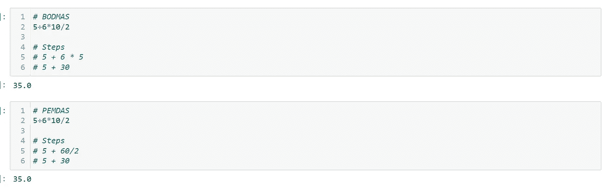

Image by Author

# 5.在 Python 中声明变量:

现在我们将把注意力集中在用 Python 创建变量上。

变量是表示值/量的任何符号或记号，并且具有变化的固有属性，即，如果需要，变量可以改变其值。

更简单的定义是变量是值的占位符。

在像 C 编程这样的其他语言中，我们在使用变量之前显式定义变量类型。

例如，如果我们需要定义一个整数变量 a1，我们必须首先如下声明它:

**"def a1 as int"**

在 Python 中，变量具有动态特性，即当您为变量赋值时，其数据类型会根据所提供的值自动赋值。

例如，如果我们运行以下命令:

```
a1 = 5
```

我们会观察到 Python 给 a1 分配了一个整数类型。

我们使用等号给变量赋值，如上所示。

Python 是动态的，因为只需给现有变量赋一个新值，我们就可以改变它的数据类型，而不需要任何额外的指令。

例如，如果我们指定字符串“hello world！”到 a1 时，数据类型会自动从整数变为字符串。

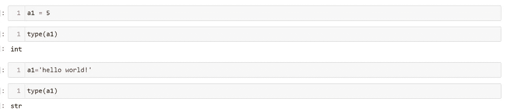

Image by Author

这里的‘int’和‘str’是整数和字符串的简称，如上图。

动态性既有优点也有缺点。

主要优点是易于更改。根据我们的需要，我们可以立即更改数据并直接更改数据类型。

主要缺点是编码时需要变量的各种数据类型。

让我们假设您需要编写大约 2000 行代码。总是存在重新分配数据和无意中更改变量的数据类型的风险。

因此，您需要在编码时小心谨慎，避免出现上述情况。

# 5.a .声明变量的规则:

我们需要回答的下一个问题是，我们需要遵循什么规则来定义一个变量。

我们可以将任何字母或字母数字字符声明为变量吗？答案是“不”。

作为 python 程序员，我们需要遵守 PEP8 规则。
这是 Python 的创始人吉多·范·罗苏姆先生给出的一套准则。

以下是 PEP8 指南的链接:

 [## PEP 8 风格的 Python 代码指南

### 本文档给出了 Python 代码的编码约定，这些代码构成了主 Python 中的标准库…

peps.python.org](https://peps.python.org/pep-0008/#introduction) 

您可以通过简单地滚动文档来开始。它涵盖了大多数初学者在学习语言时犯错误的领域。

对于变量，以下是应遵循的一般规则:

1.  变量名必须是小写的。
2.  避免使用带有特定含义的保留关键字。例如，我们看到整数和字符串使用了关键字 int 和 str。
3.  变量名中不能有空格。如果希望变量名包含两个或更多单词，则需要用下划线将它们分开，如下所示:
4.  要创建变量，不能使用特殊字符，如@、#、$、%等。这条规则的唯一例外是我们前面看到的下划线。
5.  不能声明以数字开头的变量。例如，1_a 不是可接受的变量名。

我们发现保留字的方法是，它总是以绿色突出显示，如下所示:

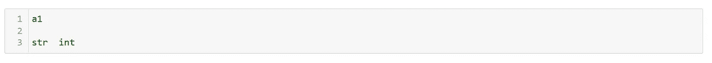

Point 2 above(Image by Author)

在上图中，我们可以看到 a1 是黑色的，像' int '和' str '这样的保留关键字是绿色的。

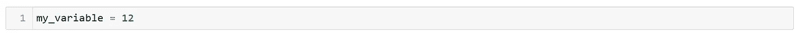

Point 3 above(Image by Author)

# 5.b .一次声明多个变量:

让我们讨论如何在一行代码中声明多个变量。

假设我们要将变量 d，e，f，g 声明为 1 到 4。我们可以使用下面的命令来做到这一点:

```
d, e, f, g = 1, 2, 3, 4
```

Python 将理解如何基于所提供的数据来赋值。

我们可以通过打印出一些数字来交叉检查作业，如下所示:

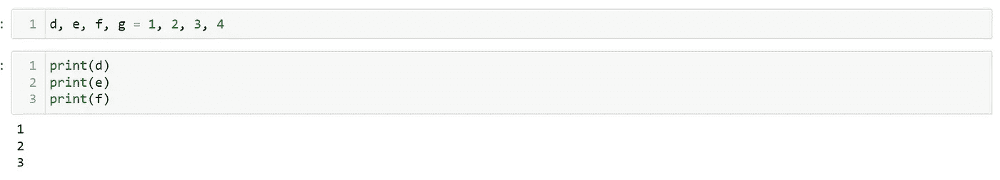

Image by Author

如果我们希望多个变量具有相同的值，我们可以将所有变量等同于相同的值，如下所示:

```
d = e = f = 2
```

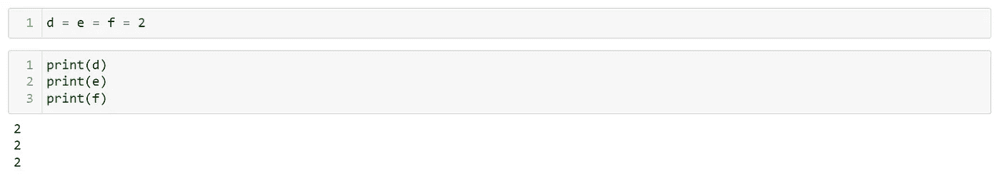

Image by Author

# 6.Python 中的类型转换:

顾名思义，类型转换将一种数据类型转换为另一种数据类型。

在讨论类型转换时，通常想到的第一个问题是，我们为什么需要类型转换？

为了理解这一点，让我们举个例子:

假设我们声明一个名为“a”的整数变量，并给它赋值 5。

现在，在编写要使用变量的函数时，您会发现您需要的数据类型是 float 而不是 integer，即十进制值 5.0 而不是 integer 5。

所以现在你有两个选择:

1.  将变量“a”重新定义为 5.0。
2.  使用类型转换方法，将整数转换为浮点数。

如果我们选择类型转换技术，我们有两种类型可用:

1.  隐式类型转换
2.  显式类型转换

隐式意味着“内部的”，也就是说，无论发生什么类型的转换，都是在内部发生的，Python 会自动完成。

Explicit 正好相反，也就是说，我们需要指定我们想要执行的数据类型。

假设变量 a 的值为 5。

现在假设我们想将整数数据类型转换为字符串格式。我们可以通过以下方式实现这一点:

```
a = 5
type(a)a = str(a)
type(a)
```

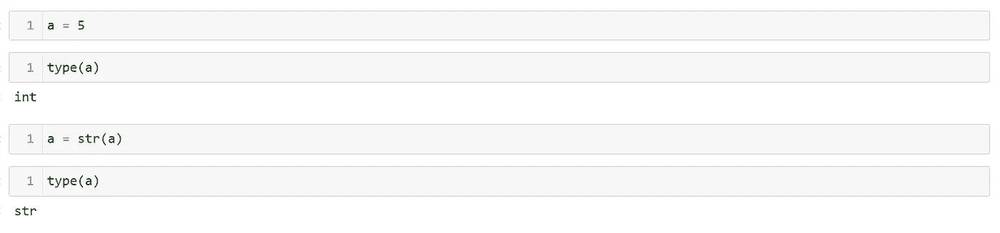

Image by Author

我们已经通过“str”关键字将整数显式地更改为字符串。

让我们看一个隐式转换的例子。

我们有两个变量，“a”和“b”，值如下:

```
a = 10
b = 11.5
```

当我们检查数据类型时，我们看到‘a’是一个整数，而‘b’是一个浮点数。

现在让我们创建一个新变量“c”，它是“a”和“b”的组合，如下所示:

```
c = a + b
```

现在，当我们检查“c”的数据类型时，我们观察到 Python 将它声明为浮点类型，如下所示:

```
type(c)
```

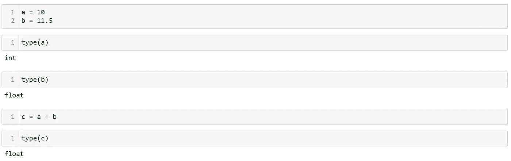

Image by Author

现在，我们来了解一下 python 内部执行了什么任务。

我们想要添加 10 和 11.5，所以为了保持数据类型一致，Python 将数字 10 转换为 10.0，然后添加到 11.5。这就是为什么我们得到的最终数据类型是浮点数。

# 7.Python 中的比较运算符:

顾名思义，比较运算符是允许您同时比较两个或更多变量或元素的运算符。

让我们看看 Python 中可用的各种比较运算符。

我们将声明两个变量——值分别为 5 和 8 的 a 和 b。

我们将使用数学中通常使用的算子。

第一个运算符是大于/小于。

```
a = 5
b = 8a > b
```

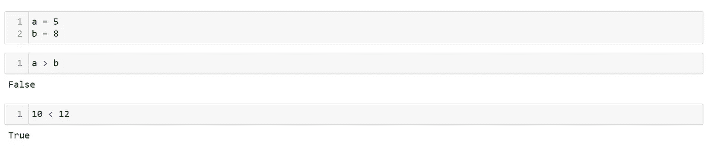

Image by Author

为了检查这两个元素是否相等，我们使用双等号运算符，如下所示:

假设我们想检查变量‘a’的值是否等于‘b’。为此，我们需要运行以下命令:

```
a == b
```

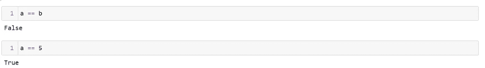

Image by Author

如果我们想要检查相等性的相反情况，即变量不等于某个值，我们可以运行以下命令:

```
a != b
```

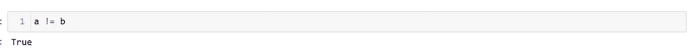

Image by Author

“不是”的符号是感叹号(！).

最后，我们有大于等于和小于等于运算符。
我们需要运行以下命令:

```
# greater-than-equal
a >= b# less-than-equal
a <= b
```

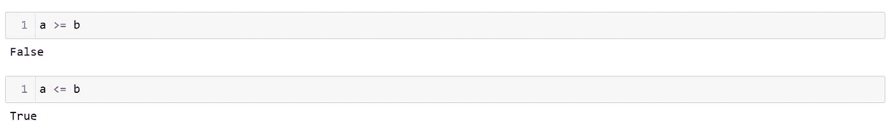

Image by Author

# 8.Python 中的逻辑运算符:

顾名思义，逻辑运算符是允许您在 Python 中执行逻辑检查的运算符。

Python 中有三种逻辑运算符:

1.  和'，
2.  或者
3.  “不是”

根据条件，它将输出一个布尔值 true 或 false。

为了简单起见，我们将考虑两个变量，它们将具有布尔值‘真’和‘假’。

只有当两个条件都正确时,“and”运算符才会输出布尔值“True ”,如下所示:

```
a = True
b = Falsea and b# Second test
a = True
b = Truea and b
```


Image by Author

顾名思义,“or”运算符将输出“True ”,即使任何一个条件都是正确的，如下所示:

```
a = True
b = Falsea or b
```

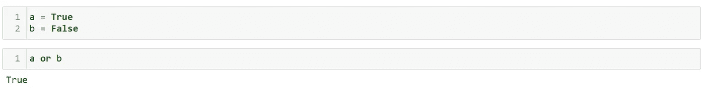

Image by Author

“not”运算符用于否定，也就是说，我们用它来颠倒应用它的条件。

例如，如果我们对前面的代码应用否定，我们将得到布尔值“False”而不是“True”，如下所示:

```
not(a or b)
```

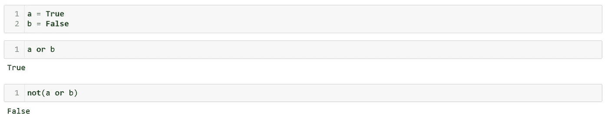

Image by Author

# 9.Python 中的赋值运算符:

赋值运算符允许您在 Python 中为变量赋值。

Python 中有很多赋值操作符。我们已经使用过的最基本的运算符是“等于”运算符。

所以如果我们有一个'我的变量'，我们想给它赋值 15。我们可以通过以下方式实现这一点:

```
my_variable = 15
```

现在，我们想给上面的变量加上 10，并将值改写为 25 而不是 15。

我们可以通过两种方式做到这一点，如下所示:

1.  我们通过将变量加 10 写入变量本身来重新分配它，如下所示:
2.  我们使用简写技术来做同样的事情，而不用重写整个代码，如下所示:

```
# Method 1:my_variable = my_variable + 10print(my_variable)# Method 2:
my_variable = 15my_variable += 10print(my_variable)
```

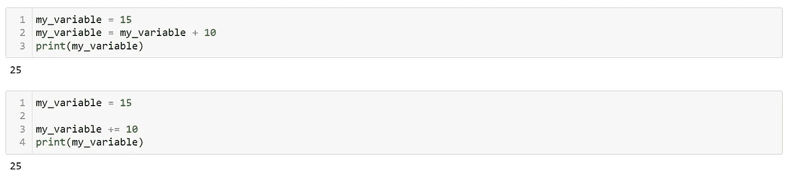

Image by Author

通过写‘a+= 10’，你是在要求 Python 做‘a = a+10’。

与加法类似，我们可以使用任何数学运算符和等号运算符。

```
my_variable = 15# Subtraction
my_variable -= 10
print(my_variable)# Multiplication
my_variable *= 10
print(my_variable)# Division
my_variable /= 10
print(my_variable)# Floor Division ( to get the quotient)
my_variable //= 5
print(my_variable)# Modulo operation (to get the remainder)
my_variable %= 1
print(my_variable)
```

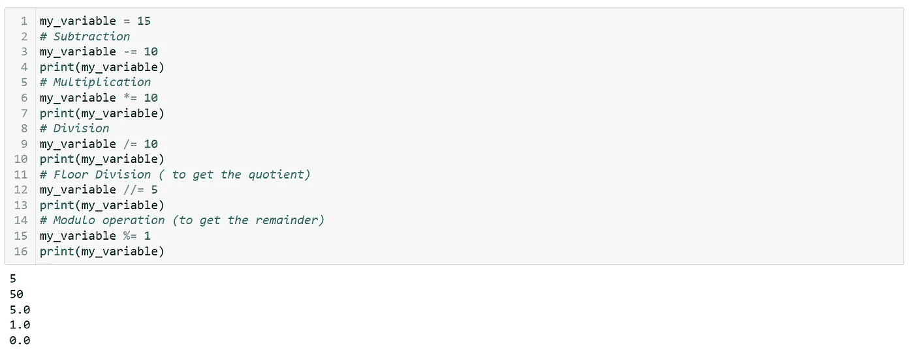

Image by Author

# 10.Python 中的成员和标识运算符

# 10.a .会员运营商:

成员运算符允许您检查一个值是否出现在一组元素中。

Python 中有两个成员运算符:

1.  英寸，
2.  不在

假设我们在变量“a”中存储了以下字符串:

```
a = 'Hi this is Python'
```

现在，如果我们想检查字符串“Hi”是更大的字符串的一部分，我们可以这样做:

```
'Hi' in a
```

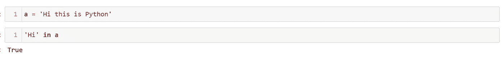

Image by Author

它根据字符串的可用性返回一个布尔值 True 或 False。

有趣的是，即使我们用小写字母书写搜索字符串,“in”操作符也能很好地工作，如下所示:

```
'hi' in a
```

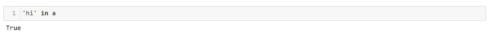

Image by Author

接下来，我们有“in”运算符的否定形式。“不在”运算符给出了完全相反的结果，如下所示:

```
'hi' not in a
```

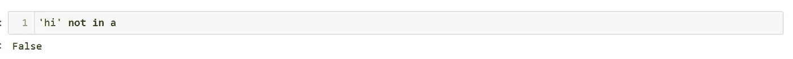

Image by Author

假设我们有一个数字 1 到 3 的列表，我们想检查数字 2 是否在这个列表中，如下所示:

```
2 in [1, 2, 3]
```

# 10.b .身份运营商:

现在，我们将讨论标识运算符。

恒等运算符帮助我们检查变量是否在相似的内存位置。

假设我们创造了十个变量。这些变量必须存储在机器内存的某个地方。

如果我们有两个变量，我们需要检查这两个变量是否相同和相等，那么我们需要使用恒等运算符。

为了理解术语“相同且相等”，让我们使用下面的例子:

```
a1 = 10
b1 = 10
a2 = 'Hi'
b2 = 'Hi'
a3 = [1, 2, 3]
b3 = [1, 2, 3]
```

我们看到变量“a”的集合等于变量“b”的集合，即，

a1 =b1，a2 = b2，a3 = b3。

所以在价值上，他们是平等的。现在，让我们检查上述变量是否相同。

我们可以使用“is”运算符来检查变量是否相同。我们可以运行下面的命令:

```
print(a1 is b1)
print(a2 is b2)
print(a3 is b3)
```

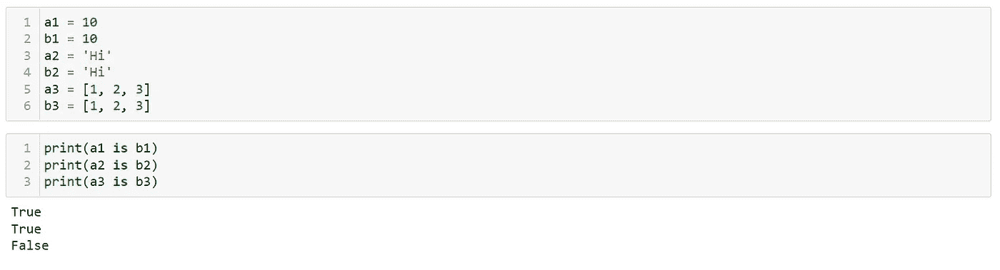

Image by Author

我们观察到 a1，b1 和 a2，b2 相等且相同，即这些变量的值和存储位置都相同。

在 a3 和 b3 的情况下，值相等但不相同，这意味着值相同，但这两个变量的存储位置不同。

正如我们在成员运算符中看到的否定，我们在标识运算符中也可以使用相同类型的否定，即“不是”，如下所示:

```
print(a1 is not b1)
print(a2 is not b2)
print(a3 is not b3)
```

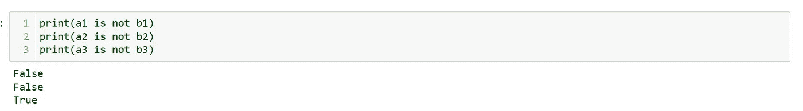

Image by Author

# 11.Python 中的字符串:

字符串是一组在一起的字符、单词或符号。在 Python 中，任何用单引号或双引号写的东西都被认为是一个字符串。

在前面几节中，我们已经在讨论几个例子时使用了字符串，例如，在成员资格操作符中，我们使用了一个变量来存储单词“Hi”。

任何用英语写的句子在 Python 中都被认为是一个字符串，只要我们把它放在单引号或双引号内，如下所示:

```
'Hello! nice to meet you.'
```

你可以把这和你用英语写的两个人的对话进行比较。我们通常用引语来表示一个人的直接引语。

如果我们创建一个变量并存储上面的字符串，我们可以检查数据类型以确认 Python 是否将其保存为字符串，如下所示:

```
my_string = 'Hello! nice to meet you.'type(my_string)
```

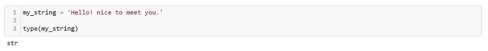

Image by Author

我们可以看到 type 方法的输出是' str '，是 string 的缩写。

假设我们想将句子“他不是在寻求帮助”存储在一个变量中，如下所示:

```
my_string2 = 'he isn't asking for help'
```

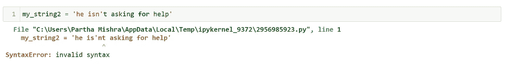

Image by Author

如果我们仔细看看代码，我们会发现在“不是”的“n”附近的撇号之后，所有的字符都是黑色的。Python 不理解这个句子还没有结束，并抛出了一个语法错误。

为了克服这个问题，我们可以通过同时使用双引号和单引号来定义变量，如下所示:

```
my_string2 = "he isn't asking for help"
```

当我们以上面的格式声明变量时，我们没有得到任何错误。

# 11.a .字符串的索引和切片:

假设我们想从字符串中提取一个特定的组件。
假设我们要从 my_string2 中拉出第一个元素，即‘h’。

我们可以通过使用方括号并应用字符串的位置(也称为索引位置)来实现这一点。

由于 Python 是一种零索引语言，我们将传递数字零来提取第一个元素，如下所示:

```
my_string2[0]
```

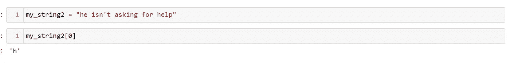

Image by Author

如果我们想从上面的字符串中提取“he is not ”,我们需要执行“slicing ”,如下所示:

```
my_string2[0:8]
```

我们使用“0:8”而不是“0:7 ”,因为为了切片成功，我们需要计算两个单词之间的空间，因为它也被视为一个元素。

它被称为切片，因为我们采取了字符串的一小部分或切片。

如果我们想要捕获字符串的最后一个元素，我们可以通过两种方式来实现:

首先，我们将使用“len”方法计算字符串的长度，如下所示:

```
print(len(my_string2))
my_string2[23]
```


Image by Author

第二种方法是使用负索引来获取所需的元素，如下所示:

```
my_string2[-1]
```


Image by Author

现在让我们看看，如果我们试图搜索一个不存在于字符串中的索引，会发生什么:

```
# out-of-range index 
my_string2[30]# fractional index 
my_string2[4.5]
```


Image by Author

我们看到我们要么得到一个索引错误，要么得到一个类型错误。

现在，假设我们想改变变量中的字符串，而不是提取它。例如，假设我们想将第一个字母“h”改为某个随机的字母，比如“k”。

如果我们试图像在变量中那样进行项赋值，我们将会以类型错误而告终，如下所示:

```
my_string2[0] = 'k'
```


Image by Author

我们可以达到上述要求的唯一方法是覆盖现有的字符串，如下所示:

```
my_string2 = "ke isn't asking for help"
```


Image by Author

# 11.b .字符串的属性和方法:

现在，让我们讨论字符串的各种属性和方法。

字符串最常用的方法是**串联**，即将两个或两个以上的字符串变量连接起来。

```
string1 = 'Hello!'
string2 = 'Everyone'
```

假设我们有上面的两个字符串，我们想把它们连接起来，组成“Hello！每个人”。

我们可以使用加号来实现连接，如下所示:

```
print(string1 + string2)
```

通过在两个字符串之间使用加号，我们观察到这两个字符串已经合并为一个，中间没有空格。


Image by Author

要在两个字符串之间添加一个空格，我们可以在上面的命令中添加一个空格字符，或者使用 print 语句，如下所示:

```
# using space in the command
print(string1 + ' ' + string2)# using the print statement
print(string1, string2)
```


Image by Author

现在让我们看看当我们对字符串应用数学运算符时会发生什么。假设我们将第一个字符串乘以五次，如下所示:

```
print(string1 * 5)
```


Image by Author

接下来，我们有“uppercase”方法，它将完整的字符串转换为大写，如下所示:

```
'asking'.upper()
```


Image by Author

要检查所有可用的属性和方法，我们可以先写字符串，下一个点，然后按 tab 键，如下所示:

```
string1.
```


Image by Author

一些最常用的字符串方法如下:

```
'asking'.upper()string1.lower()string1.split('e')string1.startswith('H')
```

作为练习，请查阅 Python 文档以更详细地理解这些方法。在谷歌上搜索你想了解的任何东西。举个例子，

“python 中字符串拆分方法的文档”。

# 12.Python 中的列表:

列出的是 ***有序的数字或元素序列*** 。这些是 Python 中最常用的数据类型。

我们可以使用方括号创建一个列表。我们可以创建一个空列表，如下所示:

```
my_list = []
```


Image by Author

您将观察到列表和我们已经讨论过的数据类型之间的相似之处。请密切关注这一部分，因为您将在职业生涯的大多数项目中使用列表和数据框。

让我们创建一个包含“aa”、“bb”和“cc”三个元素的列表，如下所示:

```
my_list = ['aa', 'bb', 'cc']
```

列表最有趣的特性是我们可以将不同的数据类型保存在一个列表中，如下所示:

```
my_list = ['aa', 1, 1.5]
```

当我们运行上面的命令时，它被执行，Python 没有抱怨。

我们还可以将一个列表作为元素放在另一个列表中，如下所示:

```
my_list = ['aa', [1, 2, 3], ['d', 'e', 'f']]
```

我们将 list [1，2，3]和['d '，' e '，' f']分别作为第二个和第三个元素。

这个列表包含另一个列表中的一个列表，称为 ***嵌套列表*** 。

现在，让我们看看如何从列表中提取信息。假设我们想从列表中获取字符串' aa'。我们可以通过我们在前面章节中看到的索引方法做到这一点，如下所示:

```
my_list[0]
```

接下来，让我们获取列表中的最后一个元素。

```
my_list[2]
```

现在，让我们更进一步，尝试从作为嵌套列表的第二个元素的列表中提取数字 2。

首先，让我们提取第二个元素:

```
my_list[1]
```

现在我们有一个列表作为输出，它有自己的索引。我们希望将第二个数字放在索引 1 中。

因此，要提取元素，我们可以编写如下命令:

```
my_list[1][1]
```


Image by Author

从嵌套列表中提取信息时，唯一需要记住的是 ***检查索引位置，并不断检查中间步骤*** 的输出，以到达所需的元素。

如果我们给定一个十进制数的索引，我们会得到之前在字符串中看到的类型错误，如下所示:

```
my_list[1.5]
```


Image by Author

现在，让我们看一个分割列表过程的例子。

假设我们想获得嵌套列表的前两个元素。我们可以这样做:

```
my_list[0:2]
```


Image by Author

如果我们仔细看看上面的代码，就会明白 Python 忽略了我们在列表末尾提到的数字，即当我们写 0:2 时，Python 只考虑列表的前两个元素 0 和 1。

捷径是*加 1**到*无论什么*索引*你想用切片过滤。例如，如果你想让它一直到索引 1，在冒号(':')后面加上两个*。*

让我们创建一个数字从 1 到 8 的列表，如下所示:

```
my_list2 = [1, 2, 3, 4, 5, 6, 7, 8]
```

如果我们想从上面提取数字 2、3、4、5 和 6，我们可以这样做:

```
my_list2[1:6]
```


Image by Author

当我们想改变列表中的一个元素时会发生什么？
在字符串的例子中，我们看到它们是 ***不可变的*** ，也就是说，你不能替换字符串元素，只有在你想编辑它们的时候才能覆盖它们。

在列表的情况下，我们可以改变元素，因为 ***列表是可变对象。***

比如说我们想把‘我的 _ 列表 2’里的 2 改成 10。我们可以这样做:

```
my_list2[1] = 10print(my_list2)
```


Image by Author

因此，我们首先使用索引选择位置 2，然后使用等号运算符，将值 10 赋给索引位置 1。

假设我们想改变列表中的多个数字。例如，我们想将索引的数字从 1 改为 3。我们可以使用以下方法:

```
my_list2[1:4] = [200, 5, 1000]print(my_list2)
```


Image by Author

如果我们想向现有列表中添加更多的元素，我们可以执行以下操作:

假设我们想在 my_list2 之后添加元素 1、2 和 3，并准备一个扩展列表。

```
my_list2 + [1, 2, 3]
```


Image by Author

通过使用上述方法，我们并没有永久地改变列表。我们需要使用列表的扩展方法来对给定的列表进行任何永久的更改。


Image by Author

如果我们想逐个添加元素，我们可以使用 append 方法。

```
my_list2.append(1000)
```


Image by Author

我们已经学习了如何添加元素，所以让我们看看如何从列表中删除元素。

让我们创建另一个名为 my_list3 的列表。

```
my_list3 = [1, 2, 2, 2, 5, 6, 7, 8]
```

现在，我们想从 my_list3 中删除元素 2，2，2。我们可以这样做:

```
del my_list3[1:4]
```

我们知道 1:4 在索引中会选择元素 2，2，2。所以我们在它前面写下命令‘del’来删除这些数字。

另一种方法是使用 remove 方法并完成任务。假设我们想从 my_list3 中删除元素 5。我们可以这样做:

```
my_list3.remove(5)
```


Image by Author

如果我们想删除列表中的最后一个元素，我们可以使用 pop 方法来完成这个任务，如下所示:

```
my_list3.pop()
```


Image by Author

我们可以看到，只要我们运行 pop 方法，Python 就会在输出中显示最后移除的元素。

如果我们想从列表中删除所有的元素(空的或空白的列表)，我们可以使用' clear '方法，如下所示:

```
my_list3.clear()
```


Image by Author

让我们为其他示例重新填充列表。

```
my_list3 = [1, 6, 7]
```

清除列表的另一种方法是将变量赋给一个空列表，如下所示:

```
my_list3 = []
```


Image by Author

我们还可以使用 insert 方法将数据放入空列表中。

```
my_list3.insert(0, 1)
my_list3
```


Image by Author

insert 方法首先接受位置，然后接受值。在上面的例子中，我们在索引 0 处插入 1。

假设我们想按升序排列数字。我们可以使用排序方法来实现这一点，如下所示:

```
my_list3 = [200, 1000, 3, 500, 100, 10, 15]my_list3.sort()
```


Image by Author

排序方法的默认行为是按升序排列。
如果我们想要相反的，即降序，那么我们需要执行以下命令:

```
my_list3.sort(reverse=True)
```


Image by Author

接下来，让我们讨论列表理解，这是执行简单任务的最短方式。

让我们举一个例子，学习如何进行列表理解。

假设我们在一个列表中保存了从 0 到 19 的数字，我们想对这些数字求平方。

有两种方法可以完成这项任务:

1.  使用 for 循环，取每个数字并求平方。
2.  使用列表理解。

一旦我们学会了如何使用循环，我们将再次讨论第一种方法。

现在，让我们看看使用列表理解的解决方案。

```
a = [x ** 2 for x in range(20)]print(a)
```


Image by Author

让我们试着理解上面的代码。
我们使用了方括号，表示这是一份清单。
在列表中，我们提到了“x ** 2”，如果您还记得的话，它代表变量 x 的 2 次幂，本质上是执行平方运算。

现在我们已经使用了 range 方法来生成从 0 到 19 的数字列表。

如果我们必须用英语来推断代码，我们可以这样说:
“对 0 到 19 的列表中的每个元素求元素‘x’的平方。”

现在，如果我们想要一个偶数的平方数列表作为输出，我们可以使用下面的代码来实现:

```
a = [x ** 2 for x in range(20) if x%2 == 0]print(a)
```


Image by Author

与前面的代码相比，这里唯一的区别是，在 range 方法之后，我们添加了一个 if 条件，用于使用前面讨论的模数运算符检查偶数。

# 13.Python 中的字典:

字典是一个无序的数据序列，以键值对的形式，不像列表那样有顺序，可以用位置号过滤。

让我们用 Python 创建一个空白字典:

```
a = {}type(a)
```


Image by Author

创建字典最简单的方法是将一个变量等同于一组花括号，如上所示。

为了检查字典的创建，我们可以检查变量的类型。

现在我们来看看键值对的概念。为了理解这一点，让我们创建一个包含一些元素的字典，如下所示:

```
a = {1:'abc', 2:'def'}
```

这里 1 和 2 是键，而“abc”和“def”是值。我们看到每个键都有一个相关的值。

***要访问一个值，我们需要调用相应的键。***
例如，假设我们要访问值‘ABC’。
为了实现这一点，我们需要调用 key 1，如下所示:

```
a[1]
```


Image by Author

正如我们在列表中看到的，字典可以有混合的数据类型，如下所示:

```
b = {'a':'James', 1:2}
```


Image by Author

创建字典的第二种方法是使用“dict”方法，如下所示:

```
b1 = dict()b1 = dict(a=1, b=1)
```


Image by Author

使用上述方法的优点是，我们需要像给任何变量赋值一样，使用等号运算符给键赋值。

我们将在字典之后讨论元组，但是为了完整起见，让我们看看创建字典的过程。

```
b1 = dict([('abc', 1), ('def', 2)])
```


Image by Author

我们讨论了如何使用键访问值。除了第一种技术，另一种方法是使用 get 方法来检索信息。

```
b1 = dict([('abc', 1), ('def', 2)])b1.get('abc')
```


Image by Author

让我们看看当我们试图获取任何不存在的值时会发生什么。例如，假设我们在上面的字典中给出键为' apple ',并尝试检索信息。

```
b1['apple']
```


Image by Author

我们观察到我们得到一个“关键错误”，如上所示。

现在，让我们看看如何修改它的值。假设我们想将下面字典中的“a”值改为 100:

```
b1 = dict(a=1, b=2)b1['a'] = 100print(b1)
```


Image by Author

类似地，如果我们想要添加一个新的键-值对，我们可以执行以下操作:

```
b1['c'] = 3print(b1)
```


Image by Author

现在，让我们来看看字典的一些最常用的方法。第一个是 pop 方法，通过它我们可以从字典中删除一个键值对。

```
b1.pop('a')
```


Image by Author

如果我们想清空字典，我们可以使用' clear '方法，如下所示:

```
b1.clear()
```


Image by Author

如果我们想将字典中的所有元素都看作一个键值对，我们可以运行下面的命令:

```
a.items()
```


Image by Author

接下来，如果我们想要获得字典中所有键的列表，我们需要执行以下命令:

```
a.keys()
```


Image by Author

类似地，补键方法是 values 方法，在这里我们得到一个字典值的列表，如下所示:

```
a.values()
```


Image by Author

要找到可用的键-值对的总数，我们可以使用“len”方法，如下所示:

```
len(a)
```


Image by Author

接下来，看看嵌套的字典。类似于列表，我们在列表中有一个列表，我们可以有一个嵌套的字典，如下所示:

```
a[3] = dict(a=50, b=25, c=101)
```


Image by Author

# 14.Python 中的元组:

元组是不可变的数字或元素的有序序列，即，一旦定义了元组，就不能更改它。
元组和列表非常相似。元组和列表数据类型之间的主要区别是可变性的可用性。

要创建一个元组，我们需要将元素传递到一组常规括号中，如下所示:

```
my_tuple = (345, 123, 567)type(my_tuple)
```


Image by Author

创建元组的第二种方法是用逗号分隔元素，如下所示:

```
my_tuple = 50, 101.1, 'def'
```


Image by Author

当我们创建一个只有一个元素的元组时，有趣的事情发生了。让我们来看看这个场景:

```
my_tuple = ('abc')
```

假设我们声明了一个只有一个元素的元组。
现在，当我们检查数据类型时，您会观察到 Python 已将其视为字符串而非元组，如下所示:


Image by Author

为了克服这个问题并声明只有一个元素的元组，我们必须修改上面的代码，即在第一个元素后添加逗号将显式指示 Python 创建元组而不是字符串。

```
my_tuple = ('abc',)
```


Image by Author

我们提到过元组是不可变的对象。让我们尝试更改第一个元素，看看输出:

```
my_tuple[0] = 1
```


Image by Author

从上面我们可以看到，只要我们试图给元组赋值，就会得到一个“类型错误”。

从列表和元组的讨论到现在，有些人可能会有这样的疑问:
***如果列表是元组的一部分，我们可以改变列表的元素吗？***

让我们执行并找出答案。对于此示例，让我们创建以下元组:

```
my_tuple = ('abc', [1, 2 ,100], (500, 600, 700))
```

现在，让我们访问第一个索引中的列表，并尝试将元素 1 更改为 1000，如下所示:

```
my_tuple[1][0] = 1000
```


Image by Author

所以我们这个问题的 ***答案是肯定的。*** 如果元组里面的对象是可变的，我们可以改变元素。

与列表类似，我们可以对元组进行切片，如下所示:

```
my_tuple2 = 1,'a',2,'b',3,'c',4,'d'my_tuple2[1:5]
```


Image by Author

现在，让我们看看元组的一些常用方法。第一个是“count”，用于计算给定元素在元组中重复的次数，如下所示:

```
my_tuple3 = (1, 1, 2, 2, 3, 'c', 'd', 'd')my_tuple3.count('d')
```


Image by Author

因此，我们可以看到，只要我们在 count 方法中传递' d ',我们就会得到 2 的输出，即' d '在元组中重复了两次。

另一种最常用的元组方法是索引。顾名思义，index 方法为我们提供了第一次出现的元素的索引位置，例如:

```
my_tuple3.index('d')
```

上述命令的输出是 6，即 python 第一次在元组中找到元素‘d’是在索引位置 6。

假设您团队中的某个人已经定义了元组，并将其放入数据库中。
假设你想检查一个元素是否存在于元组中。
您可以使用成员资格运算符“in”来实现，如下所示:

```
'd' in my_tuple3
```


Image by Author

元组相对于列表的主要优势如下:

1.  当我们遍历数据时，我们发现元组给了我们更快的结果。
2.  当我们想要保护数据并避免意外更改时，我们需要将信息保存在元组中，而不是列表中。

# 15.Python 中的集合:

集合是唯一元素的无序序列，即在给定的集合中没有值可以重复。它们类似于字典，但不像字典那样有键值对分配。

让我们创建一组简单的字母表，如下所示:

```
a = {'a', 'd', 'b', 'c'}
```

我们也可以拥有包含多种数据类型的集合，如下所示:

```
a = { 6.5, 'James', ('a', 'd', 10)}
```


Image by Author

现在，让我们看看当我们试图从包含重复项的列表中创建一个集合时会发生什么。

```
a1 = set([1,1,1, 2, 3])
```


Image by Author

我们观察到管理集合的规则被保持，即没有元素重复。

我们看到在元组中，我们可以像存储列表一样存储可变对象。让我们试验一下我们是否能成套地做同样的事情。

```
a1 = {'a', 'b', [1, 2]}
```


Image by Author

我们注意到我们得到了一个“类型错误”，它表明可变对象不能成为集合的一部分。

现在，让我们看看如何向集合中添加元素。
要添加单个元素，我们可以使用 add 方法，如下所示:

```
a = set([1, 3, 4, 5, 8])
```


Image by Author

我们可以看到“2”已被添加到集合中，如上所示。

对于添加多个值，我们可以使用 update 方法，如下所示:

```
a.update([8, 9, 10, 11])
```


Image by Author

如果我们想要更新基于多种数据类型的集合，该怎么办？我们可以这样做:

```
a.update([1, 1, 19], {22, 25, 28})
```


Image by Author

现在，让我们看看如何从集合中删除元素。要删除任何东西，我们可以使用一种叫做丢弃的方法。

让我们从上面的集合中丢弃元素“9”。

```
a.discard(9)
```


Image by Author

执行上述任务的另一个命令是使用 remove 方法，如下所示:

```
a.remove(1)
```


Image by Author

在删除和丢弃中，删除方法更好，因为当我们试图删除一个不存在的元素时，它会显示一个“关键错误”，如下所示:

让我们再次尝试删除元素“1”。


Image by Author

我们可以看到' remove '方法给了我们一个' key error ',而' discard '方法没有。

假设我们有以下两组:

```
my_set1 = {1, 2, 4, 5 ,10}my_set2 = {3, 6 ,7, 9 ,10}
```

如果我们想要执行两个集合之间的交集、并集和差集，我们可以执行如下所示的任务:

```
my_set1.union(my_set2)my_set1.intersection(my_set2)my_set1.difference(my_set2)my_set2.difference(my_set1)
```


Image by Author

当我们取两个集合之间的差时，我们从左边的集合中移除交集值。

在上面的例子中，我们应用了与第一个集合的差异，我们得到了那个集合的所有元素，没有公共元素“10”。

在两个或多个集合之间执行联合的另一种方法是使用管道运算符，如下所示:

```
my_set1 | my_set2
```


Image by Author

类似地，执行交集的快捷方式是使用&符号，如下所示:

```
my_set1 & my_set2
```


Image by Author

Python 中另一种可用的集合类型是冻结集合。

冻结集类似于元组，因为它是不可变的。

要创建冻结集，我们需要使用以下命令:

```
my_set1 = frozenset({1, 2, 4, 5 ,10})my_set2 = frozenset({3, 6 ,7, 9 ,10})
```

让我们看看当我们试图在冻结集中添加或删除元素时会发生什么。

```
my_set1.add(15)my_set2.remove(6)
```


Image by Author

我们得到一个“属性错误”，如上所示。

# 16.If，Else，Python 中的 Elif:

让我们开始学习 Python 的控制语句，即 if、else 和 elif 条件。

所以想到的第一个问题是:
“什么是控制语句？”

控制语句是处理一组代码需要满足的条件。

在 Python 中，我们可以使用 if、else 和 elif 条件来控制代码流。

所以我们一个一个来看这些条件。
我们要讨论的第一个是‘如果’条件。

顾名思义，只有满足给定的条件，Python 才会执行代码块。

“if”条件是 Python 中最简单的控制语句形式，如下例所示:

```
a = 10if a == 10:
    print('The value of a is 10 hence this statement got printed')
```


Image by Author

在上面的例子中，我们遵循以下逻辑:

1.  我们首先将变量 a 声明为 10
2.  接下来，在 if 块中，我们使用双等号检查变量 a 是否等于 10。
3.  一旦条件满足，Python 就会运行 print 语句。

当条件不匹配时，Python 会跳过“if”语句中的代码块。
我们可以通过将“a”的值改为“3 ”,然后运行前面的代码来观察这一点，如下所示:

```
a = 3if a == 10:
    print('The value of a is 10 hence this statement got printed')
```


Image by Author

接下来，我们有 Else 条件。“else”语句与“if”块一起工作。所以大多数时候，你会在 Python 代码中观察到 if-else 组合。

顾名思义，当“if”语句失败时，将执行“else”中的代码块。

简单地说，如果条件一失败，那么执行 else 语句代码块。

让我们在上面的代码中添加一个“else”块并检查结果，如下所示:

```
a = 3if a == 10:
    print('The value of a is 10 hence this statement got printed')
else:
    print('a is not 3')
```


Image by Author

在上面的代码中，我们将' a '声明为三，因为' if '语句失败，所以执行' else '语句。

最后，我们有“elif”条件，它是“Else if”的缩写，即如果语句不匹配，那么我们可以检查多个其他语句/条件，而不仅仅是“Else 条件”。

```
a = 3if a == 10:
    print('The value of a is 10 hence this statement got printed')
elif a == 5:
    print('a is 5')
elif a == 3:
    print('a is 3')
else:
    print('a is not 3')
```


Image by Author

有时，根据任务的不同，可能需要嵌套条件。

嵌套条件是一组代码，您可以在其中观察到另一个条件中的条件，例如:

```
a = -5if a >0:
    if a == 8:
        print('a is 8')
    elif a == 5:
        print('a is 5')
    else:
        print('number is not 8')
else:
    print(f' number is {a}')
```

我们有两组代码块，一组是外部的 if-else 条件，另一组是第一个 if 条件中的“if elif else”代码块。

如果‘a’的值为正，那么我们进入外部 If 块，这导致基于内部 if elif else 块检查值。

如果外部 If 块为 false，则执行 else 条件，如下所示:


Image by Author

# 17.对于 Python 中的循环:

循环是一组重复一段代码的指令。
从本质上讲，循环是一种持续运行并不断重复的东西。

在 Python 中，当我们说“for loop”时，我们的意思是我们访问某些 iterables 的元素，例如，循环遍历一个列表、元组或字典。

其工作方式如下:

1.  iterable 中的一个元素，比如一个列表，被传递给 for 循环的代码块。
2.  Python 检查上述元素是否是列表中的最后一个。如果是，则循环终止。如果没有，则发送下一个进行处理。
3.  如果有下一个元素，则重复步骤 1 和 2。

让我们以下面的列表为例:

```
a = [1, 2, 3 ,4, 5]for i in a:
    print(i)
```


Image by Author

我们使用“for 循环”一次打印出一个元素。我使用了虚拟变量“I ”,但它可以是你选择的任何东西。例如，对于列表 a 中的数字 b，打印(b)。

```
for b in a:
    print(b)
```

假设我们想使用“for 循环”计算 5 的阶乘。

我们将得到的值是 120，即 5*4*3*2*1。

```
for i in a:
    my_mul = my_mul * i
    print(f'The multiple is {my_mul}')
print(f'The factorial of 5 is {my_mul}')
```


Image by Author

首先，我们创建了一个虚拟变量来存储最终结果。因为我们要将这些数字相乘，所以我们选择了一个作为变量的初始值。

每当列表中的一个元素进入循环的代码块时，它就会乘以先前存储的数字。

最后，我们在循环退出后打印 5 的阶乘。

现在，让我们看一个使用字典的例子。

我们将使用一个 for 循环，通过对键进行迭代来提取字典值。

假设我们有下面的字典:

```
char_names = {1:'James', 2:'Tom', 3:'Jerry', 4:'Spike', 5:'Tuffy'}
```

我们可以使用如下所示的键来打印名称:

```
for char in char_names:
    print(char_names[char])
else:
    print('\n')
    print('End of For Loop!')
```


Image by Author

我们可以看到，我们使用了“else”条件和“for 循环”。我们可以根据自己的需求混合和匹配所讨论的条件语句。

下面是“for 循环”的另一个示例:

```
char_names = {1:'Spike', 2:'Tom', 3:'Jerry', 4:'Tuffy'}
for char in char_names:
    if char == 2:
        print(char_names[char], 'vs Jerry')
    elif char == 1:
        print(char_names[char], 'vs Tom')elif char == 4:
        print(f'Jerry with {char_names[char]}')

    else:
        print('\n')
        print('The End')
```


Image by Author

作为一项任务，尝试找出输出背后的逻辑。

# 18.Python 中的 While 循环:

只要 set 条件的计算结果为 True，while 循环就会遍历一个代码块。

while 循环的工作方式如下:

1.  首先，我们对 while 循环的条件进行检查，只有当它为真时，代码块才会被执行。
2.  代码块一执行，流程就返回到第一步。
3.  只有当循环的条件评估为假时，该过程才终止。

让我们使用“while 循环”来计算 5 的阶乘。

```
a = 5my_mul = 1i = 1while i <= a:
    my_mul = my_mul * i
    i = i + 1print(f'Five factorial is {my_mul}')
```


Image by Author

我们首先声明了所需的变量，然后在 while 循环中，我们不断将数字相乘以获得阶乘。

作为初学者，与 while 循环相关的主要风险是您应该 ***注意 I .*T3 的递增计数器**

***如果你忘记增加“I”，你将会陷入一个无限循环*** 中，这可能会使你的系统崩溃。

# 19.Python 中的面向对象编程(OOP ):

我在我的另一篇文章中讨论过 OOP，我在下面做了链接。

继续阅读下面的文章，以结束学习完整的 Python 数据科学。

[](/@mishrapartha/object-oriented-programming-oop-in-python-dc81e9323a08) [## Python 中的面向对象编程(OOP)

### 让我们讨论一下面向对象编程(OOP)。

medium.com](/@mishrapartha/object-oriented-programming-oop-in-python-dc81e9323a08) 

如果您喜欢这篇文章，请随意阅读 Seaborn 的数据可视化文章。


[米帕萨](/@mishrapartha?source=post_page-----3c90c4e1761b--------------------------------)

## Seaborn 文章-数据可视化

[View list](/@mishrapartha/list/seaborn-articles-data-visualization-1ea1f0b8a294?source=post_page-----3c90c4e1761b--------------------------------)7 stories

**祝您的数据科学之旅一切顺利！**

下次见！

[](/mlearning-ai/mlearning-ai-submission-suggestions-b51e2b130bfb) [## Mlearning.ai 提交建议

### 如何成为 Mlearning.ai 上的作家

medium.com](/mlearning-ai/mlearning-ai-submission-suggestions-b51e2b130bfb)