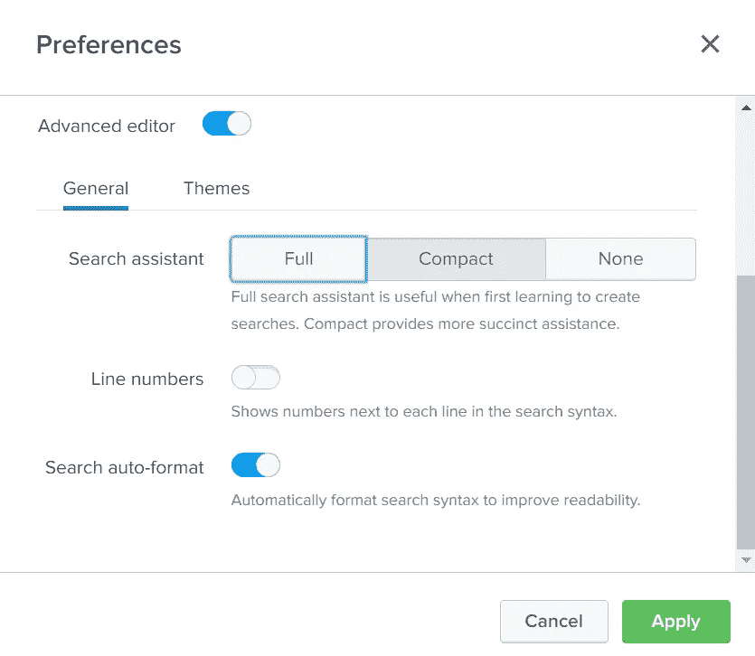
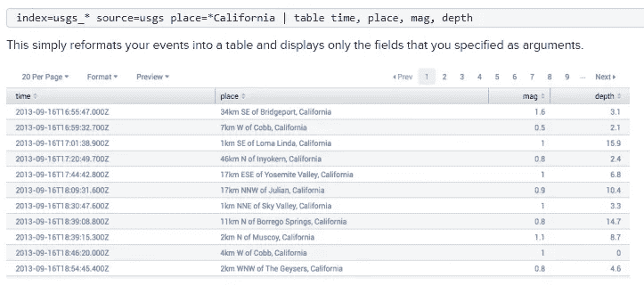

# 在 Splunk 中搜索的初学者指南

> 原文：<https://medium.com/mlearning-ai/a-beginners-guide-to-searching-in-splunk-b8c409a8ae6e?source=collection_archive---------5----------------------->


Splunk Search App

Splunk 是成千上万家希望解决数据问题的公司的首选工具，但开始有效使用它可能会令人生畏、力不从心且耗时。通常，配置 Splunk 实例的管理员或工程师不会使用 Splunk，这可能会使用户感到更加疏远，并且不熟悉他们所需的数据结构。本指南旨在为那些搜索 Splunk 的人提供一个起点，帮助他们只提取对他们有用的数据，并提供如何加快极其漫长的搜索的技巧。

## 提示 1:通过打开自动格式使你的搜索更清晰

Splunk 搜索可能会变得非常漫长和复杂，尤其是当您开始将几个不同的命令串在一起时。搜索自动格式会将通过 **|** 字符“输送”到另一个命令的命令分隔到不同的行上(稍后会详细介绍)，并且会自动切换括号内的子搜索。要打开这个功能，点击页面顶部的用户名>首选项> SPL 编辑器，并打开底部的“搜索自动格式”开关。



Splunk User Preferences

## 技巧 2:学习你的数据

如果您正在配置您自己的 Splunk 实例，您应该已经知道您的数据是如何加载到 Splunk 中的，但是如果您正在搜索其他人已经配置的 Splunk 实例，了解该数据是什么样子对于浏览它是至关重要的。要开始探索您的数据，您应该了解哪些索引可供您使用。Splunk 中的索引就像一个数据桶，创建它是为了对放入其中的数据进行松散排序。您的 Splunk 实例可能有一个索引，也可能有数百个，而您可能只能访问少数几个。要了解您可以访问哪些索引，您可以运行以下命令:

```
| eventcount summarize=false index=*
| dedup index
| fields index
```

该命令列出您选择的时间段内的所有事件，确保包括索引，从该列表中删除重复的索引，然后只显示剩余索引的列表，而不显示任何无关信息。一旦你有了一个索引列表，试着通过在搜索中包含`index=your_index`从每个索引中获取数据，然后改变时间范围到你开始得到结果的时候。如果你的搜索时间太长，减少你的时间范围或切换到实时结果。一旦有了结果，看看返回的信息是否是您感兴趣的。如果看起来你可以使用这些数据，记下这个索引，看看数据是如何在每个事件中形成的。这些事件中的字段可用于构建有意义的搜索。

## 技巧 3:通过只寻找你需要的东西来加快搜索速度


Splunk Timeframe Selector

我见过用户在 Splunk 中搜索时遇到的一个常见问题是，他们的查询时间太长，以至于他们认为 Splunk 不可用。根据加载到 Spunk 中的数据量，如果您查看的条目太多，您的搜索可能需要几分钟或几小时。为了帮助缓解这个问题，限制你的搜索，只寻找你需要的东西，可以大大提高他们的速度。在设定的时间范围内搜索是加快搜索速度的最有效方法。通过缩小搜索范围，您可以删除 Splunk 需要搜索的大部分数据。在限制了你的搜索时间后，收录是另一个加快搜索速度的好方法。虽然排除，或者说某个搜索词对加快搜索速度没有什么帮助，但是包含可以大大加快搜索速度。你的每个搜索应该总是以`index=your_index_here`开头。该搜索只包括您想要搜索的索引。包含索引后，您的搜索词应该限制在可能包含这些词的字段中。例如，`index=your_index_here search_term_here`是一个非常慢的搜索，而`index=your_index_here relevant_field=search_term_here`通过定义包含哪个字段来加速搜索。

## 技巧 4:使用“`table"`命令让你的结果可读

一旦您知道您要搜索的数据，并且能够在合理的时间内运行搜索，基本 Splunk 搜索可用性的最后一步是能够以可读和相关的方式格式化结果。管道字符`|`进行搜索，并根据搜索结果运行附加命令。为了达到可读性，我们可以将搜索结果通过管道传输到`table`函数中。`table`命令将字段名作为参数，输出一个表，其中字段名作为列名，搜索返回的事件作为行。例如:

```
index=your_index_here relevant_field=search_term_here
| table relevant_field, column_field_2, column_field_3
```

运行上述搜索将显示一个比查看原始 Splunk 事件更具可读性和可管理性的表格。



A table in Splunk, taken from Splunk’s documentation: [https://docs.splunk.com/Documentation/SplunkCloud/latest/SearchReference/Table](https://docs.splunk.com/Documentation/SplunkCloud/latest/SearchReference/Table)

## 最后的想法

本指南并不全面，但它应该是熟悉使用一个强大且通常令人生畏的工具的良好开端。现在，您应该对如何理解您正在搜索的数据有了更多的了解，将您的搜索加速到可管理的等待时间，并以易读的格式仅显示相关数据。要获得更全面的信息，请查看 Splunk 提供的一些文档，或者浏览 Splunk 在其网站上创建的课程:
[【https://docs.splunk.com/Documentation】](https://docs.splunk.com/Documentation)
[https://education.splunk.com/](https://education.splunk.com/)

[](/mlearning-ai/mlearning-ai-submission-suggestions-b51e2b130bfb) [## Mlearning.ai 提交建议

### 如何成为 Mlearning.ai 上的作家

medium.com](/mlearning-ai/mlearning-ai-submission-suggestions-b51e2b130bfb)