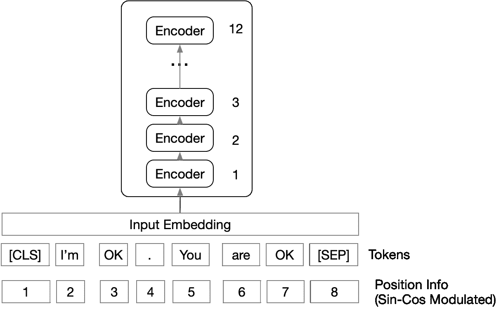
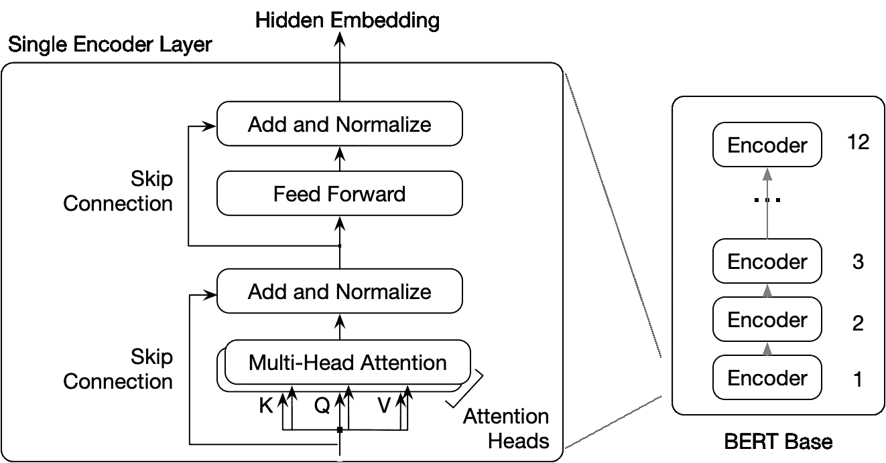

# 值得品尝的伯特风味

> 原文：<https://medium.com/mlearning-ai/a-bert-flavor-to-sample-and-savor-8787b11a63a3?source=collection_archive---------3----------------------->

幸运的是，我们可以从 BERT 架构中派生出各种模型来满足我们的内存和延迟需求。事实证明，模型容量(参数的数量)取决于三个变量，即 **层**的**数量、**隐藏嵌入大小**，以及**注意力头**的数量。**

这篇文章聚焦于这三个参数。

## 编码器层数

BERT 模型由几个相似的 transformer 编码器层组成，相互堆叠。第 N-1 层的输出是第 N 层的输入。BERT Base 有 12 层，BERT Large 有 24 层。

## **隐藏嵌入尺寸**

隐藏嵌入大小是每一层的输出的大小(在 BERT 基的情况下是 768，在 BERT 大的情况下是 1024)。

## 注意力头的数量

正如在卷积神经网络中，我们在输出端使用几个过滤器来产生几个不同的特征图，多头注意力也有类似的目的。键、查询和值(K，Q，V)被多次( **A** 次)用不同的、已学习的线性投影投影到不同的空间。BERT Base 使用 A=12 的注意力头，BERT Large 使用 A=16。(不要与 L=12 个编码器层合并)

## 有名的

内部前馈层始终是隐藏嵌入大小的四倍(因此它是一个隐式变量)。

## 总结

学生模型结构紧凑，适用于资源受限的环境(比如移动和边缘环境)

## 参考

[博览群书的学生学得更好:论预培训紧凑模型的重要性](https://arxiv.org/pdf/1908.08962.pdf)

[抱脸预训练模特](https://huggingface.co/transformers/v3.3.1/pretrained_models.html)

[TinyBERT:提取用于自然语言理解的 BERT](https://arxiv.org/pdf/1909.10351.pdf)

[比以往任何时候都更好地理解搜索](https://blog.google/products/search/search-language-understanding-bert/)

[尼斯伯特图(图一)](https://peltarion.com/knowledge-center/documentation/modeling-view/build-an-ai-model/blocks/bert-encoder)

 [## Mlearning.ai 提交建议

### 如何成为 Mlearning.ai 上的作家

medium.com](/mlearning-ai/mlearning-ai-submission-suggestions-b51e2b130bfb)