# 距离测量简介

> 原文：<https://medium.com/mlearning-ai/a-brief-introduction-to-distance-measures-ac89cbd2298?source=collection_archive---------2----------------------->

## 你应该听说过的机器学习的 10 个距离度量

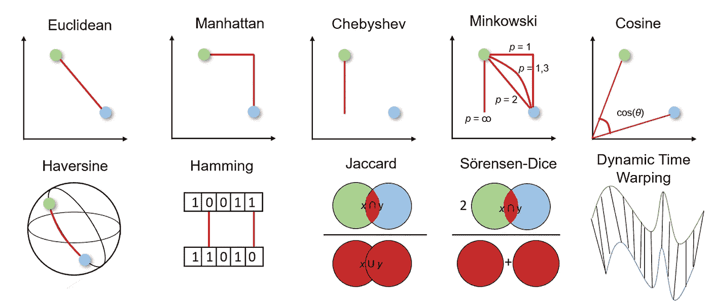

10 often used distance measures (based on [M. Grootendorst](https://towardsdatascience.com/9-distance-measures-in-data-science-918109d069fa))

距离度量是监督和非监督学习算法的基础，包括 K-最近邻、自组织映射、支持向量机和 K-均值聚类。

距离度量的选择会影响我们的机器学习结果，因此考虑哪种度量最适合该问题非常重要。因此，我们应该小心决定使用哪种方法。

但是在我们做出决定之前，我们需要了解距离测量是如何工作的，以及我们可以从中进行选择。

因此，本文将简要介绍常用的距离度量，它们是如何工作的，如何用 Python 计算它们，以及何时使用它们。这样你可以加深你的知识和理解，提高你的机器学习算法和结果。

但是在我们深入研究不同的距离度量之前，让我给你一个关于它们如何工作以及我们如何选择正确的距离度量的总体想法。

顾名思义，距离度量用于计算给定问题空间中两个对象(即数据集中的特征)之间的差异。然后，该距离可用于确定特征之间的相似性。距离越小，特征越相似。

我们可以在几何距离和统计距离之间进行选择。我们应该选择哪种距离度量取决于数据的类型。要素可能具有不同的数据类型(例如，实值、布尔、分类)，数据可能是多维的或由地理空间数据组成。

# 几何距离度量

## 欧几里得距离

欧几里德距离测量两个实值向量之间的最短距离。由于其直观的使用、简单的实现以及对许多用例的良好结果，它是最常见的距离度量，也是许多应用程序的默认距离度量。

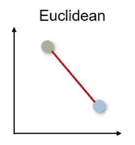

欧几里德距离也可以称为 L2 范数，计算如下:

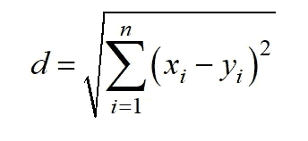

为了计算 Python 中向量之间的距离，我们可以使用

```
**from** scipy.spatial **import** distance
distance**.**euclidean(vector_1, vector_2)
```

欧几里德距离有两个主要的缺点。首先，距离测量不适用于比 2D 或 3D 空间更高维度的数据。第二，如果我们不[标准化和/或规范化我们的特征](/@jodancker/a-brief-introduction-to-feature-scaling-e396356937b8)，距离可能会由于不同的单位而偏斜。

## 曼哈顿距离

曼哈顿距离也称为出租车或城市街区距离，因为两个实值向量之间的距离是在假设一个向量只能以直角移动的情况下计算的。这种距离测量通常用于离散和二进制属性，以获得真实的路径。

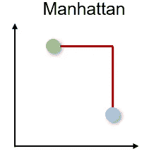

曼哈顿距离基于 L1 规范，计算公式如下:

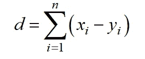

并且可以通过以下方式在 Python 中实现:

```
**from** scipy.spatial **import** distance
distance**.**cityblock(vector_1, vector_2)
```

曼哈顿距离有两个主要的缺点。首先，它不如高维空间中的欧几里德距离直观，其次，它不显示可能的最短路径。虽然这可能不成问题，但我们应该意识到更高的距离。

## 切比雪夫距离

切比雪夫距离也称为棋盘距离，因为它是两个实值向量之间在任何维度上的最大距离。距离测量通常用于仓储物流，其中最长的路径决定了从一个地点到下一个地点所需的时间。

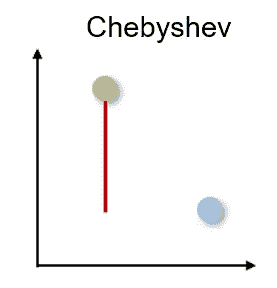

切比雪夫距离通过 L 无穷范数计算:

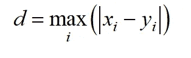

我们可以通过以下方式在 Python 中计算距离:

```
**from** scipy.spatial **import** distance
distance**.**chebyshev(vector_1, vector_2)
```

切比雪夫距离只有非常具体的用例，因此很少使用。

## 闵可夫斯基距离

闵可夫斯基距离是上述距离度量的一般化形式。因此，它可以用于相同的用例，同时提供高度的灵活性。我们可以选择 p 值来找到最合适的距离度量。

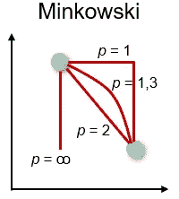

闵可夫斯基距离计算如下:

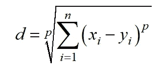

在 Python 中，我们可以通过以下方式确定距离:

```
**from** scipy.spatial **import** distance
distance**.**minkowski(vector_1, vector_2, p)
```

由于闵可夫斯基距离代表不同的距离度量，因此它具有相同的主要缺点，例如高维空间中的问题和对特征单位的依赖性。此外，p 值的灵活性也可能是一个缺点，因为找到正确的 p 值在计算上可能是低效的。

## 余弦相似度和距离

余弦相似性是由两个向量之间的余弦确定的方向的度量，其忽略了向量的大小。余弦相似度通常用于数据量不太重要的更高维度，例如，用于推荐系统或文本分析，其中数据由字数表示。

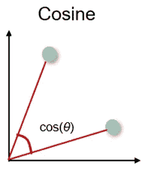

余弦相似度可以在-1(相反方向)和 1(相同方向)之间，计算公式如下:

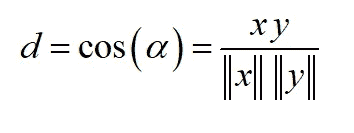

然而，余弦相似性通常用于范围在 0 和 1 之间的正空间。从 1 中减去余弦相似性的余弦距离位于 0(相似值)和 1(不同值)之间。在 Python 中，余弦距离可由下式确定:

```
**from** scipy.spatial **import** distance
distance**.**cosine(vector_1, vector_2)
```

余弦距离的主要**缺点**是不考虑矢量的大小，只考虑矢量的方向。因此，价值观的差异没有得到充分考虑。

## 哈弗线距离

哈弗线距离测量球面上两点之间的最短距离。因此，在点具有经度和纬度并且曲率有影响的情况下，距离用于导航。

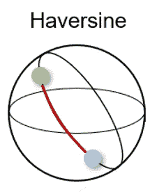

哈弗线距离可以由下式确定:

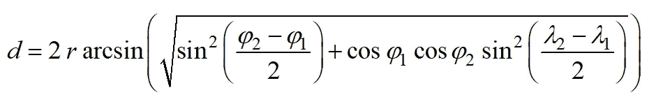

其中 *r* 是球体的半径 *φ* 和 *λ* 是经度和纬度。在 Python 中，可以使用以下公式确定哈弗线距离:

```
**from** sklearn.metrics.pairwise **import** haversine_distances
haversine_distances([vector_1, vector_2])
```

哈弗线距离的主要缺点是假设了一个球体，但这种情况很少发生。

## 汉明距离

汉明距离测量两个二进制向量或字符串之间的相异度。

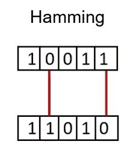

为此，对向量进行逐元素比较，并对差异数进行平均。如果两个向量相同，则结果距离介于 0 之间；如果两个向量完全不同，则结果距离介于 1 之间。

我们可以通过以下方式确定 Python 中的汉明距离:

```
**from** scipy.spatial **import** distance
distance**.**hamming(vector_1, vector_2)
```

海明距离有两大**劣势**。首先，距离度量只能比较相同长度的向量，其次，它不能给出差异的大小。因此，当差值的大小很重要时，不推荐使用汉明距离。

# 统计距离度量

统计距离测量可用于假设检验、拟合优度检验、分类任务或异常值检测。

## Jaccard 索引和距离

Jaccard 指数用于确定两个样本集之间的相似性。它反映了与整个数据集相比，存在多少一对一的匹配。Jaccard 索引通常用于二进制数据，以将用于图像识别的深度学习模型的预测与标记数据进行比较，或者基于单词的重叠来比较文档中的文本模式。

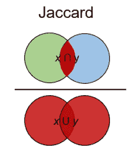

Jaccard 距离的计算公式如下:

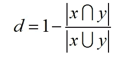

在 Python 中可以通过以下方式确定:

```
**from** scipy.spatial **import** distance
distance**.**jaccard(vector_1, vector_2)
```

Jaccard 索引和距离的主要**缺点**是它受到数据大小的强烈影响，即每个项目的权重与数据集的大小成反比。

## 索伦森-戴斯指数

s rensen-Dice 指数类似于 Jaccard 指数，因为它衡量样本集的相似性和多样性。然而，该指数更直观，因为它计算重叠的百分比。索伦森-戴斯指数常用于图像分割和文本相似性分析。

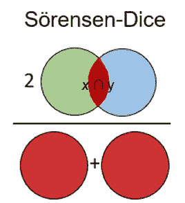

索伦森-戴斯距离由下式确定:

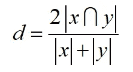

我们可以通过以下方式在 Python 中实现索引:

```
**from** scipy.spatial **import** distance
distance**.**dice(vector_1, vector_2)
```

索伦森-戴斯指数的主要缺点是它受到数据集大小的强烈影响。

# 动态时间扭曲

动态时间弯曲是度量两个不同长度时间序列之间距离的一种重要方法。有了这个，动态时间弯曲可以用于所有使用时间序列数据的用例，例如语音识别或异常检测。

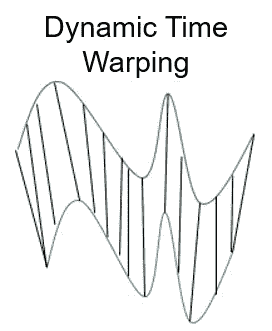

但是，为什么我们需要另一个时间序列的距离度量呢？如果时间序列不具有相同的长度或失真，则上述距离度量不能确定良好的相似性。例如，欧几里德距离计算每个时间步长的两个时间序列之间的距离。但是，如果两个时间序列具有相同的形状，但是在时间上发生了偏移，那么尽管时间序列非常相似，欧几里德距离将显示出很大的不同。

动态时间弯曲通过使用多对一或一对多映射来最小化两个时间序列之间的总距离，从而避免了这个问题。当搜索最佳比对时，这导致更直观的相似性度量。该距离通过弯曲路径来最小化，该弯曲路径通过动态规划找到，并且必须满足以下条件:

*   **边界条件:**扭曲路径在两个时间序列的起点和终点开始和结束
*   **单调性条件:**点的时间顺序被保留，避免时光倒流
*   **连续性条件:**路径转换限于相邻的时间点，避免时间跳跃
*   **翘曲窗口条件(可选):**允许点落入给定宽度的翘曲窗口
*   **坡度条件(可选):**扭曲路径的坡度受到限制，避免极端运动

要确定两个时间序列之间的距离，我们可以使用 Python 中的`fastdtw`包:

```
from scipy.spatial.distance import euclidean
from fastdtw import fastdtwdistance, path = fastdtw(timeseries_1, timeseries_2, dist=euclidean)
```

动态时间弯曲的一个主要缺点是，与其他距离测量相比，它的计算量相对较高。

# 结论

在这篇文章中，我简要介绍了十种常用的距离测量方法。我已经向您展示了它们是如何工作的，如何用 Python 实现它们，以及它们经常用于什么问题。

如果你认为我错过了一个重要的距离测量，请告诉我。

[](/mlearning-ai/mlearning-ai-submission-suggestions-b51e2b130bfb) [## Mlearning.ai 提交建议

### 如何成为 Mlearning.ai 上的作家

medium.com](/mlearning-ai/mlearning-ai-submission-suggestions-b51e2b130bfb)