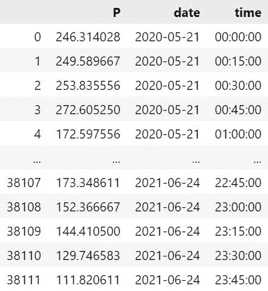

# 特征提取简介

> 原文：<https://medium.com/mlearning-ai/a-brief-introduction-to-feature-extraction-e0a6ae4371b?source=collection_archive---------4----------------------->

## 从时间序列中提取特征时，您应该尝试一个有用的工具


Photo by [Jake Hills](https://unsplash.com/@jakehills?utm_source=medium&utm_medium=referral) on [Unsplash](https://unsplash.com?utm_source=medium&utm_medium=referral)

您正在将原始时间序列数据用于监督或无监督学习模型，并且数据集太大而无法有效管理？还是你的学习模型速度相当慢？

那么你可能想更仔细地研究特征提取。在这篇文章中，我将简要介绍特征提取的目的、好处和挑战。最后，我将向您展示如何使用 Python 中的`tsfresh`包轻松地从时间序列数据中获得特性。

特征提取的目的是从原始数据集中提取信息丰富、相关且不冗余的特征。由此，特征提取与降维相关。例如，我们可以提取时间序列的趋势、季节性或峰度，或将原始数据转换为数值。

与直接使用原始数据集相比，特征提取具有以下优点。使用特征而不是原始数据改善了数据处理，并提高了我们的机器学习方法的学习速度，因为我们有一个更小的数据集。此外，当我们减少过度拟合的机会和更有效的模型构建时，我们通常会得到更好的结果。

然而，选择和组合特征是耗时且乏味的。我们需要识别可能的特征，提取特征，然后只使用需要的特征。最后一步非常重要，因为我们使用的每个功能都应该有助于改进我们的模型。

为此，我们需要对数据集有深刻的理解。因此，特征提取是一项重复的任务，是探索性数据分析和特征工程的结合。此外，拥有领域专业知识会有所帮助，因为这让我们更容易识别相关特性。最后，我们需要一个验证策略来检查每个特性在改进模型中的有效性。这样的策略应该比仅仅绘制和比较结果更加复杂和稳健。例如，我们可以构建一个基线模型，然后构建一个模型，在这个模型中，我们一个接一个地添加特性，并比较新模型是否比我们的基线模型有所改进。如果是，我们保留该特征，否则我们移除该特征。

# 时间序列特征提取

在深入研究时间序列的特征提取之前，我想简单地给你一些你应该记住的时间序列特征，除了常用的特征，如趋势、季节性、峰度和偏斜度，它们通常是检测模式的良好起点。

**日期时间特征:**这些可以由时间序列中每个观察的时间戳导出。例如，我们可以提取日、小时、工作日、假日等。使用 Python 的 [pandas datetime 功能](https://pandas.pydata.org/docs/user_guide/timeseries.html#time-date-components)可以很容易地提取这些特性。

**滞后和窗口特征:**有时值会受到先前时间步长值的影响。因此，检测到这样的模式，我们可以改进我们的模型。虽然很难确定这样的特征，但我们可以使用自相关来找到相互影响的值之间的正确滞后。

我们可以使用来自`pandas`或`numpy`的函数提取特征。或者，我们可以让我们的生活简单一点，通过使用`[tsfresh](https://tsfresh.readthedocs.io/en/latest/index.html)`来自动提取特征。

## 自动化特征提取

`tsfresh`是一个 python 包，可以自动计算几百个时间序列特征/特性。这些包括简单的特征，如最小值或中值，但也包括更复杂的特征，如相关性。该软件包还提供了评估每个特性的相关性/重要性的方法。我们可以通过运行`pip install tsfresh`来安装`tsfresh`。

我将向您展示如何使用基于电力负荷曲线时间序列的`tsfresh`。我的数据帧包含每个`day`在特定`time`的有功功率值`P`。如您所见，电力负荷曲线的分辨率为 15 分钟，涵盖了 2020 年 5 月下旬至 2021 年 6 月下旬之间的几天。



DataFrame of electricity load profiles in 15 min resolution.

为了提取时间序列的特征，我们需要运行`[extract_features()](https://tsfresh.readthedocs.io/en/latest/api/tsfresh.feature_extraction.html#)`函数，并将时间序列数据作为 DataFrame 传递。此外，我们需要指定我们的数据的数据格式。

由于数据帧中可以有多个时间序列，我们需要通过将列名传递给参数`column_id`来指示每个时间序列属于哪个实体。例如，在我的例子中，实体是天，因为我想提取每日电力负荷概况的特征。如果我想提取描述每个时间步载荷的特征，实体就是时间步。

当我们想要提取时间序列的特征时，根据时间对值进行排序是很重要的。为了确保时间序列被排序，我们将指示时间步长的列传递给参数`column_sort`。

该函数返回包含每个实体的所有提取特征的数据帧。

```
from tsfresh import extract_featuresextracted_features = extract_features(timeseries, column_id="date", column_sort="time", impute_function=impute)
```

通常，并不是所有的特征都能被计算出来，有些特征会带有`NaN`值。我们可以通过传递参数`impute_function`或者运行:

```
from tsfresh.utilities.dataframe_functions import impute

impute(extracted_features)
```

如果您不想提取所有可能的特征，因为您已经确定了哪些参数是相关的，或者您想要微调您的特征提取，您可以将带有相关特征的[字典](https://tsfresh.readthedocs.io/en/latest/text/feature_extraction_settings.html)传递给`default_fc_parameters`。例如，对于我的电力负荷曲线时间序列，我只想提取包括中值、平均值、最小值、最大值、峰度等特征。

```
fc_parameters = {'sum_values': None, 
'median': None,
'mean': None,
'standard_deviation': None,
'variation_coefficient': None,
'variance': None,
'skewness': None,
'kurtosis': None,
'last_location_of_maximum': None,
'first_location_of_maximum': None,
'last_location_of_minimum': None,
'first_location_of_minimum': None,
'maximum': None,
'minimum': None,
'number_peaks': [{'n': 1}, {'n': 3}, {'n': 5}, {'n': 10}]}extract_features = extract_features(timeseries, column_id="date", column_sort="time", impute_function=impute, default_fc_parameters=fc_parameters)
```

要查看您可以选择哪些功能，您可以通过运行以下命令来查看`tsfresh`的参数:

```
from tsfresh.feature_extraction import ComprehensiveFCParametersfc_parameters = ComprehensiveFCParameters()
```

## 自动化特征选择

在我们自动提取特征后，我们需要决定哪些是相关的。在这里，`tsfresh`也可以帮助我们，如果我们有一个目标向量。为此，`tsfresh`根据特征的[重要性识别特征，以预测目标](https://tsfresh.readthedocs.io/en/latest/text/feature_filtering.html)。例如，在我的例子中，目标向量可以是在对每日电力负荷分布图进行聚类之后的聚类标签。

我们可以通过使用`tsfresh`的`select_features()`函数过滤特性，并将目标向量作为 pandas Series 或 numpy 数组传递:

```
from tsfresh import select_featuresfeatures_filtered = select_features(extracted_features, target)
```

`tsfresh`不是分两步提取和过滤特征，而是允许我们一步完成特征提取和选择。为此，我们只需使用`extract_relevant_features`功能:

```
from tsfresh import extract_relevant_featuresextract_relevant_features(timeseries, y, column_id='date', column_sort='time')
```

# 结论

特征提取可以帮助您改进机器学习模型，因为我们使用信息和非冗余特征来减少数据集的大小。然而，特别是特征提取和特征选择可能非常繁琐和耗时，因为我们需要识别可能的特征并决定它们是否相关。因此，在本文中，我向您展示了一个 Python 包，它可以帮助您找到时间序列的相关特征。

如果你喜欢这篇文章和/或有任何意见，我很高兴听到它。

[](/mlearning-ai/mlearning-ai-submission-suggestions-b51e2b130bfb) [## Mlearning.ai 提交建议

### 如何成为 Mlearning.ai 上的作家

medium.com](/mlearning-ai/mlearning-ai-submission-suggestions-b51e2b130bfb)