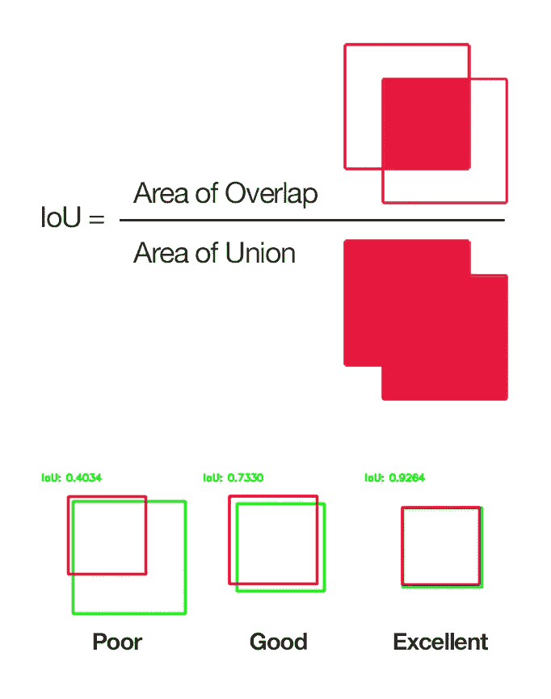
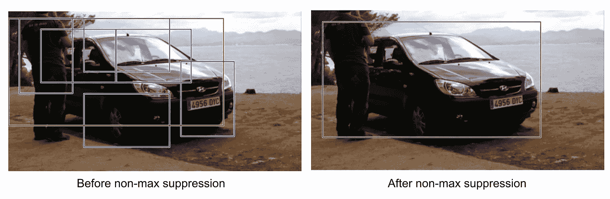
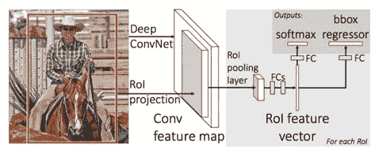
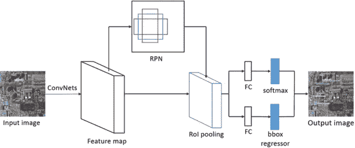
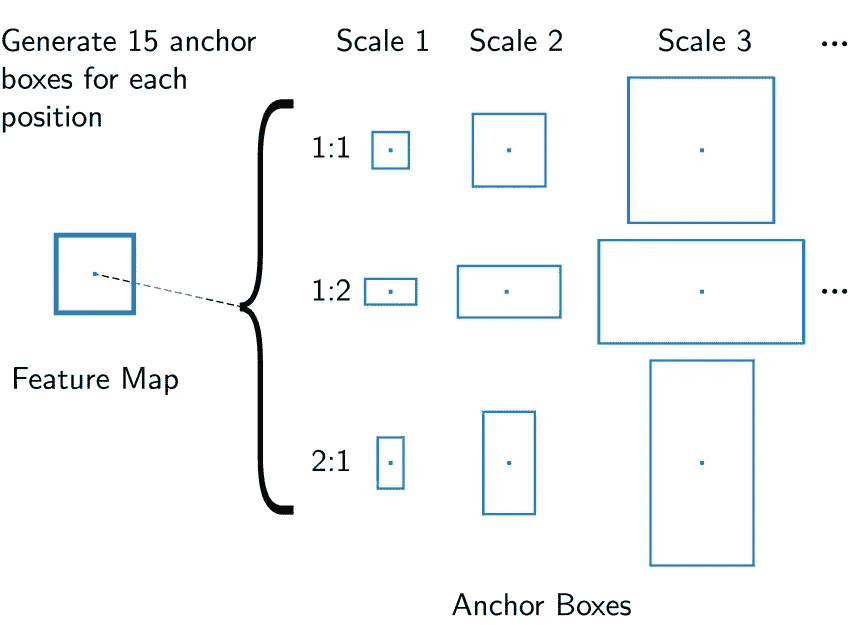
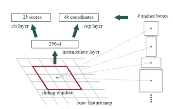

# R-CNN、快速 R-CNN 和更快 R-CNN 概述

> 原文：<https://medium.com/mlearning-ai/a-brief-overview-of-r-cnn-fast-r-cnn-and-faster-r-cnn-9c6843c9ffc0?source=collection_archive---------0----------------------->

## 基于区域的 CNN (R-CNN)

R-CNN 架构用于检测图像中对象的类别以及这些对象的包围盒。RCNN 架构已经被开发，因为在包含一个以上对象的视觉中，不能用 CNN 对一个以上的对象进行分类。

R-CNN 的一般工作原理分两步进行。首先，通过选择性搜索来确定视觉中可以找到对象的特征，然后在确定区域之后，将每个区域作为 CNN 模型的输入，并对类和边界框执行预测过程。

R-CNN Architecture

> 选择性搜索:
> 
> 它用于确定图像上应该捕获的区域。首先确定小区域。然后，相似的区域被组合以创建更大的新区域。该过程重复进行，在该过程中的每一步都创建更大的区域，然而，视觉中的对象实际上是聚集的。

在 R-CNN，我们使用选择性搜索来识别特定地区的候选人。每个候选区域作为不同 CNN 网络的输入。作为在区域岛上执行操作的结果，获得了大约 2000 个不同的区域，2000 个 CNN 网络用于所获得的 2000 个区域。通过使用来自这些网络的特征，利用 SVM 来确定对象的类别，并且通过回归来确定对象的边界框。

并集上的交集(IoU)分数指的是预测边界框的准确性。将获得的包围盒与真实包围盒进行比较，通过该比较过程，获得 IoU 分数。

> →边界框的预测区域和实际边界框区域的交集/边界框的预测区域和边界框的实际区域的组合

Intersection Over Union

> 非最大抑制:
> 
> 并非所有从图像中获得的区域都被使用。使用非最大值压缩技术来获得正确的区域。使用这种技术，获得的交集(IoU)分数大于 0.5 的边界框被保留，而其他边界框被抑制。如果为一个对象获得超过 0.5 个边界框，则使用具有最高 IoU 分数的边界框。

Non-Max Suppression Technique

## 快速 R-CNN

R-CNN 模型的成本相当高，因为每幅图像要提取近 2000 个不同的候选区域，每个区域使用不同的 CNN 网络。这些工艺步骤导致巨大的成本和长时间的培训。

由于这个原因，在 R-CNN 架构中为每个区域创建的不同 CNN 模型被移除，并且快速 R-CNN 架构被开发为对区域使用单个 CNN。与 R-CNN 不同，CNN、SVM 和回归器的使用得到了发展。结合 CNN、SVM 和回归器创建的架构与开发的模型一起表现得非常好。

Fast R-CNN

用 CNN 对整幅图像进行处理，得到特征图。收集区域建议所需的特征(区域建议特征地图)。然后，对获得的特征图应用最大池，并降低特征图的维数。执行最大池化过程的图层称为 RoI(感兴趣区域)池化图层。降维后的特征图被转换成一维向量，并作为 CNN 模型的输入。使用 Softmax，确定区域中对象的类别信息，同时确定对象的包围盒回归量。
*比 R-CNN 快 10 倍左右。*

## 更快的 R-CNN

因为在 R-CNN 和快速 R-CNN 中应用的选择性搜索在计算方面是昂贵的，所以在快速 R-CNN 中使用区域前向网络(RPN)。某些研究已经证明了 RPN 的使用效率。

任何大小的图像都可以作为输入。然后，该图像被作为 CNN 模型的输入。如果你用的模型是 VGG16，AlexNet 之类的模型，重建模型时不要在模型中使用全连通层。因为我们必须给出特征图作为 RPN 的输入，所以特征图也由卷积层产生。

Faster R-CNN

说到 RPN 我们需要知道的一个重要结构:锚盒。锚是不同比例和长宽比的盒子。当要创建的小网络在特征图上滑动时，根据锚在特征图中进行对象搜索。

Anchor Boxes Example

RPN 中的第一卷积层默认应用 3x3 的滤波器，输出通道的数量是 512。该 conv 图层将要素地图作为输入。卷积层的输出作为两个不同卷积层的输入给出。两者的滤波器大小都是 1x1。第一层是 cls，即分类层。cls 层通知我们在滑动窗口的位置是否有物体。这里应用了二元分类过程。在对象 1 的情况下，在没有对象 0 的情况下，在建模阶段，sigmoid 激活函数通常与卷积层一起使用。该层的输出通道数表示为 2 * 9，默认情况下 k 值为 9(因此第一层的滤波器大小为 3×3)，Cls 层的输出通道数应为 2 * k。Reg 层与 Cls 层并行工作。Reg 层负责绘制 Cls 中检测到的对象的边界框。因为它包含 4 个坐标信息，所以该层的输出通道数被表示为 4 * 9 (4 * k)。对于模型编码中的 Reg 层，conv 层优选线性激活函数。

RPN

总之，作为过滤过程的结果，RPN 的输出是标记为具有对象的锚盒。cls 图层中值为 0 的边界框被放入背景中。

RPN 之后的 RoI 层接收 RPN 的 cls 和 reg 层的输出作为输入，以及 RPN 作为输入的特征地图。RoI 层负责在全连接层之前使每个特征图的大小相同，这是更快的 R-CNN 的最后一层。由于来自 RPN 的区域推荐具有不同的大小(因为锚盒具有不同的比例和纵横比)，所以有必要产生具有固定大小的特征地图。RoI 层使用大小为 7x7 的最大池层。输出层数为 512。
RoI 后获得的值经过分类处理，在展平后作为输入提供给全连接层。在分类过程中，在回归器的帮助下创建被预测类别的对象的包围盒。

我希望我能够正确地传达 R-CNN、快速 R-CNN 和更快 R-CNN 的基本知识。感谢您的阅读！

资源:

1-[https://arxiv.org/abs/1506.01497](https://arxiv.org/abs/1506.01497)

2-[https://www.youtube.com/watch?v=iHf2xHQ2VYo](https://www.youtube.com/watch?v=iHf2xHQ2VYo)

3-[https://towards data science . com/r-CNN-fast-r-CNN-faster-r-CNN-yolo-object-detection-algorithms-36d 53571365 e](https://towardsdatascience.com/r-cnn-fast-r-cnn-faster-r-cnn-yolo-object-detection-algorithms-36d53571365e)

4-[https://www . hackere earth . com/blog/developers/object-detection-for-self-driving-cars/](https://www.hackerearth.com/blog/developers/object-detection-for-self-driving-cars/)