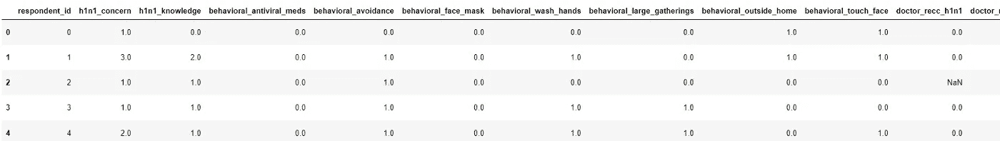
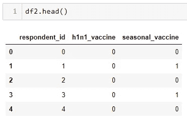
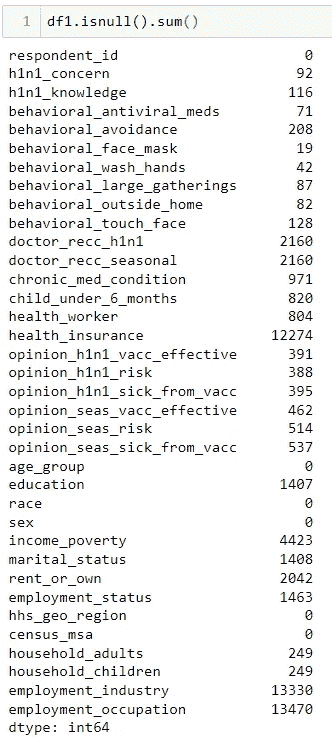
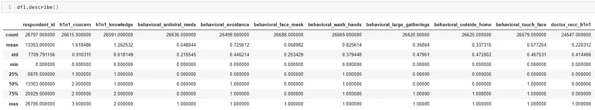
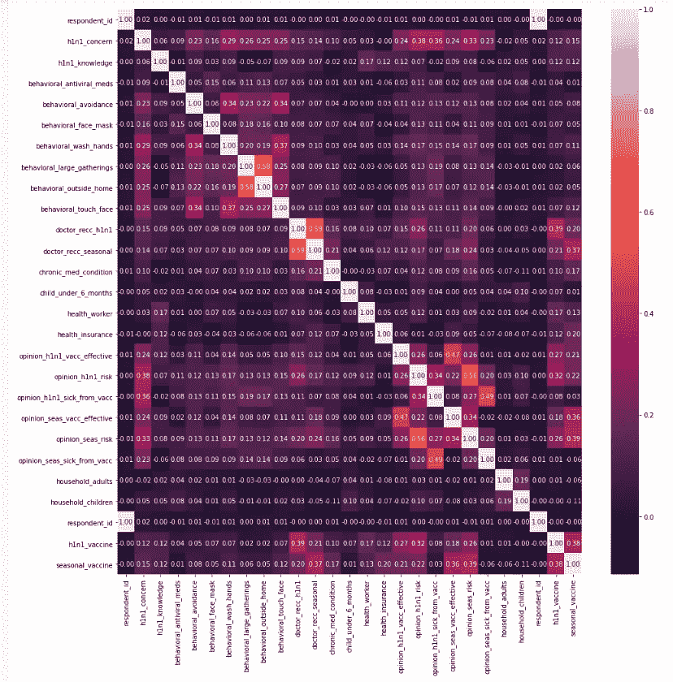
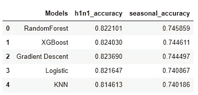

# 基于最大似然算法的疫苗接种预测比较研究

> 原文：<https://medium.com/mlearning-ai/a-comparative-study-on-vaccination-prediction-using-ml-algorithms-8a6cd1482958?source=collection_archive---------6----------------------->

本文由[阿尔帕斯兰·梅斯里](https://medium.com/u/fe99f0a4a612?source=post_page-----8a6cd1482958--------------------------------)和[黑尔·克孜尔杜曼](https://medium.com/u/233c859ccc6?source=post_page-----8a6cd1482958--------------------------------)撰写。

Pexels, [Pavel Danilyuk](https://www.pexels.com/@pavel-danilyuk/)

2009 年末和 2010 年初，美国通过电话进行了 H1N1 流感调查。在这项调查中，除了社会、经济和人口统计问题，受访者还被问及他们是否接种了 H1N1 疫苗或季节性流感疫苗。有了这些信息，就可以预测这些人是否接种了 H1N1 和季节性流感疫苗。
本研究是对未来研究的初步准备。作为一种方法，使用了 5 种分类算法。这些分别是；随机森林、XGBoost、梯度下降、逻辑回归和 KNN。为每种方法选择了 3 个相关性最高的独立变量，并在研究结束时给出了显示模型成功的比较表。

可在此处[访问病历报告和数据集。](https://github.com/simplextable/Flu_Shot_Learning_Predict_H1N1_and_Seasonal_Flu_Vaccines/tree/master/Hale)

首先，导入必要的库。

然后加载 csv 文件。df1 表的内容与下表中的内容相同。

数据集中有几个独立变量。

然后，查看包含独立变量的 df2 变量。在这个问题中，h1n1 _ 疫苗和季节性 _ 疫苗列需要被估计。

在下一步中，检查列中有多少数据丢失。

使用 Describe 函数可以快速浏览每一列的属性。

因变量和自变量组合在 united_df 变量中，以查看列之间的相关性。

检查关联热图时，与第一个目标变量 h1n1 疫苗关联度最高的列如下:

# doctor _ recc _ H1N1:0.39
# opinion _ H1N1 _ risk:0.32
# opinion _ H1N1 _ vacc _ effective:0.27
# opinion _ seas _ risk:0.26
# health _ insurance:0.22
# doctor _ recc _ seasonal:0.21

与第二个目标变量(季节性疫苗列)最相关的列如下:

# opinion _ seas _ risk:0.39
# doctor _ recc _ seasonal:0.37
# opinion _ seas _ vacc _ effective:0.36
# opinion _ H1N1 _ risk:0.22
# opinion _ H1N1 _ vacc _ effective:0.21
# doctor _ recc _ H1N1:0.2
# health _ insurance:0.2

除了这些高度相关的变量之外，h1n1 疫苗和季节性疫苗变量之间也有很高的相关性。然而，由于因变量不能用于估计过程，这些列的相关性被忽略。

在下面的代码块中，因变量被复制到变量 y。之后，df1 和 y 变量被 66% / 33%分割为训练和验证数据。在此过程之后，x_train 和 x_val 变量中的 nan 值被填充为平均值。

在下一步中，创建 x_train1 来预测第一个目标变量 h1n1_vaccine 列，而创建 x_train2 来预测第二个目标变量 seasonal_vaccine。只有 3 个与 df1 变量中的目标变量最相关的变量被添加到这些变量中。

创建比较表所需的变量，并添加到下一个代码块中。

为 h1n1 _ 疫苗调用并运行了 5 个机器学习算法。使用 append 函数将模型的准确度分数添加到 h1n1_accuracy 变量中。

为季节性疫苗调用并运行了 5 个机器学习算法。使用 append 函数将模型的精度分数添加到 search _ accuracy 变量中。

将 Model_accuracy_scores 变量制成数据帧，然后调用该数据帧。

结果如下:

虽然 XGboost 算法以 0.824030 的准确度分数(与其他算法相比的最佳方式)估计 h1n1 _ 准确度目标变量，但 KNN 算法表现最差，准确度分数为 0.814613。在 Seasonal_accuracy 中，Random forest 的表现最好，精度得分为 0.745859，而 KNN 的表现最差，精度得分为 0.740186。当我们查看准确性指标时，算法之间的得分差异非常小。

这篇文章是为了快速解决疫苗接种预测问题而准备的。这是更全面研究的第一步。在未来的研究中，可以使用不同的指标、不同的自变量选择技术、模型参数优化和叠加技术。

资源:

*   1:[https://www . driven data . org/competitions/66/flu-shot-learning/](https://www.drivendata.org/competitions/66/flu-shot-learning/)
*   2:[https://www . pexels . com/photo/white-surface-5998512/](https://www.pexels.com/photo/syringe-and-capsules-on-white-surface-5998512/)

 [## Mlearning.ai 提交建议

### 如何成为 Mlearning.ai 上的作家

medium.com](/mlearning-ai/mlearning-ai-submission-suggestions-b51e2b130bfb)