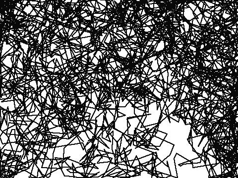

# 从头开始和 sklearn 线性回归的比较

> 原文：<https://medium.com/mlearning-ai/a-comparison-of-made-from-scratch-and-sklearn-linear-regression-9933b2b55cd4?source=collection_archive---------8----------------------->

我一直在看 Edureka 关于数据科学的视频，并一直在研究线性回归，这是最简单的估计算法之一。在这个视频中完成的一个目标是从头开始制作一个线性回归模型，然后将其与 Python 的机器学习库 sklearn 中的线性回归模型进行比较。