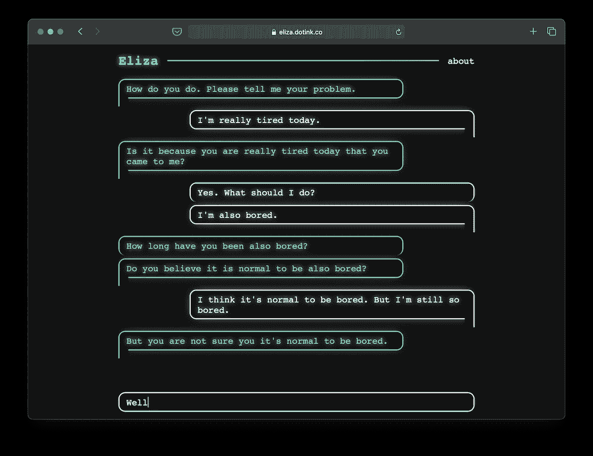
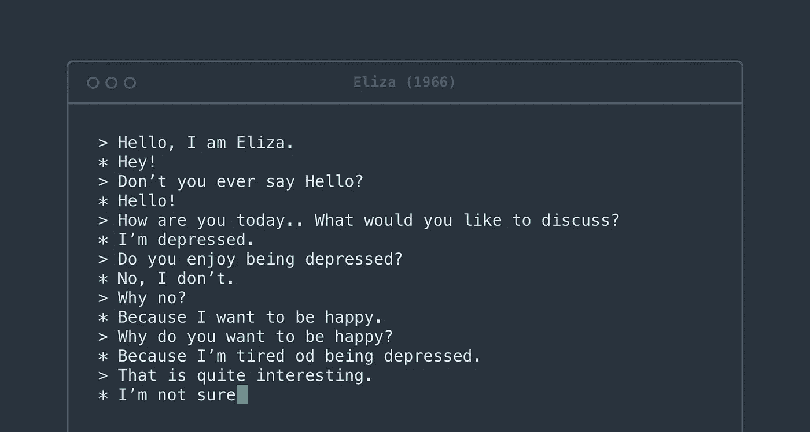
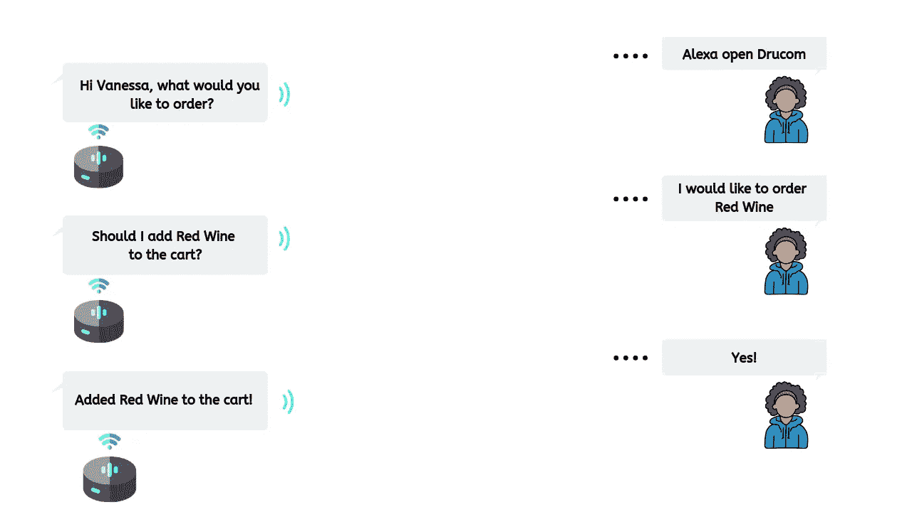
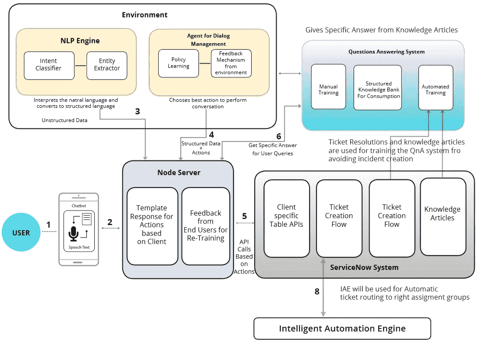

# 聊天机器人综合指南第一部分——自然语言处理和架构

> 原文：<https://medium.com/mlearning-ai/a-comprehensive-guide-on-chatbots-part-i-nlp-and-architecture-cdc9897f65e7?source=collection_archive---------1----------------------->

了解深度学习和基于规则的聊天机器人是如何工作的

E.g., A Conversation with ELIZA

# 介绍

在过去的十年里，深度学习的技术和创新迅速发展。大型公司、组织和政府机构经常使用这些技术，因为它提供了更好、更快的客户体验。如今，几乎每个不同领域的大型公司都使用聊天机器人来改善客户体验。

# 聊天机器人的类型

在我们深入研究聊天机器人之前，我们需要了解它们是如何工作的。通常有两种不同类型的聊天机器人——我们可以将它们指定为

1.  基于规则的聊天机器人
2.  基于机器学习的聊天机器人

## 基于规则的聊天机器人

基于规则的聊天机器人需要显式编程。它们只能在预定义的框架内与终端用户通信，并且在流畅通信方面效率低下。因为这种方法更为传统，许多企业今天仍然依赖于基于规则的聊天机器人。最早的基于规则的聊天机器人之一 ELIZA 是由麻省理工学院人工智能实验室的 Joseph Weizenbaum 于 1966 年编写的。

Example dialogue with ELIZA, source: [https://blog.infermedica.com/introduction-to-chatbots-in-healthcare/](https://blog.infermedica.com/introduction-to-chatbots-in-healthcare/)

## 基于机器学习的聊天机器人

相反，机器学习驱动的聊天机器人经过训练，可以找到几个句子和单词结构之间的相似性和关系。这些聊天机器人不需要显式编程；他们需要特定的模式来理解用户并产生反应(例如模式识别)。最后，需要理解自然语言处理技术的复杂性。我将在接下来的章节中介绍它们。

通常，聊天机器人有三个主要的程序属性:

1.  实体—被定义为最终用户生成的用于与聊天机器人通信的上下文。
2.  意图—最终用户在键入问题或陈述时心中的目标。
3.  回应——聊天机器人对用户意图的回答。

A conversation example with Alexa

# 自然语言处理

它是以自然语言的形式产生有意义的短语和句子的过程。它涉及到文本规划、句子规划和文本实现。文本规划包括从知识库中检索相关内容。句子规划包括选择需要的词，形成有意义的短语和设置句子的语气。语篇实现是将句子计划映射成句子结构的过程。

有两大类自然语言处理(NLP)算法:传统和深度学习。传统的 NLP 涉及大量的编程。它通常用于设计和开发基于规则的聊天机器人。您必须预测用户在每个上下文中可能说的单词和短语，识别语音模式，提取预定义的关键字，等等。换句话说，有很多规则，很多*正则表达式*。*编写*和*调试*这些程序要花很多时间。当用户偏离预期路径时，这些规则很快就会失效。这就是许多聊天机器人不便于在高质量技术产品中实际实现的原因。我们必须建造数以百万计的智能虚拟助手，能够维护自然语言对话。

# 设计原理

这些目标通过分层决策过程来实现，该决策过程可以使用 [*马尔可夫决策过程*](https://en.wikipedia.org/wiki/Markov_decision_process) 来构建。例如，为了保持对用户的吸引力，微软的小冰可以表现为不同的对话模式，包括随意聊天、预订酒店等。每种对话模式都由相应的技能来处理。例如，对话可以被视为一个分层的决策过程:顶层过程控制整个对话并选择适当的技能，而底层过程则相应地产生响应和行动。

这个过程可以用 [*马尔可夫决策过程*](https://en.wikipedia.org/wiki/Markov_decision_process) 来开发，其中人类用户就是环境。在每一步，聊天机器人将当前对话状态作为输入，并基于分层对话策略输出技能或响应。然后，它从用户那里获得奖励，并进入下一个状态。聊天机器人的目标是找到最佳策略和技能，使回报最大化。

# 体系结构

对话式(基于机器学习的)聊天机器人可能有不同的架构结构，这取决于许多因素。这些因素可能与后端、数据库和服务器结构中使用的技术不同。通常，对话聊天机器人是基于以下架构构建的——其中系统被划分为必要的子系统，这些子系统相互补充。

System Architecture

## NLP 引擎

NLP 引擎是核心组件，它解释用户在任何给定时间所说的话，并将语言转换为系统可以进一步处理的结构化输入。由于聊天机器人是领域特定的，它必须支持这么多的功能。NLP 引擎包含先进的机器学习算法来识别用户的意图，并进一步将它们与机器人支持的可用意图列表进行匹配。

它还有两个组成部分；

1.  意图分类器——意图分类器接受用户的输入，识别其含义，并与聊天机器人支持的意图之一相关联。
2.  实体提取器—实体提取器从用户的查询中提取关键信息。

## 节点服务器

处理来自用户的流量请求并将其路由到适当组件的服务器。流量服务器还将来自内部组件的响应路由回前端系统。

首先，节点服务器处理系统其他组件之间的数据流量。

## 问答系统

问答系统的根本目标是回答用户的常见问题。系统解释该问题，并用从知识库中检索的相关答案进行响应。它有两个主要组成部分:

1.  **手动培训** —涉及领域专家创建常见用户问题列表并映射其答案。这有助于机器人快速识别最重要问题的答案。
2.  **自动训练** —主要是将公司的文件，如政策文件和其他 Q & A 类文件提交给 bot，并要求其进行自我训练。该引擎从这些文档中得出一个问题和答案列表。

## 对话管理代理

它管理对话的实际上下文。例如，用户可能会说“他需要点冰淇淋”，机器人可能会接受订单。然后，用户可能会说“将其更改为咖啡”，这里用户指的是他之前下的订单，机器人必须正确地解释这一点，并在与用户确认之前对他之前下的订单进行更改。对话管理插件使我们能够做到这一点。该组件有两个主要的子系统；

1.  **反馈机制——T**代理不时从用户那里获取反馈，以了解聊天机器人的对话方式是否相关，以及用户对其回应是否满意。这*强化了*机器人从错误中学习，并在未来的对话中自我修正。
2.  **策略学习—** 策略学习是一个更高级的框架，它教导机器人在对话过程中采取更多愉快的方式，以提高最终用户的整体满意度。

# 结论

到目前为止，我们已经讨论了聊天机器人的架构和理论组件。在接下来的部分，我们将讨论如何实现我们所知道的。

# 参考

1.  Dasagrandhi，C.S .(未注明日期)。*了解对话聊天机器人架构*。[在线]blog.vsoftconsulting.com。可在:[https://blog . vsoft consulting . com/blog/understanding-the-architecture-of-conversational-Chatbot #:~:text = Chatbot % 20 architecture % 20 is % 20 the % 20 heart 获得。](https://blog.vsoftconsulting.com/blog/understanding-the-architecture-of-conversational-chatbot#:~:text=Chatbot%20architecture%20is%20the%20heart.)
2.  ‌Kibble 河(2013 年)。自然语言处理导论。[在线]伦敦大学国际课程出版办公室 32 罗素广场伦敦 WC1B 5DN 英国:伦敦大学，第 5–90 页。地点:【https://www.london.ac.uk/. 
3.  黄，谢(2021)。聊天机器人:设计、架构和应用。顶点论文。第 4-41 页。
4.  Goodfellow，Ian，等人深度学习。马萨诸塞州剑桥，麻省理工学院出版社，2016 年。

 [## Mlearning.ai 提交建议

### 如何成为 Mlearning.ai 上的作家

medium.com](/mlearning-ai/mlearning-ai-submission-suggestions-b51e2b130bfb)