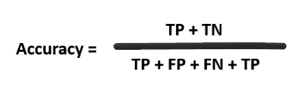
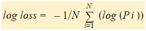

# 分类评估指标综合指南

> 原文：<https://medium.com/mlearning-ai/a-comprehensive-guide-to-classification-evaluation-metrics-ba814a20aa08?source=collection_archive---------6----------------------->


Photo by [Myriam Jessier](https://unsplash.com/@mjessier?utm_source=unsplash&utm_medium=referral&utm_content=creditCopyText) on [Unsplash](https://unsplash.com/s/photos/data-science?utm_source=unsplash&utm_medium=referral&utm_content=creditCopyText)

# 什么是评估指标？

模型评估指标是定义来检查/验证模型是否能够按照期望的水平执行的指标。定义了许多指标，根据使用案例，我们挑选最适合的指标。基于该度量，模型被评估，并且如果需要的话被重新训练。

# 最常见的分类指标是什么？

对于分类算法，有 6 个最常用的指标，如下所述-

1.  准确(性)

在计算精度之前，我们先来看一个叫做混淆矩阵的矩阵。

混淆矩阵是一个矩阵，允许您可视化分类机器学习模型的性能。下面是一个片段，展示了如何生成混淆矩阵-

```
from sklearn.metrics import confusion_matrixcf_matrix = confusion_matrix(y_test, y_pred)
print(cf_matrix)70/3
67/6
```

实际— — — — — — TP / FP

预测————TN/FN

混淆矩阵创建了这四个象限的矩阵-真阳性、真阴性、假阳性和假阴性。

> 真阳性(TP)是模型正确预测阳性类别的结果。
> 
> 真阴性(TN)是模型正确预测阴性类别的结果。
> 
> 假阳性(FP)是模型错误地预测阳性类别的结果。
> 
> 假阴性(FN)是模型错误预测阴性类别的结果。

> 我们希望我们的模型关注真正的积极和真正的消极。
> 
> 准确性是一个度量标准，它给出了我们的模型正确预测的比例。从形式上看，准确性有以下定义:

准确度=正确预测数/预测总数。



什么时候不应该使用精确度？

尽管准确性是一个很好的衡量标准，但当数据集不平衡时，它就不能使用了。在这种情况下，让我们说我们有一个随机模型，总是预测有利于多数阶级。该模型将具有很高的准确性，即使它没有从数据中学到任何东西！

2.精确

当我们想关注正面预测能力时，下一个指标就派上用场了。

Precision 给出了所有预测为阳性的结果中被正确识别为阳性的部分。

精度= TP/TP+FP

```
from sklearn.metrics import precision_score
precision_score(y_true, y_pred)
```

3.回忆(敏感度)

回忆给出了您在所有阳性中正确识别为阳性的比例。

召回= TP/TP +FN

```
from sklearn.metrics import recall_score
recall_score(y_true, y_pred)
```

在精确度和召回率之间有一个权衡，因为通常增加一个会导致减少另一个，反之亦然。

因此，有另一个指标同时考虑了这两个指标。

4.F1-分数

F1 分数被定义为精确度和召回率之间的调和平均值。

我们使用调和平均值，因为它对高精度或高回忆值不太敏感。因此，F1 值更倾向于具有相似精度和召回率的分类模型。

F1 = 2 *(精度*召回)/(精度+召回)

```
from sklearn.metrics import f1_score
f1_score(y_true, y_pred)
```

5.AUC ( **曲线下面积** ) ROC ( **受试者操作特征**)曲线。

AUC-ROC 曲线是在各种阈值设置下对分类问题的性能测量。ROC 是概率曲线，AUC 代表可分性的程度或度量。它告诉我们这个模型在多大程度上能够区分不同的类。AUC 越高，模型预测 0 类为 0 和 1 类为 1 的能力越强。

下面的代码片段显示了 AUC ROC-的实现

fpr 代表假阳性率——定义在测试过程中，在所有可用的阴性样本中有多少不正确的阳性结果。

tpr 代表真阳性率——定义测试期间所有可用阳性样本中出现正确阳性结果的数量。

```
from sklearn import metrics
fpr, tpr, thresholds = metrics.roc_curve(y_true, y_pred)
metrics.auc(fpr, tpr)
```

6.原木损失

Log Loss 是每个实例的校正预测概率对数的负平均值。

在逻辑回归中，我们以概率的形式得到预测。校正概率是正面结果的概率。

**计算原木损失，有如下所述的三个步骤-**

> 找出正确的概率。
> 
> 记录下修正后的概率。
> 
> 取第二步中得到的负平均值。

当我们记录修正后的概率时，我们会得到很多负值，所以我们取这些值的**负平均值**，以维持一个普遍的约定，即损失分数越低越好。

[](/mlearning-ai/mlearning-ai-submission-suggestions-b51e2b130bfb) [## Mlearning.ai 提交建议

### 如何成为 Mlearning.ai 上的作家

medium.com](/mlearning-ai/mlearning-ai-submission-suggestions-b51e2b130bfb)