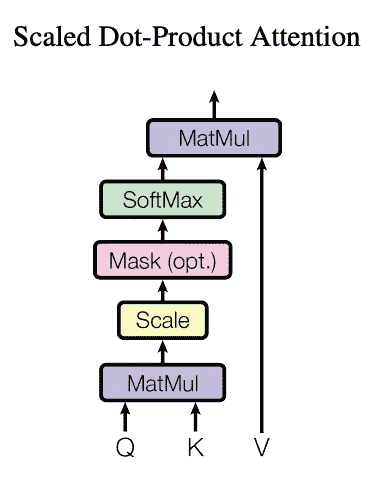
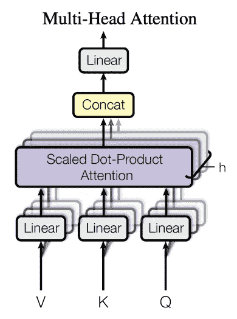

# 变压器综合指南(第一部分:编码器)

> 原文：<https://medium.com/mlearning-ai/a-comprehensive-guide-to-transformers-part-1-the-encoder-187f6b58bce0?source=collection_archive---------1----------------------->

## 对颠覆 NLP 的模型的深入研究(带代码)

Photo by [Randy Jacob](https://unsplash.com/@randvmb?utm_source=medium&utm_medium=referral) on [Unsplash](https://unsplash.com?utm_source=medium&utm_medium=referral)

递归神经网络在 2017 年年中非常棒。他们能够做一个成功的序列模型应该做的一切，尽管有一些缺点。然后变形金刚([注意力是你需要的全部](https://arxiv.org/pdf/1706.03762.pdf))出现了，很快 NLP 中的每一个最先进的模型都是变形金刚。最近，随着 OpenAI 的 [ImageGPT](https://openai.com/blog/image-gpt/) 和 [DALL-E](https://openai.com/blog/dall-e/) ，变形金刚也越来越多地被用作图像的自回归模型。越来越清楚的是，变形金刚是非常通用的模型，可以应用于许多任务，而不仅仅是文本。让我们先从高层次了解一下变压器的工作原理。

# 高级直觉

考虑转换器最简单的方式是编码器-解码器模型，它可以处理序列内部和序列之间的成对连接。这意味着转换器可以理解任何两个序列之间的联系，只要它们在编码器和解码器端的标记之间有某种联系。例如，这意味着转换器可以很容易地在任何两种语言之间进行翻译，因为每种语言在句子中的单词之间都有关系。另一个例子是如何使用变压器自回归预测图像中的下一个像素。

这也被证明在字幕模型中有效，例如[网状记忆变压器](https://arxiv.org/pdf/1912.08226.pdf) (Cornia *et。艾尔。*)其中转换器在图像中的对象和英语语言之间进行翻译。由于图像中的对象有成对的关系，所以 transformer 非常适合这项任务。稍后将会清楚为什么变形金刚对成对连接的序列很有用。

# 深潜

现在让我们进入变压器的内部。转换器的特征在于其不同的训练和推理过程。在训练期间，它同时计算所有输出，而在推理期间，它顺序计算输出，与传统的 RNNs 没有什么不同。然而，在训练过程中，RNN 会花费更多的时间，变形金刚可以使用他们的新架构来加速训练，变得更有效率。在本文中，我们将深入讨论编码器架构，而在下一篇文章中，我们将讨论解码器以及编码器和解码器之间的关系。下面的代码是一个在英语和德语之间转换的转换器。

> 接下来的所有代码都取自这里的[和](https://github.com/bentrevett/pytorch-seq2seq/blob/master/6%20-%20Attention%20is%20All%20You%20Need.ipynb)，并将进行深入解释。

我们将从进口开始。当它们出现时，我会一一解释。

下一个单元格处理随机播种。这个单元格确保所有随机调用在笔记本开始时是一致的。

我们在这里下载 spacy 词汇表(如果你愿意，你可以改变语言，但是现在我们使用德语)。

在这个单元中，我们使用标记化函数来获取两种语言中的一个句子，并将其分解成单词。

下面的单元格有 torchtext 字段对象。field 对象是一个非常通用的工具，可用于创建词汇表，将单词转换为整数标记索引，以及将标记索引转换为单词。本质上，它为您提供的所有单词创建了一个查找表，每个单词恰好对应一个令牌索引。以这种方式，不是将字编码为非常稀疏并且会浪费存储器的独热向量，而是将其编码为单个整数，作为其对应的独热向量中的 1 的索引。参数 *batch_first* 意味着转换器的输入将是【T4(N，S)】的形状，其中 *N* 是批次大小， *S* 是序列长度。

现在我们可以加载数据了。对于这个特定的示例，我们将加载 Multi30k 数据集，并将字段设置为我们之前指定的字段。这样，当我们创建训练、测试和验证数据集时，它们将与我们的自定义字段一起预构建。有了数据之后，我们可以用数据集中的词汇初始化字段。 *min_freq* 参数只是一个过滤器，任何在数据集中只出现一次的单词都不会包含在词汇表中。当模型遇到一个对它来说是陌生的单词时，它会用一个 *< unk >* 标记来表示它。

下面是初始化设备、批处理大小和迭代器的代码(在 torchtext 中它们被称为迭代器，而在 torch 中它们被称为数据加载器)。与我们上面初始化的数据集不同，迭代器不能被索引，所以在训练期间，通常对它们调用一个 *enumerate()* 。我们使用的这种特殊类型的迭代器叫做桶迭代器。本质上，它将数据(句子)分成几批，这样需要的填充量最少。为什么我们需要衬垫？简单地说，因为所有的句子长度不一样，把它们分成几批需要我们在较短的句子上加一些填充。

现在我们开始研究构成转换器的方法和类。我们从这个*positionwiseedforward layer*类开始，它由两个线性层组成。它的目的是将输入维度( *hid_dim* )转换成一个大得多的维度( *pf_dim* )，然后将其转换回未来层的输入维度。论文中没有提到这背后的原因，但这背后的直觉是，引入更多的神经元可以刺激模型在相同的维度上表示不同的信息。之后，应用一个脱落层来阻止过度拟合。输入大小为 **(N，S，H)** ，其中 *N* 为批量大小， *S* 为序列长度， *H* 为隐藏维度大小。在两个完全连接的层之间，隐藏尺寸将改变为 *pf_dim* 大小，并在最后一个完全连接的层之后恢复为 *H* 。

# 注意力

变形人模型的 DNA，多头注意力允许变形人推断句子中标记之间的关系。要理解多头注意力，首先必须理解成比例的点积注意力。

Source: [Attention Is All You Need](https://arxiv.org/pdf/1706.03762.pdf)

在比例点积注意中，输入由一个查询矩阵、一个键矩阵和一个值矩阵组成。接下来，将查询矩阵和转置的关键字矩阵相乘。这导致大小为 **(N，Q，H)****(N，H，K)** = **(N，Q，K)** ，其中 *Q* 和 *K* 分别是查询序列和键序列的长度。直观上，这种乘法产生了查询序列中的元素和关键字序列中的元素之间的 2D 映射，提供了查询序列和关键字序列中的所有单词之间的关系的表示。在这之后，这个点积图通过 softmax 在 keys 维度上运行，它实际上压缩了 0 和 1 之间的值，以表示模型应该关注一对令牌的程度。然后，这个注意力矩阵乘以值矩阵，值矩阵通常与关键矩阵的大小相同，这给出了最后的大小 **(N，Q，H)** 。我们可以用一个浓缩的例子来理解正在发生的事情:如果我们使用一个英语句子作为查询，一个德语句子作为关键字，那么注意力将代表每个英语单词与每个德语单词的对应程度。当它与德语句子相乘时，它代表了每个英语单词与德语单词相比应该被赋予的重要性。另请注意，输入大小和输出大小是相同的，允许这些关注层相互堆叠。以上是对这种注意力的直观描述。

Source: [Attention Is All You Need](https://arxiv.org/pdf/1706.03762.pdf)

多头注意力是规模点积注意力的一种更为进化的类型，它使用多个头部，类似于 CNN 中的多个过滤器，以鼓励模型理解查询和键序列之间的多种类型的成对连接(考虑到值通常与键相同)。首先，输入通过三个相应的线性层。请注意，线性图层的大小是相同的，但实际图层本身是不同的。这种关注的主要亮点是，输入 *Q* 、 *K* 和 *V* 的 *hid_dim* 方面被分成两个维度，一个是头的数量，另一个是 *head_dim* (如下面的代码所示)*。*这实质上是将每个向量分成 *h* 个向量，每个向量的大小都是 *head_dim* 。正常比例的点积注意力也有一个关键的区别。就在 softmax 之前，查询和密钥的乘积除以 *head_dim 的平方根。*根据论文作者的说法，这可以防止点积的结果变得太大，抵消消失梯度。在计算完所有的头部之后，它们被连接起来，并且最终的线性层被应用到这个输出。在下面的代码中，有一个掩码参数，对于编码器来说，它只是将所有带有 *pad_token* 的索引设置为基本的 *-inf* ，因此当调用 softmax 时，这些值变成 0。这防止了模型关注填充标记，填充标记会使训练和推断不一致。

# 编码器

下面是 EncoderLayer 类，它包含编码器所包含的大部分操作。它从自我关注层开始，本质上是发现输入序列中的单词如何与自己相关联。然后，应用图层归一化，使每个要素的平均值为 0，标准差为 1。接下来，如前所述，应用位置式前馈层。应用另一层标准化，编码器层完成。大量使用层规范来防止过度拟合，这是此类大型神经网络的一个大问题。

Encoder 类既涉及 EncoderLayer 类，也涉及用位置编码将单词标记序列转换成特征向量。用 *nn 将输入序列中的每个索引转换成一个 *hid_dim* 大小的向量。嵌入()*类。 *nn。Embedding()* 是用向量表示整数值的查找表。这类似于将一个热点向量转换成每个单词的学习特征向量。此后，由于模型没有位置感，使用相同的 *nn 对输入进行位置编码。Embedding()* 使用的令牌嵌入。之后，使用填充索引作为注意掩码，遍历编码器层堆栈。它的输出是一个编码的输入序列，其中包含有关多头自关注输入序列的信息。在下一篇文章中，我们将讨论解码器如何工作，以及编码器如何馈入解码器。

# 结论

简单地说，变压器是一个复杂的网络。复杂到需要多篇长文才能解释透彻。然而，它的复杂性不仅仅是一个借口，而是它允许变压器理解和操作序列前所未有的模式。由于 ML 中无数的任务都可以用序列来表示，所以 transformer 开始统治这个领域也就不足为奇了。请务必关注即将推出的第 2 部分！