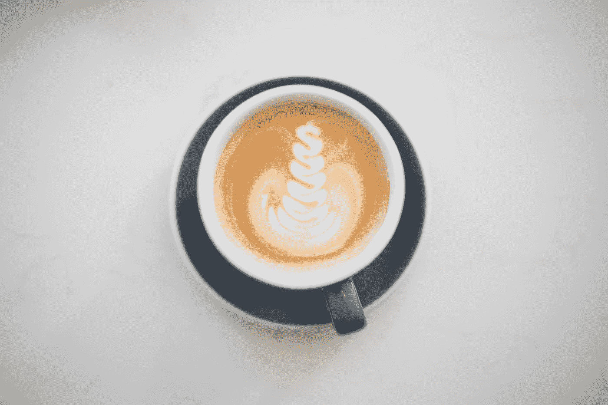
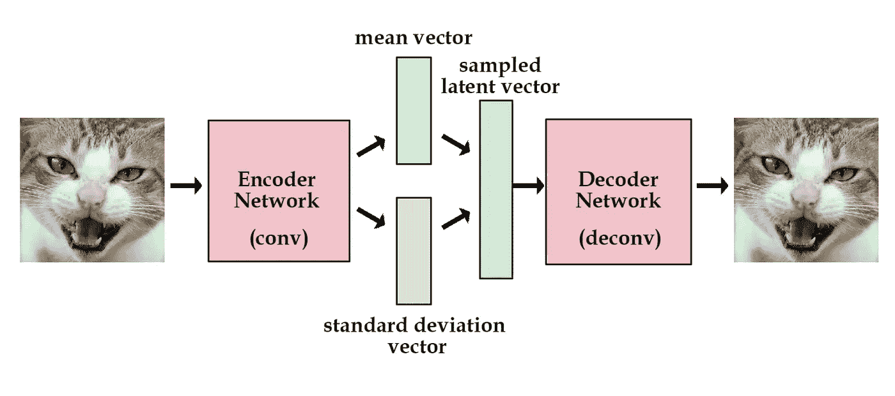
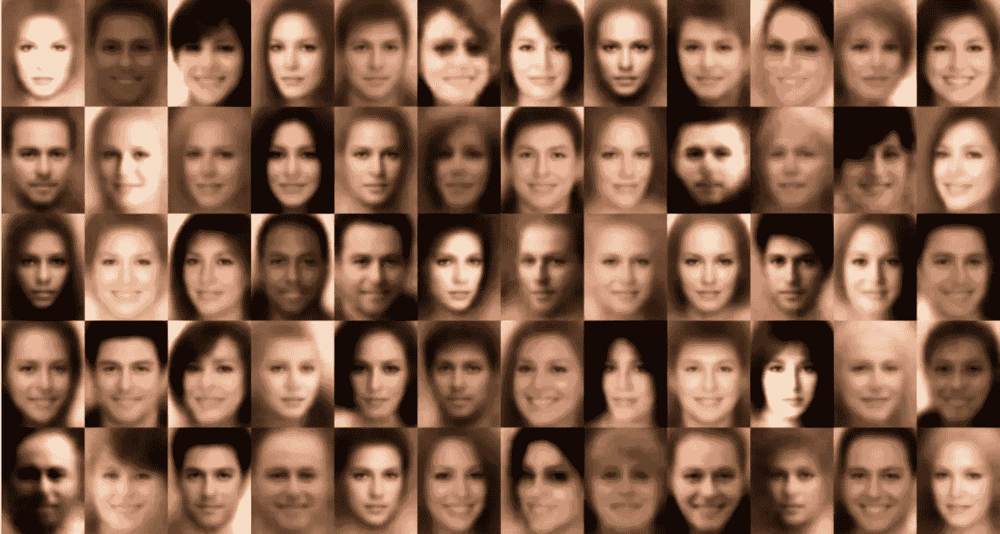
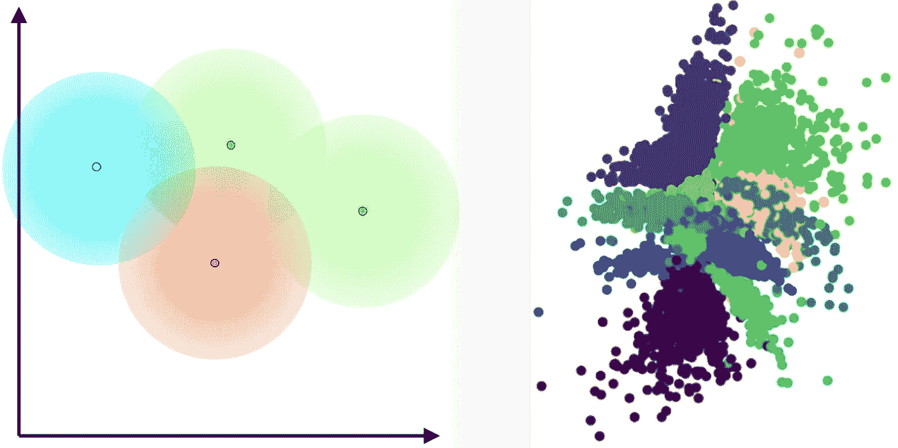
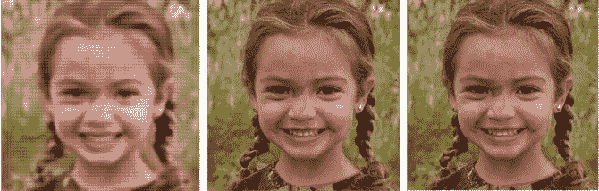

# 关于瓦斯、VQ 瓦斯和 VAE 甘斯的速成班

> 原文：<https://medium.com/mlearning-ai/a-crash-course-on-vaes-vq-vaes-and-vae-gans-3fdcc40b059e?source=collection_archive---------1----------------------->

*完全理解我在半年的培训中学到的东西*

Photo by [Glen Jackson](https://unsplash.com/@glenjjackson?utm_source=medium&utm_medium=referral) on [Unsplash](https://unsplash.com?utm_source=medium&utm_medium=referral)

# 介绍

在过去的半年里，我一直在尝试深度学习中不同的生成模型，或者更具体地说，不同类型的 vae。简而言之， **V** 变量**A**uto**E**n 编码器是一个能够复制图像的生成模型，并随之生成图像的潜在向量，这些向量可用于训练其他神经网络或潜在空间操纵。对于普通或普通的 VAE，我曾尝试从 ImageNet 生成高质量的图像，但却意识到它根本无法在潜在空间中生成这些类型的图像(主要是因为每个输出看起来都像一个土豆)。

然后我发现了 VQ-VAE，它通过使潜在空间离散而不是连续，解决了我在正常 VAE 中遇到的潜在空间问题。除此之外，我们还有 VAE GAN，它结合了 VAE 和 GAN 的优点，可以生成超逼真的图像。现在，当然，我们可以更进一步，把所有的首字母缩略词组合成一个 VQ-VAE-GAN，但这只是包括了其他网络的所有概念，不需要它自己的解释。

此外，VQ-VAE 可以获得与 GAN 相当的结果，并且还可以生成更高质量的内容，因此 VAE-GAN 在这一点上几乎已经变得多余。此外，VAEs 更容易训练，因此在未来，它们可能几乎专门用于图像重建任务，如生成、潜在空间操作和文本到图像的生成。

# VAE

香草 VAE 是最著名的生产模式之一(除了甘)。它有三个部分，由下采样、通常称为 *z* 的潜在向量和上采样组成。下采样通常由卷积组成，上采样或者是转置卷积，或者是包含正常上采样和保留了上采样的空间维度的卷积的块。然而，使用卷积的上采样通常比普通的转置卷积产生更平滑的结果。

Illustration of a VAE (Source: [http://kvfrans.com/content/images/2016/08/vae.jpg](http://kvfrans.com/content/images/2016/08/vae.jpg))

在这些回旋之间，我们找到了潜在向量，这是 VAE 的标志。潜在向量是卷积输出的均值和标准差的组合(如上图所示)。在给定随机潜在向量的情况下，该潜在向量可用于生成随机图像(类似于 GAN ),但尤其用于图像处理。这意味着在理想情况下，你可以得到一个戴眼镜的人的潜在向量，减去戴眼镜的潜在向量，并解码这个潜在向量，得到不戴眼镜的同一个人。这是 VAEs 没有被 GANs 取代的原因之一，因为这种潜在的空间操纵。这个潜在空间是连续的，这意味着任何点都可以被采样，并且结果被训练得尽可能精确。

损失函数是 VAE 最有趣的部分之一。存在正常的均方误差损失来计算图像的像素值的差异，但是除此之外还有 KL 发散损失。简单地说，KL 散度是潜在空间的“标度”。如果潜在空间太大，会导致潜在空间中出现空白，从而导致那里的结果不准确。当潜在空间太小时，会出现类似的问题。KL 损失旨在优化潜在空间的缩放，本质上使其连续，给予 VAE 其名称的变化部分。

Randomly generated face images from a vanilla VAE (source: [Wojciech Mormul on Github](https://github.com/WojciechMormul/vae)).

以上是 VAE 生成的一些图像。由于潜在空间的连续性，图像具有比典型 GAN 更平滑的边缘，这使得图像不太真实。当我试图在 ImageNet 上使用 VAE 时，这个问题表现得更加明显，每个图像开始看起来越来越像一个土豆，很明显，香草 VAE 不适合这种工作。在 KL 项变为 0 的地方，VAE 也遭受后部坍缩。这就把我们带到了我们对 VAE 的第一次修改，它的作者是 [*Oord 等人。艾尔。*](https://arxiv.org/abs/1711.00937) 称为 VQ-VAE 或矢量量化的 VAE。

> *注意:这是对 VAE 发生的事情的一种极其浓缩的直觉，许多人都写过很棒的文章，比如约瑟夫·罗卡的这篇文章* *更深入地讲述了 VAE 内部发生的事情。*

# VQ-VAE

VAE 进化的下一步是重现香草 VAE 的标志，即潜在空间。这并不意味着删除潜在空间，它只是允许它是离散的，而不是连续的，因此得名矢量量化部分。下面的图片是这些潜在空间的可视化。

latent spaces of VAE vs VQ-VAE

这表明了 VAE 和 VQ-VAE 之间的根本区别。潜在空间中的点在 VQ-VAE 中是离散的，但在 VAE 中是连续的。

但是等等，如果我们把潜在空间离散化，难道不会使输出不切实际吗？这就是我们包括一个函数来计算最近的嵌入，或者潜在空间中最近的采样点。这解决了模糊输出的问题，因为如果 VQ-VAE 从它训练过的点采样，那么它自然会更清晰。

然而，这里存在一个问题。如果 VAE 仅从其已训练的点进行采样，则它将仅输出看起来像训练集中的图像的图像。我们可以通过围绕训练集中的每个点在训练期间添加表面点来解决这个问题。为简单起见，我将这些点称为周围点。我们可以把我们加的周围点数叫做 *k* ，通常设置为 512 或者 256。在训练时，这些周围的点是用训练数据来训练的，所以它们和原始点一样锐利和准确。

与普通 VAE 相比，VQ-VAE 的损失函数基本保持不变。然而，不需要 KL 发散损失，因为最近的嵌入函数解决了这个问题。这解决了 VAE 后塌的问题，因为没有 KL 项变为零。然而，我们确实需要矢量量化的损失，或者帮助微调潜在空间中周围点的值的损失。这有助于潜在空间更持续地发挥作用，同时仍然保持生成图像的良好质量。

vanilla VQ-VAE | state of the art VQ-VAE (VQ-VAE 2) | ground truth

根据我的经验，这种类型的 VAE 工作得很好，足以将整个 ImageNet 包含在其潜在空间中，这意味着它可以为任何时间点拍摄的任何图像重建并返回相对准确的潜在向量。对我来说，这个模型已经足够好了，对于许多图像质量不像图像内容那样重要的应用程序来说，它可能也足够好了。与 GAN 不同，这也更容易训练并且可以容易地再现。令人惊讶的是， [VQ-VAE 2 在图像质量和多代多样性指标上超过了大甘](https://syncedreview.com/2019/06/06/going-beyond-gan-new-deepmind-vae-model-generates-high-fidelity-human-faces/)。不过，另一种获得相同结果的方法是使用 GAN 的鉴别器。

# VAE 甘

虽然 GANs 能够生成超现实的图像，有时甚至可以愚弄人类(见[哪张脸是真实的](http://www.whichfaceisreal.com/))，但你可能仍然需要 VAE 的某些部分，如潜在空间，来生成具有预期特征的图像。为此，我们只需在 VAE 的转置卷积后插入 GAN 的鉴别器。我们在 VAE 的损失函数中增加了鉴别器损失分量，以帮助图像变得更清晰、更真实。然而，根据我的经验，这通常比普通的 VQ-VAE 更难训练，而 VQ-VAE 通常更适合大多数应用。

# 结论

当甘斯车开始加速前进时，VAE 车被远远甩在后面，因为它的图像质量较低，被认为是次等的车型。然后，当 VQ-VAE 被设计出来时，这种情况发生了变化，因为 VQ-VAE 产生的图像与甘斯所产生的图像不相上下，而且有许多甘斯所没有的优点。现在，研究人员可以精细地控制生成的图像的内容，而不会影响图像的质量。希望现在您对不同类型的 vae 有了全面的了解，并对生成模型内部发生的事情有了一些基本的了解。非常感谢您的阅读，祝您阅读愉快。