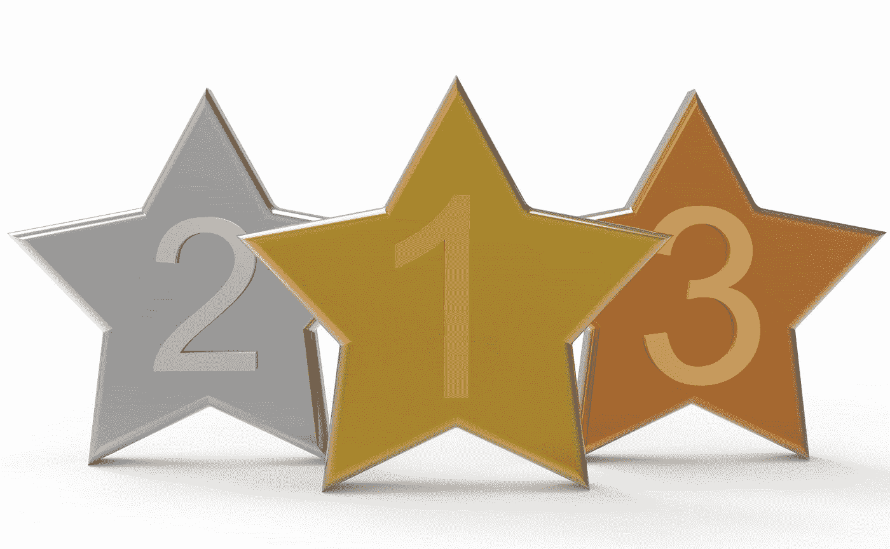

# 一位数据科学家参加了她的第一次 Kaggle 竞赛，以赢得奖金

> 原文：<https://medium.com/mlearning-ai/a-data-scientist-entered-her-first-kaggle-competition-to-win-prize-money-64bdf7ee20c1?source=collection_archive---------4----------------------->

我已经使用 Kaggle 数据科学网站一年了，参加比赛，参加它的微型课程。我参加的所有比赛都是为刚进入这个领域的人准备的，所以我还没有一个很好的机会利用这个平台来提高我的技能水平。这样做的原因是，虽然 Kaggle 擅长张贴…