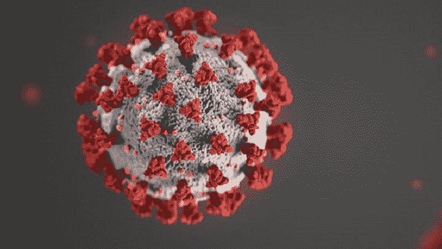

# 一名数据科学家观察南非的第三波冠状病毒

> 原文：<https://medium.com/mlearning-ai/a-data-scientist-looks-at-south-africas-third-wave-of-the-coronavirus-ab5a4e0a299d?source=collection_archive---------2----------------------->

疫情冠状病毒是困扰世界的一件事。尽管疫苗已被生产出来作为针对该病毒的预防措施，但疫苗在几个国家的缓慢推广，加上该病毒已变异成更具传染性和更危险的变种这一事实，已成为疫情将成为…