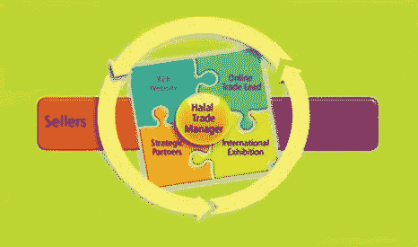

# 数据科学家首次尝试 ka ggle 2021 年 6 月的表格竞赛

> 原文：<https://medium.com/mlearning-ai/a-data-scientists-first-attempt-at-kaggles-june-2021-tabular-competition-5cf52409bf72?source=collection_archive---------2----------------------->

对于那些关注 Kaggle 竞赛的人来说，他们在 2021 年每个月都有一个表格竞赛，所以我决定在我还在学习 Python 的时候，我应该能够做到这一点。上个月，我在 2021 年 5 月的 Kaggle 表格竞赛中获得了一枚铜牌，我写的关于这个主题的帖子的链接可以在这里找到…