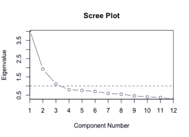

# 对因子分析的深入研究

> 原文：<https://medium.com/mlearning-ai/a-deep-dive-into-factor-analysis-d64e550c358f?source=collection_archive---------2----------------------->

对于任何数据科学家来说，大量不必要的数据集都是一场噩梦，因为有几个属性会影响机器学习算法的性能。因此，降维技术对于减少我们可以进一步用于分析的属性数量是必要的。

在这篇文章中，我将讨论**因子分析**，一种降维技术，并给出这种统计技术的概述。因子分析工作的基本轮廓；何时以及如何在数据集中使用因子分析都将在内容部分讨论。

如果你想了解降维的概况，可以参考[这篇博客](https://elemento.medium.com/dimensionality-reduction-c4727ad078e6?source=user_profile---------0-------------------------------)。

# 介绍

因子分析是一种**无监督**、**概率机器学习算法**用于降维。它旨在将相关变量重新组合成更少的潜在变量，称为**因子**，它们共享一个共同的方差。因子分析的主要目的是通过一组公共因子(因子的数量少于 n 个变量)找到 n 个变量之间的相互关系。简单地说，它将变量分成有意义的类别。

因子分析基于潜在因子在低维空间的思想。新的观测值被建模为潜在变量加高斯噪声的线性变换。

# 因子分析的先决条件

为了获得准确的结果，我们应该在应用因子分析之前检查以下先决条件-

*   我们应该对**大型数据集**进行因子分析，以减少最终结果中的误差。应该有**高因子加载分数** ( > 0.80)才能在小数据集上使用因子分析。
*   因素和变量之间的*相关性*应该至少为**0.30，**因为任何低于这个值的值都意味着变量之间的弱关系。
*   需要检查数据集的 *SMC(平方多重相关)*，存在奇点问题的变量，即 **SMC 接近 0** 和多重共线性问题，即 **SMC 接近 1.0，**应从数据集中**移除**。
*   我们也应该从数据集中移除 o 个**个**个。
*   数据集应该是**标准缩放的，**我们应该将分类特征转换为数字特征。

# 假设

1.  **没有完美的多重共线性**:因子分析是一种相互依赖的技术。
2.  **同方差:**由于因子分析是测量变量的线性函数，所以不需要变量之间的同方差。

# 术语

在学习应用因子分析的方法之前，让我们简要地看一下本文后面使用的基本术语。

## 1.因素

该因子是一个潜在的(隐藏的或未观察到的)变量，代表具有共同方差的相关变量。因子的最大数量等于变量的数量。

## 2.特征值(特征根)

特征值表示给定主成分可以解释的总方差。方差不能为负，因此负特征值意味着模型不正确。相反，接近零的特征值表示多重共线性，因为第一个分量可以吸收所有方差。例如，特征值 2.5 意味着该因子将解释 2.5 个变量的方差。

## 3.因素负荷

因子负荷是变量和因子的相关系数。这是一个衡量变量对因子贡献大小的指标。因此，高因子加载分数意味着变量更好地考虑了因子的维度。

## 4.社区

公度是每个变量的平方负荷的总和。它表示每个变量的变化量。如果特定变量的公因子很低，比如说在 0-0.5 之间，那么这表明该变量不会对任何因子产生显著影响。旋转对变量的公度没有任何影响。

# 因子分析的实施

因子分析涉及的各个步骤是:

1.  *检查因子分析的可因子性*
2.  *决定因素数量*
3.  *解读因素*

让我们一个一个地详细介绍每个步骤。

# 因子分析的可因子性

检查数据集的可分解性意味着‘我们能在数据集中找到因子吗？’。检查可分解性的方法有

1.  *相关矩阵检查*
2.  *KMO 海事安全局检查*
3.  *巴特利特球形度试验*

## 相关矩阵检查

给定的数据集是高低相关性的组合吗？如果是，那么我们可以继续进行因素分析。

## KMO MSA 支票

**Kaiser-Meyer-Olkin 抽样充分性度量**测试变量之间的偏相关是否较小。它是一种统计，说明由潜在因素引起的变量中的方差比例。高值，即接近 1，表示因子分析对数据集有帮助。如果该值小于 0.5，则不应进行因子分析。

## 巴特利特球形试验

它测试相关矩阵是单位矩阵的假设。它将进一步表明变量是不相关的，因此，因子分析在这里是不适用的。如果该值小于 0.05，则可以继续进行因子分析。本质上，它检查变量之间的某种冗余，我们可以用几个因素来总结。测试的**零假设**是**变量是正交的**，即不相关。

# 确定因子的数量

如果我们提取太多的因子，那么可能会出现不希望的误差方差。另一方面，去除一些因素可能会遗漏有价值的公共方差。因此，选择最可行的方法来确定要提取的因子数是至关重要的。

主要是，**特征值**和**碎石测试，**即碎石图，确定要保留的因子数量。特征值是一种分析方法，而碎石图是一种图解方法。让我们详细看看这两种方法。

## 分析方法

这种方法也被称为 ***凯泽准则*** 。在这种方法中，特征值为 1 以上的所有因子都被保留。大于 1 的特征值意味着因子比唯一变量能解释更多的方差。选择特征值大于 1 的因子的原因很简单。我们的数据是标准比例的，所以特征的方差也是 1。我们得到了比单个观察变量更能解释方差的因素。

人们发现，这一标准有时会导致过高估计提取的因子的数量。因此，更好的方法是将**筛屑试验与**分析法结合使用。

## 碎石试验(图解方法)

图形方法是基于因素特征值的可视化表示，称为 scree 图。

[**来源**](https://en.wikipedia.org/wiki/Scree_plot) **的图像**

scree 图由特征值和因子组成。要保留的因子数是留在图形“肘部”的数据点。图的肘点是特征值趋于平稳的地方。

scree 图由特征值和因子组成。要保留的因子数是图形“肘部”左侧的数据点图表的拐点是特征值趋于平稳的地方。

# 解释这些因素

在找到最佳数量的因子后，我们需要借助因子负载、共性和方差来解释这些因子。对因素的解释对于确定因素中变量之间关系的强度是必不可少的。

我们可以通过最重要的**负载**来识别这些因素。零载荷和低载荷用于确认因素的识别。加载的符号表明相关性的方向不影响因子加载的大小或要保留的因子数量的解释。加载分数范围从-1 到 1。接近-1 或 1 的值表示该因子影响这些变量。相反，如果加载值相对于 0 更大，则因子对变量的影响更小。

如果因子分析未旋转，那么**方差**将等于特征值，因为旋转改变了比例方差的分布，保持累积方差不变。

**公度**是因子解释的每个变量方差的比例。旋转对变量的公度没有任何影响。较高的公度表明因子解提取了变量中更大数量的方差。为了更好地测量因子，分析公度应为 0.4 或更大。

# 旋转因子分析

应用旋转和因子分析并不能固有地提高导出因子的预测值。尽管如此，它确实有助于更好地可视化和解释这些因素，因为未旋转的因素有时是模糊的。

旋转有两种: ***正交旋转*** & ***斜向旋转*** 。

正交旋转是指因子彼此旋转 90 度。两种标准正交技术是 ***Quartimax*** 和 ***Varimax*** 旋转。Quartimax 涉及最小化解释每个变量所需的因素数量。Varimax 减少了每个因素中高负荷变量的数量，并使小负荷变得更小。

斜旋转是指各因素之间没有旋转 90 度。标准的斜旋转手法有 ***直接 Oblimin*** 和 ***Promax*** 。直接 Oblimin 试图简化输出结构，而 Promax 是权宜之计，因为它在较大的数据集中速度很快。Promax 包括将载荷提高到 4 的幂，这最终导致因素之间更好的相关性，并实现简单的结构。斜旋转的唯一问题是它使因素相互关联。

# 额外资源

*   在这篇文章中，我省略了因子分析的数学模型和推导过程，因为这会使文章变得冗长，但是如果你感兴趣，可以查看下面的链接

[https://www . cs . Princeton . edu/~ bee/courses/scribe/LEC _ 10 _ 02 _ 2013 . pdf](https://www.cs.princeton.edu/~bee/courses/scribe/lec_10_02_2013.pdf)

*   Scikit learn 还在其用户指南中解释了因子分析背后的数学原理。一定要去看看。

 [## 2.5.将信号分解成分量(矩阵分解问题)

### 主成分分析用于将多元数据集分解成一组连续的正交分量，这些分量解释了一个最大的…

scikit-learn.org](https://scikit-learn.org/stable/modules/decomposition.html#factor-analysis) 

*   有关旋转因子分析的实施，您可以查看 scikit learn 用户指南。

 [## 因子分析(带旋转)以可视化模式

### 研究虹膜数据集，我们看到萼片长度、花瓣长度和花瓣宽度高度相关。萼片…

scikit-learn.org](https://scikit-learn.org/stable/auto_examples/decomposition/plot_varimax_fa.html#sphx-glr-auto-examples-decomposition-plot-varimax-fa-py) 

你好👋

我是一名有抱负的研究员，对机器学习&深度学习深感兴趣。希望这篇文章对你有用。😇

 [## Mlearning.ai 提交建议

### 如何成为 Mlearning.ai 上的作家

medium.com](/mlearning-ai/mlearning-ai-submission-suggestions-b51e2b130bfb)