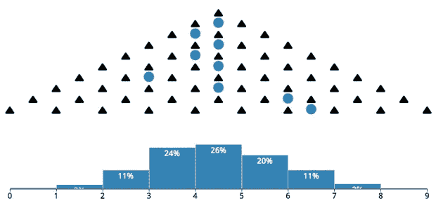
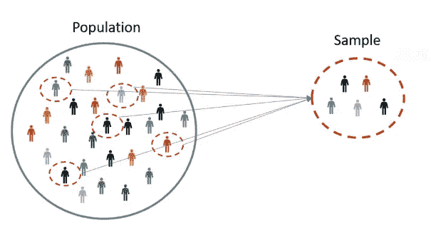
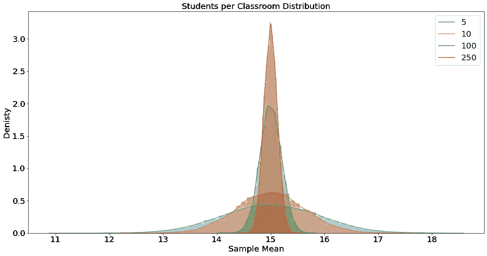
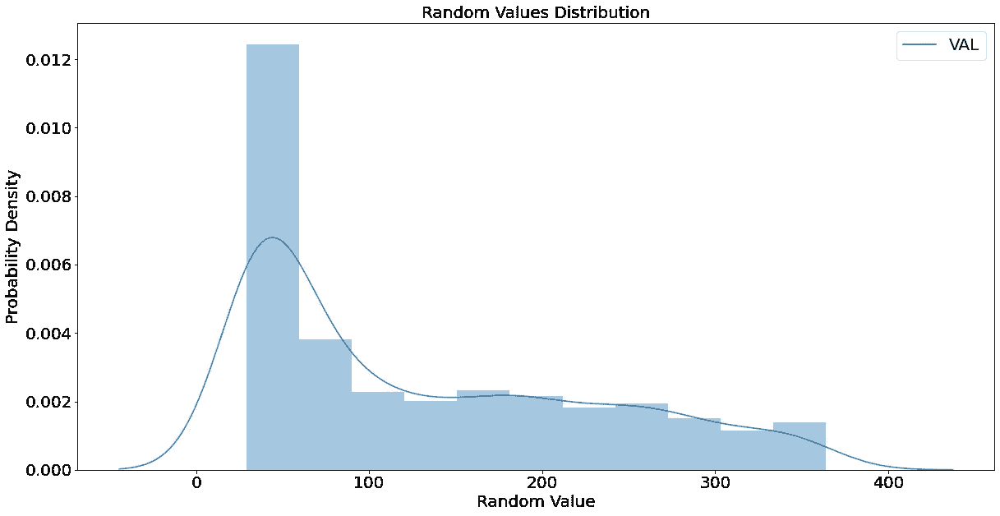
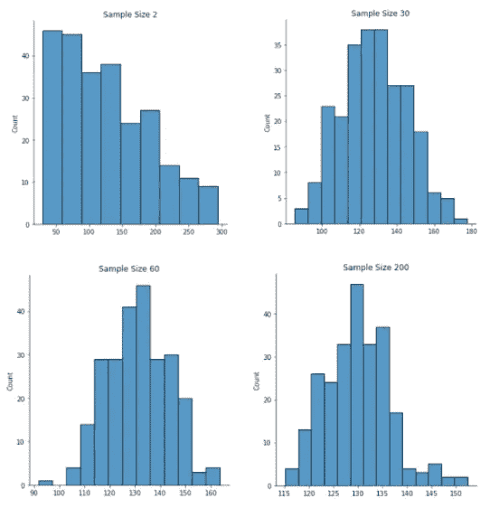

# 深入探究中心极限定理

> 原文：<https://medium.com/mlearning-ai/a-deep-dive-into-the-central-limit-theorem-aa25c8b50336?source=collection_archive---------5----------------------->



# 摘要

1.  主题:**中心极限定理**
2.  主题:**用于分析的统计数据**
3.  技能: **Python 获取数据**
4.  工具: **Jupyter 笔记本，Python**
5.  **目标:**

*   描述统计推断中总体和样本之间的关系。
*   定义中心极限定理(CLT)并应用数据分析技巧使用 Python 和 Jupyter Notebook 评估 CLT。
*   理解并讨论 CLT 在数据分析中的应用。
*   做一个练习，用一个真实的例子来强化 CLT 的概念。

# 统计推断:总体与样本

*以下程序将定义统计推断，传达其重要性，并提供一个示例来强化概念。*

**统计推断**是根据从总体中抽取的较小样本来了解总体的过程。



*Image Source:* [*https://cdn-images-1.medium.com/max/605/1*dF6v-rXH3Zp4M7jU9ifUFg.png*](https://cdn-images-1.medium.com/max/605/1*dF6v-rXH3Zp4M7jU9ifUFg.png)

在上图中，人口在左边，人口样本在右边。**群体**包含所有感兴趣的样本。**样本**是人口的一个较小子集，应随机抽取，以代表人口的所有人口统计数据。箭头表示构成样本的总体中随机选择的元素。**样本大小(n)** ，代表样本中元素的数量。上图的样本大小是 5，即 n=5。

样本大小( *n* )可以是任何大小，但应该足够大以表征总体。可以从总体中取出一个以上的样本，而且很多时候应该从总体中取出一个以上的样本，这称为样本数。样本的数量不应与样本中元素的数量(n)相混淆。在定义中心极限定理时，将详细讨论适当的样本大小和样本数量。

如果样本代表总体，那么我们就可以“推断”从样本中获得的测量值对总体是真实的。这被称为统计推断，我们假设人口可以用一个潜在的概率分布来统计描述。然后，我们根据样本计算统计数据，对总体参数进行推断。

**举例:**如果我们想知道生活在美国的人的平均身高。

1.  我们对居住在美国的人口进行了抽样调查。
2.  我们计算样本的平均高度，并确定估计总体参数 x 的统计量。

**关键外卖**

这里的关键要点是，样本(通常表示为(n))是总体的一个子集。由于收集整个人口的数据并不总是现实或可行的，因此可以收集随机样本来提供人口的推断统计分析。理解这个推论能多好地代表总体是中心极限定理的美妙之处。

# 引入中心极限定理(CLT)

以下程序将定义中心极限定理，建立其统计值，提供一个交互式代码，同时使用 Jupyter Notebooks 作为 python 解释器，并提供 CLT 在数据分析中的用例。

**中心极限定理**指出，如果我们对替换总体重复取样，随着取样数量的增加:

1.  样本均值将接近等于总体均值，与样本大小无关。


在哪里，

μx =样本平均值

μ =总体平均值

2.样本均值的标准差将接近等于总体均值除以样本大小的平方根。


在哪里，

σx=样本标准偏差

σ =总体标准偏差

n =样本量

3.如果总体是正态的，那么样本均值将具有与样本大小无关的正态分布。

4.如果总体不是正态分布，但样本量大于或等于 30，则样本均值的抽样分布接近正态分布。

陈述 1 和陈述 2 都假设你已经从总体中选择了每一个可能的样本，或者基本上你已经选择了足够的样本来接近上述为真的方程。当给定从样本计算的参数，推断关于总体的参数时，这些方程是有用的。

为了更好地理解语句 3 和 4，我们将从 Jupyter 笔记本开始我们的代码！

## 中心极限定理代码

请在您首选的 web 浏览器中打开 Jupyter Notebook，并跟随我完成以下步骤。

1.  **首先我们需要导入我们的标准库。您应该熟悉每个库及其用途。如果没有，请参见之前相应的课程**。

```
#Importing standard libraries 
import numpy as np #used for random number generator
from scipy.stats import norm #extension of numpy for stat analysis
from scipy.stats import gamma #extension of numpy for stat analysis
import pandas as pd #used for data manipulation
import matplotlib.pyplot as plt #used for quick plotting
import seaborn as sns #used to plot distributions
import warnings #used to ignore displot warning
warnings.filterwarnings('ignore')
```

**2。现在我们已经导入了必要的库，让我们开始学习中心极限定理的陈述 3。声明 3 指出:**

*如果总体是正态的，那么样本均值将具有与样本大小无关的正态分布。*

为了测试这一点，我们将使用 Jupyter Notebook 从各种样本大小的正态分布中生成随机样本。目标是看每个样本大小的分布是否如 CTL 声明 3 中所述保持正态。

让我们假设我们的数据是正态分布的，并给出整个加州每个教室的学生人数，总体均值μ = 15，𝝈标准差= 2。为了确定 CLT 陈述 3 是否成立，我们将选取 5、10、100 和 250 个样本。对于每个样本大小，我们将总共抽取 20，000 个样本，并计算每个样本的样本均值 x。然后我们将这些样本均值绘制成分布图。

第一步是为每个样本大小定义一个大小为 20，000 的数组，并为我们的总体分布参数μ和 sigma(𝝈).赋值

```
#Define an array for 20,000 samples per each sample size 
samples_5 = np.zeros(20000) 
samples_10 = np.zeros(20000) 
samples_100 = np.zeros(20000) 
samples_250 = np.zeros(20000)#Defining parameters from our population distribution
mu, sigma = 15, 2
```

下一步是为每个样本大小创建一个 for 循环，它将从正态分布中输出随机值，然后计算每个样本的平均值。

```
#Defining parameters from our population distribution
mu, sigma = 15, 2#Creating for loop for sample size 5
for a in range(20000):
    sample = np.random.normal(mu, sigma, 5)
    x_bar_5 = sample.mean()
    samples_5[a] = x_bar_5#Creating for loop for sample size 10
for b in range(20000):
    sample = np.random.normal(mu, sigma, 10)
    x_bar_10 = sample.mean()
    samples_10[b] = x_bar_10#Creating for loop for sample size 100
for c in range(20000):
    sample = np.random.normal(mu, sigma, 100)
    x_bar_100 = sample.mean()
    samples_100[c] = x_bar_100#Creating for loop for sample size 250
for d in range(20000):
    sample = np.random.normal(mu, sigma, 250)
    x_bar_250 = sample.mean()
    samples_250[d] = x_bar_250
```

现在我们有了一个针对每个样本大小的数组。让我们将它们组合成一个 pandas 数据框架，用于在同一个地块上绘制每个分布。然后让我们画出数据图并比较分布。

```
#Combining arrays into a dataframe to plot
df = pd.DataFrame(np.vstack((samples_5,samples_10,
                             samples_100,samples_250)))
df = df.T
df.columns = ['5','10','100','250']#Plotting Distributions
plt.figure(figsize=(20,10))
sns.distplot(df['5'])
sns.distplot(df['10'])
sns.distplot(df['100'])
sns.distplot(df['250'])
plt.title('Students per Classroom Distribution', fontsize=20)
plt.xlabel('Sample Mean', fontsize=20)
plt.ylabel('Denisty', fontsize=20)
plt.xticks(fontsize=20)
plt.yticks(fontsize=20)
plt.legend(df, fontsize=20)
plt.show()
```



CLT 声明 3 成立！我们可以在图中看到，无论样本大小如何，所有分布都是正态分布。我们还可以看到，随着样本量的增加，我们的样本均值越来越接近 CLT 陈述 1 中的总体均值。

**练习:**使用我们在 Jupyter Notebook 中创建的代码，开始研究样本均值分布。首先向自己提出以下问题，并通过修改代码和绘制分布图来找到答案。

*   为什么大样本量在图中有更高的峰值密度？
*   什么参数影响每个分布的尾部长度？
*   对于这个人群，什么样的样本量是足够的？

**3。让我们看看是否可以使用类似的设置来研究和理解 CLT 陈述 4。CLT 声明 4 称:**

*如果总体不是正态分布，但样本量大于或等于 30，则样本均值的抽样分布近似于正态分布。*

对于这部分代码，我们将使用。csv 文件标题为 *Random Values.csv* 。你可以在这里下载文件[。](http://nowhere/)

首先，让我们导入提供的随机值数据，并绘制其分布图。

```
#Import .csv containing random values that are not
#normally distributed then plot the values#Reading .csv file
df_random = pd.read_csv('data/Random Values.csv')#Plotting VAL distribution
plt.figure(figsize=(20,10))
sns.distplot(df_random)
plt.title('Random Values Distribution', fontsize=20)
plt.xlabel('Random Value', fontsize=20)
plt.ylabel('Probability Density', fontsize=20)
plt.xticks(fontsize=20)
plt.yticks(fontsize=20)
plt.legend(df_random, fontsize=20)
plt.show()
```



我们可以看到，通过目测，这些值的分布并不代表正态分布。形状不对称，峰值向左倾斜，大部分值位于右尾部。

现在，让我们挑选一些不同的样本大小，确保选择一些小于或等于 30 的值和一些大于 30 的值来测试 CLT 陈述 4。让我们选择 2、30、60 和 200 作为样本大小，并创建样本均值的分布图。

```
#taking different samples sizes to test CLT Statement 4#Define sample sizes
sample_sizes = [2,30,60,200]#plotting the distribution of the 'sample_sizes' 
plt.figure(figsize=[10,5]) #defining the figure size
for i, sample_size in enumerate(sample_sizes):# for loop to plot
    sample_means =  [df_random.VAL.sample(sample_size).mean()
                     for i in range(250)]
    sns.displot(sample_means) #displot of sample means
    plt.title('Sample Size '+str(sample_size))
plt.show
```



正如您在 Jupyter 笔记本中的图表所示，当样本大小为 30 时，样本均值分布变为正态分布！CLT 声明 4 成立！

**练习:**使用我们在 Jupyter Notebook 中创建的代码，开始研究样本均值分布。首先向自己提出以下问题，并通过修改代码和绘制分布图来找到答案。

*   在多大的样本量下，样本均值分布开始看起来呈正态分布？该数据的理想样本量是多少？
*   选择的箱数如何改变分布的形状？
*   随机变量数据最能代表什么类型的分布，为什么？

**3。讨论:数据分析和数据科学的中心极限定理**

*以下课程将*讨论中心极限定理在数据分析和数据科学中的应用，并提供用例示例。

**中心极限定理为什么重要？**

中心极限定理很重要，因为它允许我们对数据进行统计推断。正如我们所看到的，有了足够多的样本和样本量，CLT 将允许我们推断统计参数，如该人口的均值和标准差。

中心极限定理也为广泛的统计方法提供了理论依据，例如假设检验，我们将在以后的课程中讨论。简而言之，理解 CLT 的结果意味着什么，有助于我们理解如何证明更先进的统计概念和结果。

**用例:中心极限定理的例子**

中心极限定理有许多用途。下面你会发现一些例子，虽然还有很多。

*   CLT 可以在**金融**中用于分析股票回报、构建投资组合和管理风险。
*   CLT 在政治中被用来从投票中推断潜在的选举结果。
*   CLT 用于**临床试验**以评估治疗的有效性。
*   当**为了某个特定的兴趣、关注或观点而调查某个人群时，就会用到 CLT。**
*   CLT 被用在**数字**营销中，以增加广告的效果，了解目标市场人群。

如你所见，中心极限定理在现实世界中有许多应用。但其核心是，给定一个满足上述标准的样本，它允许我们推断出关于一个总体的统计信息。

# 摘要

有哪些关键要点？

*   统计推断是基于从总体中抽取的较小样本来理解总体的过程。
*   中心极限定理允许我们从满足定理标准的样本中对总体的统计量进行统计推断。
*   给定大于或等于 30 的总体样本量，样本均值的抽样分布近似于正态分布。
*   中心极限定理被用于许多不同的行业，并有无数的应用，因为它是统计方法的基石。

想看更多我的作品或了解我如何能帮助你，请访问 https://www.chaseholtan.com。