# 降维的详细目录

> 原文：<https://medium.com/mlearning-ai/a-detailed-catalog-of-dimensionality-reduction-ca33d6f2744?source=collection_archive---------1----------------------->

## 用 Python 语言解释的多种降维方法


Photo by [Evie S.](https://unsplash.com/@evieshaffer?utm_source=unsplash&utm_medium=referral&utm_content=creditCopyText) on [Unsplash](https://unsplash.com/?utm_source=unsplash&utm_medium=referral&utm_content=creditCopyText)

维数是数据集的要素输入数量。在降维过程中，我们旨在通过将高维空间中的数据降维到低维空间(一种投影)来使用这些数据。这里的目的是原样保留高维数据中有意义的数据(即通过归约丢弃无意义的信息)或以最少的损失完成大小归约过程。

让我们想象一下 2D 空间中的一些点。

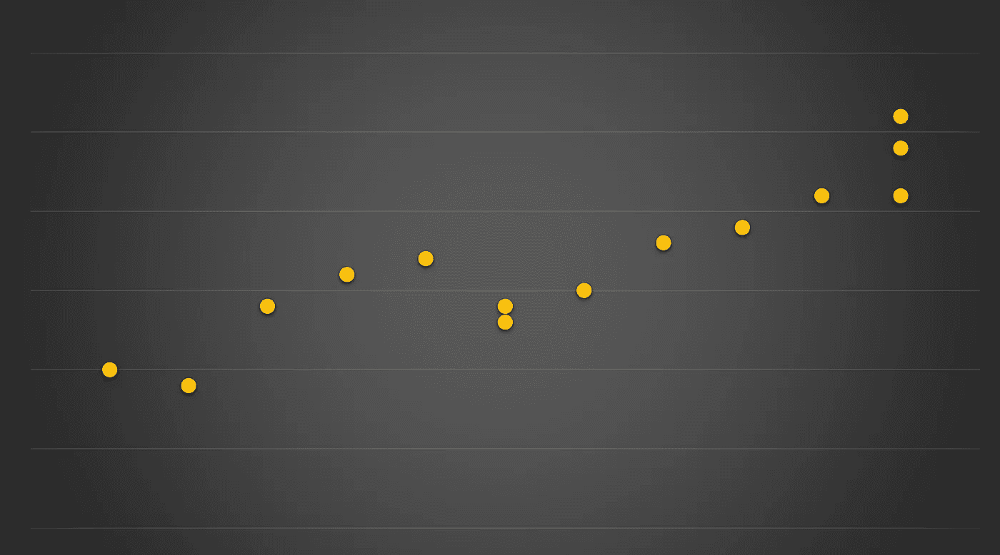

Points in 2D space. Chart by author.

它们有一个位于某处的平均值，它们有特征向量(大的特征向量 v1 和小的特征向量 v2)。我们可以只用 v1 坐标来表示这些点。想象所有这些点都在蓝线上，它们离均值有多远？另一个 v2 维度并不重要。所以，我们降低了维度(从 2D 到 1D)。

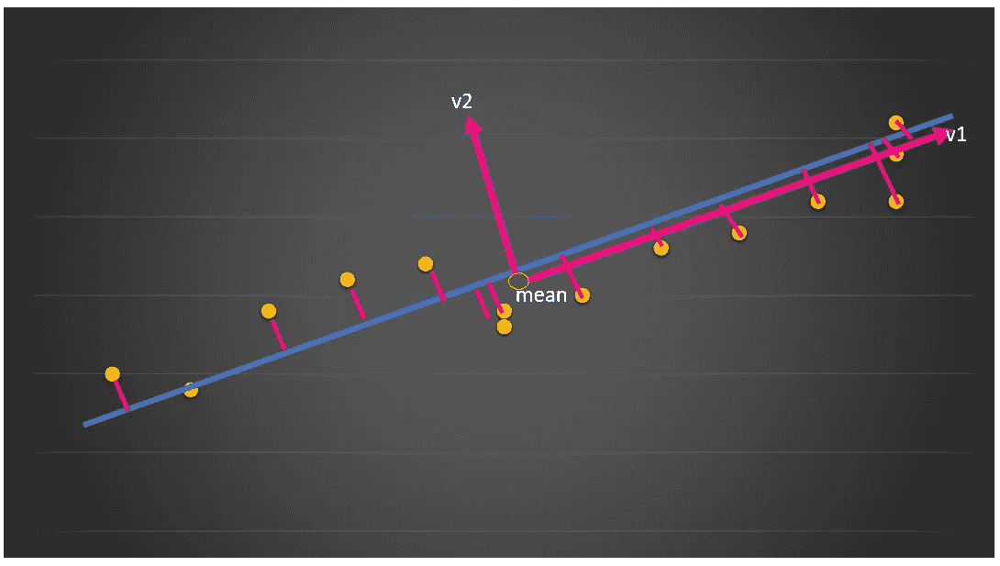

1 Dimension reduction. Image by author.

我们应用这种归约操作的原因是为了避免维数灾难。

## 维度的诅咒

数据越大，我们要处理的麻烦就越多。随着维度的增加，数据空间的体积也在增加，并且增加的速度使得数据在这个巨大的空间中变得越来越稀疏。随着数据变得越来越稀疏，该数据有意义所需的数据数量增加，也就是说所需的数据相对于维度呈指数增长。

所以我们还是简单的考虑一下吧。在表格数据集中，每一列有一个维度，在一个有 n 列的数据集中总共有 n 个维度。行是这个 n 维空间内的点。把几行、多列的情况想象成星系中的一个星座。正如 Kuss [2002] 指出的那样，模型在处理稀疏数据时表现不佳。他们不能泛化模型，过度拟合。

由于在执行降维操作时，我们获得了一个较小的数据集，因此当然会损失一些信息。然而，我们不应该认为这是有害的。相反，它总共为我们贡献了很多。

学习发生在**的时间更少。需要更少的计算资源**。

减少维度数量也意味着降低复杂性。由于复杂性也会导致过度拟合，我们**用这个过程来减少过度拟合**。

考虑到当人类的大脑在理解 4 个维度上有困难时，会有你需要理解更多的情况。因此，更少的维度更容易理解和可视化。我们可以**将**输入可视化，可以减少到二维或三维。

如果您的输入包含线性相关的要素(**多重共线性**)，您可以使用降维来消除它们。

自然，一些**不重要的特征**也会在降维过程中被剔除。因此，您将删除对模型没有贡献的特征，这些特征的行为类似于噪声。

一些方法可以将**非线性数据转换成线性**分解形式。

简而言之，我们可以说，拥有太多的特征对一个机器学习算法是不利的。因此，降维操作被用于消除维数灾难。

根据所讨论的数据集，降维可以分为两个子类别，可以应用特征选择或特征提取方法。我们可以用一个线性代数的例子来演示这两个子范畴。

我们有一个等式:a + b + c + d + e = f。然后我们从两个给定的特征中创建一个新的特征，ab = a + b。那么新的等式将是；

ab + c + d + e = f(这是特征提取)

然后，我们知道 c 和 d 是零或者非常接近零。因此，我们删除它们，因为它们的影响可以消除。c，d ~= 0。最后，我们得到；

ab + e = f(这是特征选择)

在特征选择方法中，手边的数据没有变换。尝试从可用数据集中提取重要特征。输出矩阵是输入矩阵的一部分。您可以在我关于这个主题的文章中找到特性选择方法的细节。

[](https://towardsdev.com/the-most-used-feature-selection-methods-c117273759f8) [## 最常用的特征选择方法

### 机器学习中常用特征选择方法的解释。

towardsdev.com](https://towardsdev.com/the-most-used-feature-selection-methods-c117273759f8) 

在特征提取中，输出数据不是输入的一部分，而是输入的转换形式。一个由许多维度组成的空间被转换或投影到一个更少维度的空间，因此，我们发现了新的特征。线性和非线性方法都可用。

# 线性的

这些方法最适用于线性数据。它们在非线性数据情况下可能表现不佳。

## PCA:主成分分析

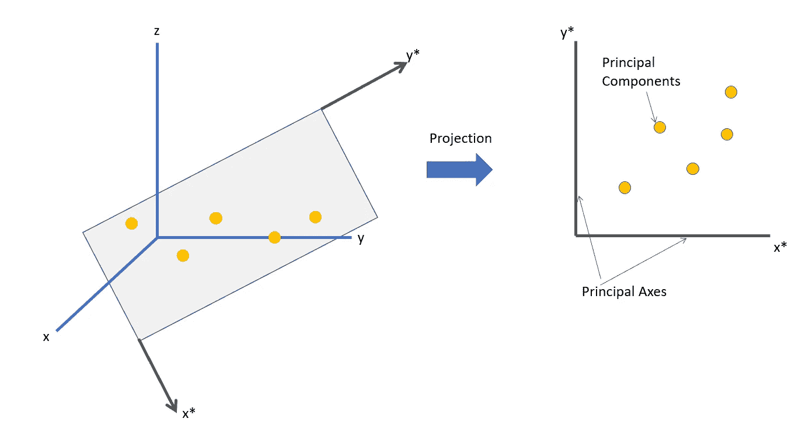

Image by author.

它是最著名的降维方法。它是一种正交的线性变换，将数据变换到一个新的坐标系中，使得数据的某个投影的最大方差位于第一个主分量上，第二个最大方差位于第二个主分量上，依此类推。**方差**是 PCA 中的关键词。为什么？因为在这种理解中，我们说:如果一个变量在每次观察中取几乎相同的值，就模型而言，它没有增加多少信息，这个变量被认为是不重要的。

PCA 试图像回归线一样通过空间中的点画一条直线。这些线是主要成分。维数决定了主成分的个数。PCA 的任务是将这些成分按重要性排序。

由于 PCA 方法，数据被压缩，所使用的存储空间减少。计算完成得更快。它消除了不必要的功能。

反过来，可能会丢失信息。因为它是一种线性方法，所以它总是寻找特征之间的线性关系。如果数据的均值和协方差不足以解释数据，那么 PCA 也是不足的。在使用 PCA 的情况下，可解释性不幸丧失。

它是一种无监督的机器学习算法，通过数学方法将一个变量矩阵转换为一个具有不相关变量的更小矩阵，每个变量都称为主分量。为了更好地理解它，让我们使用虹膜数据集。

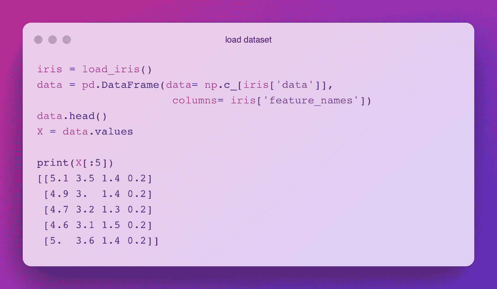

作为输入，我们有一个具有 4 个特征和 150 个观察值的矩阵(150，4)。

首先我们必须缩放 X 矩阵。如果我们不缩放，具有大数字的特征将解释所有的方差，这会误导我们。

我会应用 sklearn 的 StandardScaler。


接下来，我们需要计算 x 的协方差矩阵。

**协方差矩阵**

协方差矩阵给出了每个元素的协方差对。协方差是两个变量如何相互依赖的度量。这是对这两个变量如何一起变化的度量。如果两个变量(x 和 y)的协方差足够高，它们在变化的情况下共同作用。

方差计算如下:

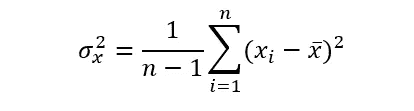

Variation equation

两个变量的协方差计算如下:

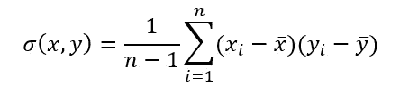

Covariance equation

协方差矩阵是:


Covariance matrix

现在让我们计算 x 的协方差矩阵。


下一步是特征分解。我们需要计算这个协方差矩阵的特征值和特征向量。这个本征事物的概念需要详细考虑。我写了另一篇关于这个话题的文章，现在让我们简单解释一下。

[](/@okanyenigun/eigenvalues-eigenvectors-8ae946539ba9) [## 特征值和特征向量

### 降维的一个基本课题

medium.com](/@okanyenigun/eigenvalues-eigenvectors-8ae946539ba9) 

特征向量是在相关的线性变换下不改变方向的向量。

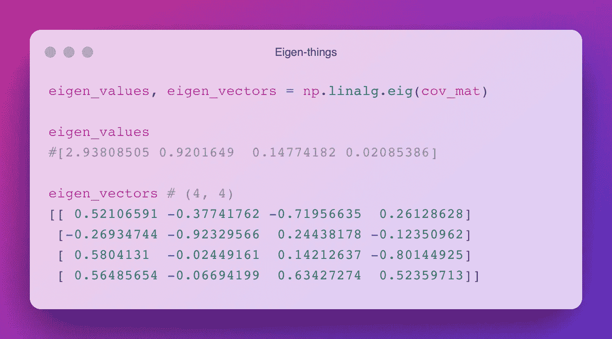

现在，我将计算特征值的百分比。每个百分比都指出了它们所解释的可变性。具有最高特征值的向量成为最重要的分量。

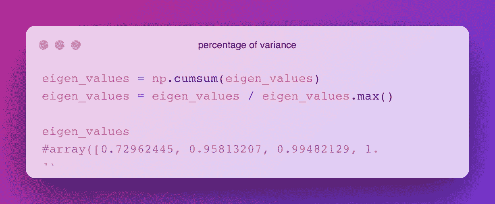

我将选择 2 个维度，因为前 2 个特征值提供了 95.8 %的可变性。

最后，X 将通过特征向量进行缩放。

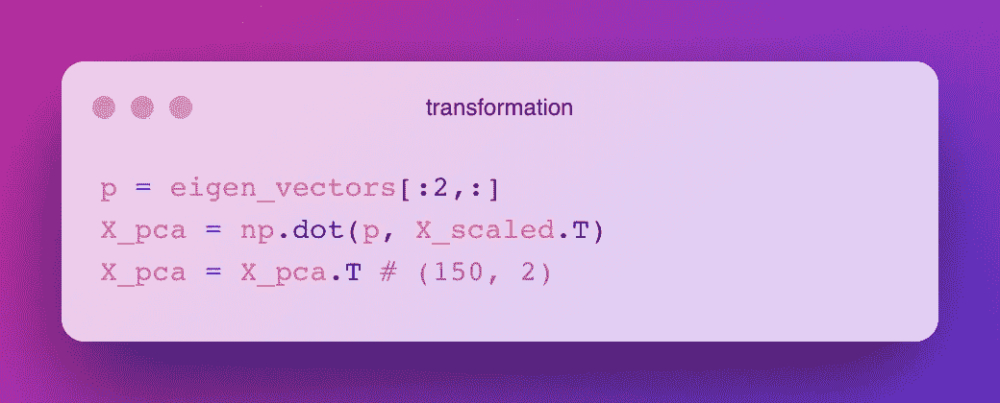

所有代码:

**Sklearn 实现**

```
from sklearn.decomposition import PCA*class* sklearn.decomposition.PCA(*n_components=None*, ***, *copy=True*, *whiten=False*, *svd_solver='auto'*, *tol=0.0*, *iterated_power='auto'*, *random_state=None*)[[source]](https://github.com/scikit-learn/scikit-learn/blob/baf828ca1/sklearn/decomposition/_pca.py#L116)[¶](https://scikit-learn.org/stable/modules/generated/sklearn.decomposition.PCA.html#sklearn.decomposition.PCA)
```

**参数**；

**n_components** : *int，float 或‘mle’，默认=无*

这定义了我们想要保留的组件数量。如果是 None(默认情况)，那么；

```
n_components = min(n_samples, n_features)
```

如果它在 0 和 1 之间，这意味着我们希望保留 n 个分量，这解释了给定的方差百分比。

如果设置为' *mle* ，那么算法使用 [Minka 的 mle 方法](https://vismod.media.mit.edu/tech-reports/TR-514.pdf)进行配置。这是对尺寸的自动猜测。

**复制** : *bool，default=True*

如果为真，则覆盖给定 x 上的转换值。

**变白** : *bool，default=False*

它对变换后的向量应用数学运算。它们乘以样本数的平方根，然后除以奇异值，以获得具有单位分量方差的不相关值。这种方法将方差归一化。可以提高准确度。

**svd_solver** : *{ '自动'，'完整'，' arpack '，'随机化' }，默认= '自动'*

自动:自动选择。如果随机化不适用，则继续使用全 SVD。

完整:运行 *scipy.linalg.svd*

arpack: n_components 必须低于 min(X.shape)。运行*scipy . sparse . Lina LG . svds*

随机化:如果输入大于 500x500，并且要提取的 *n_components* 低于最小维度的 80%,那么*随机化*可以被应用和建议。[哈尔科的奇异值分解法](https://arxiv.org/pdf/0909.4061.pdf)。

**tol** : *float，默认=0.0*

如果解算器是' *arpack 【T23 ' '，那么公差值可以设置为奇异值。*

**iterated _ power**:*int 或' auto '，默认='auto'*

如果求解器是'*随机化的*'，那么可以定义幂法的迭代次数。

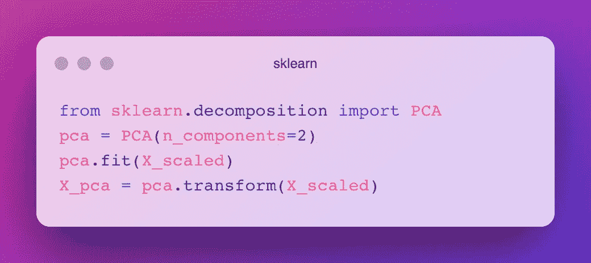

我们可以得到解释的方差百分比；

```
pca.explained_variance_ratio_
#[0.72962445 0.22850762]
```

现在，让我们在乳腺癌数据集上使用主成分分析。

```
pca.explained_variance_ratio_
#array([0.44272026, 0.18971182])
```

最后，我们将一个 30 个特征的矩阵减少到 2 个维度，2 个维度解释了 63%的方差。

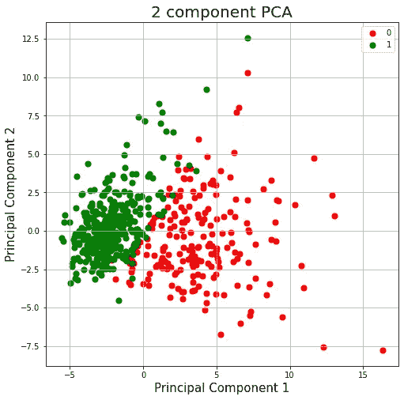

Image by author.

## FA:因子分析

这是另一种约简方法，它试图通过变量之间的关系来发现数据集中的潜在变量。我们称这些潜在变量为因素。

在这里，我们看看每个变量与其余变量的相关性。根据这些相关性，这些变量被放在不同的组中。也就是说，这些组中的变量彼此之间的相关性很高，但与其他变量的相关性很低。

我们举个简单的例子。例如，我们有两个变量:CPU 功率和耗电量。这两个变量之间将有很高的相关性，因为随着 CPU 能力的增加，它消耗的电量也将增加。然后我们把这两个变量放在同一个组。我们称这个组为因子。当我们浏览数据集中的要素时，我们会减小数据量，因为组(因子)的数量会比要素少。

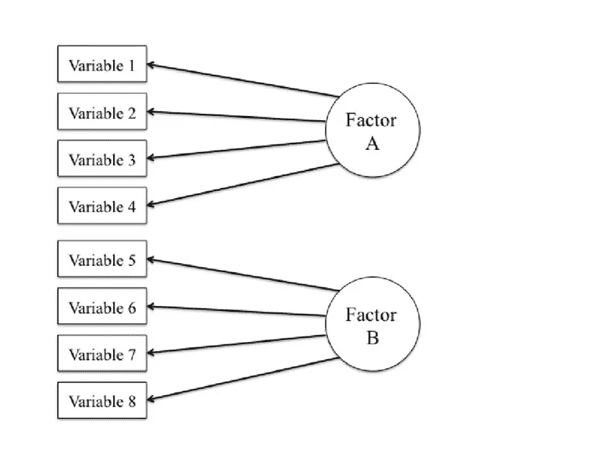

Source: [Jason W Osborne, Researchgate](https://www.researchgate.net/figure/Conceptual-overview-of-Exploratory-Factor-Analysis_fig1_209835856)

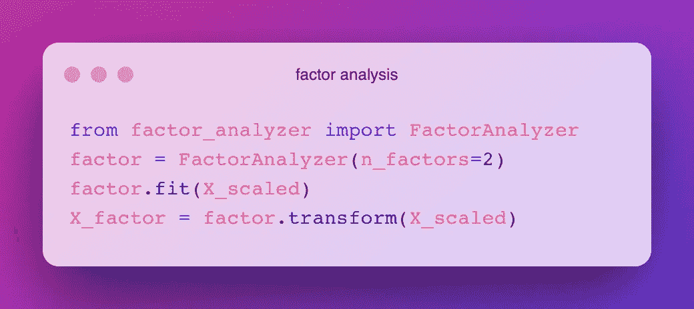

为了演示 FA，我将使用 BFI 数据集。可以从[这里](https://vincentarelbundock.github.io/Rdatasets/datasets.html)下载。这个数据集是一个人格评估项目。清洗完数据集后，看起来是这样的；

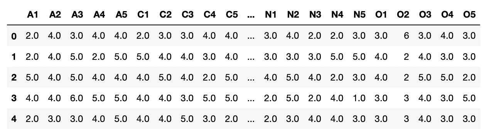

Dataset.

原则上，在应用因子分析之前，我们需要测试数据集是否适合这种分析。这被称为“抽样充分性测试”。为此，我们可以应用两种不同的测试方法。

**Bartlett 的测试**检查这些特征是否彼此相关。在此过程中，它将相关矩阵与单位矩阵进行比较。

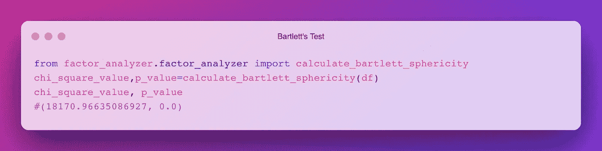

p 值为 0，表明相关矩阵不是单位矩阵。它通过了测试。

在**凯泽-迈耶-奥尔金测试**中，考虑了特征之间的差异。KMO 控制方差比。测试结果在 0 到 1 之间。因子分析的结果越高越好(实际的好结果限制为 0.6)。

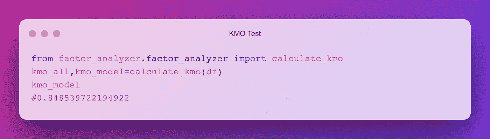

0.84 是个不错的成绩。

为了确定因子的数量，我们将使用特征值。实际上，我们可以将值的极限设置为 1。

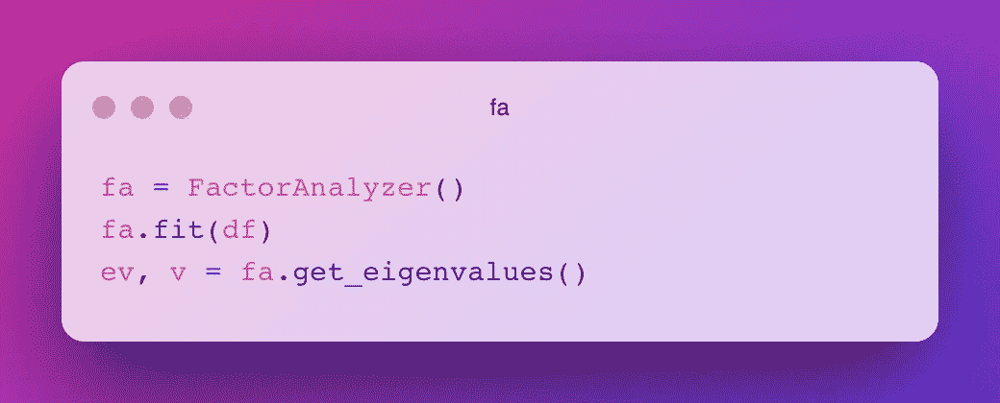

让我们画出这些值；

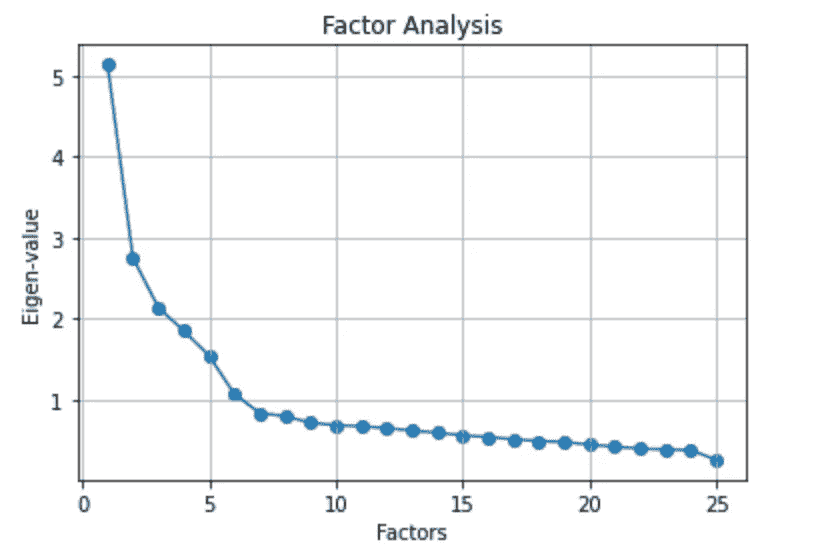

Eigenvalues. Image by author.

我们可以选择 6 个因子，因为只有 6 个特征值大于 1。

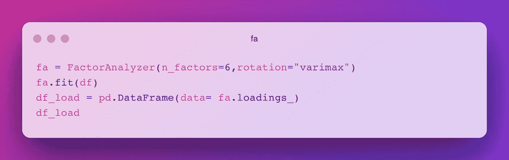

旋转参数是为了更容易解释分析而给出的参数。

因子加载显示了每个原始特征与因子的关系。越高越好。正如你所看到的，第六因子中的所有值都很低。事实上，第 6 个因素是不需要的。最好从 5 个因素重新开始。

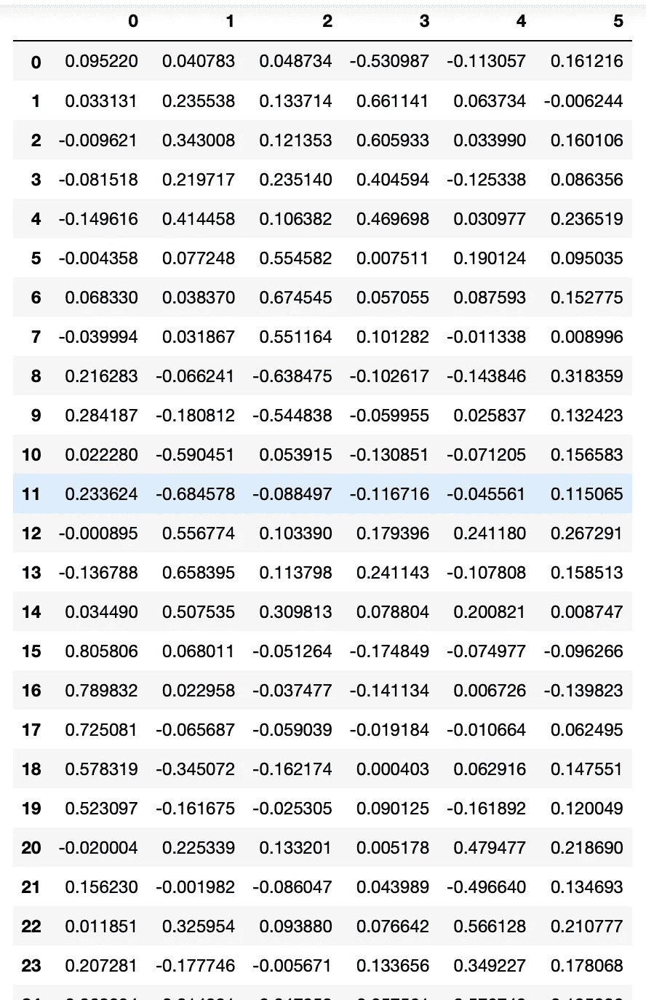

Loadings.

总方差的 45%是由这些因素解释的。

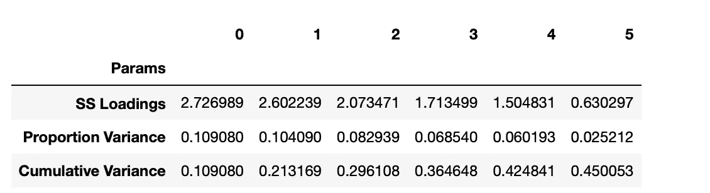

Variance Table

本演示的全部代码；

## 线性鉴别分析

LDA 可以用作多分类模型，也可以用于降维。这是一种受监督的方法(与 PCA 相反)，因此它使用类别标签。

为了使 LDA 正常工作，数据必须呈正态分布。不需要缩放。类必须存在。最大分量可以比目标特征中的类的总数少一个。

现在，我们有两个类，如下所示。

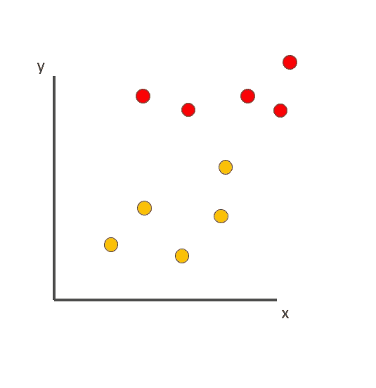

Two classes. Image by author.

假设我们将这些点投影到 x 轴上。正如你所注意到的，它不是这样工作的。大量信息丢失。

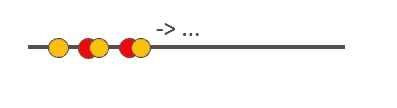

Image by author.

取而代之的是，让我们根据 x 和 y 在点之间放一条线性线(类似回归)，然后，让我们将这些点投影到这条线上。

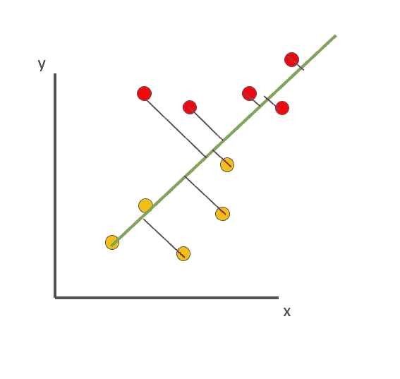

Image by author.

现在好多了！解释了很多。

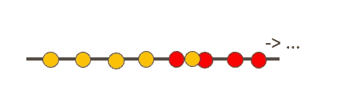

Image by author.

因此，这些线性组合(判别函数)由 n 个输入特征产生。特征被投射到这些线性判别式上。请记住，这些线性判别式假设目标要素的类别具有相同方差的多元正态分布。

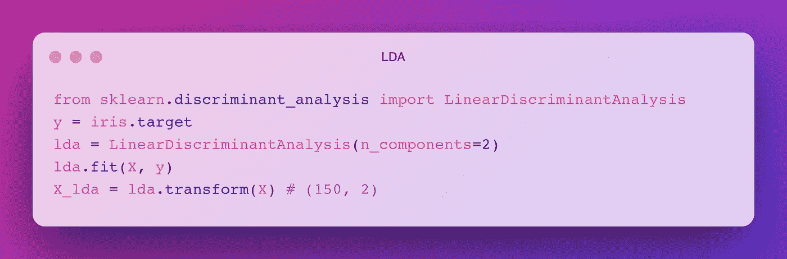

让我们创建虚拟分类数据来演示 LDA。

```
from sklearn.datasets import make_classificationX, y = make_classification(n_samples=1000, n_features=10,   n_informative=5, n_redundant=2, random_state=1, n_classes=4)
```

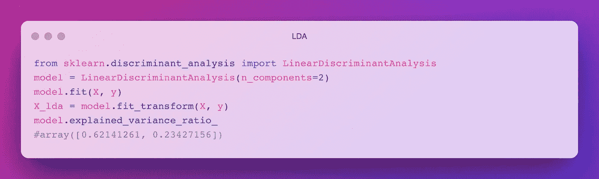

超过 85%的差异由两个部分解释。您可以在下面的图表中看到包含两个组件的类。

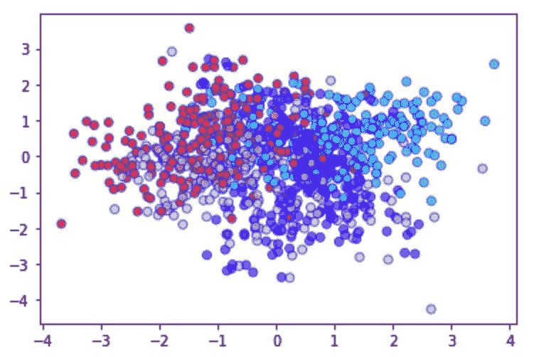

Classes. Image by author.

## 独立分量分析

ICA 是一种基于信息论的方法。与 PCA 不同，它寻找的是相互独立的因素，而不是不相关的因素。让我解释一下这种差异:如果我们说两个变量彼此不相关，我们表明它们之间没有线性关系。如果我们说这两个变量是独立的，我们是说它们在任何意义上都不相互依赖。

ICA 认为原始变量中存在一些潜在的混合变量，并且这些潜在变量必须是相互独立的。它通过分离信息来最大化 ICA 分量的非高斯性。

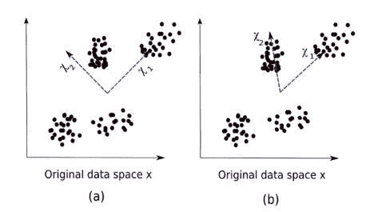

a) PCA b) ICA [Source](https://www.analyticsvidhya.com/blog/2018/08/dimensionality-reduction-techniques-python/)

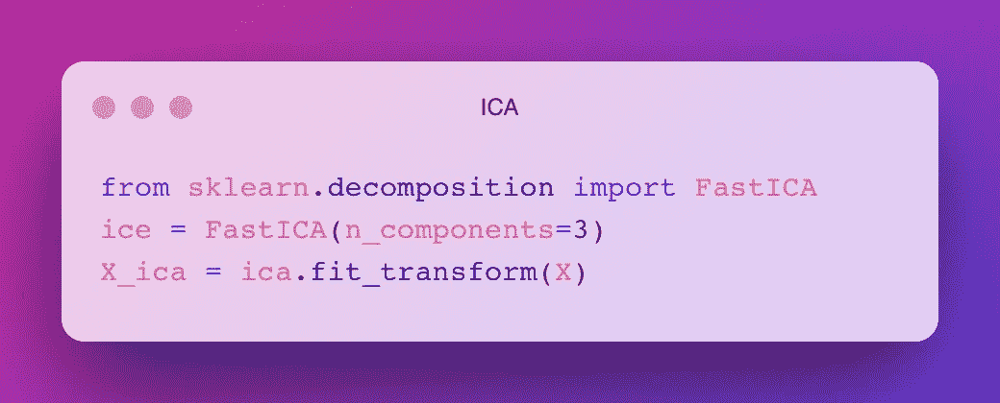

我们可以再次使用乳腺癌数据集。

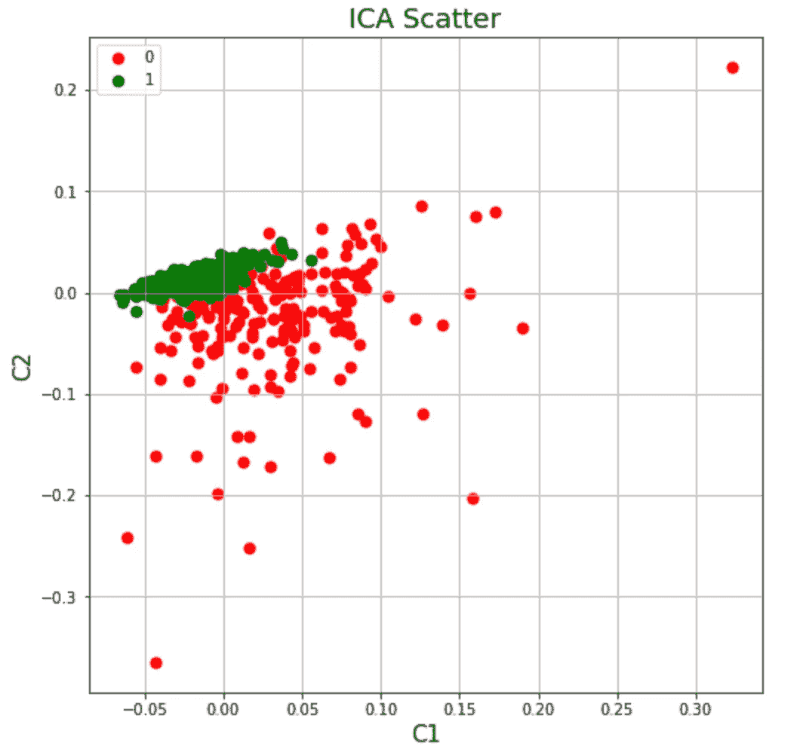

Image by author.

# 矩阵分解

我们可以用线性代数知识来降维。我们可以分解(矩阵分解或矩阵因式分解)复杂的矩阵，使其更具可计算性。

分解矩阵由复矩阵的组成部分组成。我举个例子简化一下。我们可以说 2 x 5 是 10 的因数。就像取 10 的因子一样，我们对矩阵进行类似的处理。

## LU 矩阵分解

该方法将矩阵分解成两个分量；A 是我们要分解的方阵，L 和 U 是三角矩阵。

A = L . U

LU 分解的更稳定版本是 LUP 分解，其中在方程中引入了新的矩阵 P。父矩阵被重新排序以提供一个更健壮的解决方案，这就是我们需要 P 矩阵的地方。

A =公共事业单位

```
import numpy as np
from scipy.linalg import lu#let's define a square matrix 3x3
arr = np.array([[1,1,1],[2,2,2],[3,3,3]])#we will use lu method to get decomposed matrixes
P, L, U = lu(arr)#P
[[0\. 0\. 1.]
 [0\. 1\. 0.]
 [1\. 0\. 0.]]#L -> lower triangle
[[1\.         0\.         0\.        ]
 [0.66666667 1\.         0\.        ]
 [0.33333333 0\.         1\.        ]]#U -> upper triangle
[[3\. 3\. 3.]
 [0\. 0\. 0.]
 [0\. 0\. 0.]]
```

## QR 矩阵分解

如果矩阵不是正方形，可以使用 QR 矩阵分解。它应用于 m×n 矩阵。

A = Q . R

q 是一个 m×m 的方阵，R 是一个形状为 m×n 的上三角矩阵。

```
from numpy.linalg import qrQ, R = qr(arr, "complete")#Q
[[-0.26726124  0.95618289  0.11952286]
 [-0.53452248 -0.04390192 -0.84401323]
 [-0.80178373 -0.28945968  0.52283453]]#R 
[[-3.74165739e+00 -3.74165739e+00 -3.74165739e+00]
 [ 0.00000000e+00 -4.96506831e-16 -4.96506831e-16]
 [ 0.00000000e+00  0.00000000e+00  4.93038066e-32]]
```

## 乔莱斯基分解

我们可以将这种方法应用于平方对称矩阵，并且所有特征值都应该是正的。我们把矩阵 A 分解成一个下三角矩阵和 l 的转置矩阵。我们也可以用一个上三角来分解它。

L^T 或 U^T

```
from numpy.linalg import cholesky#a new matrix that is positive
arr = np.array([[3,1,1],[2,4,2],[3,3,6]])
L = cholesky(arr)#L
[[1.73205081 0\.         0\.        ]
 [1.15470054 1.63299316 0\.        ]
 [1.73205081 0.61237244 1.62018517]]
```

## 奇异值分解

如果数据集非常稀疏(大部分数据为零)，可以使用它。使用领域包括推荐系统、评级、图像压缩、去噪等。

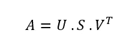

矩阵 A 被分解成 U-正交矩阵、S-对角矩阵和 V-另一个对角矩阵。

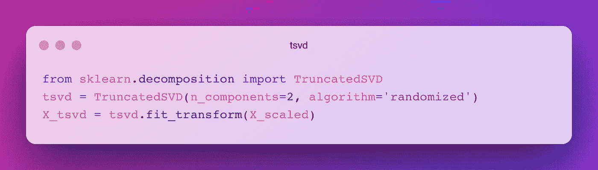

## NMF:非负矩阵分解

这是一种无监督的学习算法。这里，输入矩阵必须是非负矩阵。这个输入矩阵分解成两个非负的 W 和 H 矩阵。

A =宽高

此方法提供数据压缩。它对噪声具有鲁棒性，并且易于解释。

```
**from** sklearn.decomposition **import** NMF 
model = NMF(n_components=200, init='nndsvd', random_state=0) 
W = model.fit_transform(X) 
```

# 非线性(流形学习)

如果我们的数据是非线性类型的，线性降维方法将不会表现得足够好。在这种情况下，最好使用非线性方法。

## 多方面的

让我们用扁平的地球来简单地描述流形。这些朋友环顾四周，得出结论:既然他们看到的那块地球是平的，那么地球也一定是平的。然而，当我们考虑到他们所看到的世界的规模时，这只是很小的一部分。这小小的见证是这个世界的一个缩影。如果我们把所有这些流形放在一起，那么我们将拥有真实数据的世界，我们将理解世界的球形结构。

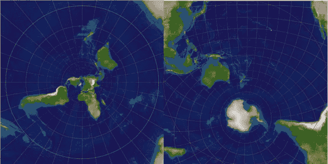

The surface of the Earth requires (at least) two charts to include every point. Here the [globe](https://en.wikipedia.org/wiki/Globe) is decomposed into charts around the [North](https://en.wikipedia.org/wiki/North_pole) and [South Poles](https://en.wikipedia.org/wiki/South_Pole). Source: [Wikipedia](https://en.wikipedia.org/wiki/Manifold)

同样，让我们考虑一条 n 维曲线。当我们把这条曲线上的所有流形放在一起，还是得到原来的 n 维曲线。

有不同的方法可以找到流形上两点之间的最短距离。曲面在测地线距离处是弯曲的，在欧几里德距离处是平坦的。

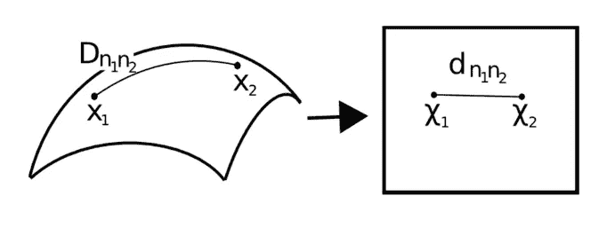

Geodesic And Euclidean Distances. [Source](https://www.analyticsvidhya.com/blog/2018/08/dimensionality-reduction-techniques-python/)

## 核主成分分析

正如该方法的名称所示，该方法类似于用于非线性情况的 PCA 方法。它使用了“内核技巧”。

数据首先在内核的帮助下被投影到一个更高维的空间。这样，类变得更容易分离。然后，将经典的 PCA 应用于这个新的高维数据，并将数据降回到低维空间。

核函数计算数据非线性映射的点积。这里的意思基本上是这样的:原始特征的非线性组合被创建并从原始维度放大到更高维度的空间。例如，我们有三个特征 x1、x2 和 x3:

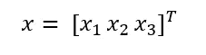

我们将内核应用于这些特征，然后我们得到更高维度的东西。

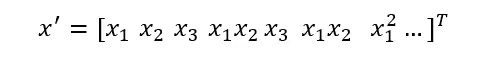

为了形象化这一点，让我们首先创建虚拟聚类数据。

```
from sklearn.datasets import make_circles
X, y = make_circles(n_samples=1000, factor=.2, noise=.1)
```

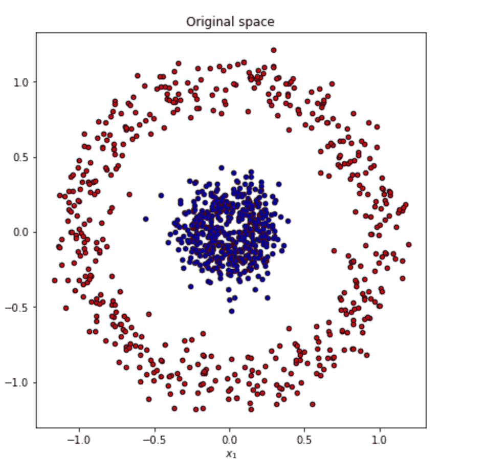

Image by author.

正如您所看到的，在这里似乎不可能线性地分离这两个类。现在让我们应用 KPCA 和增加维度。

```
kpca = KernelPCA(kernel="rbf", fit_inverse_transform=True, gamma=10, )
X_kpca = kpca.fit_transform(X)
```

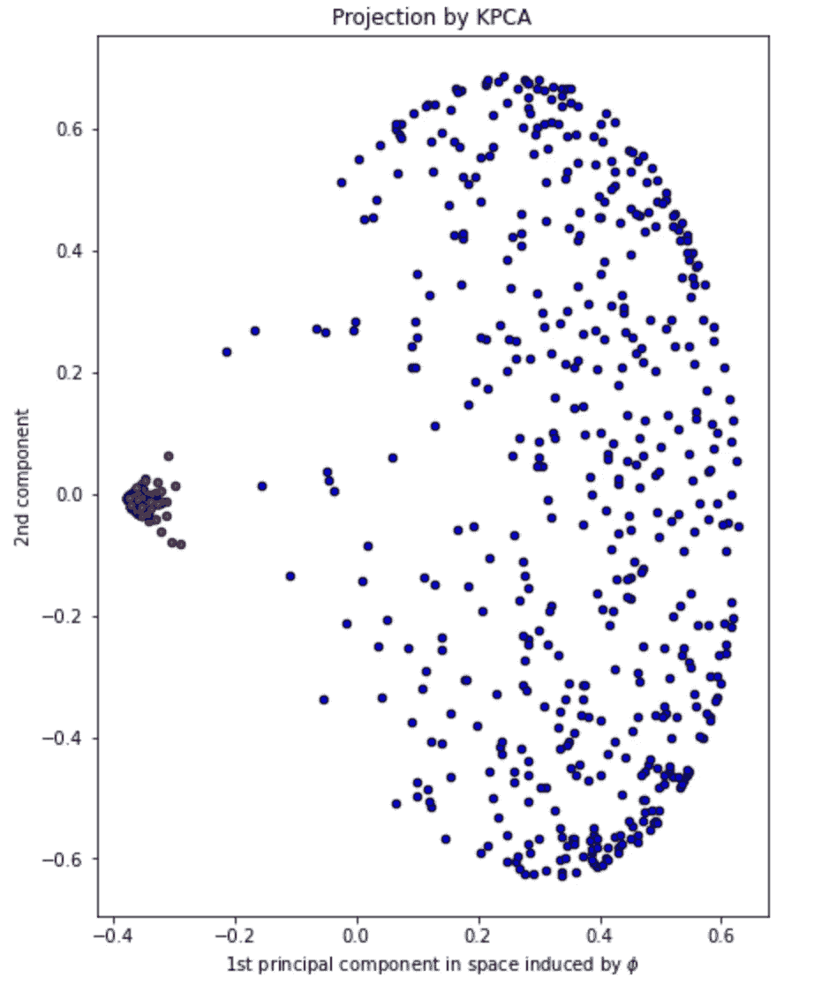

Image by author.

不错！现在，我们可以用一条直线把它们分开。

```
**from** **sklearn.decomposition** **import** KernelPCA*class* sklearn.decomposition.KernelPCA(*n_components=None*, ***, *kernel='linear'*, *gamma=None*, *degree=3*, *coef0=1*, *kernel_params=None*, *alpha=1.0*, *fit_inverse_transform=False*, *eigen_solver='auto'*, *tol=0*, *max_iter=None*, *iterated_power='auto'*, *remove_zero_eig=False*, *random_state=None*, *copy_X=True*, *n_jobs=None*)[[source]](https://github.com/scikit-learn/scikit-learn/blob/baf828ca1/sklearn/decomposition/_kernel_pca.py#L21)
```

**参数；**

**n _ 组件** : *int，默认=无*

如果选择“无”，则保留所有非零分量。

**内核** : *{ '线性'，'多边形'，' rbf '，' sigmoid '，'余弦'，'预计算' }，默认= '线性'*

它是 PCA 的内核类型。 *rbf* 是用的最多的一个。

**伽玛** : *浮点，默认=无*

它是核系数(如果核是 rbf、poly 或 sigmoid 之一)。

**度数** : *int，默认=3*

如果选择内核为 *poly* ，我们可以给出一个度数值。

**coef0** : *浮动，默认=1*

如果内核是 sigmoid 或者 poly，我们可以传递一个独立的 term 值。

**内核参数** : *字典，默认=无*

我们可以像字典一样传递参数。

**alpha** : *float，默认=1.0*

如果 *fit_inverse_transform* 为真，则可以设置岭回归的超参数值。

**eigen_solver** : *{ '自动'，'密集'，' arpack '，'随机化' }，默认= '自动'*

特征值求解器。如果组件数量少于训练样本，建议使用*随机化*或 *arpack* 。

**tol** : *float，默认=0*

如果本征解算器是 *arpack* 时的收敛公差。

**max_iter** : *int，default=None*

这是 *arpack* 特征值求解器的最大迭代次数。

**iterated _ power**:*int≥0，或' auto '，默认='auto'*

如果 svd 解算器被选择为*随机化*，则为迭代次数。

**remove _ zero _ EIG**:*bool，default=False*

如果设置为真，则删除所有零特征值。

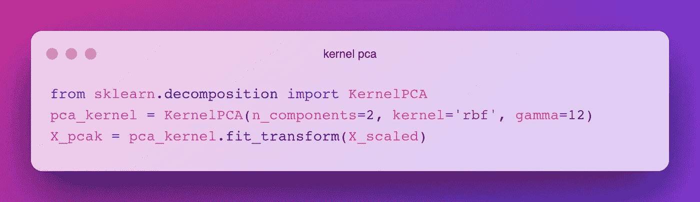

## t-SNE:t-分布随机邻居嵌入

它是一种有监督的方法，用于自然语言处理和图像处理领域，此外，它还有助于数据可视化。建议在应用 t-SNE 之前使用 PCA 或 TSVD。

记住，主成分分析试图最大化方差，与此不同，SNE 霸王龙试图最小化两个分布之间的差异。

**发散**

虽然题目不难，但有时可能很难理解，因为数学是一个抽象的概念，而这些概念也是非常不寻常的概念。上过向量微积分课程也会让你更容易理解这门学科。

如果我们复习一个具体的概念，让我们想想一条河。在河流的每一点，水都有一定的流速值，相应的，单位时间内也有一定的水流量。如果要用向量来表示，就需要把这条河表示成由箭头组成的面或者物体。这就是所谓的向量场。为了说明这一点，需要一个给出河流中期望点的水流量的方程。使用各种测量和最合适的方程模型(阶数等)来创建该方程。).

生成的方程是 ai+bj+ck 形式的向量函数。该功能提供了关于有多少水沿哪个方向通过的信息。我们现在可以使用这个函数，即向量场，来达到我们想要的目的。例如，我们可以学习我们想要的点的流量。

或者说，我们想知道是否存在点流变化。正如我们使用导数来寻找函数的单位变化，我们也根据 x，y 和 z 分别对 I，j 和 k 求导，并将该区域的坐标写在适当的位置。我们得到的三个值给出了该点在每个方向上矢量的增加或减少。即单位时间通过的水量如果有增加，则为正，如果有减少，则为负，否则为零。当我们把这三个值相加，我们就明白了该点向量的值是否总共增加了。

如果结果是肯定的:有所增加。这意味着要么是狭窄，要么是补充了水分。如果结果是否定的:有减少。正常情况下，每分钟通过 10kg 的水，就变成了 3kg。要么是河流变宽了，要么是水从那部分被抽走了。

总而言之，散度用于检测向量场在某一点的值是否增加。

**KL —散度**

在机器学习领域的很多情况下，我们可能需要比较两个概率分布。例如，我们有一个随机变量，这个变量有两种不同的概率分布。一个是我们估计的近似值，一个是实际分布。在这种情况下，我们需要测量这两个分布之间的统计距离。我们用散度来衡量这一点。在这里，散度是这两个概率分布之间的差异的度量。

KL 散度是一种计算这个散度分数的数学方法。

KL(P | | Q)=—X P(X)中的 X 总和* log(Q(x) / P(x))

现在，让我们回到 SNE 霸王龙的话题。该方法首先计算高维数据的概率分布。然后，它在较低的维度上创建这些分布的相似副本。最后，它最小化了这两种分布之间的差异。

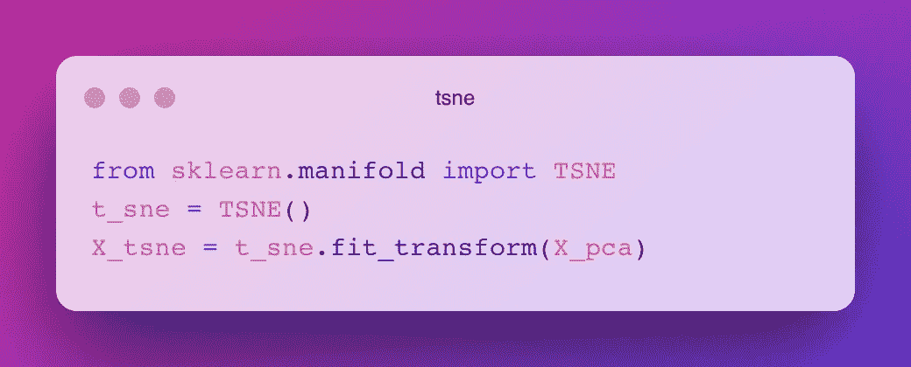

为了演示 SNE 霸王龙，我们可以使用 MNIST 的数据。

看起来不错！聚集得很好。点的邻居数量决定了它在数据中的密度。我们可以用困惑值来控制密度。该值越高，考虑的全局结构就越多。

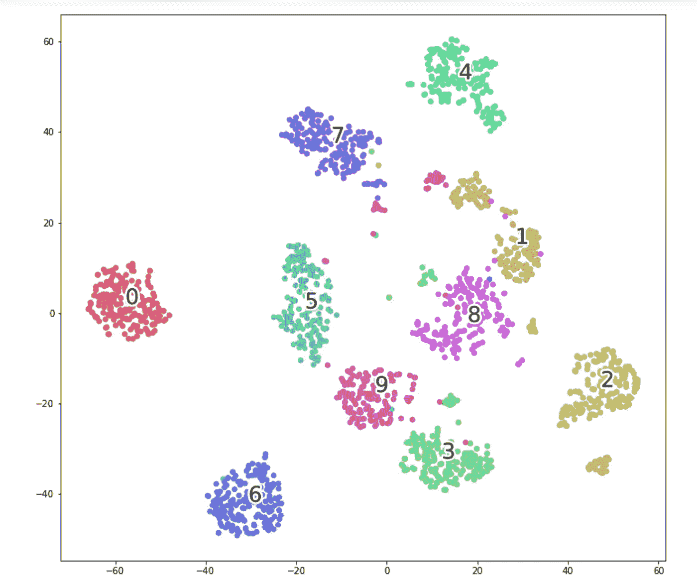

MNIST Clusters after t-SNE applied. Image by author.

显然，在非线性情况下，使用 t-SNE 比 PCA 更好。但是如果说的是大数据量，计算成本会很高。

## UMAP:一致流形近似和投影

t-SNE 不错，但也有缺点。很多信息可能会在这个过程中丢失，计算起来太费时间了。UMAP 提供了更快的过程和更好的可视化能力。

首先，测量高维空间中的点之间的距离。然后它们被投射到更低维度的空间中，并且在更低维度的空间中再次测量距离。通过使用 SGD(随机梯度下降),这些距离之间的差异试图被最小化。

```
import umap
X_umap = umap.UMAP(n_neighbors=5, min_dist=0.3, n_components=3).fit_transform(X)
```

## LLE:局部线性嵌入

另一种无监督的非线性方法。它使用数据的拓扑结构，并将其保存在一个低维空间中。这是一种快速的方法，但如果数据中有噪声，效果就不好。

它查找每个数据点的最近邻，并创建一个充满权重的矩阵。这些权重被计算为其 k 个邻居的线性组合。然后最小化它们之间的平方距离。最后，通过特征向量优化将权重映射到低维空间。

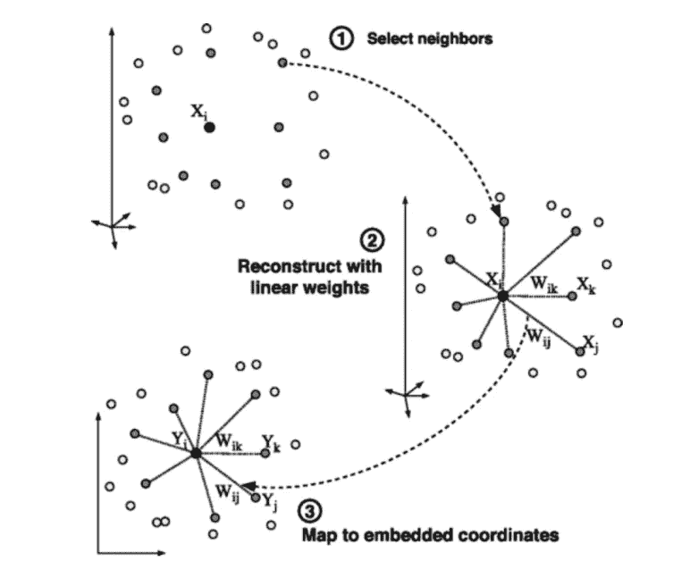

Source: *Dimensionality reduction technique: LLE | Source: S. T. Roweis and L. K. Saul, Nonlinear dimensionality reduction by locally linear embedding*

## MDS:多维标度

我们可以应用度量和非度量多维标度方法。

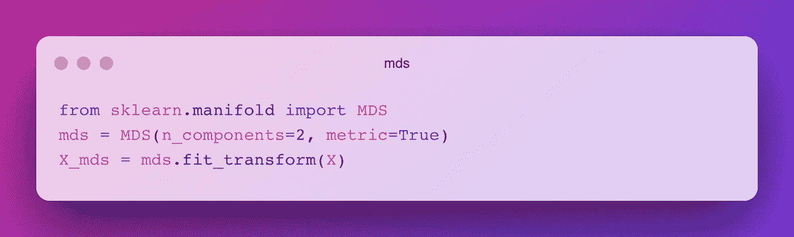

## 光谱嵌入

非线性，无人监管。这种方法在低维空间的表示中搜索不同组中的聚类。

计算数据的拉普拉斯矩阵。本征物是从分解中获得的。该方法使用第二小特征值及其向量。

这种方法用于图像分割项目。

## Isomap:等距映射

Isomap 方法假设流形是平坦的。因此，测地线距离和欧几里德距离是相等的。

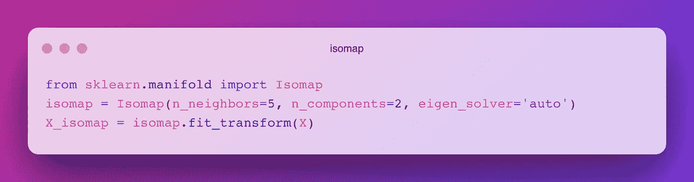

## 自动编码器

自动编码器是一种人工神经网络。这是另一篇详细文章的主题。但是，我们应该知道，自动编码器也用于降维操作。

在自动编码器中，输入和输出都有 *n* 个单位。中间至少有一个隐藏层。第一部分是编码器。编码器接受 n 维输入，并将其压缩到 m 维。第二部分是解码器。它从编码器获取 m 维数据，并将其扩展回 n 维。

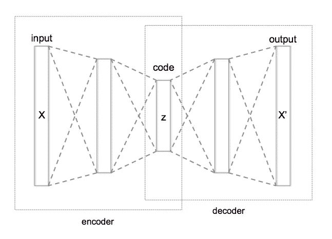

AutoEncoder. Source: [Wikipedia](https://commons.wikimedia.org/wiki/File:Autoencoder_structure.png)

# 结论

这是一篇很长的文章。还有很多其他的事情可以做，很多方法可以应用。在本文中，我主要从分类和聚类问题的角度处理了降维操作。然而，它通常用于声音处理、图像处理以及机器学习或人工智能应用中。

降维操作与微积分和线性代数的主题密切相关。事实上，它可能是机器学习项目中数据预处理阶段最数学化的部分。保持我们的线性代数和本征值学科的知识是有用的。

希望这个目录对你有用。

# 阅读更多内容…

[](/@okanyenigun/eigenvalues-eigenvectors-8ae946539ba9) [## 特征值和特征向量

### 降维的一个基本课题

medium.com](/@okanyenigun/eigenvalues-eigenvectors-8ae946539ba9) [](https://python.plainenglish.io/what-are-the-feature-transformation-techniques-ba594b523ec4) [## 特征变换技术有哪些？

### 特征转换技术的浏览

python .平原英语. io](https://python.plainenglish.io/what-are-the-feature-transformation-techniques-ba594b523ec4) [](https://python.plainenglish.io/outliers-and-anomalies-210eefc51aa) [## 什么是异常值和异常值？

### 对异常世界的探索

python .平原英语. io](https://python.plainenglish.io/outliers-and-anomalies-210eefc51aa) [](https://python.plainenglish.io/how-to-handle-missing-values-ef4abd02673f) [## 如何处理缺失值？

### 处理丢失数据所需的一切

python .平原英语. io](https://python.plainenglish.io/how-to-handle-missing-values-ef4abd02673f) [](https://towardsdev.com/the-most-used-feature-selection-methods-c117273759f8) [## 最常用的特征选择方法

### 机器学习中常用特征选择方法的解释。

towardsdev.com](https://towardsdev.com/the-most-used-feature-selection-methods-c117273759f8) 

# 参考

[https://en.wikipedia.org/wiki/Dimensionality_reduction](https://en.wikipedia.org/wiki/Dimensionality_reduction)

[https://machine learning mastery . com/dimensionally-reduction-for-machine-learning/](https://machinelearningmastery.com/dimensionality-reduction-for-machine-learning/)

[https://machinelingmastery . com/introduction-to-matrix-decompositions-for-machine-learning/](https://machinelearningmastery.com/introduction-to-matrix-decompositions-for-machine-learning/)

[https://medium . com/data-science-365/statistical-and-mathematical-concepts-behind-PCA-a2cb 25940 CD 4](/data-science-365/statistical-and-mathematical-concepts-behind-pca-a2cb25940cd4)

[https://sci kit-learn . org/stable/modules/generated/sk learn . decomposition . PCA . html](https://scikit-learn.org/stable/modules/generated/sklearn.decomposition.PCA.html)

[https://towards data science . com/principal-component-analysis-PCA-with-scikit-learn-1e 84 a 0 c 731 b 0](https://towardsdatascience.com/principal-component-analysis-pca-with-scikit-learn-1e84a0c731b0)

[https://towards data science . com/factor-analysis-on-women-track-records-data-with-r-and-python-6731 a73c D2 e 0](https://towardsdatascience.com/factor-analysis-on-women-track-records-data-with-r-and-python-6731a73cd2e0)

[https://towards data science . com/11-dimensionally-reduction-techniques-you-should-know-in-2021-dcb 9500d 388 b](https://towardsdatascience.com/11-dimensionality-reduction-techniques-you-should-know-in-2021-dcb9500d388b)

[https://www.youtube.com/watch?v=3uxOyk-SczU](https://www.youtube.com/watch?v=3uxOyk-SczU)

[https://www.youtube.com/watch?v=AU_hBML2H1c](https://www.youtube.com/watch?v=AU_hBML2H1c)

[https://www.youtube.com/watch?v=jPmV3j1dAv4](https://www.youtube.com/watch?v=jPmV3j1dAv4)

[https://machine learning mastery . com/divergence-between-probability-distributions/](https://machinelearningmastery.com/divergence-between-probability-distributions/)

[https://eksisozluk.com/entry/73389025](https://eksisozluk.com/entry/73389025)

[https://neptune.ai/blog/dimensionality-reduction](https://neptune.ai/blog/dimensionality-reduction)

[https://www.geeksforgeeks.org/dimensionality-reduction/](https://www.geeksforgeeks.org/dimensionality-reduction/)

[https://www . Java point . com/dimensionally-reduction-technique](https://www.javatpoint.com/dimensionality-reduction-technique)

[https://thenewstack . io/3-机器学习中的数据降维新技术/](https://thenewstack.io/3-new-techniques-for-data-dimensionality-reduction-in-machine-learning/)

[https://www . analyticsvidhya . com/blog/2018/08/dimensionally-reduction-techniques-python/](https://www.analyticsvidhya.com/blog/2018/08/dimensionality-reduction-techniques-python/)

[https://sci kit-learn . org/stable/modules/unsupervised _ reduction . html](https://scikit-learn.org/stable/modules/unsupervised_reduction.html)

[https://www.tmwr.org/dimensionality.html](https://www.tmwr.org/dimensionality.html)

[https://www . data camp . com/tutorial/introduction-factor-analysis](https://www.datacamp.com/tutorial/introduction-factor-analysis)

[](/mlearning-ai/mlearning-ai-submission-suggestions-b51e2b130bfb) [## Mlearning.ai 提交建议

### 如何成为 Mlearning.ai 上的作家

medium.com](/mlearning-ai/mlearning-ai-submission-suggestions-b51e2b130bfb)