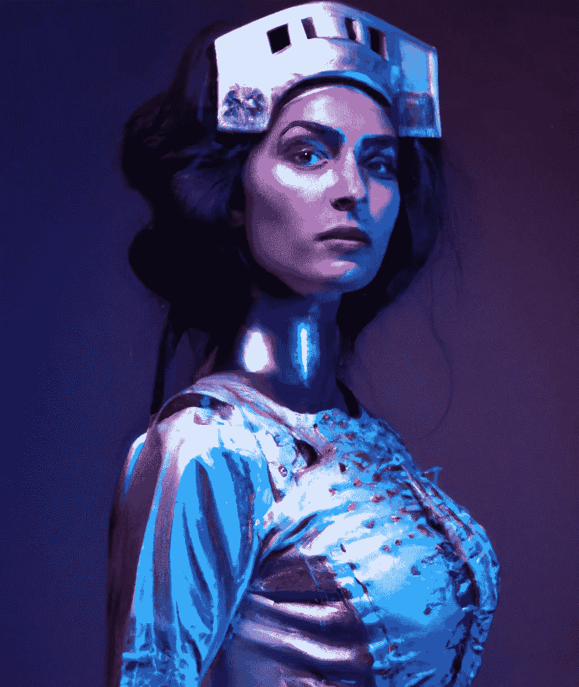

# 不同的人工智能艺术是可能的。但是怎么做呢？

> 原文：<https://medium.com/mlearning-ai/a-different-ai-art-is-possible-but-how-6b4a2911833d?source=collection_archive---------2----------------------->

## [AI 鸟瞰](https://mlearning.substack.com/p/ai-has-a-birds-eye-view?r=z7zu8&utm_campaign=post&utm_medium=web)

## 2022 年的另类机器学习艺术运动

[The Brilliant Programmer Who Created The First Machine Learning Art](https://mlearning.substack.com) 2022

## 艺术家们期望从[机器学习](https://mlearning.substack.com/p/ai-has-a-birds-eye-view?r=z7zu8&utm_campaign=post&utm_medium=web)中受益？

使用人工智能的艺术家通过编程[算法](https://mlearning.substack.com/p/what-religion-can-do-for-ai?r=z7zu8&utm_campaign=post&utm_medium=web)来创作艺术作品，而不仅仅是“学习”特定的…