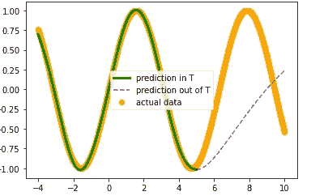
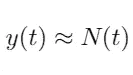
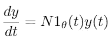
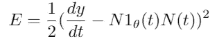
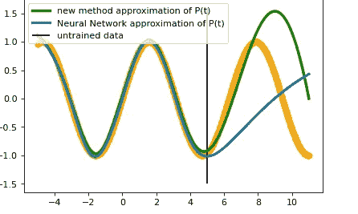

# 神经网络的外推。

> 原文：<https://medium.com/mlearning-ai/a-different-approach-inspired-by-neural-odes-extrapolation-of-neural-networks-9766f846bd02?source=collection_archive---------1----------------------->

大家好！我写信来分享一个故事！作为我论文的一部分，我正在研究一种方法，这种方法受经典神经微分方程的启发，最初是由多伦多大学和向量研究所提出的。这获得了 Neurips 2018 最佳论文。它基本上有助于解决时间序列问题，但也给了经典的机器学习方法很多启发。

这个主题是高度数学化的，所以它指的是已经在这个领域有一些背景的人，所以它将有助于理解这种方法。我会尽力让事情变得简单！

# 1.为什么我们关心神经微分方程？

众所周知，神经网络是通用的逼近器。神经网络是一种可微分的、连续的模型，可以插值任何函数，不管它有多复杂。它们是机器学习算法的一个例子，给定一个数据集，它寻找最佳参数，用优化算法最小化损失函数，以便以最佳方式描述给定的数据。使用我们手中的数据集，损失函数被最小化，这就是为什么我们说我们最小化了训练误差，当然我们可以假装我们不知道数据集的某些部分，并测试那里的误差，这被称为测试误差。主要目标是最小化测试误差，因此我们设法最小化泛化误差。

**需要记住的事情:**

1.  泛化误差:对于任何不包含在数据集中的数据，它是实际值和模型认为的值之间的差。
2.  插值:假设我们有一些已知的数据点，其中 ti 在 T=(a，b)中。插值是估计描述 t 中这些点的函数的一种方法。
3.  外推:从 t 中估计函数的一种方法。

主要的限制是，只有在我们训练神经网络的领域中，泛化误差才是好的。所以这不足以用来推断。

换句话说，如果我用一些狗和猫的图像训练一个网络，那么域就是{猫图像，狗图像}。神经网络可以很容易地预测一幅全新的图像中是否有一只狗或猫，但它不知道你是否给了它一只青蛙！在时间序列中，这是一个巨大的限制，因为如果我们能够有把握地预测域外的点，那么我们就可以预测未来！

真实现象的时间序列由于它们随时间的重复变化而被称为动力系统。动力系统出现在各种各样的领域，从数据中学习动力系统通常是一项困难的任务。对于连续动力系统，时间演化在很多情况下可以用微分方程来描述。让我们假设我们有可以用微分方程描述的时间序列，并深入研究❤方法

Here is a simple y(t)=sint function. The neural network is trained in T=(-4,5) with 100 points , and the green & purple line is the model for 1000 points in (-4,10). We see that it is perfect in T, but outside T says nothing, and so it is not accurate for extrapolation out of t=5.

# 2.方法的描述

*问题定义:我们想要一个模型，该模型适合域 T 的一些数据，预测 T 中的新 ti 的 y(ti ),而且预测 T(未来)之外的新 ti。*

**2.1 我们想要插值并找到一个足够接近 y(t)的模型。第一种通常的方法是训练神经网络，例如具有一个隐藏层的前馈神经网络。**

**2.2** 第二种方法是一种尝试，也考虑了系统的动态演变。

*   假设 N(t)是 2.1 中的神经网络插值，则

*   假设 y(t)是一阶未知微分方程的解。我们说过神经网络是可微的，所以我们可以得到 N(t)的导数。

*   我们将训练神经网络 N1，并通过最小化损失函数来找到参数θ:

*   现在我们有了微分方程，如果我们求解它，我们将得到 y(t)的解，希望它在域 T 之外比 N(t)好，这样就考虑了系统的动态演化！
*   我们如何解决颂歌？当然是数字上的。数值求解微分方程有很多算法。有一些是龙格库塔法，或者是更简单甚至有深度学习的欧拉法。 ***我会再做一篇博客文章来解释微分方程的数值方法，以及深度学习是如何求解的。*** 所以，我训练了一个新的神经网络来求解我在(-4，5)中的微分方程，结果是这样的:

# 3.结论

总之，在连续动力系统中，时间演化在许多情况下可以用微分方程来描述，在这篇论文中，我试图探索常微分方程如何帮助。

我希望你觉得这篇文章有趣和有用，感谢阅读！联系我的任何想法，扩展，甚至只是分享任何关于这个话题的讨论！

 [## Mlearning.ai 提交建议

### 如何成为 Mlearning.ai 上的作家

medium.com](/mlearning-ai/mlearning-ai-submission-suggestions-b51e2b130bfb)