# 时间序列分析的不同介绍

> 原文：<https://medium.com/mlearning-ai/a-different-introduction-to-time-series-analysis-dbe7850b0bea?source=collection_archive---------2----------------------->

## 理解时间序列和选择最佳预测模型的关键概念


Image from unsplash [@tobbes_rd](http://twitter.com/tobbes_rd)

# 简介-什么是时间序列？

时间序列是一个有序的测量序列，每个测量都有一个相关的时间。在这篇文章中，我们将使用来自 Kaggle challenge [**商店商品需求预测**](https://www.kaggle.com/c/demand-forecasting-kernels-only) 的数据集。该数据集的日平均销售额具有以下模式

```
df.set_index('date').plot()
plt.title('Store Item Demand Forecasting')
```

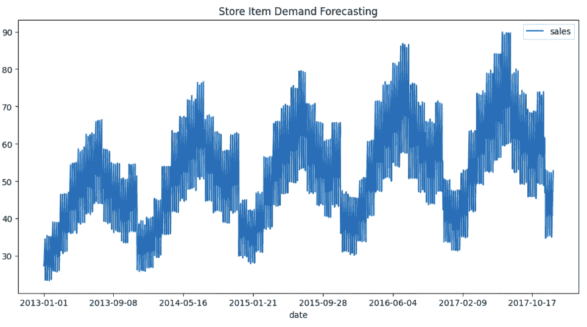

Image by the author: Plot of a time serie. The y-axis is always the variable that is measured, while the x-axis are their correspondent times.

处理时间序列的主要目标之一是不仅要理解其历史行为，还要能够预测序列的未来值。为此，有许多机器学习模型，因此，对于给定的数据集，不容易知道使用哪一个。在这篇文章中，我们将根据数据的性质来理解这些模型的优缺点。

# 1.统计分析—了解时间序列的行为

有许多统计数据和指标来描述时间序列。然而，我们将把重点放在那些与了解我们应该使用哪种预测模型来预测未来数据相关的问题上。

## 1.1 表征时间序列-平稳分析

一个时间序列， *Y(t)* ，如果它的统计性质不随时间变化，就称它是平稳的。这个概念很重要，因为未来的值会有相同的行为。前者并不意味着数据将是可预测的，反之亦然(例如，具有趋势或季节性的时间序列不是稳定的)，但在最坏的情况下，我们可以在任何给定的时间点估计具有一定方差的期望值。

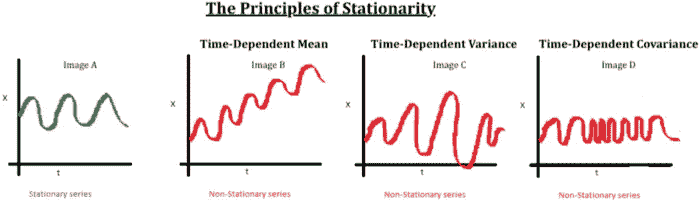

Image from the principles of stationarity, Source: [BeingDatum](https://beingdatum.com/time-series-forecasting/)

因此，商店项目需求预测数据集 Y(t)不是固定的。即使有时时间序列不是平稳的，也可以进行一些转换将其转换为平稳的，例如，通过用 ***n 阶微分*** 去除趋势的影响。给定一个数列 Y(t)，n 阶微分定义为

> Y '(t)= Y(t)—Y(t-1)———Y(t-n)

在我们数据集的最后一年进行一阶微分，我们得到以下结果

```
df.sales=df.sales.diff()
df.plot()
plt.title('Rolling diff Demand')
```

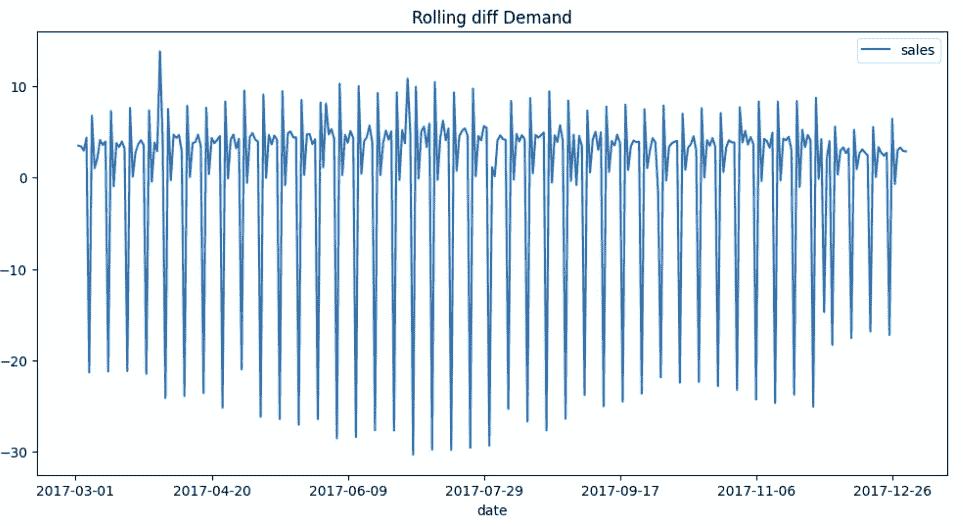

Image by the author: In this image we can see the 1-order differentiation of the original serie from March to December of 2017\. As we can see, the mean value is arround 0, while the varienace and range keeps stable from -25 to 7 sales. This means that we can consider this time interval as a stationary time serie.

尽管如此，有时，数据在 n 阶微分后保持不稳定，因为增长不是线性的。例如，如果我们看到整个时间序列 Y(t ),而不仅仅是去年，我们可以看到它不是平稳的。

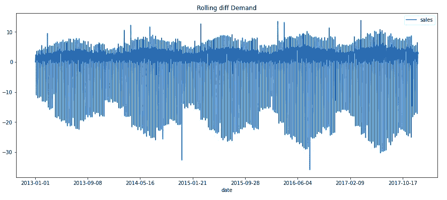

Image by the author: 1-order differentiation of the whole time serie. We can the that along the entire history, that the variance does not keep stable, but it fluctuates with the past of the time. It means that the time serie is not stationary.

在那些情况下，我们可以试着预先对 Y(t)做一个 ***对数*** 或 ***指数*** 变换。通过这种变换，我们终于可以看到我们的时间序列 Y(t)是平稳的

> Y'(t) = log(Y(t))
> 
> Y'(t) = exp(Y(t))

```
df.sales=np.log(df.sales).diff()
df.set_index('date').plot()
plt.title('Rolling diff Demand')
```

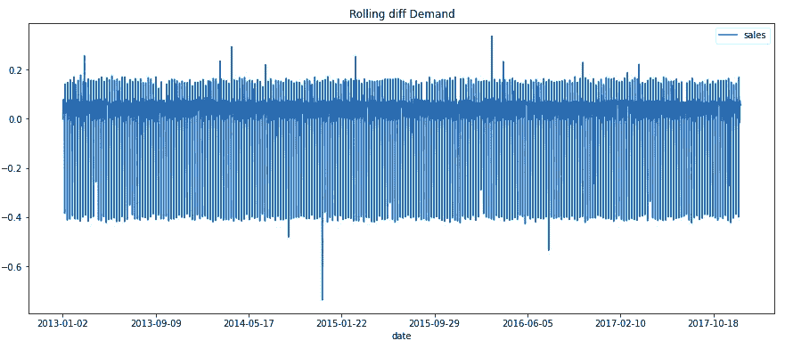

Image by the author: 1-order differentiation with a logarithmic correction of the values of the time serie. The logarithmic correction is usefull when the time serie follows an exponential growth. Now we are pretty sune that the time serie is stationary.

现在我们可以看到，数列的方差和均值保持不变，这意味着它是平稳的。在特定的日子里有一些点的值偏离时间序列行为，这种值被称为**残差。**残差一般是由具体的临时原因引起的，不会改变整个时间序列的模式，所以我们不必担心。

## 1.2 自相关和部分自相关(ACF PACF)

为了预测未来值，我们不仅要了解 Y(t)统计特性的时间演变，还要了解未来值与过去值的相关程度。为此，我们使用 ACF 和 PACF。

***ACF*** 是时间序列 Y(t)在该序列的前一时刻与其自身的相关性。计算与序列的 *k* 过去值的相关性，我们可以检查 *k* 过去值中的哪些与当前值相关

> ACF =相关性(Y(t)，Y(t-k))

```
from statsmodels.graphics.tsaplots import plot_acf
plot_acf(df.sales)
```

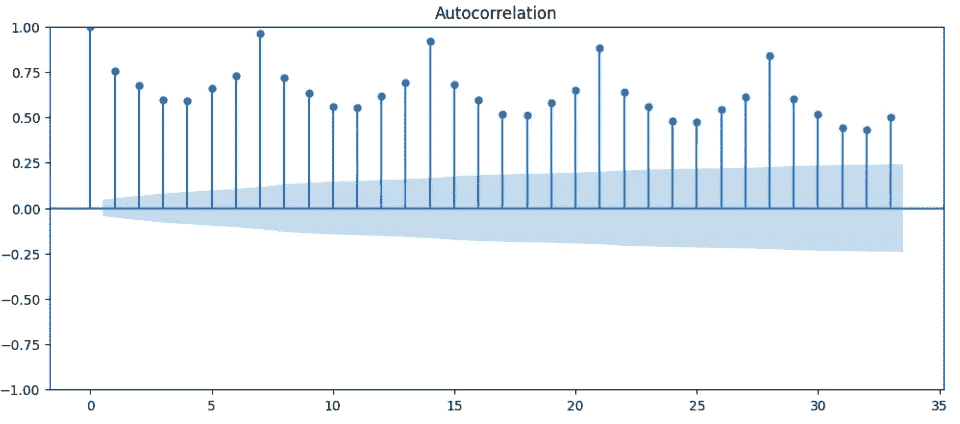

Image by the author: Partial autocorrelation. We can see that all of the 33 previous day are correlated with the current value (correlation>0.25). It means that the current value is related with at least, the 33 previous values.

类似地，*执行 *Y(t)* 与过去值 *Y(t-k)* 的相关运算，但是去除了中间值的影响: *Y(t-1)，Y(t-2)，… Y(t-k+1):**

> *PACF =相关性(Y(t)，Y(t-k) | Y(t-1)，Y(t-2)，… Y(t-k+1))*

```
*from statsmodels.graphics.tsaplots import plot_pacf
plot_pacf(df.sales)*
```

*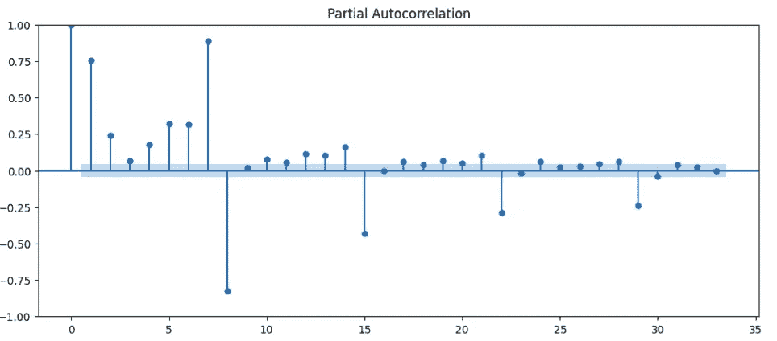*

*Image by the author: Partial Autocorrelation. Hera we can see that the most important days are the last 8 days and peak of correlation each 7 days. It means that the time serie has a recurrence of 7 days.*

*两者的主要区别在于， *Y(t-k)* 的 ACF 不仅考虑了它对 Y(t)的依赖性，还间接考虑了 *Y(t)* 和 *Y(t-k)* 之间的所有中间点。而带有 *Y(t-k)* 的 PACF 只考虑了与 *Y(t)* 和 *Y(t-k)的关系。**

## *1.3 噪声和残差*

*有时数据的方差很大，很难看出任何模式，这是很常见的。这种模式叫做**吵**闹**系列。没有立即解决这个问题的方法。一种可能性是在更高的数据级别上聚集数据(例如在天级别上而不是在小时级别上)。处理数据的另一个常见解决方案是计算系列的**移动** **平均值**。***

```
*df.rolling(window=7).mean().plot()*
```

*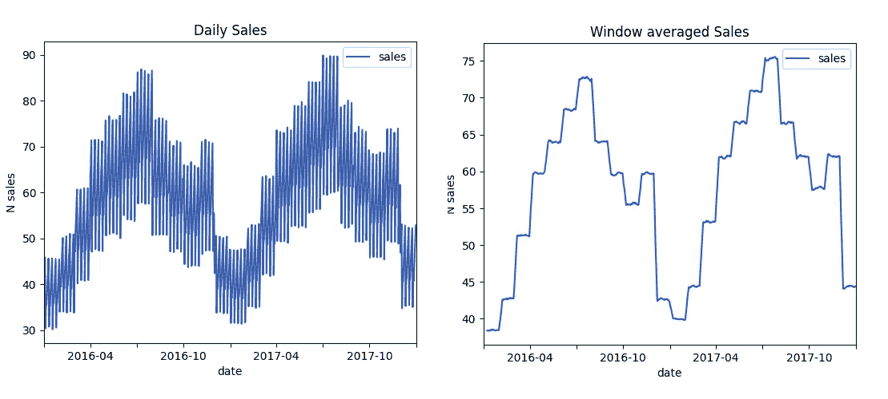*

*Image by the author: Comparison of the original time serie and the window averaged time serie.*

*在我们的例子中，这是不需要的，因为我们正在处理日常数据，并希望预测每天的销售额。如果我们的数据是每小时的销售额，那么将它汇总到每天的总和中会很有趣。*

## *1.4 季节性*

*通常，Y(t)的值不仅与最近的前一个值有关，而且可能有很长的重复周期。这种行为叫做季节性。此外，通常数据不只有一个季节性因素，而是同时有许多季节性因素(例如年度季节性、月度季节性等)。*

> *例如，酒店夏季的预订更多地与去年夏季的预订相关，而不是上个月的预订*

*假设季节性有一个恒定的周期，我们可以通过使用*傅立叶级数分解* ***来计算季节性的每个贡献的这些周期。*** 首先，方便的是 ***从数据中去除趋势*** 的影响。如果数据有线性趋势，我们可以用线性回归来做。*

```
*trend = LinearRegression(
    ).fit(df.index.values.reshape([-1,1]),df.sales
    ).predict(df.index.values.reshape([-1,1]))df.sales = df.sales-trend*
```

*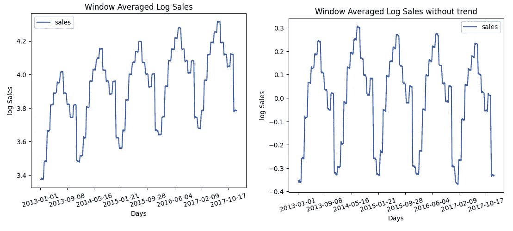*

*Image by the author: Removing the trend of the time serie. We use a linear regression because after the log transformation, the trend follows a linear growth.*

*有了 Y(t)序列，没有趋势，我们可以做傅立叶分解分析。通过分析，我们可以看到季节性的周期性。*

```
*from scipy.fftpack import fft
plt.plot(fft(df.sales.values))*
```

*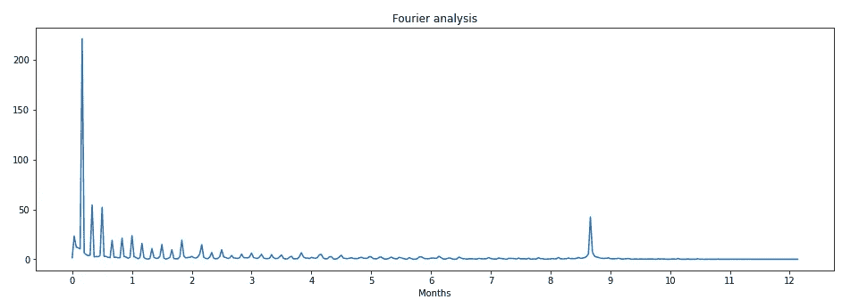*

*Image by the author*

## *1.5 结果分析*

*通过分析我们看到了销售系列的以下特性:*

*   *对数增长下的平稳行为。*
*   *季节性周期为 8.8 个月。*
*   *上个月与当前值高度相关。*
*   *复发 7 天。*

# *2.预测模型—预测时间序列的演变*

*现在我们将分析不同类型的模型来预测销售时间序列的未来。在前面，我们已经分析了销售时间序列的属性，有了这些属性，我们将能够选择最佳模型。*

## *2.1 自动润滑模型*

*自回归模型假设未来值与时间序列的过去值相关，因此，未来值的模型为:*

> *Y(t)= Y(t-1)* a _ t-1+Y(t-2)* a _ t-2+…Y(t-p)* a _ t-p*

*最著名的自回归模型之一是 **ARIMA** 。该模型不仅对序列的过去值进行**自回归**，还通过**移动平均**考虑了过去值的误差。*

> *Y(t)= Y(t-1)* a _ t-1+Y(t-2)* a _ t-2+…Y(t-p)* a _ t-p+*
> 
> *+误差(t-1)*b_t-1 +误差(t-2)*b_t-2 + … +误差(t-q)*b_t-q*

*其中误差(t) = Y(t) — Y(t-1)。这个模型需要时间序列是平稳的，因此它会自动对序列进行 n 阶**微分**以在需要时将序列转换为平稳(需要注意的是，它只做微分，不做指数 o log 变换)。*

> *Y(t)= Y(t)—Y(t-1)—Y(t-2)—Y(t-d)*

*前面公式中的 p、d 和 q 值是调整 ARIMA 所需的参数。p 和 q 可以分别从具有高相关性的部分自相关和相关的最后值中获得。d 值就是保持数列不变的微分的阶。然而，ARIMA 不能处理季节性。这就是为什么存在一个叫做 **SARIMA** 的算法扩展，它可以处理季节性*

```
*import statsmodels.api as smmodel = sm.tsa.statespace.SARIMAX(df_train.sales,
    trend='t', freq='D', order=(30,1,9)
).fit(disp=False, solver='powell')model.predict(365)*
```

*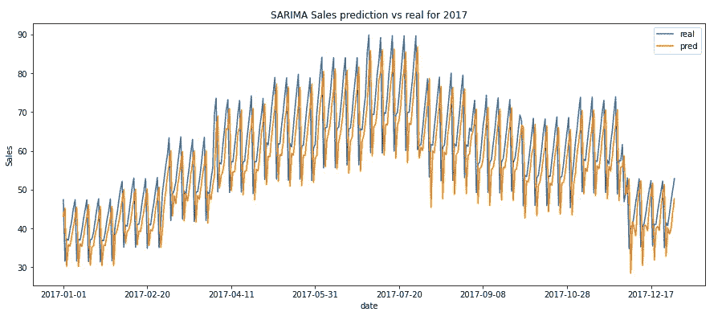*

*Image by the author: Here we can see the predictions of the SARIMA model. We can see that the model perfectly catchs the seasonality, the trend and the variance of the data. This is normal noting that the time serie had a high autocorrelation and partial autocorrelation and the time serie where pretty stationary after the log and 1-order differentiation transformation.*

## *2.2 回归模型*

*正如我们在前面的例子中看到的，当与过去的值有很高的相关性和自相关性时，ARIMA 模型及其变体在预测时间序列中的未来方面非常出色。这只在与过去值的关系是线性相关时有效，当关系是非线性时无效。*

*处理非线性自回归的解决方案是使用非线性回归模型，该模型能够堆叠一个时间窗口的值来进行未来预测。其中一个模型是 LSTM 网络(一种特殊的递归神经网络)。您可以通过将时间序列转换为如下所示的表格数据集来为数据添加季节效应*

```
*weekday_df = pd.get_dummies(
    df.date.dt.dayofweek.to_numpy(), prefix='weekday')df = pd.merge(weekday_df, df, how='inner', on = 'date')*
```

*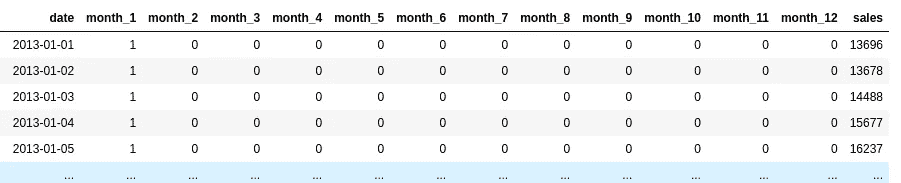*

*Image by the author: Reshape of the origial time serie into a tabular structure. We have added the months for each day to let the model learn the seasonality due to each month of the year.*

*为了将最近的过去值作为自回归模型，我们必须构建一个最近值的移动窗口堆栈。LSTM 模型是通过将窗口值堆叠在一个数组中来构建的，但其他回归模型(如 RandomForest)的构建方式有所不同。*

```
*x = np.zeros((len(df)-seq_size, seq_size, df.shape[-1]-1))
y = np.zeros((len(df)-seq_size, 1))

for i in range(len(df)-seq_size):
    x[i,:,:]=df[i:(i+seq_size),0:-1]
    y[i,:]=df[i+seq_size, -1:]*
```

*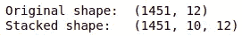*

*Image by the author*

*这种模型的一个优点是不需要事先对时间序列进行深入分析，因为它们能够自己处理非线性关系。*

```
*from keras.models import Sequential
from keras.layers import LSTM, Flatten,Dropout,Denseinputshape = (X_train.shape[1], X_train.shape[2])
model = Sequential()
model.add(LSTM(64, activation='tanh', return_sequences=False))
model.add(Dense(500))
model.add(Dense(1))model.compile(optimizer='adam', loss = 'mse', metrics = ['accuracy'])model.fit(X_train, y_train, verbose=1, epochs = 10, batch_size = 1,shuffle = False)*
```

*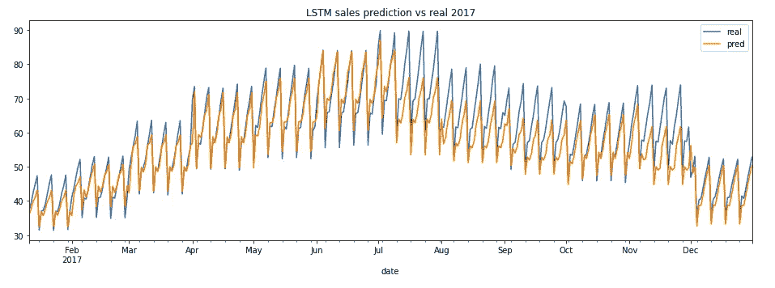*

*Image by the author: Hear we can see the predictions of the LSTM model. we can see that the model capture pretty well the tendency and the variance of the time serie. However, we can see that it fails with the seasonality from half of July to August. This is because we are adding the seasonality to the model with the month number and, as we have seen in the Fourier decomposition, the model follows a strange seasonality of 8.8 which are not entire month. For a more precise result, we should make a finer work of data engineering in the tabular reshape.*

*在这种情况下，我们可以看到，我们可以很容易地使用过去的数据值来建模时间序列，因为这个时间序列可以通过过去的行为来表征。然而，时间序列的演变取决于其他值，甚至其他时间序列。此模型的优点是您可以在模型中包含其他值来预测时间序列的未来行为。*

## *2.3 傅立叶级数模型*

*自回归模型擅长预测未来值与前一个值(移动平均值)具有一定周期性的时间序列，如前一个示例所示。然而，这些模型无法预测没有移动平均贡献并且同时具有多个季节性(每日、每月、每三个月、每周……)的时间序列。*

*目前时间系列最受欢迎的模型之一是 **Prophet** 。该模型的主要优点是能够同时检测和拟合**多个季节性**。同时，还能够同时调整**主趋势**及其断点(指数和线性趋势)。*

*对于我们当前的数据集，我们将使用默认的季节性(每年和每周)，我们还将添加**我们在傅立叶分析中看到的 8.8 个月的季节性行为**。*

```
*from prophet import Prophetmodel = Prophet(
    seasonality_mode='multiplicative',
    ).add_seasonality(name='monthly', period=260, fourier_order=5
                     ).fit(df_train)forecast = model.predict(model.make_future_dataframe(periods=365))*
```

*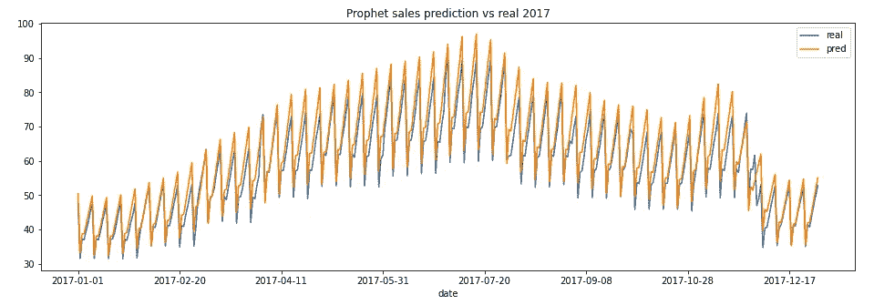*

*Image by the author: Here we can see the predictions of the model Prophet.We can see that it captures very well the seasonality and the trend, but it fails a little with the variance. It may be because the seasonality component in this time serie is abrupt. We could model it better by adding this information to the model through breakpoints.*

*正如我们在代码中看到的，我们将季节性设置为“乘法”。在自回归模型中，我们看到了季节性对时间序列的影响*

> *Y(t)= Y _ 趋势(t)+Y _ 季节(t)*

*然而，有时季节性的影响通过一个因素而不是一个加法来改变趋势。先知能够适应这两种行为*

> *Y(t)= Y _ 趋势(t)* Y _ 季节(t)*

*使用 Prophet，我们还可以看到序列的组件分解，就像我们可以看到时间序列的不同组件一样*

*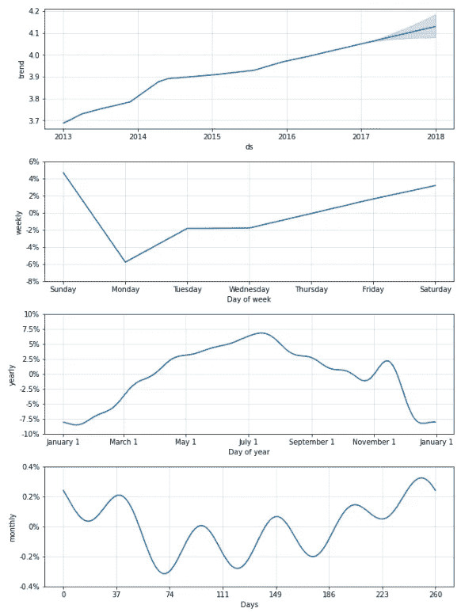*

*Image by the author: Components of the prediction from Prophet*

# *3.结论*

*在这篇文章中，我们解释了一些统计工具来分析和理解时间序列的行为。理解这种行为不仅对于解释过去的值很重要，而且对于了解如何建立预测模型来预测时间序列的未来值也很重要。*

*在所有的预测模型中，我们根据它们的行为定义了 3 种不同的模型。没有最佳模型，但根据时间序列的性质，我们应该选择使用哪一个。在这里，我们展示了一个简单的表格，以了解每个先前模型的功能*

*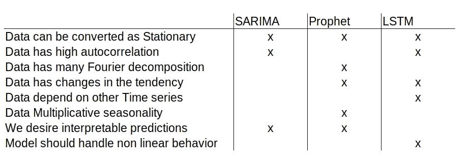*

*Image by the author: Cheat sheet of the strengths and weakness of each of the models.*

*希望你喜欢:)*

*[](https://mlearning.substack.com) [## MLearning.ai 艺术

### 创意经济的人工智能艺术解决方案🟠最先进的机器学习演示，快速易用🔵…

mlearning.substack.com](https://mlearning.substack.com)*