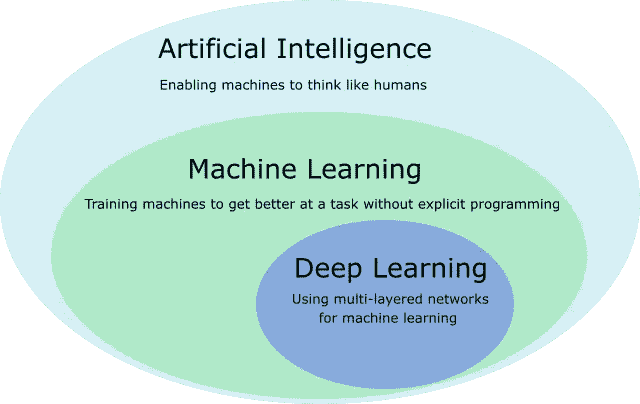
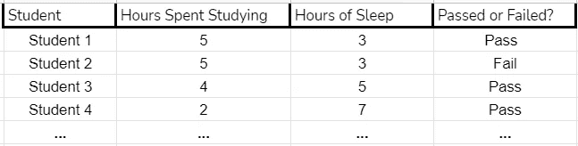
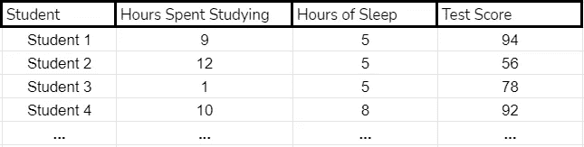
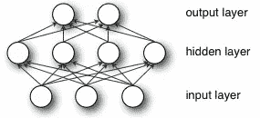
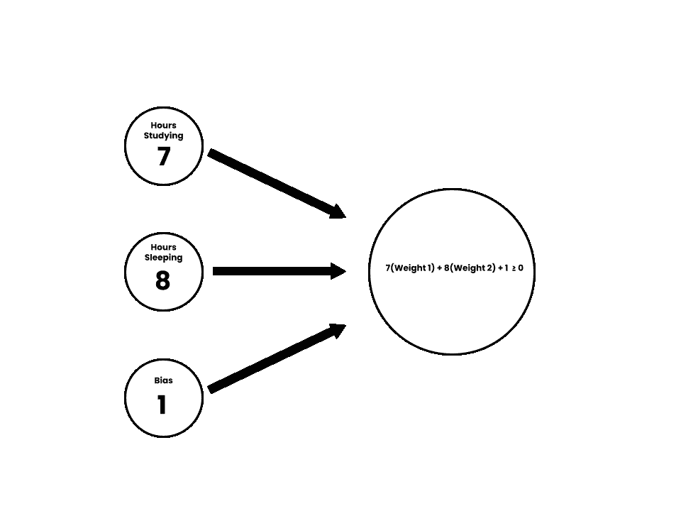
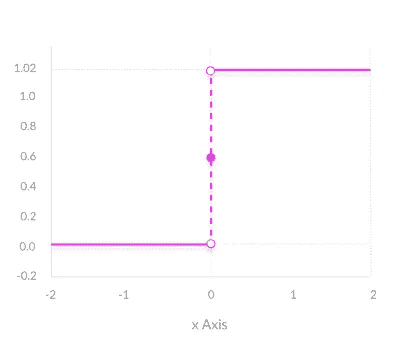
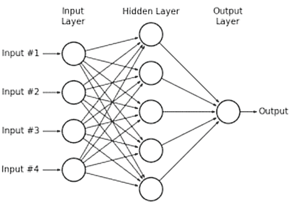

# 人工智能概述

> 原文：<https://medium.com/mlearning-ai/a-general-overview-of-artificial-intelligence-85437b4eabd8?source=collection_archive---------5----------------------->

人工智能或 AI 是一个在过去几年中越来越多地使用的术语。

人工智能是一种试图复制人类智能来完成通常由人类完成的任务的方法。

虽然创建一个智能系统似乎令人困惑，但我们可以开始通过学习来模拟智能。**机器学习**是人工智能的一个大型子集，它让机器使用真实世界的数据进行学习(因此得名)。在机器学习中，有更多包含更多人工智能方法的子集:

Source: [https://www.7wdata.be/wp-content/uploads/2019/05/AIvsMLvsDeepLearningpng.png](https://www.7wdata.be/wp-content/uploads/2019/05/AIvsMLvsDeepLearningpng.png)

有几种不同类型的机器学习，每种类型都用于特定的任务。预定义的三种类型是**监督学习、非监督学习和强化学习。**

# 监督学习

监督学习由带标签的数据组成，这些数据使机器学习模型接受输入并试图预测正确的输出(或标签)。把它想象成一道选择题。你阅读问题，接受并吸收信息。基于这些信息，你试着选择正确的多项选择答案。*有了监督学习，机器的输入就像给定的信息，标签就像答案。*

注意:这些输入通常也被称为**特征**。

## 机器学习到底是怎样的？

简单地说(将在本文后面详述)，模型猜测标签并检查它是否正确。让我们用一个例子来说明:

您希望基于以下两个输入来预测学生是否通过测试:

*   数小时的睡眠
*   花在学习上的时间

为了概念化，下面是一些数据的样子:

This is a **dataset** which displays student data on whether they passed or failed the test and their hours of sleep. This is the data that the machine learning(ml) model will train on(talked about later in the article).

在这里，我们得到了数据。机器将以下列方式处理每一种情况:

1.  收集信息(学习和睡觉花费的时间)
2.  预测学生是通过还是失败
3.  将预测结果与实际结果进行比较(在数据中给出)
4.  尝试修正它的预测方法，以变得更加准确

# 无监督学习

首先，在没有 ***标记的*** 数据集的情况下进行无监督学习。无监督学习预测值，并尝试根据预测中的错误来修正预测方法。

让我们回到前面的例子，但是稍微改变一下数据集。

注意到区别了吗？现在我们在最后有了数值。这到底有什么不同？

首先，我们不能对测试中的每个分数使用 100 个标签(例如“100”，“99”，…)，因为那样会非常低效。相反，现在我们的模型将不得不根据学生花在学习和睡眠上的时间来预测他们的分数。

对于这类任务，我们需要更多的数据。想象你自己试图猜测(有根据的猜测)这些学生的分数。你可以更容易地猜测他们是通过还是失败，所以你需要更少的数据来处理，这也适用于机器学习模型。

该模型将通过以下步骤使其预测更加准确:

1.  收集信息(学习和睡觉花费的时间)
2.  预测考试分数
3.  计算误差(具体函数后面会提到)
4.  基于该误差校正预测算法。

无监督学习是另一种类型的机器学习，但是它可以进一步指定为特定类型。

## 使聚集

聚类分析试图将不同的数据分组到不同的组中。这些组以及使数据点成为组的一部分的因素不是预先确定的，而是由模型来决定。

Source: [https://www.geeksforgeeks.org/clustering-in-machine-learning/](https://www.geeksforgeeks.org/clustering-in-machine-learning/)

## 联合

顾名思义，**关联学习**是一种无监督学习，寻找不同数据点之间的关联。其中一个例子是，如果模型多次发现特定杂货的使用情况，则在每个客户的购物清单上的常用项目之间建立关联。想了解更多关于联想的信息，请看这篇博文:

 [## 联想学习

### 关联学习是一种基于规则的机器学习和数据挖掘技术，它可以发现…

deepai.org](https://deepai.org/machine-learning-glossary-and-terms/association-learning) 

## 异常检测

异常检测是无监督学习的一种形式，它可以发现和检测数据集中的异常值。通过利用没有已知模式的非结构化数据，异常检测可以洞察数据集中的问题或麻烦。异常检测的一些实际应用包括数据过滤、欺诈检测等等。下面是一篇深入探讨异常检测应用的博文:

 [## 基于机器学习的异常检测:介绍

### 异常检测在健壮的分布式软件系统中起着重要的作用。异常检测可以:增强…

www.bmc.com](https://www.bmc.com/blogs/machine-learning-anomaly-detection/) 

# 神经网络

机器学习基于**神经网络。**神经网络的工作方式类似于人的大脑，通过获取输入或数据，学习和自我纠正，就像我们像人类一样在消费信息时学习和适应一样。

神经网络有几个不同的方面。以下是说明神经网络不同部分的描述性图像:

Source: [https://wiki.pathmind.com/neural-network](https://wiki.pathmind.com/neural-network)

如上图所示，神经网络有几层。首先，输入层接收所有提供的信息或数据。有几个方面与输入层无关:

*   输入层有几个**神经元(也称为节点或感知器)**
*   输入层的大小取决于数据的大小→在我们之前的示例中，我们只将学习时间和睡眠时间作为参数。

此外，还有**个隐藏层**试图将数据转换成可用于决策/给出结果的信息。在当前的例子中，隐藏层将把花在学习和睡觉上的时间转换成数字，这些数字可以告诉学生是否及格，这些数字将在**输出层中。**

## 神经网络是如何工作的呢

这个问题问得好！

让我们进一步研究前面讨论的分类问题，学生的睡眠和学习时间，以及学生是否通过或失败的输出。

首先，投入是睡眠时间和学习时间。此外，我们添加了另一个称为偏差的值，该值会随着时间的推移而改变。对于每个输入，它们进入神经元的方式如下:

As you can see, there are 3 inputs into the neuron, which are the hours studying, the hours sleeping, and the bias.

输入的每个值(不包括偏差 1)乘以一个权重。权重是在迭代或**时期**中反复改变的东西，它改变了神经网络如何利用睡眠和学习值。

此外，您可能已经注意到，在神经元的表达式末尾有一个不等式。这是为了表明如果值大于 0，那么学生通过，否则学生失败。

**权重值最初是随机分配的:**例如，假设我们分配权重 1 = .5，权重 2 = -0.25。当我们对这些输入代入方程并求解时，我们得到 2.5 **≥ 0** ，因此表明该学生通过了**。**然而，如果我们查看数据集中的学生，该学生可能失败了，这意味着权重必须调整(也可能有偏差)。

# 激活功能

在神经元内的表达式计算出其值后，**激活函数**确定神经元的输出。对于分类这样的事情，网络给出二进制输出是理想的。这种输出需要**二进制阶跃函数。**激活功能的图像如下:

As depicted, any values greater or equal to zero would return a value of 1, or true, and values less than 0 would equal 0 or a false value. Such functions are useful for classification. Source: [https://missinglink.ai/guides/neural-network-concepts/7-types-neural-network-activation-functions-right/](https://missinglink.ai/guides/neural-network-concepts/7-types-neural-network-activation-functions-right/)

**这些函数基于表达式值**，如前一节权重、偏差和输入值所示。有几个其他的激活函数适用于不同的场景，但是为了简洁起见，本文不会一一介绍。我推荐以下网站，以了解有关不同激活功能的更多信息:

 [## 神经网络中的 7 类激活函数:如何选择？

### 神经网络激活功能是深度学习的重要组成部分。激活功能决定输出…

missinglink.ai](https://missinglink.ai/guides/neural-network-concepts/7-types-neural-network-activation-functions-right/) 

# 深度学习

**深度学习**是机器学习的子集。长话短说，深度学习是更大的神经网络。通常，机器学习模型会在输入和输出之间使用一个单层，使其成为一个**单层感知器:**

As you can see, there is only one hidden layer here. While there are several inputs, since there is still only a single layer in between the inputs and the one output, this is a single layer perceptron. Source: [https://qph.fs.quoracdn.net/main-qimg-a426aed3cf9635d058e14bd49dc899b8](https://qph.fs.quoracdn.net/main-qimg-a426aed3cf9635d058e14bd49dc899b8)

另一方面，深度学习使用更大的神经网络，这意味着更多的层。**记住:一个神经网络只有一个输入和输出层，但是在它们之间可以有更多的隐藏层。**这将使神经网络归类为多层感知器(MLP):

As shown, there is more than one hidden layer making the neural network a multilayer perceptron. Source: [https://www.google.com/url?sa=i&url=https%3A%2F%2Fgithub.com%2FThanasis1101%2FMLP-from-scratch&psig=AOvVaw20Oi0QMk2V82cSIAOtp9DK&ust=1614526958829000&source=images&cd=vfe&ved=0CAIQjRxqFwoTCPDuvuKziu8CFQAAAAAdAAAAABAD](https://www.google.com/url?sa=i&url=https%3A%2F%2Fgithub.com%2FThanasis1101%2FMLP-from-scratch&psig=AOvVaw20Oi0QMk2V82cSIAOtp9DK&ust=1614526958829000&source=images&cd=vfe&ved=0CAIQjRxqFwoTCPDuvuKziu8CFQAAAAAdAAAAABAD)

深度学习模型往往具有更好的准确性，可以用于更多的情况，**然而，dl 模型需要大量的数据来进行训练。**

*使用深度学习方法的模型有哪些类型？*

## 递归神经网络

正常的神经网络从前一层获取输入，然后向下一层输出一些东西。**递归神经网络(RNNs)** 是一种深度学习的形式，它通过记住特征的先前值的输出来使用先前的信息。这张图片很好地描述了 RNNs 的工作方式:

Source: [https://www.google.com/url?sa=i&url=https%3A%2F%2Fdeveloppaper.com%2Fprediction-of-bitcoin-and-ether-price-using-recurrent-neural-network-long-term-memory-rnn-lstm%2F&psig=AOvVaw2TqzMv8ptS_5b8WigEEgdI&ust=1614609610639000&source=images&cd=vfe&ved=0CAIQjRxqFwoTCKiEqtTnjO8CFQAAAAAdAAAAABAH](https://www.google.com/url?sa=i&url=https%3A%2F%2Fdeveloppaper.com%2Fprediction-of-bitcoin-and-ether-price-using-recurrent-neural-network-long-term-memory-rnn-lstm%2F&psig=AOvVaw2TqzMv8ptS_5b8WigEEgdI&ust=1614609610639000&source=images&cd=vfe&ved=0CAIQjRxqFwoTCKiEqtTnjO8CFQAAAAAdAAAAABAH)

RNNs 采用先前的输出，并再次将它们输入到神经网络中。**你可以把这个想象成利用以前的知识继续学习**。RNNs 有几种有用的应用，比如用机器学习构建句子甚至音乐。众所周知，rnn 有一个问题，即它们的梯度在开始时太小，导致它们学不到任何东西，或者有“短期记忆”。

**LSTMs(或长短期记忆)**机器学习模型是一种递归神经网络。LSTMs 存储一个名为**单元状态**的存储器，并使用三个不同的门确定哪些信息应该被遗忘，或者作为输入和输出。简而言之，LSTMs 具有更好的记忆，但是另外能够忘记可能不值得记住和放入单元状态的信息。这里有一个非常有用的视频，帮助解释 LSTMs 如何深入工作:

这里有另一个来源，你可以查看以获得更多关于深度学习内部工作的信息:

 [## 什么是深度学习？-机器学习精通

### 深度学习是机器学习的一个子领域，它涉及的算法是由大脑的结构和功能激发的

machinelearningmastery.com](https://machinelearningmastery.com/what-is-deep-learning/) 

# 人工智能的应用

人工智能对现实世界有着巨大的影响，并将持续很长一段时间。以下是机器学习如何实时应用的一些例子:

1.  **搜索引擎/推荐—** 无论你是在 Youtube 上观看视频，还是在学校研究论文中搜索文章，你的行为都会产生数据。这种类型的数据可以让更好的搜索引擎结果出现在你面前，也可以让 youtube 创建一个推荐视频列表(*你一定在浏览 Youtube 的某个时候看过)。*
2.  **业务分析—** 企业都有内部数据洞察力，如销售报告、收入、运营成本，以及能够提供市场趋势洞察力的外部竞争对手数据。机器学习在这里有巨大的机会，可以访问大量数据，并可以提供人眼难以捕捉的洞察力。

如果我要列出人工智能的每一个应用，这将是一篇很长的文章！

这里有一些其他的应用，你可以看看(这些是非常普遍的某些领域，但有例子，你可以深入研究)👍):

 [## 机器学习让成熟行业变得更聪明的 15 个例子

### 肯·詹宁斯的历史性危机！连胜在 2011 年 2 月 16 日告一段落。在连续赢了 74 场比赛后…

builtin.com](https://builtin.com/artificial-intelligence/machine-learning-examples-applications) 

我叫 Ankit Nakhawa，今年 15 岁，对 BCIs 和 AI 充满热情。如果你想问一个问题，和我谈谈这篇文章，或者其他什么，你可以通过***【ankitnakhawa@gmail.com】、*** 或 [LinkedIn](https://www.linkedin.com/in/ankit-nakhawa-3686211b6/) 联系我，我希望收到你的来信！

请随意查看我的其他文章！

[https://medium.com/@ankitnakhawa/](https://medium.com/@ankitnakhawa/has-recommended)