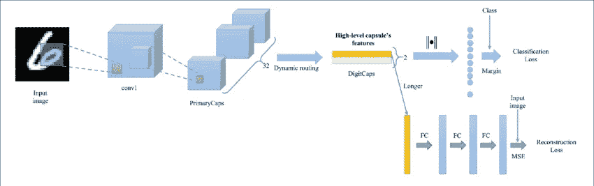

# 胶囊网的詹蒂利介绍

> 原文：<https://medium.com/mlearning-ai/a-gentil-introduction-to-capsule-nets-211a74d9165?source=collection_archive---------8----------------------->

Photo by [Sangga Rima Roman Selia](https://unsplash.com/@sxy_selia?utm_source=medium&utm_medium=referral) on [Unsplash](https://unsplash.com?utm_source=medium&utm_medium=referral)

# 介绍

神经网络是人工智能的支柱。自从沃伦麦卡洛克在 1943 年开发了人工神经元，并在 20 世纪由 Frank Rosenblatt 和 Arthur Samuel 进一步推进以来，人工智能领域在学术界和工业界都有了显著的发展。

人工智能最近的发展和繁荣表明了在该领域已经做了多少研究，以及常规方法如何得到进一步增强，从而为人工通用智能的乐观未来铺平了道路(AGI)。

卷积神经网络(ConvNets)是一种深度学习算法，主要用于图像处理，是 21 世纪初出现的新方法之一。这种技术已经存在了一段时间，并在该领域得到了快速发展，它仍然广泛应用于图像分类、对象检测和分割、模式识别以及许多其他涉及图像、视频的任务，以及文本处理中的有限使用，以及超出其最初使用范围的语音。自 Yann LeCun 于 1988 年创建以来，ConvNets 是深度学习领域研究最多、性能最高的架构之一。

为了理解顶点网及其解决的问题，我们需要探索顶点网及其带来的问题。

# 卷积神经网络

卷积神经网络(ConvNets)架构的灵感来自人脑中的连接模式。当给定一幅图像作为输入时，ConvNets 可以通过给它们不同的权重和偏差来区分图像中不同的方面和对象。这是通过对输入图像应用大量矩阵乘法和求和来实现的，这导致可靠的预测。ConvNets **能够捕捉图像中的空间和时间相关性**。卷积层、池层和全连接层是通信网中的三个主要层。每一层都以渐进的粒度级别理解图像。第一层最有可能代表简单的几何形式曲线，边缘，清晰度和颜色。而随后的层试图理解复杂的形状，如矩形、正方形，直至复杂的形状，如人脸、动物等。

## 卷积层

卷积层是 CNN 的主要组成部分。它包含一组过滤器(或内核)，其参数将在整个训练中学习。过滤器的尺寸通常小于图像的实际尺寸。每个过滤器与图像卷积，并创建一个激活图。简单来说，卷积层将图像简化为一组特征及其各自的位置。

## 汇集层

池化图层是 CNN 中使用的一个非常关键的操作，池化有助于减少要素地图表示的空间大小。换句话说，汇集层接收由卷积层生成的特征图，并返回特征图的一个区域中存在的特征的统计概要。这有助于减少要学习的参数数量和网络中执行的计算数量。在所有情况下，汇集提供了一些平移不变性，即无论特征出现在表示中的什么位置，都会产生完全相同的结果。例如，我们总是认为一只狗是一只狗，不管它在图像的哪个位置，中间，还是左下方。等等。

> 这意味着无论对象出现在帧的什么位置，它都是可识别的。

## 完全连接的层

一个完全连接的层就是一个前馈神经网络。完全连接的层构成了网络的最后几层。全连接层的输入通常是最终汇集层或卷积层的输出。来自汇集层或卷积层的输出在被馈送到全连接层之前被展平。

要更深入地了解 ConvNets [请点击此处](https://towardsdatascience.com/convolutional-neural-networks-explained-9cc5188c4939)

# ConvNets(池层)的问题

如上所述，CNN 有多个过滤器堆叠在一起，学习识别独立于图像本身位置的特定特征。这些特征在网络的初始层是简单的，并且随着网络变得更深而变得更加复杂。

ConvNets 中非常重要的一层是连接池层。池化是 CNN 中非常关键的操作，它旨在创建位置不变性(位置不变性是指仅使用一种表示来识别不同位置的相同对象。)并且它被用在每个 CNN 层之后，以使问题在计算上更易处理。然而，池操作的问题是，它迫使我们丢失图像中的所有位置数据，丢失了有价值的信息，并且还忽略了图像的一部分。例如，如果我们在图像中有一张脸，这张脸由眼睛、嘴和鼻子组成。图像中一个非常重要的特征是这些部分之间存在空间关系(例如，嘴在鼻子下面，鼻子通常在眼睛下面)。在这个例子中，CNN 会很好地将图像分类为面部，同样，如果有面部的一部分，假设嘴移动到图像的左上方，CNN 仍然会将图像分类为面部，而不考虑图像中特征的空间位置。简而言之，CNN 可以通过统计来学习图像的模式，但不能学习不同方向上的实际图像。

从技术上讲，我们不需要位置不变性，而是需要等方差，即我们希望理解图像中的旋转或比例变化，并且我们希望相应地调整网络。这样，图像中不同组件之间的空间定位不会丢失。

正如杰弗里·辛顿所说，

> “卷积神经网络中使用的池操作是一个巨大的错误，它如此有效的事实是一场灾难。”

# 胶囊网络:问题解决者

caps nets conv nets 问题的解决方案(协议路由机制)。CapsNets 是一种最新的创新型深度学习网络。2017 年 10 月底，Sara Sabour、Nicholas Frost 和 Geoffrey Hinton 在一篇名为*的开创性论文中介绍了这种算法。Hinton 在整个深度学习界被广泛认为是深度学习之父。事实上，CapsNets 已经在 MNIST 分类上击败了最好的 CNN，这很好，令人印象深刻！！*

胶囊是一组神经元，其活动向量表示特定类型的实体(例如对象或对象部分)的参数。活动向量的长度用于表示实体存在的概率，其方向用于表示实例化参数。一级的主动胶囊通过变换矩阵对更高级胶囊的实例化参数进行预测。(当多个预测一致时，更高级别的胶囊变得活跃。辛顿*等人*能够证明，与康文网络相比，胶囊网络在识别高度重叠的数字方面达到了 MNIST 的 SOTA 性能。为了实现这一点，使用了迭代的协议例行程序机制。

## CapsNets 如何解决 ConvNets 问题？

问题是我们如何表示多维实体？这个想法是，在一幅图像的每个区域，我们假设最多有一个特定类型的特征，然后我们将使用一群神经元，它们的活动将代表该特征的不同方面，比如在该区域内，它的 x 和 y 坐标到底是什么？它在什么方位？它移动的速度有多快？它是什么颜色的？有多亮？诸如此类的东西。所以我们可以用一大堆神经元来代表同一事物的不同维度，前提是只有一个神经元。这种表示方法与通常使用神经网络的方式有很大不同，在通常情况下，网络的每一层都试图预测特定的单个实体。

通常在神经网络中，我们只有一个很大的层，所有的单元都去做一些矩阵乘法和求和，通常是为了预测一个单一的实体。然而，我们应该做的是尝试将它们组合成更小的组，以表示单个实体的各种坐标。为了表示，每个更小的分组(子集)可以被称为一个胶囊，其思想是胶囊能够表示一个特征的实例，但只能表示一个。它代表了该特性的所有不同属性。这是一个具有许多属性的特性，而普通网络只有一种属性。

拿到胶囊后，我们可以做一些神经网络不擅长的事情，这就是 Geoffry 所谓的协议的**例程。乔佛里用简单的一句话解释为；假设你想做分割，你有一个可能是嘴的东西和一个可能是鼻子的东西。你想知道是否应该把它们放在一起做成一件东西。所以常规协议的想法是我们应该有一个用于嘴的胶囊，它有嘴的参数，你有一个用于鼻子的胶囊，它有鼻子的参数，然后破译是否把它们放在一起，你让他们每个人投票决定一张脸的参数应该是什么。现在，如果嘴和鼻子处于正确的空间关系，它们会一致。因此，当你在一个层次上让两个胶囊为下一个层次上的同一组参数投票时，你可以假设他们可能是对的，因为在高维空间中达成一致是非常不可能的。这是一种非常不同的过滤方式，不同于我们通常在传统神经网络中使用的方式。**

协议路由对于让神经网络更好地从有限的数据中进行归纳、更好地了解观点的变化以及更好地进行分割至关重要。

## **对 CapsNet 更深层次的了解**

Image from [Paper](https://www.researchgate.net/publication/327775001_Accurate_Reconstruction_of_Image_Stimuli_From_Human_Functional_Magnetic_Resonance_Imaging_Based_on_the_Decoding_Model_With_Capsule_Network_Architecture)

让我们假设，对于单次固定，解析树是从固定的多层神经网络中雕刻出来的，就像从岩石中雕刻出来的雕塑一样。每一层将被分成许多称为“胶囊”的神经元小组(*、辛顿等人【2011】*)，解析树中的每个节点将对应于一个活动胶囊。使用迭代路由过程，每个活动胶囊将选择上一层中的胶囊作为其在树中的父胶囊。对于视觉系统的更高层次，这个迭代过程将解决将部分分配给整体的问题。活动囊内神经元的活动代表了图像中存在的特定实体的各种属性。这些属性可以包括许多不同类型的实例化参数，例如姿态(位置、大小、方向)、变形、速度、反照率、色调、纹理等。一个非常特殊的属性是图像中实例化实体的存在

封装的输出是一个向量的事实使得使用强大的动态路由机制来确保封装的输出被发送到上一层中适当的父节点成为可能。最初，输出被路由到所有可能的父节点，但通过总和为 1 的耦合系数按比例缩小。对于每个可能的亲本，胶囊通过将其自己的输出乘以权重矩阵来计算“预测向量”。如果该预测向量与可能的父项的输出具有大的标量积，则存在自上而下的反馈，该反馈增加该父项的耦合系数，并减少其他父项的耦合系数。这增加了胶囊对该父项的贡献，从而进一步增加了胶囊预测与父项输出的标量积。

这种类型的“按协议路由”应该比 max-pooling 实现的非常原始的路由形式有效得多，max-pooling 允许一层中的神经元忽略下面一层的本地池中除了最活跃的特征检测器之外的所有特征检测器。我们证明了我们的动态路由机制是实现分割高度重叠对象所需的“解释”的有效方式。

卷积神经网络(CNN)使用学习特征检测器的翻译副本。这允许他们将在图像中的一个位置获得的关于良好权重值的知识转换到其他位置。事实证明，这对于图像解读非常有帮助。即使我们用矢量输出胶囊代替了 CNN 的标量输出特征检测器，用协议路由代替了最大池，我们仍然希望在空间上复制所学的知识。为了实现这一点，我们把胶囊的最后一层做成卷积的。与 CNN 一样，我们制作更高级别的胶囊来覆盖图像的更大区域。然而，与 max-pooling 不同的是，我们不丢弃关于实体在区域内的精确位置的信息。对于低级胶囊，位置信息是“位置编码的”,通过该位置信息胶囊是活动的。随着我们在层次上的提升，越来越多的位置信息被“速率编码”在胶囊输出向量的实值分量中。这种从位置编码到速率编码的转变，结合更高级别的胶囊代表具有更多自由度的更复杂实体的事实，表明胶囊的维度应该随着我们在层级中的上升而增加。

要进一步了解 CapsNet，请查阅 Hinton 的论文。其他有用的资源:

*   [了解辛顿的胶囊网络](/ai³-theory-practice-business/understanding-hintons-capsule-networks-part-i-intuition-b4b559d1159b)
*   [胶囊网络:新的深度学习网络](https://towardsdatascience.com/capsule-networks-the-new-deep-learning-network-bd917e6818e8)
*   [卷积神经网络有什么问题？](https://towardsdatascience.com/what-is-wrong-with-convolutional-neural-networks-75c2ba8fbd6f)
*   [理解胶囊网络及其在计算机视觉中的实现](https://analyticsindiamag.com/understanding-capsule-net-with-its-implementation-in-computer-vision/)
*   [卷积神经网络中的平移不变性](https://divsoni2012.medium.com/translation-invariance-in-convolutional-neural-networks-61d9b6fa03df)

 [## Mlearning.ai 提交建议

### 如何成为 Mlearning.ai 上的作家

medium.com](/mlearning-ai/mlearning-ai-submission-suggestions-b51e2b130bfb)