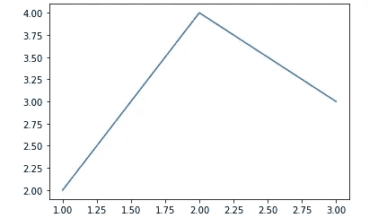
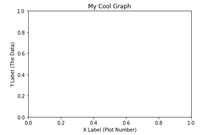
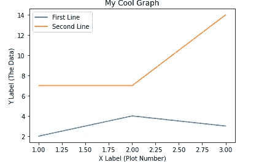
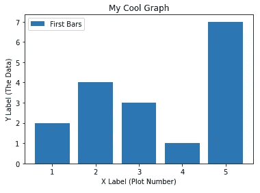
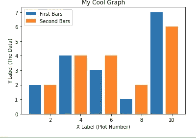
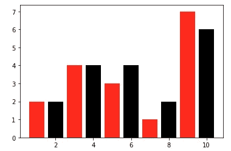
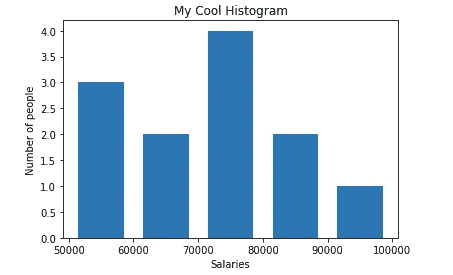
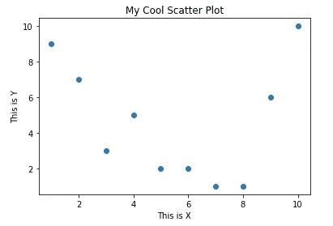
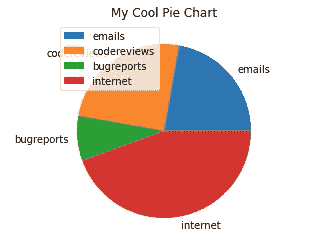

# 使用 Matplotlib 的数据可视化简介

> 原文：<https://medium.com/mlearning-ai/a-gentle-introduction-to-data-visualization-using-matplotlib-58c2170de5b3?source=collection_archive---------7----------------------->


# 什么是数据可视化？

简单地说，这是一种表示数据的方式

数据可视化是数据的图形化表示。通过使用图表、图形和地图等可视化元素，数据可视化工具为查看和理解数据中的趋势、异常值和模式提供了一种便捷的方式。

在大数据世界中，数据可视化工具和技术对于分析海量信息和做出数据驱动的决策至关重要。

最常用的工具有——Tableau、Matplotlib、Seaborn、PoweBI、Amazon Quicksight。

今天我们将关注 Matplotlib，这是一个用于数据可视化的 python 库。

## Matplotlib 简介

Matplotlib 是一个 Python 库，经常与 Jupyter Notebook 一起使用。matplotlib 中使用的模块称为 pyplot。

在本教程中，我们将回顾一些使用 Jupyter notebook 绘制图形的 matplotlib 技术。

```
#import the library
import matplotlib.pyplot as plt
```

绘制一个简单的图表

```
plt.plot([1, 2, 3], [2, 4, 3])plt.show()
```



图例、标题和标签

```
x = [1, 2, 3]
y = [2, 4, 3]
plt.xlabel('X Label (Plot Number)')
plt.ylabel('Y Label (The Data)')plt.title('My Cool Graph')
plt.show()
```



```
x = [1, 2, 3]
y = [2, 4, 3]x2 = [1, 2, 3]
y2 = [7, 7, 14]plt.plot(x, y, label='First Line')
plt.plot(x2, y2, label='Second Line')
plt.xlabel('X Label (Plot Number)')
plt.ylabel('Y Label (The Data)')plt.title('My Cool Graph')
plt.legend()
plt.show()
```



条形图和直方图

条形图

```
x = [1, 2, 3, 4, 5]
y = [2, 4, 3, 1, 7]plt.bar(x, y, label='First Bars')plt.xlabel('X Label (Plot Number)')
plt.ylabel('Y Label (The Data)')plt.title('My Cool Graph')
plt.legend()
plt.show()
```



```
x = [1, 3, 5, 7, 9]
y = [2, 4, 3, 1, 7]x2 = [2, 4, 6, 8, 10]
y2 = [2, 4, 4, 2, 6]plt.bar(x, y, label='First Bars')
plt.bar(x2, y2, label='Second Bars')plt.xlabel('X Label (Plot Number)')
plt.ylabel('Y Label (The Data)')plt.title('My Cool Graph')
plt.legend()
plt.show()
```



指定颜色-

```
plt.bar(x, y, label='First Bars', color='red')
plt.bar(x2, y2, label='Second Bars', color='black')
```



直方图

```
import matplotlib.pyplot as pltsalaries = [55312, 88143, 57423, 65872, 68154, 77554, 72345, 79492, 52310, 88541, 97000, 105234, 73198]
bins = [50000, 60000, 70000, 80000, 90000, 100000]plt.hist(salaries, bins, histtype='bar', rwidth=0.7)plt.xlabel('Salaries')
plt.ylabel('Number of people')plt.title('My Cool Histogram')plt.show()
```



散点图

```
import matplotlib.pyplot as pltx = [1, 2, 3, 4, 5, 6, 7, 8, 9, 10]
y = [9, 7, 3, 5, 2, 2, 1, 1, 6, 10]plt.scatter(x, y)plt.xlabel('This is X')
plt.ylabel('This is Y')plt.title('My Cool Scatter Plot')plt.show()
```



饼图

```
import matplotlib.pyplot as pltdays = [1, 2, 3, 4, 5]emails = [1, 1, 2, 3, 1]
codereviews = [2, 1, 1, 2, 3]
bugreports = [0, 0, 1, 0, 2]
internet = [3, 4, 2, 2, 5]slices = [sum(emails), sum(codereviews), sum(bugreports), sum(internet)]
tasks = ['emails', 'codereviews', 'bugreports', 'internet']plt.pie(slices, labels=tasks)plt.title('My Cool Pie Chart')
plt.legend()
plt.show()
```

[](/mlearning-ai/mlearning-ai-submission-suggestions-b51e2b130bfb) [## Mlearning.ai 提交建议

### 如何成为 Mlearning.ai 上的作家

medium.com](/mlearning-ai/mlearning-ai-submission-suggestions-b51e2b130bfb)