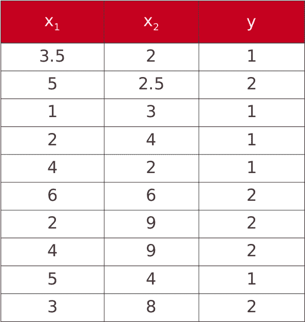
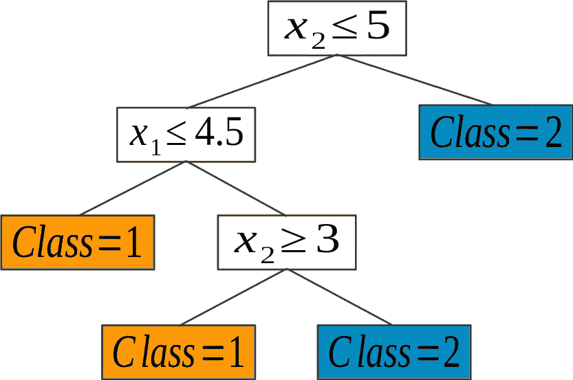
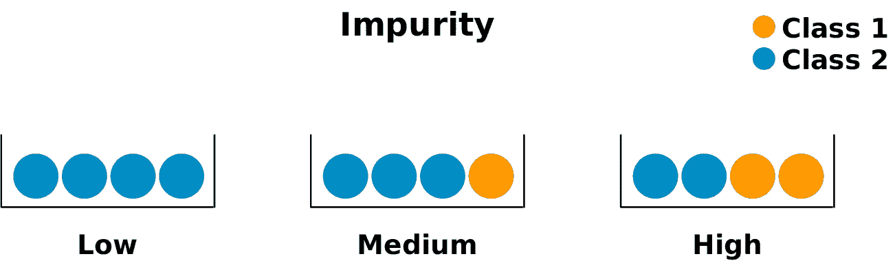
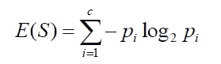
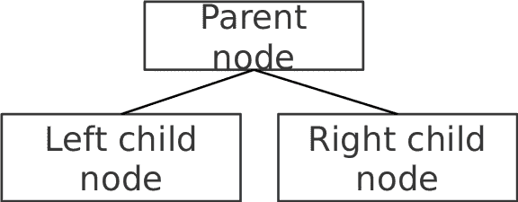

# 决策树的简明介绍

> 原文：<https://medium.com/mlearning-ai/a-gentle-introduction-to-decision-trees-3f85fb0c451e?source=collection_archive---------8----------------------->


Photo by [Mark König](https://unsplash.com/@markkoenig?utm_source=medium&utm_medium=referral) on [Unsplash](https://unsplash.com?utm_source=medium&utm_medium=referral)

# 什么是决策树？

决策树是一种分类算法，使用基于树的方法来分类。

决策树是倒过来画的，它的根在顶部。最顶端的节点代表根节点，然后继续到条件/ **内部节点**，基于此，树分裂成分支/ **边缘**。不再分裂的树枝末端，代表决定/ **叶子。**

假设我们有一个数据集如下——其中 x1 和 x2 是因变量，y 是目标变量。



上述数据集的决策树将如下图所示。对于每个阶段，测试一个条件，属于该条件的数据行被拆分，直到我们到达死胡同。

死胡同可能是当你已经达到最大深度或者当你已经达到最大叶子数的时候。

树的开始应该具有最高的杂质。什么是杂质？让我们在下一节讨论。



# 杂质函数

创建决策树的方法包含一些杂质的概念。当决定在一个节点上测试哪个条件时，我们考虑问题后其子节点中的杂质。我们希望它尽可能的低(或者高纯度)。

例如，考虑下图。最右边的子集是具有最高杂质的子集，这意味着测试时的条件将导致两类分裂的相等或良好混合，而不像最左边的子集，分裂将立即到达终端或叶节点。



# 熵和基尼杂质

## 有两种广泛使用的杂质函数-

## 基尼杂质

这衡量了我们错误分类数据点的概率。

让假设我们有 C 个总类别，p(i)p(i)p(i)是选择具有类别 iii 的数据点的概率，那么基尼系数杂质计算如下

```
G=∑i=1Cp(i)∗(1−p(i))
```

**基尼系数为 0 的杂质是最低和最好的杂质**。只有一切都是同一个阶层，才能实现。

## 熵

熵可以定义为亚分裂纯度的量度。熵总是在 0 到 1 之间。任何分裂的熵都可以用这个公式来计算



如果我们比较这两种方法，那么就计算能力而言，基尼系数比熵更有效。

# 信息增益

父节点的杂质和子节点杂质的加权和之差被定义为信息增益。
子节点的杂质越低，信息增益越大

# 既然我们理解了杂质和信息增益，让我们形式化 CART 算法

CART 代表分类和回归树。它构建了一个二叉树(是-否分裂)。

1.  循环遍历每个特征并分割它所取的每个值:
    将数据集分割成两部分(左和右):
    跟踪使杂质(信息增益)平均减少最大化的分割:



2.递归地将左右数据集传递给子节点。

3.如果满足一些停止标准，什么也不做:只识别返回的值
最佳猜测:平均或最常见的类

[](/mlearning-ai/mlearning-ai-submission-suggestions-b51e2b130bfb) [## Mlearning.ai 提交建议

### 如何成为 Mlearning.ai 上的作家

medium.com](/mlearning-ai/mlearning-ai-submission-suggestions-b51e2b130bfb)