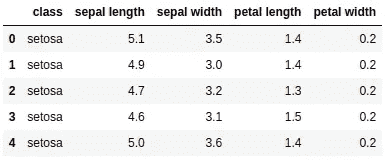
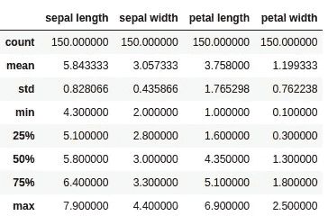
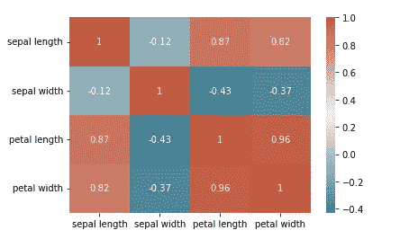
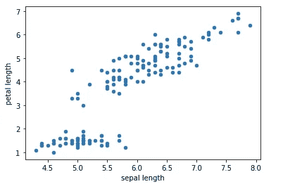

# Python 中的 EDA(探索性数据分析)简介

> 原文：<https://medium.com/mlearning-ai/a-gentle-introduction-to-eda-exploratory-data-analysis-in-python-38e9c021fd3c?source=collection_archive---------1----------------------->


探索性数据分析，通常称为 EDA，是分析数据集的过程。这包括以下三个部分-

1.  **了解您的数据变量或列**
2.  **清理你的数据集**
3.  **分析变量或列之间的关系**

# **了解你的变量**

我们将使用一个流行的数据集— iris 作为我们的用例。使用此链接获取— [iris](https://archive.ics.uci.edu/ml/datasets/iris) 。

1.  **df.shape** 返回我的数据集的行数乘以列数。

```
df.shape()(149, 5)
```

**2。df.head()** 返回数据集的前 5 行。

```
df.head()
```



3. **df.columns** 返回数据集中所有列的名称。

```
df.columnsIndex(['class', 'sepal length', 'sepal width', 'petal length', 'petal width'], dtype='object')
```

4. **df.nunique(axis=0)** 返回每个变量唯一值的个数。

```
df.nunique(axis=0)class            3
sepal length    35
sepal width     23
petal length    43
petal width     22
dtype: int64
```

5. **df.describe()** 总结数字变量的计数、平均值、标准差、最小值和最大值。

```
df.describe
```



# **清理你的数据集**

1.  删除空值-这将删除所有包含空值的列和行。如果您想将其限制为仅行或列，可以指定 axis=0，1。

```
df.dropna()
```

2.剔除异常值—

异常值会扭曲数据并导致不正确的结果。因此，去除它们是很重要的。这里，我们使用 z-score 来查找异常值。

```
from scipy import stats
import numpy as np
z = np.abs(stats.zscore(df[['sepal length','sepal width','petal length', 'petal width']]))
threshold = 3 /*can be changed*/
print(np.where(z > 3))(array([15]), array([1]))
```

这意味着第 15 行第 1 列的数据点是异常值。

3.删除冗余列-

有时，多个列可以包含相同/相似的值。在这种情况下，拥有两列并不会给模型增加任何价值。所以，删除多余的列是明智的。

4.删除多余的行-

这取决于用例，但是如果重复记录没有意义，那么删除多余的行是明智的

```
df.drop_duplicates()
```

# **分析变量或列之间的关系**

最后一步是确定数据列/变量之间存在的任何关系。

1.  相关矩阵

**相关矩阵**是显示多个变量之间相关系数的表格。

```
# calculate correlation matrix
corr = df.corr()# plot the heatmap
import seaborn as sns
sns.heatmap(corr, xticklabels=corr.columns, yticklabels=corr.columns, annot=True, cmap=sns.diverging_palette(220, 20, as_cmap=True))
```



从矩阵中可以看出，萼片长度与花瓣长度呈正相关，萼片宽度与花瓣长度呈负相关。

2.散点图

**散点图**是一种图表，它沿着两个轴“绘制”两个变量的值，如年龄和身高。

```
df.plot(kind='scatter', x='sepal length', y='petal length')
```



虽然有许多其他的图，例如直方图、箱线图、对线图等..您可以探索您的用例，这些涵盖了最常用的 EDA 步骤。快乐分析！

[](/mlearning-ai/mlearning-ai-submission-suggestions-b51e2b130bfb) [## Mlearning.ai 提交建议

### 如何成为 Mlearning.ai 上的作家

medium.com](/mlearning-ai/mlearning-ai-submission-suggestions-b51e2b130bfb)