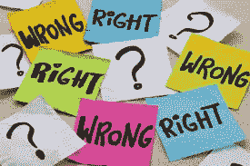

# 人工智能伦理学简介

> 原文：<https://medium.com/mlearning-ai/a-gentle-introduction-to-ethics-of-ai-64a0142c7570?source=collection_archive---------14----------------------->

Introduction to Ethics of AI

最近人工智能应用在日常生活中的蓬勃发展带来了一些关于道德用法的事实错误和担忧。多种法律、社会和商业反馈透露了对人工智能可能造成令人不快的影响的担忧——它可能侵犯隐私，操纵和威胁人类，或出于非法动机使用数据。在全面使用人工智能之前，这些日益增长的担忧需要通过道德保证来解决，我们称之为“人工智能的伦理”。

**我们为什么需要人工智能伦理？** “人工智能伦理”是“技术伦理”的一个子领域，主要回答人工智能的社会、法律和伦理方面的问题，即以道德上可接受的方式采用和改造技术需要遵循什么原则和实践。要理解伦理学，我们需要熟悉道德哲学的子领域；
-**:实体的存在，伦理的意义，道德判断的范围。
-**规范伦理学:研究道德行为和确定道德行为的实际手段。
- **应用伦理学**:伦理学在特定情境中的实际应用。****

# ****AI 伦理的原则是什么？****

****人工智能道德对于近期目标(隐私、透明)、短期目标(人工智能应用在医疗保健、政治中的影响)和长期目标(人工智能在社会中的基本应用)来说是突出的。人工智能的伦理可以被认为是机器人伦理和机器伦理的联盟。鉴于人工智能在世俗生活中的快速实施，它们被压缩为五个基本原则。****

*   ******有利/无害原则:**‘有利’是指‘有益于某人’，而‘无害’是指不伤害某人。因此，这个原则的问题是——我们应该有利而不是不利地使用人工智能吗？****
*   ******问责原则:**如果 AI 造成伤害，谁该负责？****
*   ******透明原则:**我们是否应该理解 AI 执行什么、为什么执行以及如何执行？****
*   ******公平原则**:AI 是否应该不偏不倚？****
*   ****尊重基本人权的原则:AI 应该尊重和促进人权吗？****

# ******为什么 AI 伦理不能遵循功利主义？******

********

****Img source: Google****

****伦理学明显指向功利主义，一种旨在最大化积极结果并遵循相应的是非理论的规范伦理学研究。它遵循三个简单的原则:****

*   ****积极的结果是我们唯一的目标****
*   ****任何导致积极结果的事情都是正确的，而任何导致消极结果的事情都是错误的。****
*   ****所有积极的结果都是平等的。****

****然而，功利主义作为一种理想世界的哲学，不能在现实生活中实施。它没有主观地考虑‘对’和‘错’的定义；在某些情况下，我们无法预测我们行为的结果，而且考虑到影响它们的多种因素，所有的收益也不一定相等。****

# ****道德挑战****

****然而，由于人工智能是一个发展中的领域，它不断改变形状，以适应尽可能多的领域，从而实现最大的技术进步，我们仍然面临许多伦理挑战。例如:****

*   ****面部和语音识别对白人男性图像和语音命令的准确率最高。****
*   ****亚马逊不得不放弃他们基于人工智能的招聘方法，因为不平衡的数据更倾向于男性候选人。****
*   ****自从人形机器人索菲亚在沙特阿拉伯获得荣誉公民身份以来，机器人权利一直是一个令人费解的讨论。反对机器人权利的论点认为这是“可避免的和不必要的”；然而,“感觉主义”的哲学促进了他们的权利。****
*   ****自动驾驶汽车“如果发生任何事故，谁将承担责任”的法律责任。****
*   ****可解释的人工智能正在开发中，以减少在神经网络等复杂算法中出现的人工智能“黑箱”(缺乏透明度和理解)，在这种情况下，我们无法轻松检测到故障。****

# ****朝着正确的方向前进****

********

****Freepik image****

****尽管许多哲学和社会理论都提出了人工智能的最终威胁——算法以其超级智能压倒了人类，但人类的神经网络大脑是其中最强大的。在其最高形式下，人工智能还将用于社会福利，如疾病预测、消除贫困和减少体力劳动。然而，考虑到人工智能应用过去的错误和担忧，一些组织和政府已经建立了人工智能规范和道德规范，以实现平稳和道德的功能。****

*   ****亚马逊、脸书、IBM、谷歌、苹果和微软已经建立了一个非营利性的“人工智能造福人类和社会的伙伴关系”，旨在增强观众对人工智能的理解，并制定人工智能技术的最佳实践。如果观众希望了解技术细节，他们提供各种各样的在线免费课程。****
*   ****欧盟委员会最近在 2019 年发布了“可信人工智能的道德准则”，并包含一个独立的机器人部门。****
*   ****一些学术倡议也已启动，如 IEET、IEAI 和牛津大学的一些单位。****
*   ****诸如“算法正义联盟”、“人工智能为酷儿”和“数据为黑人生活”等私人组织也是为了促进未来应用的无偏见人工智能算法而建立的。****

# ****想了解更多？****

****如果你想更深入地了解这个话题，我推荐你学习赫尔辛基大学 MOOCs 平台提供的“人工智能伦理”免费在线课程。它提供了关于这些道德规范如何在我们当前的社会中发挥作用及其活力的深入知识。它还包含有趣的问题供您回答，您还可以查看其他志同道合的学生的答案，作为同行评议练习！****

**** [## Mlearning.ai 提交建议

### 如何成为 Mlearning.ai 上的作家

medium.com](/mlearning-ai/mlearning-ai-submission-suggestions-b51e2b130bfb)****