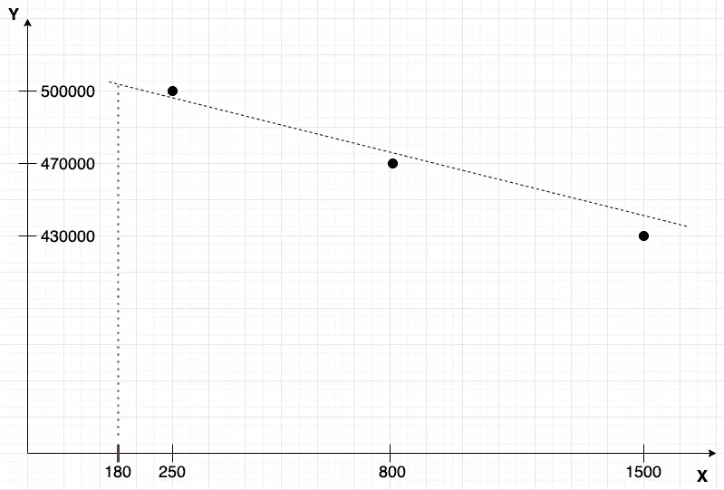
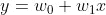

# 线性回归的简明介绍，Dart 方法

> 原文：<https://medium.com/mlearning-ai/a-gentle-introduction-to-linear-regression-the-dart-way-9750214e6fa2?source=collection_archive---------0----------------------->

大家好！

上次我[在](/mlearning-ai/machine-learning-in-dart-programming-language-fbfffd7deb18?source=friends_link&sk=12ba21f2c7a01f1aa18954ba2a82fae9)`[LinearRegressor](https://pub.dev/documentation/ml_algo/latest/ml_algo/LinearRegressor-class.html)`课上通过一个简单的使用例子向你介绍了几个用 Dart 编程语言编写的机器学习库。但是什么是线性回归呢？让我们卷起袖子努力工作吧。

简而言之，回归是指试图根据一组变量(即特征、独立变量)来预测一个数字。

假设你有一个预测̶s̶t̶o̶c̶k̶ ̶p̶r̶i̶c̶e̶s̶房价的任务，比如说，你想卖掉你的房子，你想为你的房产得到一个合理的价格。所以解决这个问题的第一个方法可能是随机猜测值。好极了。也许，有人可以接受这种方法，但我认为以过低的随机价格(在这种情况下，你得到的钱太少)或相反的极高价格(在这种情况下，没有人会买你的房子)出售你的房子是一个坏主意。

应该有更聪明的方法来预测房价。我们应该根据价格的变化来选择功能。例如，该特征可以是到最近地铁站的米距离。比如说，我们家离地铁站 500 米。那么它给了我们什么呢？老实说，没什么。至少，在这一点上。这些信息只有在数量众多的情况下才有意义——我们应该收集几个房子的例子，包括它们的价格和离最近的地铁站的距离。好吧，假设我们收集了一些信息:

因此，我们可以看到我们的可能房价落在第一和第三个记录之间，因为 500 米大于 250 米，小于 800 米。好吧，举个例子，成本可能是 480000 美元。这种估值比随机猜测好得多，但仍然是猜测。我们能改进我们的预测吗？答案是肯定的。这里数学开始发挥作用。只要更仔细地看看数据。它让你想起什么了吗？我可以给你一个提示:


这是线性方程组！为了更好地预测任意距离的价格，我们应该找到“x”的值。因此，我们可以将距离乘以“x ”,得到价格！有几种方法可以找到“x”，但不幸的是，我们永远也找不到确切的值。

在机器学习中，我们将这样的“x”称为“系数”或“权重”，通常表示为“ **w** ”(代表“权重”)。特征，这在我们的例子中只是一个变量(到最近地铁站的距离)，我们通常表示为“ **x** ”。我们将结果描述为“ **y** ”。在我们的例子中，我们只有一个特征和一个系数。

从几何学上来说，通过找到系数，我们试图找到直线的斜率。这就是为什么我们称这种算法为“线性回归”:


y 轴是价格值；x 轴是距离值。

查看图表，我们可以通过从 X 轴画一条垂直线直到它与虚线相交来进行一些预测:



我们看到，从 x=180(距离最近的地铁站 180 米)开始的 X 轴线的垂线与我们的预测线在 Y 坐标处相交，这比 500000 美元稍大—这是我们对距离最近的地铁站 180 米的房子的预测价格。

虚线是我们最好的猜测。它不可能把图上所有的点都连起来，因为任务的性质:我们要找到线，线就是数据的“趋势”。如果我们把所有的点连接起来，这条线对新的、以前看不见的点的概括能力将会很弱。

正如你所注意到的，我们的数据很有偏差——所有的点都在图表的上部。这意味着仅仅找到一个系数是不够的。所以我们需要考虑这一点。让我们回忆一下二维空间中线的方程:



“w_0”项是我们要考虑的，意思是“我们的线偏离原点多少”。

在 [ml_algo](https://github.com/gyrdym/ml_algo) 库中，第一种求系数的方法就是所谓的“闭式解”。在我接下来的文章中，你将会了解更多关于解决方案背后的算法——敬请期待。可以通过以下方式使用 [ml_algo](https://github.com/gyrdym/ml_algo) 库的封闭形式的解决方案来找到系数:

最后两条指令打印如下内容:

```
Coefficients: (514310.0, -56.05095291137695)
Prediction: 
DataFrame (1 x 1)
       price
486284.53125
```

第一个系数 514310 是我们的偏向系数(“w_0”项)，第二个是-56.05，是我们的特征(到最近地铁站的距离)系数(“w_1”项)。

486284 美元的总数看起来比我们上面猜测的 480000 美元更准确。

另一种求系数的方法是梯度下降法。这是一种迭代方法。我们在每次迭代中得到一个更新的系数值，并检查这个值是否足够好。如果我们对系数值满意，我们就停止算法。否则，我们重复迭代。在我接下来的文章中，你会对梯度下降有更多的了解——同样，请继续关注。

我们旅程的下一点是[普通最小二乘](/mlearning-ai/linear-regression-ordinary-least-squares-in-a-nutshell-c2e0d7ed260f?source=friends_link&sk=5c8bc0228d29bc67ebe524a91d687619)问题。

差不多就是这样！

如果你有任何问题，你可以在推特上联系我。

干杯:)

[](/mlearning-ai/mlearning-ai-submission-suggestions-b51e2b130bfb) [## Mlearning.ai 提交建议

### 如何成为 Mlearning.ai 上的作家

medium.com](/mlearning-ai/mlearning-ai-submission-suggestions-b51e2b130bfb)