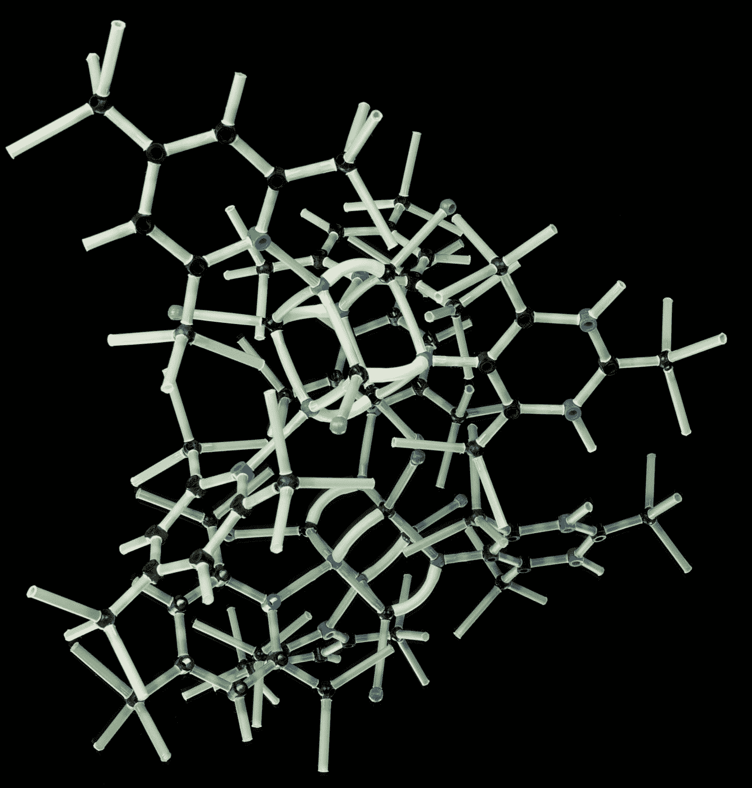
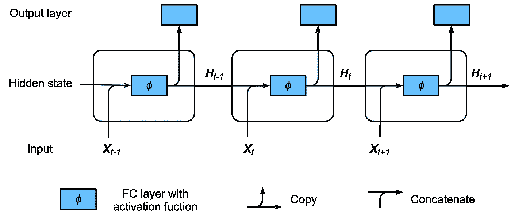
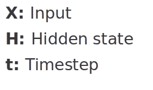

# 递归神经网络简介(RNN)

> 原文：<https://medium.com/mlearning-ai/a-gentle-introduction-to-recurrent-neural-networks-rnn-54d223598105?source=collection_archive---------7----------------------->

Photo by [Photoholgic](https://unsplash.com/@photoholgic?utm_source=medium&utm_medium=referral) on [Unsplash](https://unsplash.com?utm_source=medium&utm_medium=referral)

## 什么是 RNN，它们是如何工作的？

递归神经网络是一种用于顺序数据的神经网络。但是在我们深入研究 RNN 之前，让我们先了解什么是神经网络。

神经网络由相互连接的不同层组成，作用于人脑的结构和功能。它从海量数据中学习，并使用复杂的算法来训练神经网络。

RNN 的工作原理是保存特定层的输出，并将其反馈给输入，以便预测该层的输出。

RNN uses an internal state to preserve the sequential information between input elements.

输入层“X”接收神经网络的输入，对其进行处理，并将其传递到中间层。

隐藏状态“H”可以由多个隐藏层组成，每个隐藏层都有自己的激活函数、权重和偏差。

递归神经网络将标准化不同的激活函数和权重以及偏差，使得每个隐藏层具有相同的参数。然后，不是创建多个隐藏层，而是创建一个，并根据需要多次循环。

由于其内部存储器，RNN 的产生输出，复制输出，并将其循环回网络。

RNN 的应用包括——机器翻译、自然语言处理、时间序列预测等等。

## RNN 的缺点:

**爆炸渐变**

爆炸梯度是指算法在没有太多理由的情况下，赋予权重一个愚蠢的高重要性。

**消失渐变**

当渐变的值太小，模型停止学习或因此花费太长时间时，就会出现渐变消失。

这些可以通过 LSTM 的算法解决，我们将在另一篇文章中讨论。

 [## Mlearning.ai 提交建议

### 如何成为 Mlearning.ai 上的作家

medium.com](/mlearning-ai/mlearning-ai-submission-suggestions-b51e2b130bfb)