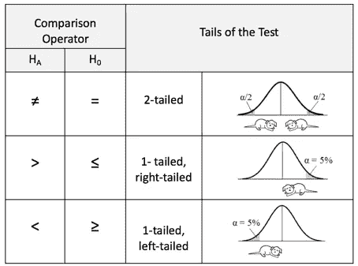
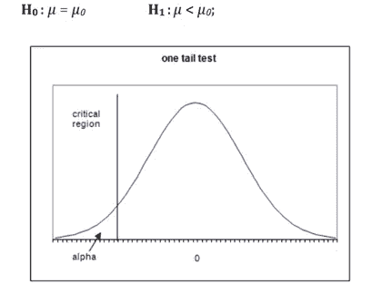
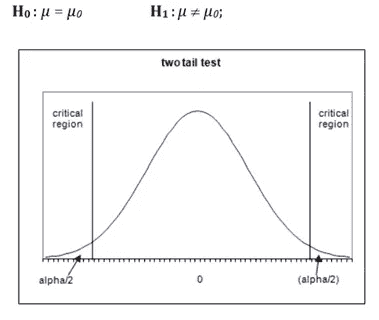

# “假设”测试的要点…

> 原文：<https://medium.com/mlearning-ai/a-gist-of-hypothesis-testing-e71a3a1d0eb?source=collection_archive---------4----------------------->

让我们用通俗的语言来说明这一点:“假设是一种假设(比如说，一个想法)，它首先是为了论证而提出的，以便可以对它进行测试，看它是否可能是真的”。举个例子:我可以说，印度每天死于 covid 的平均人数是 2 万。这个平均数是我在这里的假设(假说)，我们可以根据可能有的样本数据进行检验，然后最终得出一些结论。

> **典型定义:**假设检验是一种利用实验数据进行统计决策的统计方法。假设检验基本上是我们对总体参数的一种假设。

是的，就这么简单。我们唯一需要知道的是这里的一些相关术语，我们可以进行假设检验了！！

**关键术语和概念:**

*   **零假设:**整个游戏只有“零假设”。零假设是我们愿意假设的情况，直到被证明不是这样。我们永远不能声称零假设已经被实际证明。零假设用表示；H0: μ1 = μ2，说明两个总体均值没有区别。

> 注:我们要么拒绝 H0，要么不拒绝 H0。

*   **备选假设:**补充原假设。与零假设相反，交替假设和零假设一起覆盖了总体参数的所有可能值。用 H1、哈或者哈来表示。

> 备择假设的符号形式必须使用这些符号中的一个:≦，。

这两个术语现在应该很清楚了。如果没有，让我们看一个例子，你会对 H0 & H1 的公式感到舒服。

> 举例:百万富翁智商得分的标准差等于 15。
> 
> 现在，为了检验这一点，我们必须做出某些假设，也就是说，我们必须将这一点公式化为零&交替假设。
> 
> 在这里，我们可以做到:H0 : σ = 15 & H1 : σ ≠ 15。
> 
> 从这个例子中唯一带走的是，以这样一种方式表述，即零假设(H0)总是包含(=)而备择假设包含(或≦)

*   如果备择假设在两个方向(小于和大于)给出了在零假设中指定的参数值的备择，它被称为**双尾检验**。
*   如果备择假设仅在零假设中指定的参数值的一个方向(小于或大于)给出备择，则称之为**单尾检验**。

注意:

>:也称为右尾检验

:也称为左尾测试

≦:也称为双尾检验

Tails of the test

*   **显著性水平:**显著性水平(用𝞪表示)定义了我们需要多少证据来拒绝 H0 而支持 H1。几乎每个问题的标准显著性水平都是 0.05 (5%)。
*   **临界区域:**临界区域是样本空间中的一个区域，如果计算值位于该区域，那么我们拒绝零假设。有时也称为“拒绝区域”。
*   **临界值:**是分隔支持或拒绝零假设的值的值，根据 alpha(显著性水平)计算。

现在，基于我们如何制定我们的 H1，出现了临界区的 3 种情况(显然基于尾检验):

1.  ***右尾检验:*** 关键区域将位于右侧，临界值将根据我们正在操作的检验统计量&显著性水平决定。

Right tailed test

2. ***左尾检验:*** 关键区域将位于左侧，临界值将根据我们正在操作的检验统计量&显著性水平决定。

Left tailed test

3. ***双尾检验:*** 临界区域将位于两侧，即它将有一个下界和一个上界[L，U]，临界值将根据我们正在操作的检验统计&显著性水平决定。

Two-tailed test

现在，我知道，你一定有很多问题，比如“什么是检验统计量？”"我们如何找到临界值？"“何时拒绝或不拒绝零假设”等等。因此，我将在下一篇博客中讨论“测试统计”，因为测试统计中有很多东西，我们也将在那里讨论 P 值，这将再次帮助我们做出结论。

在总结之前，看看下面我们在进行假设检验时经常遇到的错误:

***a)第一类错误:*** 第一类错误是当原假设为真时拒绝原假设的错误。

***b)第二类错误:*** 第二类错误是在原假设为假时，没有拒绝原假设的错误。

Hypothesis errors

**在一篇简短的笔记中，可以概括如下所述的事情:**

1.  给定一个主张，确定零假设和替代假设，并用符号形式表达它们。
2.  给定一个索赔和样本数据，计算测试统计的值(将讨论)
3.  给定显著性水平，确定临界值。
4.  给定测试统计值，确定 P 值。
5.  用简单、非技术性的术语陈述假设检验的结论。

我希望你明白这个假设的要点。很快，我们将涵盖它的所有方面。

***快乐学习！！！***