# 数据清理/预处理备忘单

> 原文：<https://medium.com/mlearning-ai/a-glimpse-at-data-cleaning-preprocessing-b4d89113111a?source=collection_archive---------5----------------------->

这篇文章总结了数据清理并强调了它的重要性。它通过手动和自动方式向您介绍数据清理，如 **RANSAC** ，最后，使用图像上的**形态学、**其中的**清理二值图像，最后使用类似**规范化**、**标准化**和**正则化**的概念。为了让这篇文章保持一目了然，我们将在以后的文章中回顾像 **PCA、**这样的降维技术。**

## 干净数据的重要性

数据在机器学习编程范式中扮演着血液的角色。例如，考虑回归。在回归分析中，我们希望在数据上拟合一条曲线或直线。然后，我们将使用该曲线或直线的公式作为看不见的数据的预测器。见下图，数据是干净的。

但是，对于下图，数据包含对模型产生不利影响的异常值。

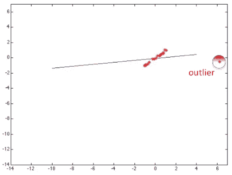

**异常值**是在总体的随机样本中，位于与其他值异常距离处的观察值。优秀的机器学习实践者脑子里一直在重复这句名言:

> **垃圾进垃圾出**

在数据清理中，离群值不是我们唯一的挑战。**噪音**和**不平衡的**数据集让生活变得艰难。通常，我们调整数据依赖于学习方差(变化)，而不是实际值。

下图显示了噪音如何影响我们的学习。因此，对于易受噪声影响的数据，应该考虑去噪。

当我们有不平衡的数据时，我们的模型将学习不平衡的模式。下图显示了它是如何发生的。在不平衡数据的情况下，您可以看到学习到的分类边界是不正确的。图中可以看到“**合成**字样。这是一种通过填充数据跨越的空间来增加数据量和避免不平衡问题的方法。

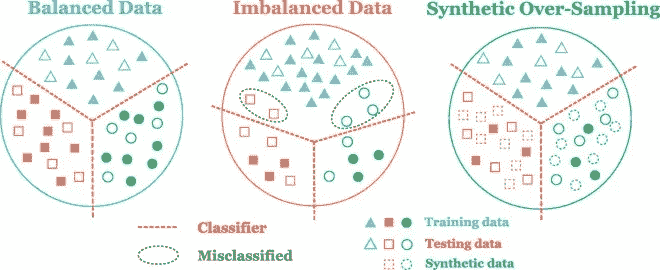

[https://www.sciencedirect.com/science/article/pii/S0263224119312412](https://www.sciencedirect.com/science/article/pii/S0263224119312412)

为训练、验证和测试子集选择数据的方式对于获得可靠的预测至关重要。如果我们不以一种平衡的方式划分它们，这种方法是欺骗性的，不能具有代表性。下图显示了不平衡数据如何影响学习到的分类边界。

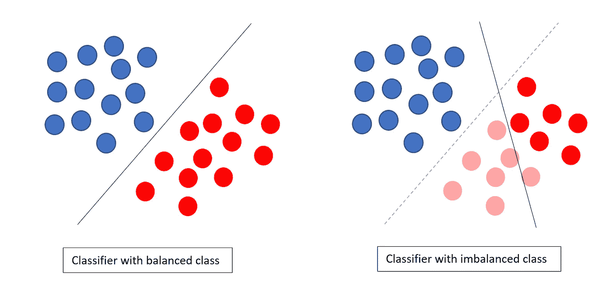

## 将数据分为定型集、验证集和测试集

将数据分成两组(训练和测试)的原因不言自明。原因是我们用一堆数据训练，我们不应该用它来测试，因为它已经学会了。但是，为什么我们有一个验证集呢？设置验证集的原因是为了在各代之间测试模型，决定是否完成训练，并确保模型不会过度拟合数据(过度拟合发生在模型记住所有数据点时，验证损失会增加，但训练损失会急剧减少)。在训练阶段结束后，测试部分用于评估模型。

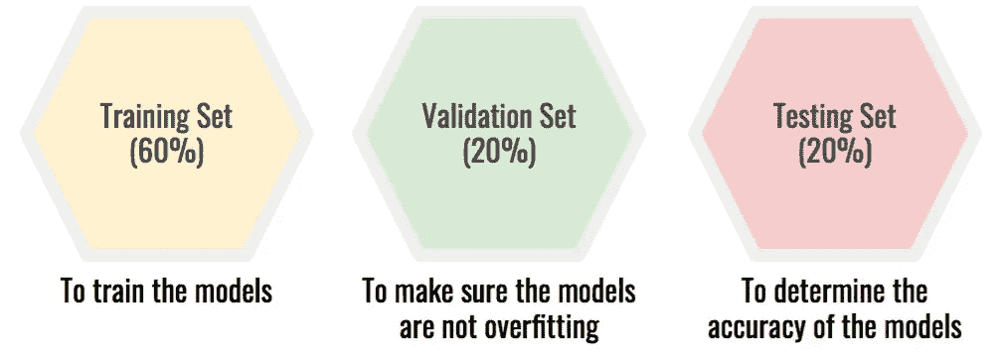

为数据创建这些分区时，它们也应该是平衡的和有代表性的，这一点非常重要。我的意思是，考虑我们的数据跨越一个空间，所以我们的样本应该均匀地分散在这个空间。我们不应该只从数据空间的特定部分获取数据，然后做一些事情。

## 手动数据清理/处理

在这种方法中，负责数据的数据科学家坐下来，查看数据，了解数据，将数据可视化，然后根据数据缺陷决定采取具体行动。例如，假设我们有一个 excel 数据文件。但是，我们的一些样本(行)缺少一些列值，我们可以排除这些行，或者在其中放入该列的平均值，或者放入平行行的列的平均值。但是，很明显，当数据量急剧增加时，这是非常耗时的。

## 自动数据清理/处理

在这些方法中，我们依靠一些计算机程序核心的算法来为我们处理数据，比如对数据的缺失部分进行插补，或者去除异常值。

**冉**多姆**萨**普 **C** 翁森苏斯

这种方法旨在使用选择的模型从数据集中排除异常值。该算法可以被认为是如下三个步骤的循环:

1.  **随机抽取符合模型所需的点数**
2.  **使用样本求解模型参数**
3.  **根据模型预设阈值内的内联因子分数进行评分**

考虑下面的代码片段，它对模型和数据执行 **RANSAC** 。这些点是表示指定图像中瞳孔边界的点的数据。这些数据是通过应用图像处理技术从图像中提取的。由于瞳孔看起来像椭圆，椭圆模型被用作测试 **RANSAC** 的模型。这个特定的将进行 10 次迭代。60%的数据是随机选取的。基于该子集，生成椭圆模型的参数(参见**模型)。估计**)。然后，我们需要检查不同子集与适合该子集的模型的偏差。我们设定的距离将作为评分标准，即距离偏差最少的子集。

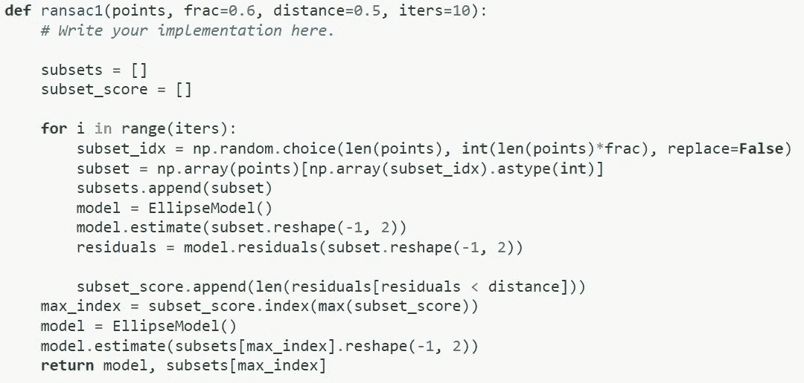

这个片段是为了从一个较低的层面展示这个想法。但是，RANSAC 可以从**skimage . measure**[[link](https://scikit-image.org/docs/stable/auto_examples/transform/plot_ransac.html)]中使用。

## 清理二进制图像的技术

在传统的机器学习中，而不是深度学习(使用卷积神经网络( **CNN** ))来提取数据，使用一些特殊的图像处理技术来提取可用于训练模型和进行估计的信息。

对于二进制图像，首先，彩色图像(具有红色、绿色和蓝色矩阵)应该转换为灰度，以便只有一个数据矩阵。然后，对灰度图像进行阈值处理将得到二值图像。在对图像进行阈值处理时，将图像的所有像素与阈值进行比较，然后根据结果将它们设置为零(黑色)或保持不变。

> **像素值= 0:黑色|像素值= 255:白色**

前述技术被称为**形态学图像处理技术。**“基本的形态学操作是**膨胀**和**腐蚀**。这些都是基于点击和适合的概念。在移动一个结构元素时(考虑图像上的过滤器),如果所有像素都覆盖了该结构元素的像素，那么 fit 发生，并且当至少一个像素被覆盖时，我们就击中了。在下面的例子中，A 是适合的，B 是命中的，C 是未命中的。

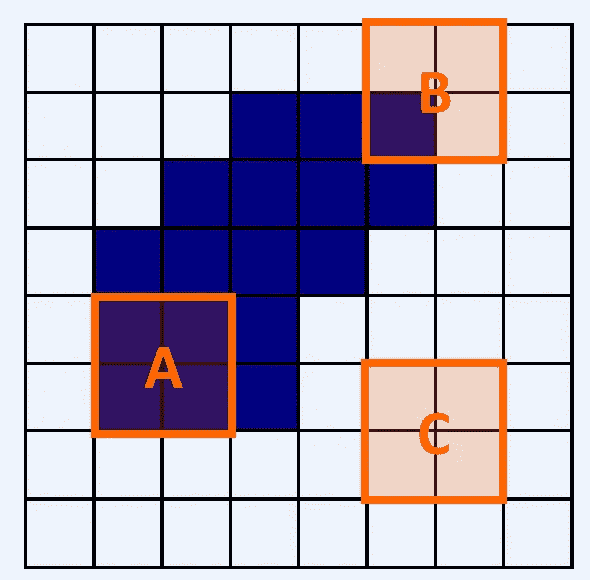

**糜烂**。如果只有结构元素符合图像，则侵蚀的输出为 1。所以，用类似正方形的结构元素腐蚀二值图像会使二值图像中的形状变小。

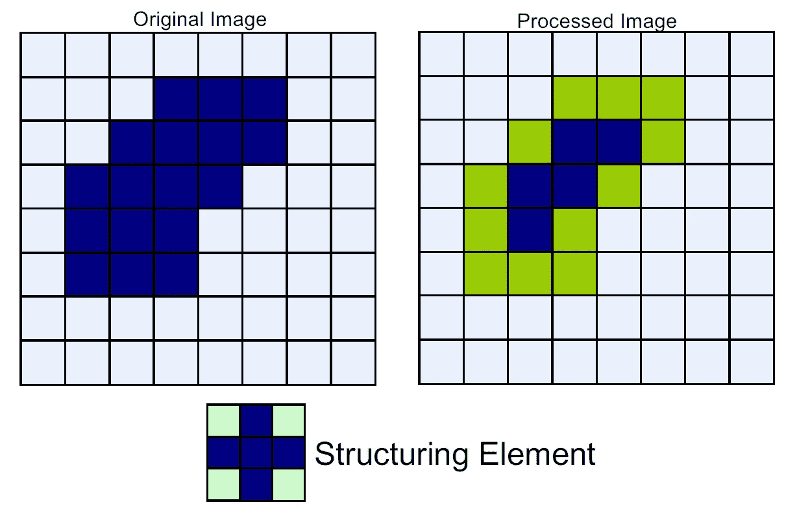

腐蚀对于分割连接的对象和剥离挤出很有用。

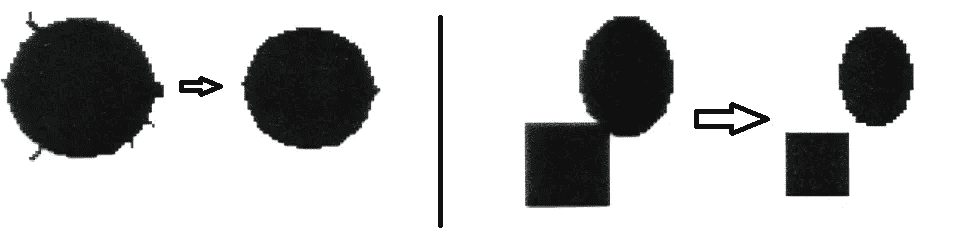

Erosion effect on shapes

**扩张**。当结构元素适合图像时，该函数的输出为 1。因此，它放大了二值图像中的形状。

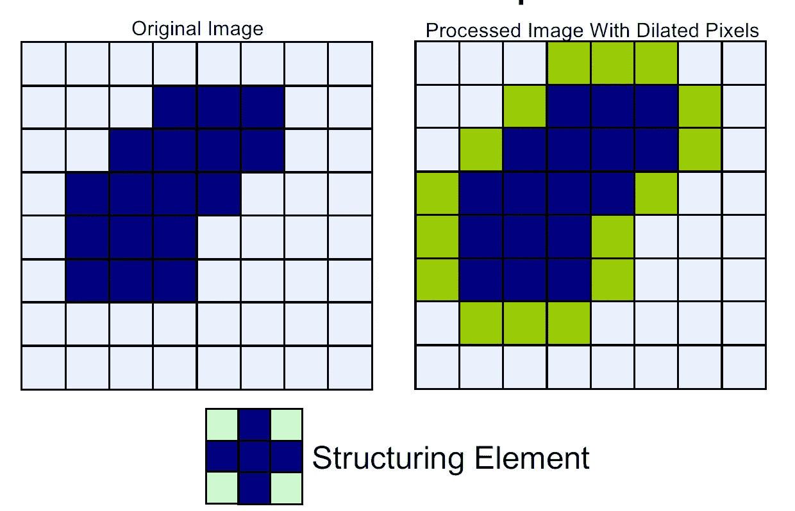

膨胀用于修复形状中的裂缝。

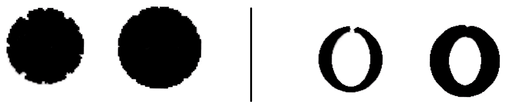

Dilation effect on shapes

有复合操作:**开启**、**关闭**。开口先腐蚀，然后扩张。它保持原来的形状，并删除小物体。

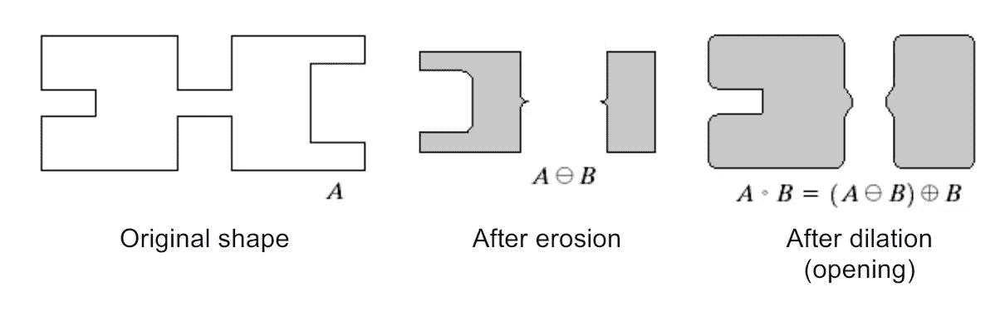

闭合是扩张，然后是侵蚀。

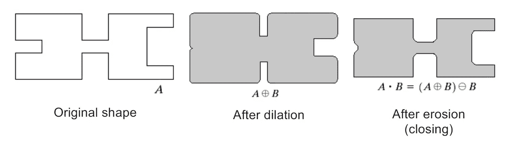

下面的例子展示了我们如何把猫从图像中去掉。我们假设我们所有的图像都将在这些阈值下工作。你可能会说，这个作品可能适合这个特定的形象。答案是肯定的。但是，该示例显示了如何使用形态学运算符。假设我们在院子的某个特定位置安装了一台摄像机，用来记录白猫经过的次数。

首先，我们用下面的代码片段将其更改为灰度图像。

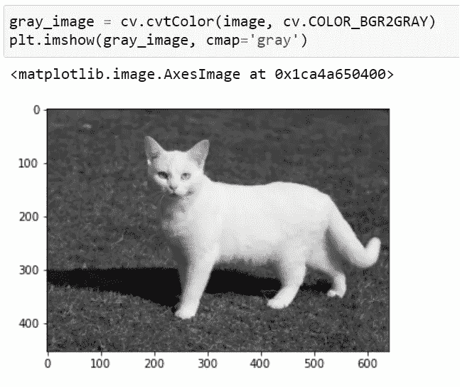

其次，我们对灰度图像进行阈值处理:

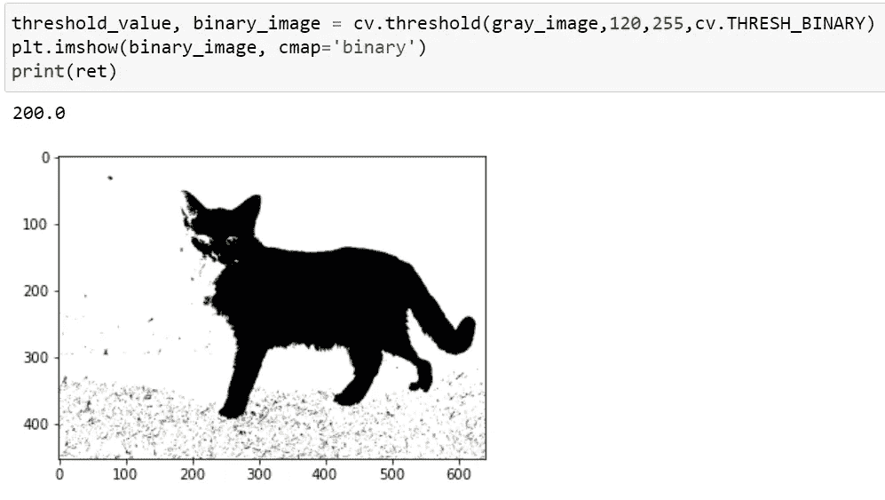

我们应该去掉那些点，让猫更容易出来。所以，我们用一个椭圆核腐蚀图像:

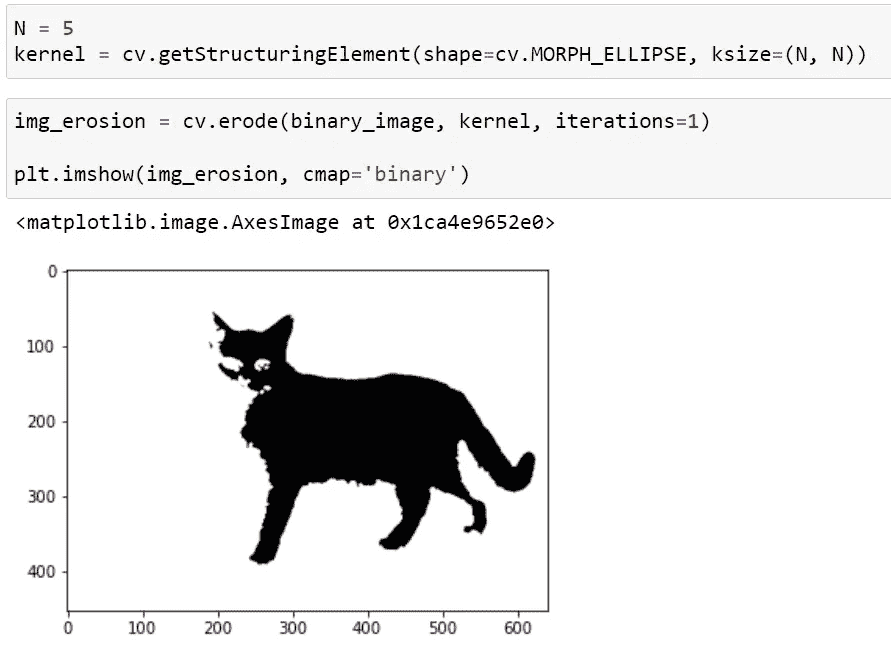

然后，对于填充眼睛和连接脖子和其他部分，让我们使用扩张功能:

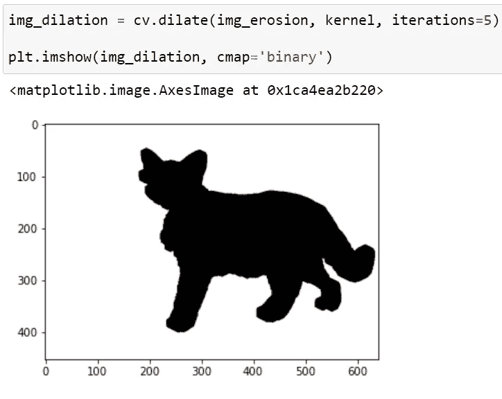

> **好**！

## 数据规范化、标准化、规则化？！

如果我们使用数据的绝对值，也就是从观察中得到的值。不同的特征将具有不同的变化范围。具有较大范围和值的特征可以改变机器学习模型学习数据模式的方式(改变模型的参数)。例如，对于梯度下降，数据 x 表示如下:

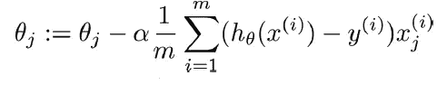

这将影响梯度下降的步长。特征范围的差异将导致每个特征的不同步长。另一个很好的例子是距离算法，如 KNN、K-means 和 SVM 受要素范围的影响最大。这是因为在幕后，他们使用数据点之间的距离来确定它们的相似性。

另一方面，其他一些模型，如基于树的模型，对范围不敏感。

**正常化**。是一种缩放技术，在这种技术中，值被移动和重新缩放，使得它们最终的范围在 0 和 1 之间。它也被称为最小-最大缩放[[sci kit-学习此目标的链接](https://scikit-learn.org/stable/modules/generated/sklearn.preprocessing.MinMaxScaler.html) ]。

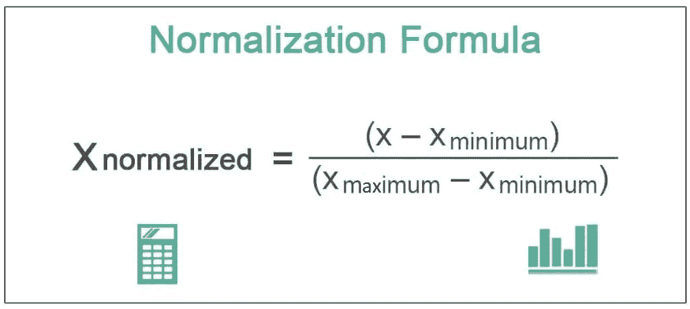

[https://www.wallstreetmojo.com/normalization-formula/](https://www.wallstreetmojo.com/normalization-formula/)

**标准化**。是另一种缩放技术，其中值以平均值为中心，具有单位标准偏差。这意味着属性的平均值变为零，并且结果分布具有单位标准偏差[[sci kit-learn link for do this task](https://scikit-learn.org/stable/modules/preprocessing.html#standardization-or-mean-removal-and-variance-scaling)]。

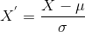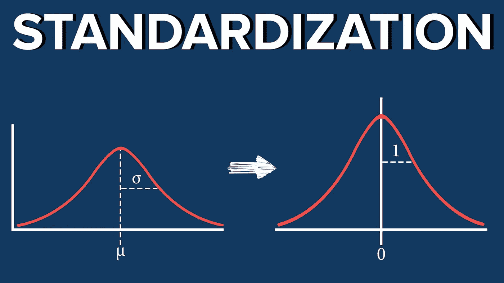

建议在原始、规范化和标准化版本的数据集上训练我们的模型，看看哪一个能提供更好的结果。然而，当数据具有高斯(正态)分布时，必须使用标准化。

**正规化**。不是一种处理数据的机制。这是一种对模型进行一些更改以避免过度拟合的方法。换句话说，**这种技术不鼓励学习更复杂或更灵活的模型，以避免过度拟合的风险。**

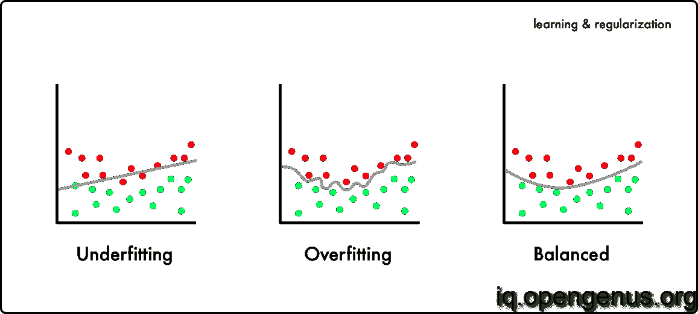

# 参考资料和阅读更多材料

 [## 功能扩展|标准化与规范化

### 我最近在处理一个来自 ML 课程的数据集，该数据集具有跨越不同程度的多个特征…

www.analyticsvidhya.com](https://www.analyticsvidhya.com/blog/2020/04/feature-scaling-machine-learning-normalization-standardization/)  [## 标准化、规范化、标准化在 ML 中的区别

### 在机器学习中，数据预处理是从数据中获得关键洞察力的最重要步骤之一。根据……

iq.opengenus.org](https://iq.opengenus.org/standardization-regularization-vs-normalization/)  [## Mlearning.ai 提交建议

### 如何成为 Mlearning.ai 上的作家

medium.com](/mlearning-ai/mlearning-ai-submission-suggestions-b51e2b130bfb)