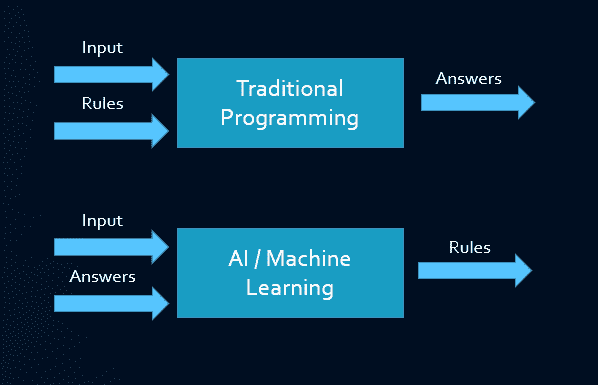
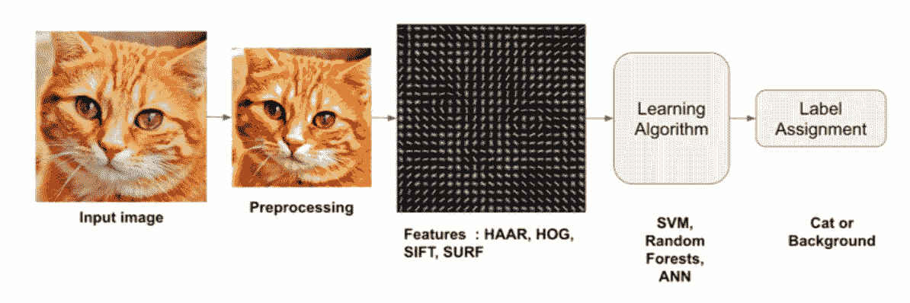
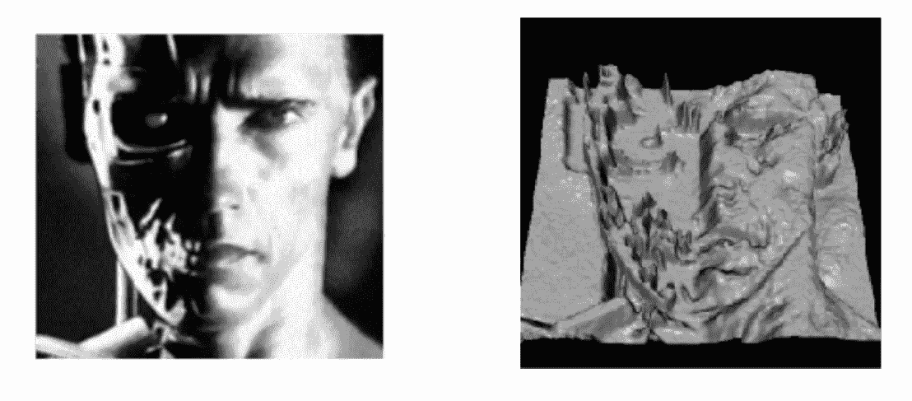
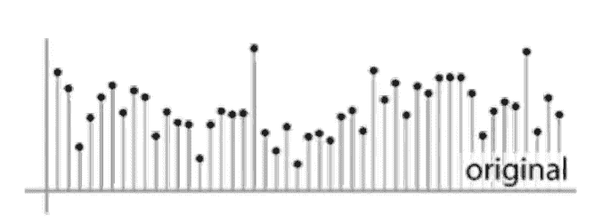
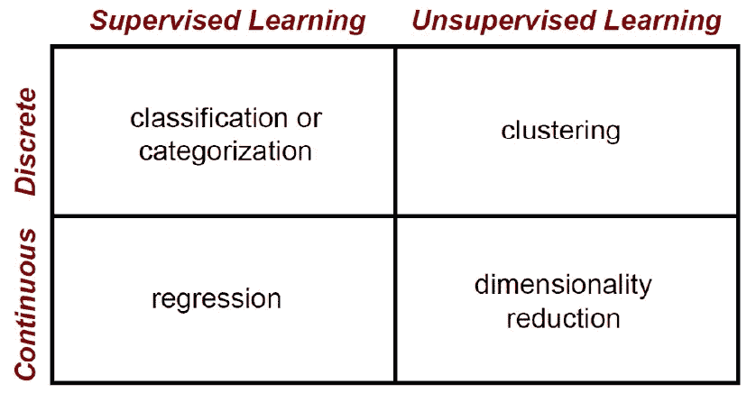
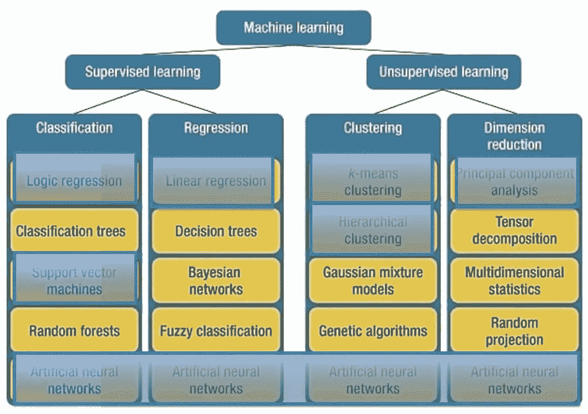

# 机器学习备忘单

> 原文：<https://medium.com/mlearning-ai/a-glimpse-at-machine-learning-cheatsheet-f364c9fd473b?source=collection_archive---------11----------------------->

在这篇文章中，我回顾了从数据到决策的机器学习。我认为人们应该知道如何使用机器学习作为一种新的编程范式。

注意**线性代数**是这个区域的基础。为了复习线性代数，查看下面的帖子。

 [## 直觉线性代数小抄

### 这篇文章回顾了机器学习入门的基础线性代数。

medium.com](/aiguys/intuitional-linear-algebra-cheatsheet-e6df994666c) 

# 机器学习

这是一种新的编程范式，赋予计算机从数据中学习的能力。换句话说，让计算机能够检测数据中的模式，并根据它们所学到的知识做出明智的决定。下图显示了传统编程和监督机器学习的区别。

以下三个机器学习在**计算机视觉**中的应用实例给出了比传统编程好得多的结果:

1.  **字符识别:**检测字符(钞票上)
2.  人脸识别在大多数现代数码相机中
3.  **驾驶员辅助系统中的行人检测**

从最高层来看，我们可以将 ML 管道分为以下步骤，如下图所示:

## 数据采集

在第一步中，系统的血液(数据)将通过传感器从物理环境中接收。数字化之后，当数据进入存储器时，它只是一串 0 和 1，只是数字。从更高的层面来看，它们可能意味着特定电机的温度、转速、图像等。我的意思是，我们用特定的方式来思考它们，从而赋予它们意义。在这一阶段，这些输入设备的质量很重要，因为如果添加了不可容忍的噪声，数据将不具有代表性，并且数据中的模式将无法检测和/或某些东西将被错误地检测到。让我们回忆一下这句名言:“**垃圾进垃圾出**”。

我们可以以各种方式考虑我们的数据，例如，以下列方式考虑一张拍摄的照片:

1.  **2D** 整数矩阵

2. **1D** 整数向量

## 特征抽出

这些方法存在于一般的机器学习方法中。这是因为**数据量少，计算/存储能力差，也可能是因为缺乏深度神经网络**。一个很好的例子是提取眼睛瞳孔中心的位置，用于预测他们正在注视的地方的模型中。在视觉中，特征提取是借助于去噪、阈值、腐蚀、边缘检测等技术来完成的。(**大部分都是用 python OpenCV** 实现的)

## 型号选择

在这个阶段，根据功能和目标任务，选择合适的模型。如果我们希望模型预测房子的价格或眼睛凝视的位置(x，y 坐标),因为这项任务应该给我们一个范围内的值，所以，我们应该做**回归**。但是，当涉及到检测图像中的动物，因为会给它们分类，这个问题是一个**分类**。请注意，在上述问题中，我们的训练数据已经有了答案，这种机器学习被称为**监督的**机器学习。这可能会变得很昂贵，因为给动物图像加标签会让人们花很多时间坐下来给图像加标签。考虑到我们有 1 亿张图片！

下图是机器学习领域俯视图。

**回归**是在数据上拟合一条**曲线或直线**，该曲线或直线可用作我们传递给它的新数据的预测函数。**分类**是确定一条**曲线或直线**，该曲线或直线**将**不同的类别相互分开。在聚类中，我们没有数据标签，所以我们希望根据数据的某些特征进行分组。出于这个目的，使用了像 **K-Means** 这样的算法(但是有很多算法可以完成这类任务)。例如，对于降维，主成分分析( **PCA** )和奇异向量分解( **SVD** )试图检测可用于学习和决策的数据的最重要部分。请记住，在机器学习的每个子领域中都有很多方法。神经网络，特别是深度神经网络，是机器学习的一个子域，它依赖于大量的数据来检测数据中的可信模式。但是，我们应该记住，神经网络需要**高计算/内存要求**和**大量数据**才能有效，否则，我们将处理**过拟合**！

## 评估和优化

评估方法用于测量并给出机器学习模型**预测**的程度。它们决定了机器学习模型的可信度。对于回归，可以用**均方误差** ( **MSE** )、**均方根误差** ( **RMSE** )、**平均绝对误差** ( **MAE** )作为评价度量(它们也被称为**损失函数**)。

对于分类来说，**准确性**可以作为一种度量标准，但它对应用程序很有用，因为我们不关心错误预测，它们不会让我们付出生命和/或大量金钱的代价。出于上述考虑，我们有其他评估指标，如**精度**、**召回**、 **F1 得分**和**交叉熵损失**。

数据集通常分为三部分:**训练**、**验证**和**测试**。**训练**用于调整模型的参数，**验证**用于在训练阶段测试指标，并决定继续训练或结束该过程。测试部分用于获得模型性能的最终评估细节。

有一个优化函数，通过改变模型的参数来优化模型，使**损失更少** ( **误差**)，如 **RMSprop** ，和**梯度下降**。

最后，将有一个软件层附加到模型输出，以将结果映射到标签，特别是在分类中。与分类一样，输出是一个数组，给出属于每个类的概率。在回归中，数据被调整到一个特定的范围，它应该被缩小。

# 结论

现在，机器学习是人们学习如何使用它的必需品。它是基于数据的新编程范例。机器学习进步的主要驱动力是算法的进步、过多的数据和强大的硬件。

 [## Mlearning.ai 提交建议

### 如何成为 Mlearning.ai 上的作家

medium.com](/mlearning-ai/mlearning-ai-submission-suggestions-b51e2b130bfb)