# 谷歌数据工作室指南

> 原文：<https://medium.com/mlearning-ai/a-guide-to-google-data-studio-f54b5115d0c8?source=collection_archive---------2----------------------->

Photo by [Alonso Moreno](https://unsplash.com/@alonsooomn?utm_source=unsplash&utm_medium=referral&utm_content=creditCopyText) on [Unsplash](https://unsplash.com/s/photos/toy-model-vehicles?utm_source=unsplash&utm_medium=referral&utm_content=creditCopyText)

# 概观

## 谷歌数据工作室是什么？

Google Data Studio 是一个可视化工具，允许您发现数据中的见解，并与他人交流您的见解。有了它，您可以将数据转化为有用的仪表板和报告，讲述数字背后的故事。

该平台可用于各种业务环境，从营销和销售到跟踪生产力和进度。本质上，如果您有一组数据，Data Studio 可以用来创建关于它的可视化。

谷歌在 2016 年首次推出 Data Studio，作为其谷歌分析 360 套件的一部分，开发该套件是为了让客户跟踪和优化谷歌营销活动。

## Google Data Studio 有哪些优势？

谷歌数据工作室的一个主要优势是它是免费的。如果你有谷歌账户，你可以登录[datastudio.google.com](https://datastudio.google.com/)开始使用。该平台基于云端，可以在任何浏览器上运行。

当然，Data Studio 可以很好地与 Google Sheets、Google Analytics 和 Google Ads 等其他 Google 产品集成。您还可以上传 CSV 和 Excel 文件或连接到 MySQL 数据库表。当数据源与 Data Studio 有实时连接，并且数据被更改或更新时，这些更改将自动反映在 Data Studio 可视化中。

因为 Data Studio 具有 Google 的直观设计感，所以您可能会发现开始制作 Data Studio 仪表板相对容易。

## 使用 Google Data Studio 有哪些挑战？

如上所述，Data Studio 旨在与其他谷歌产品集成。然而，在使用非谷歌软件时，你可能会遇到一些问题。例如，如果您的数据在 Excel 中，您需要首先将它作为一个工作表上传到 Google Drive，然后将该文件连接到 Data Studio。作为另一个例子，如果您希望使用 Hubspot 作为数据源，您将需要找到一个第三方连接器来将数据导入 Data Studio，并且不是所有这些连接器都是免费的。

虽然 Data Studio 会更新可视化以反映数据源中的变化，但更新不是即时的，滞后时间从 15 分钟到几个小时不等。

此外，Google Data Studio 不具备 Tableau 和 Power BI 等其他可视化工具可能具备的功能和复杂的可视化。它也不提供个性化支持。您需要依靠帮助页面和其他资源来解决问题。

考虑到 Data Studio 是基于云的，您可能会遇到依赖于互联网连接的基于云的工具的典型问题，比如可靠性、安全性等问题。

# 使用 Google Data Studio 创建可视化效果

## **入门**

*   登录你的谷歌账户后，进入 datastudio.google.com 的。
*   点击“空白报告”
*   您将被要求连接到数据源。

对于本指南，我将选择 Google Sheets 并连接到一个名为 *sales_sample_data* 的文件，该文件涉及玩具车、摩托车和其他车辆向玩具店的销售，我将该文件上传到我的 Google Drive 帐户。这个数据是在 Kaggle 上找到的公共样本数据集([来源](https://www.kaggle.com/kyanyoga/sample-sales-data/version/1))。(我对日期栏中的数据做了一些编辑。)

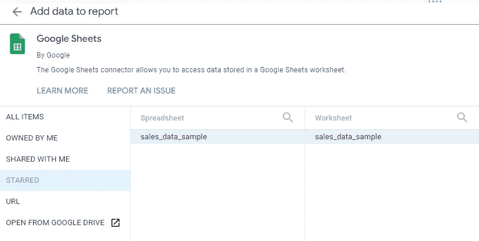

*   单击“添加”将此电子表格中的工作表添加到报告中。Data Studio 将立即打开空白报告的第一页，并创建一个默认表。(此表可以删除。)

## 添加图表概述

*   在工具栏中，单击“添加图表”

下拉菜单将显示要添加的不同类型的图表，包括:

*   桌子
*   记分卡
*   时间序列
*   酒吧
*   馅饼
*   谷歌地图等。

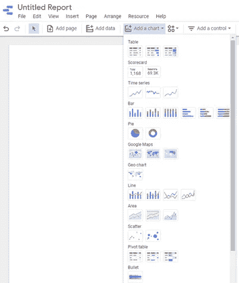

单击您想要的图表，它将出现在页面上，带有来自您的源的默认数据。您可以将此图表移动到所需位置，并根据需要调整其大小。

**属性面板**

选择图表后，屏幕右侧会打开一个属性面板。该面板有两个选项卡:

*   **数据** —允许您更改数据源、图表的指标、数据类型和其他方面
*   **样式** —允许您根据图表类型更改标签、颜色、参考线、文本样式和许多其他功能

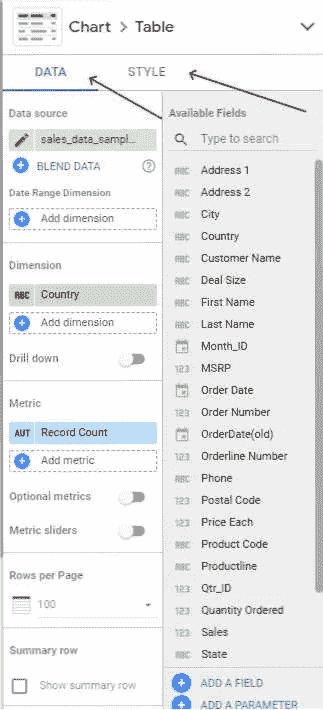

在数据选项卡中，两个重要的字段是*尺寸*和*公制*。*尺寸*指的是你想要测量的东西，*公制*指的是实际数字。

## 创建表格

**任务**:创建一个关于来自不同国家的订单数量的表格。

*   在工具栏中，单击“添加图表”
*   选择表格并将其放入报告中
*   拖动*维度*中默认添加的字段，将其替换为“国家”

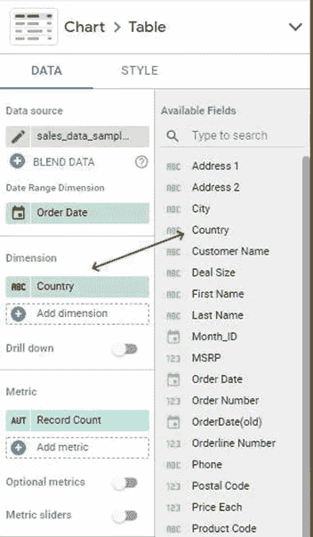

默认指标是“记录计数”，它对来自每个国家的所有订单进行计数，为我们提供了以下图表:

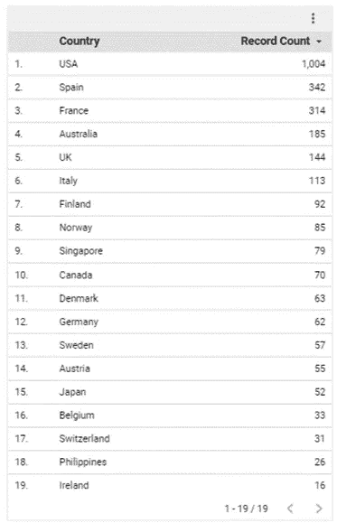

看到每个国家的总订单数是很有趣的，但这些订单中有许多可能是回头客。要添加另一列来显示来自每个国家的唯一客户的数量，请拖动“客户名称”作为另一个指标。

现在图表看起来像这样:

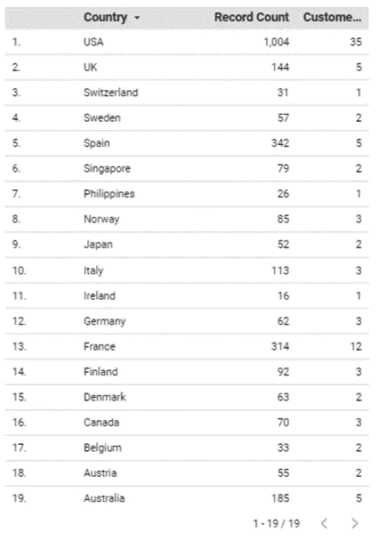

将鼠标悬停在指标上，直到出现铅笔图标，即可更改列标题名称。让我们将它们更改为“总国家”和“#的独特客户”

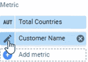

这些更改反映在列标题中。

使用面板的“样式”选项卡来更改字体、对齐方式、颜色、边框和其他属性。

## 创建条形图

任务:创建一个柱状图来显示最受欢迎的产品线。

*   在工具栏中，单击“添加图表”
*   选择条形图并将其放置在报告中
*   拖动*维度*中默认添加的字段，将其替换为“Productline”
*   拖动*指标*中默认添加的字段，将其替换为“订购数量”
*   添加“销售额”作为第二个指标

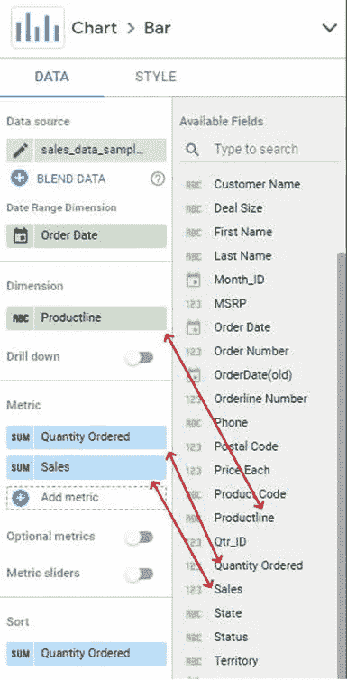

Google Data Studio 用这个条形图填充画布:

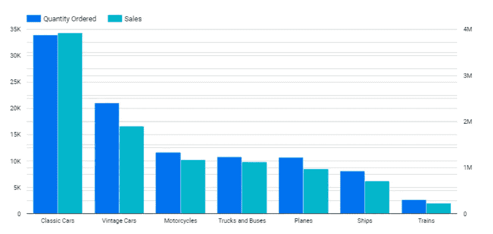

请注意图表是如何同时具有左侧和右侧 y 轴的。左边一个测量“订购数量”，右边一个测量“销售额”

使用面板的样式选项卡更改轴、条形颜色、条形方向和图表的其他方面。

## 创建时间序列图表

**任务**:创建一个时序图来可视化 2020 年全年的销售情况。

*   在工具栏中，单击“添加图表”
*   选择时间序列并将其放入报告中
*   在*维度*中默认添加的字段是“订单日期”，这是该图表所需要的
*   拖动*指标*中默认添加的字段，将其替换为“销售”

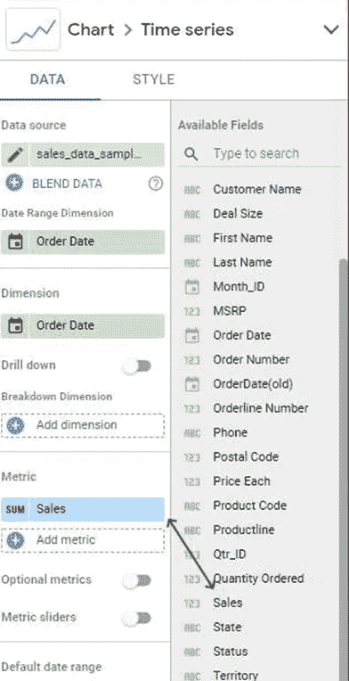

Google Data Studio 用这个时间序列图表填充画布:

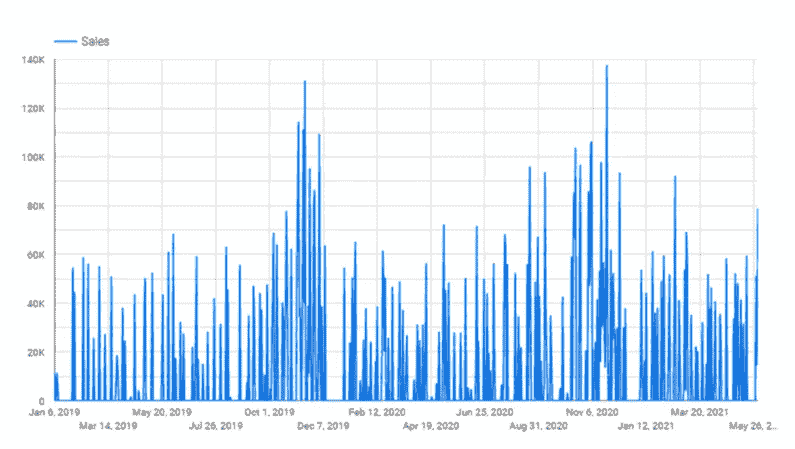

在源数据中，日期范围从 2019 年 1 月到 2021 年 5 月。要仅选择 2020 年的订单，向下滚动面板中的数据选项卡，将*默认日期范围*从自动更改为自定义，点击*自动日期范围*并使用弹出的日历选择所需日期。

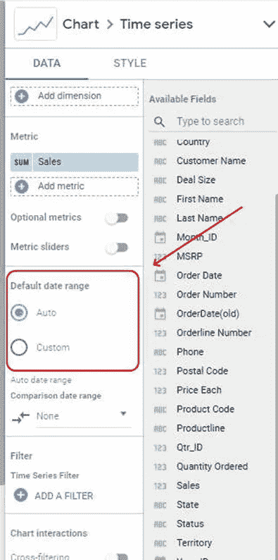

时序图表现在看起来像这样:

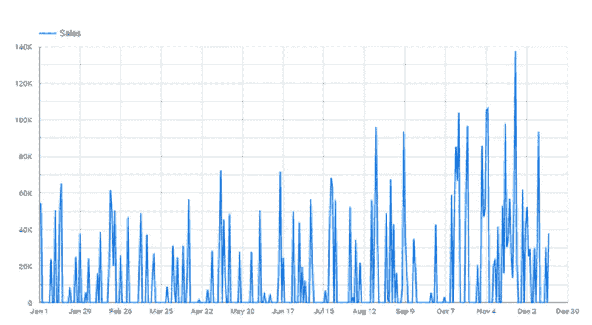

这张每日销售额的图表并没有提供很多深刻的见解。要将图表更改为每月总计:

*   在*维度*(非*日期范围维度*)下，将鼠标悬停在左侧，直到出现铅笔图标

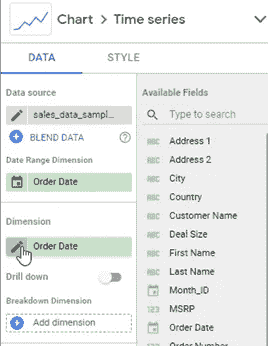

*   点击铅笔进入一系列菜单，允许您将日期更改为“月”

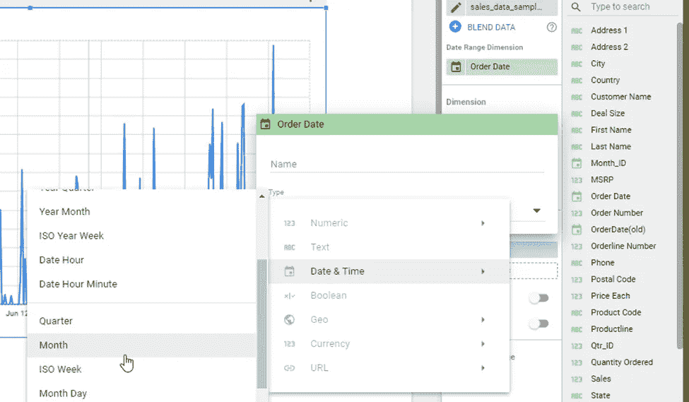

Google Data Studio 将时间序列图表更改为每月总额，现在人们可以很容易地看到，大多数销售发生在当年的 11 月份，很可能是因为客户可以在圣诞购物高峰前囤货。

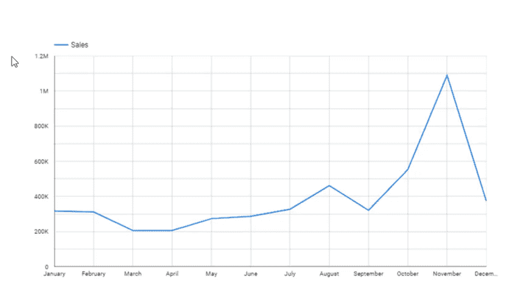

## 创建附加图表

虽然本指南涵盖了表格、条形图和时间序列图表，但类似的过程也可用于创建和定制其他类型的图表。

# 解决纷争

当您遇到麻烦或有疑问时，Google 不提供任何直接的支持选项。要找到答案，最好的策略是在线搜索您的问题，您会找到官方帮助页面、社区论坛和视频教程。

 [## Mlearning.ai 提交建议

### 如何成为 Mlearning.ai 上的作家

medium.com](/mlearning-ai/mlearning-ai-submission-suggestions-b51e2b130bfb)