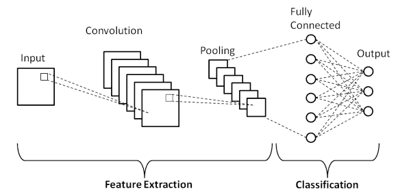
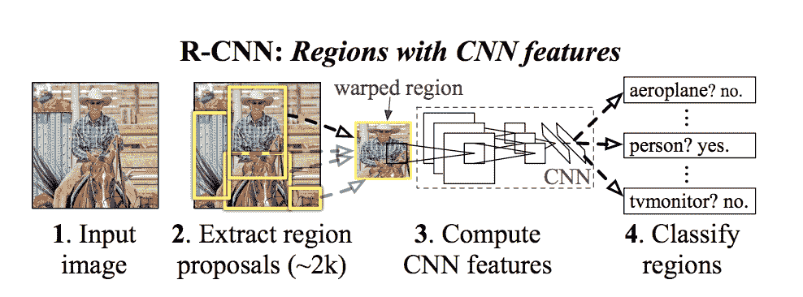
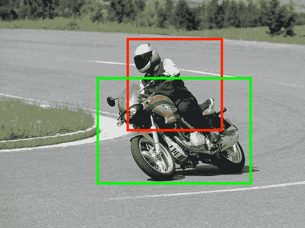
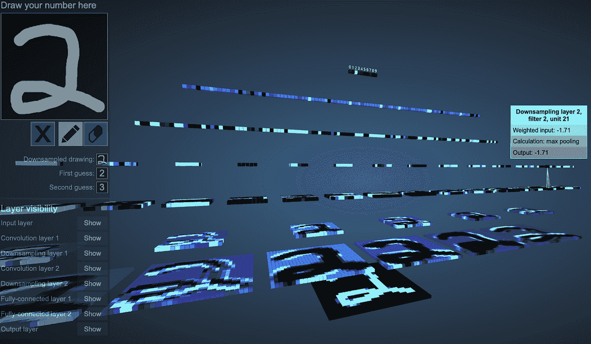
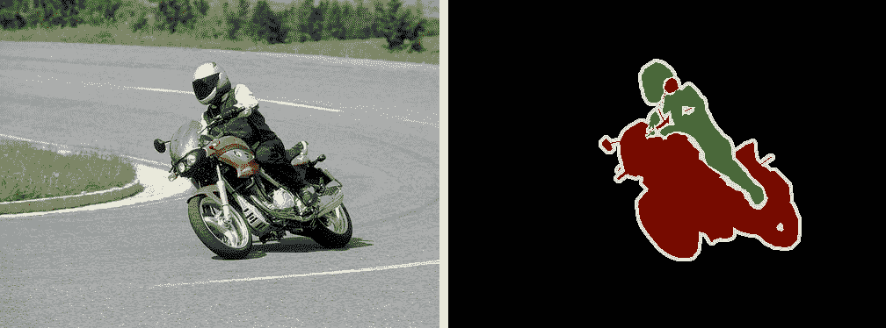
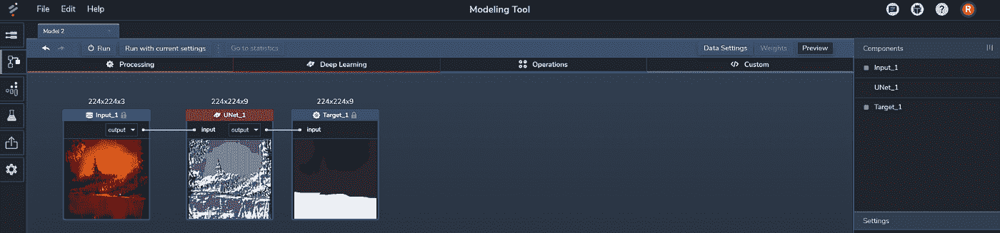
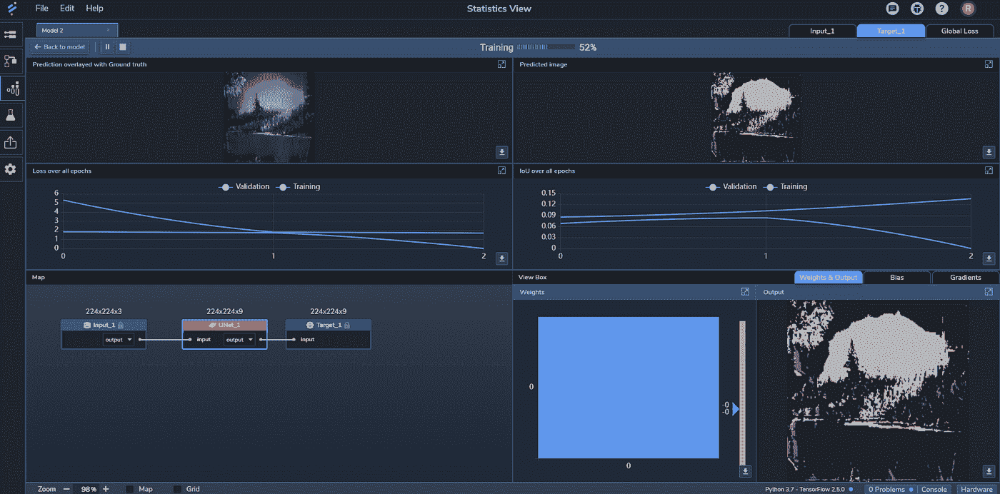
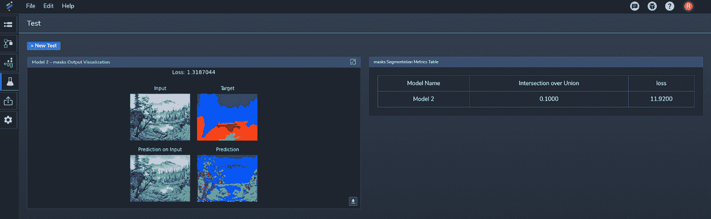
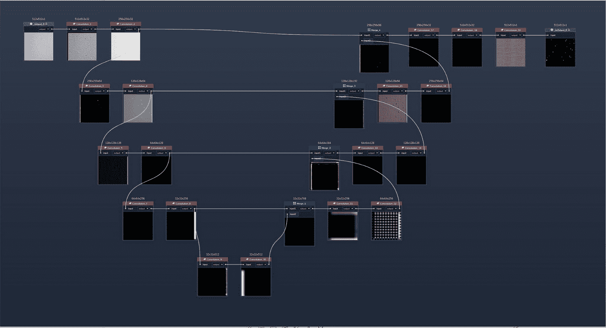

# 使用 U-网进行图像分割的指南

> 原文：<https://medium.com/mlearning-ai/a-guide-to-using-u-nets-for-image-segmentation-4799410c8aef?source=collection_archive---------1----------------------->

# 图像分割是在每像素水平上定位图像中的对象或边界的强大技术。在这篇博客中，我们快速浏览一下 U-net 是如何工作的，并探索它们是如何建立在标准 CNN 上的。

基于深度学习(DL)的图像处理现在被用于各种行业。特别是，像图像分类(即识别图像代表什么)和对象检测(即识别图像中的对象及其位置)这样的方法正被应用于从计算机视觉应用(例如，自动驾驶)到识别安全视频中的人的用例中。

另一个强大的方法是*语义图像分割*，也称为*像素级分类*或*密集预测*，它允许我们在每像素级别上对属于同一对象类的图像部分进行分类。例如，上图显示了如何通过分析全色图像，使用分割来突出显示属于摩托车及其驾驶者的像素。并且*实例分割*通过识别属于同一类(例如，摩托车 1、摩托车 2)的对象的所有实例来更进一步。

语义图像分割可以通过使用一个 *U-Net* ，一种特殊类型的卷积神经网络(CNN)来实现。U-Net 增加了一个*扩展路径*来生成属于在源图像中发现的特征或对象的像素的分类。换句话说，它将输出扩展到某个图像大小，并在网络中形成 U 的后半部分。U-Net 使我们能够超越常规的图像分类和物体检测，对这些物体的像素进行精确的形状分类。

让我们仔细看看这是如何工作的。

**CNN 综述**

为了理解 U-Nets，让我们简单回顾一下他们的底层基础*标准* CNN 是如何工作的。

我们强调*标准*是因为有许多变体，包括 [LeNet](https://en.wikipedia.org/wiki/LeNet) 、 [AlexNet](https://en.wikipedia.org/wiki/AlexNet) 和其他 CNN，它们都基于相同的一般原理，即以图像为输入，使用*滤波器*(也称*核*)对其进行*卷积*以提取一个或多个*特征图*，这一过程被称为*特征提取*。然后通过*汇集*对这些特征图进行下采样，并传递到下一层进行进一步的卷积和汇集。在每个后续卷积/汇集步骤中生成的要素图可提取更高级别的要素。最终的下采样(混合)特征图然后被展平，并用作完全连接的神经网络的输入，用于分类，如图 1 所示:

*Figure 1: A simple CNN with one convolution/pooling layer that can classify an image. (*[*Source*](https://www.researchgate.net/figure/Schematic-diagram-of-a-basic-convolutional-neural-network-CNN-architecture-26_fig1_336805909)*)*

根据您构建网络的方式，您可以修改要素提取阶段的工作方式，并根据应用程序的需要添加任意数量的图层。例如，下图 2 所示的 [R-CNN](https://en.wikipedia.org/wiki/Region_Based_Convolutional_Neural_Networks) 通过对图像的区域进行分类来进行物体检测:

*Figure 2: Example of an R-CNN that can classify objects in an image. (*[*Source*](https://towardsdatascience.com/r-cnn-fast-r-cnn-faster-r-cnn-yolo-object-detection-algorithms-36d53571365e)*)*

以我们想象的骑在摩托车上的骑手为例。分析该图像的 R-CNN 的第一个特征图可能由表示图像中发现的基本形状(例如，曲线、直线段等)的像素组组成。).下一层可以提取组成这些对象的某些特征的形状组(例如，头盔、轮子等)。)，等等。

最终输出包括分类，显示在图像区域中发现了什么对象，如图 3 所示:

*Figure 3: Example of object detection using a R-CNN that classifies objects found in certain regions of the image.* ([*Source*](http://host.robots.ox.ac.uk/pascal/VOC/voc2012/segexamples/index.html))

中枢神经系统已成为图像处理任务的热门，因为它们可以处理空间和时间方差，同时使用汇集减少(下采样)模型中的中间图像，以提高处理速度。事实上，中枢神经系统对图像处理非常有用，因此您会在我们的[机器学习用于图像处理和计算机视觉的五大方式](https://blog.perceptilabs.com/top-five-ways-that-machine-learning-is-being-used-for-image-processing-and-computer-vision/)博客中多次提到它们。

如果您想进一步加深您对有线电视新闻网工作原理的理解，请查看这个[非常酷的交互式 3D 有线电视新闻网可视化工具](https://www.cs.ryerson.ca/~aharley/vis/conv/):

*Figure 4: Screenshot from an interactive online 3D CNN tool showing how a CNN classifies an image containing a numbe*r. ([*Source*](https://www.cs.ryerson.ca/~aharley/vis/conv/))

关于构建特征图的其他信息，请务必查看我们在博客中对卷积层的描述:[四种常见类型的神经网络层(以及何时使用)](https://blog.perceptilabs.com/four-common-types-of-neural-network-layers-and-when-to-use-them/)。

**扩展到 U 网**

到目前为止描述的 CNN 架构由一个*收缩路径*(也称为*编码器*)组成，它使用连续下采样的数据迭代地构建特征地图。

U-Net 通过添加相应的*扩展路径*(也称为*解码器*)来增强标准 CNN 架构，目的是产生全分辨率语义预测。换句话说，生成突出在图像中发现的特定特征和对象的分割图像。这些高光是使用特定的颜色值在每个像素级别上完成的，并且输出图像通常至少与源图像的大小(尺寸)相同。

以上面的摩托车图片为例。使用 U-Net 进行图像分割，我们可以在比对象检测更细粒度的级别上对对象进行分类，对象检测仅限于边界框。如下面的图 5 所示，输出(右)基于每个像素对源图像(左)中的对象进行分类:

*Figure 5: Example of a segmentation output (right) generated from a source image (left) to classify objects on a per-pixel level.* ([*Source*](http://host.robots.ox.ac.uk/pascal/VOC/voc2012/segexamples/index.html))

U-Net 的扩展路径通过使用*转置卷积*对收缩路径的各种特征图进行上采样来工作，该过程有时被称为*去卷积*。扩展路径也与收缩路径有一些连接，称为*跳过连接*。使用跳过连接和正常连接，扩展路径将要素信息(在收缩路径期间增加)与空间信息(在收缩路径期间减少)结合在一起。

DL 实践者经常将收缩和扩张路径以及它们的跳跃连接描绘成 U 形，如图 6 所示，因此得名 *U-Net* :

*Figure 6: Example of a U-Net model diagram showing the correspondence between the layers of the expansive and contracting path. (*[*Source*](https://arxiv.org/abs/1505.04597)¹*)*

在为[转移学习](https://blog.perceptilabs.com/when-to-use-transfer-learning-in-image-processing/)构建 U-Net 时，选择模型的*主干*变得很重要。这实质上意味着选择基本的 CNN(例如，VGG、ResNet 等。)作为 U-Net 的基础。该选择定义了收缩路径和相应扩展路径中的层的配置。

**感知实验室让 U 网变得简单**

PerceptiLabs 可以很容易地建立一个 U-Net，并用不同的参数和主干进行实验。只需选择一个 U-Net 组件并将其放到您的模型中，将其连接到您的输入和目标，然后配置其参数。U-Net 组件抽象掉了所有的收缩层和扩展层，这样您就可以关注它是如何转换输入的，如下面的图 7 所示:

*Figure 7: PerceptiLabs’ U-Net Component gives you everything you need to experiment with U-Nets. (*[*Source*](http://www.perceptilabs.com)*)*

您可以通过从组件的**主干**设置中选择不同的主干来轻松尝试。其他设置，如**激活**、**输出激活**、**汇集**和**取消汇集**方法，也可以以类似的方式进行试验。从那以后，只需在 Perceptilabs 的[统计视图](https://docs.perceptilabs.com/perceptilabs/references/ui-overview/statistics-view)中查看训练和验证结果，就像您试验不同的值一样，如图 8 所示:

*Figure 8: PerceptiLabs’ Statistics View while training a U-Net. (*[*Source*](http://www.perceptilabs.com)*)*

统计视图显示实时指标，包括覆盖在基础事实上的预测分割(左上)和 Union 上的[交集](https://www.pyimagesearch.com/2016/11/07/intersection-over-union-iou-for-object-detection/) (IoU)(中右)，用于跨时期的验证和训练。

IoU 是评估模型准确性的一个很好的方法。它通过比较输出中的对象与地面真实中的对象的重叠程度，超越了像素精度(由于背景比对象级别的像素多，像素精度可能会不平衡)。您还可以在 PerceptiLabs 的[测试视图](https://docs.perceptilabs.com/perceptilabs/references/ui-overview/test-view)中查看这个模型的测试数据，如图 9 所示:

*Figure 9: PerceptiLabs’ Test View. (*[*Source*](http://www.perceptilabs.com)*)*

或者，您可以在 PerceptiLabs 中从头开始构建 U 网。图 10 显示了如何使用一系列[卷积](https://docs.perceptilabs.com/perceptilabs/references/components/deep-learning#convolution)组件创建收缩路径，同时使用[合并](https://docs.perceptilabs.com/perceptilabs/references/components/operations#merge)和卷积组件的组合构建扩展路径:

*Figure 10: A U-Net manually-created in PerceptiLabs. (*[*Source*](http://www.perceptilabs.com)*)*

虽然创建这种方法需要更多的工作，但它确实为每一层如何转换数据提供了额外的可视化。

**结论**

U-Nets 是一种用于有效图像分割的强大类型的 CNN。它们最初是为生物医学分割而开发的，但后来在其他垂直领域发挥了作用，包括军事、机器人、物联网、城市规划和其他需要详细分析图像的领域。

PerceptiLabs 的 U-Net 组件封装了构建和训练 U-Net 所需的一切，同时让您可以选择从头构建它们。除了可以组织模型的[模型中心](https://docs.perceptilabs.com/perceptilabs/references/ui-overview/model-hub)和可以实时查看训练结果的统计和训练视图，U-Nets 的试验从未如此简单快捷。

准备好试用 U-Nets 了吗？今天就运行[感知实验室](https://docs.perceptilabs.com/perceptilabs/getting-started/quickstart-guide)并尝试一下吧！

如需更多信息，我们建议查看以下优秀文章:

*   [UNet —逐行解释](https://towardsdatascience.com/unet-line-by-line-explanation-9b191c76baf5)
*   [语义图像分割概述](https://www.jeremyjordan.me/semantic-segmentation/)
*   [用 UNET 理解语义分割](https://towardsdatascience.com/understanding-semantic-segmentation-with-unet-6be4f42d4b47)

Ronneberge 等人。

[https://en.wikipedia.org/wiki/U-Net](https://en.wikipedia.org/wiki/U-Net)